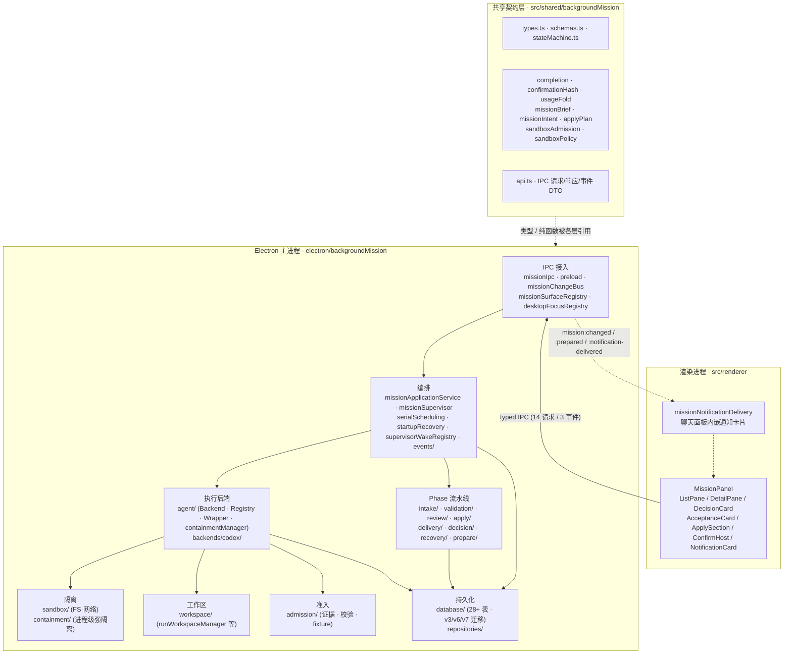
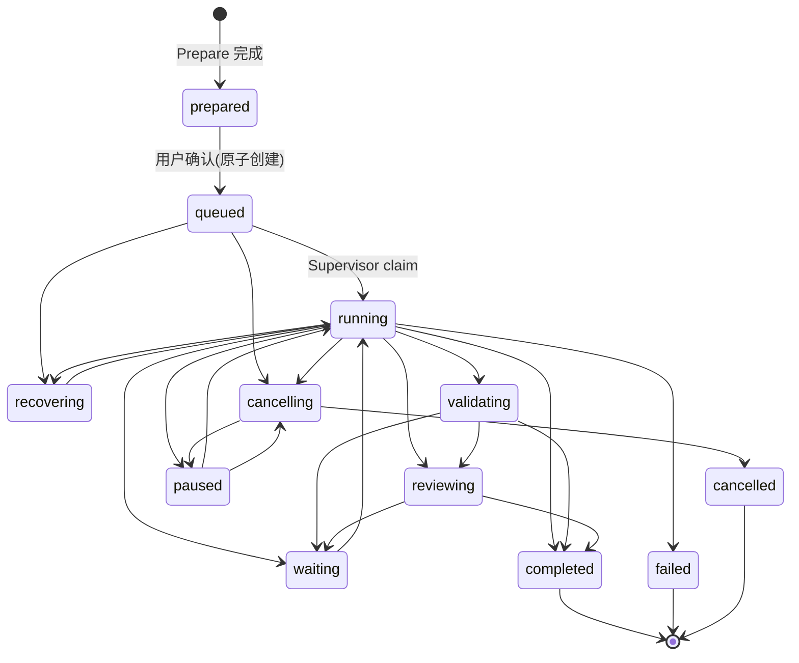
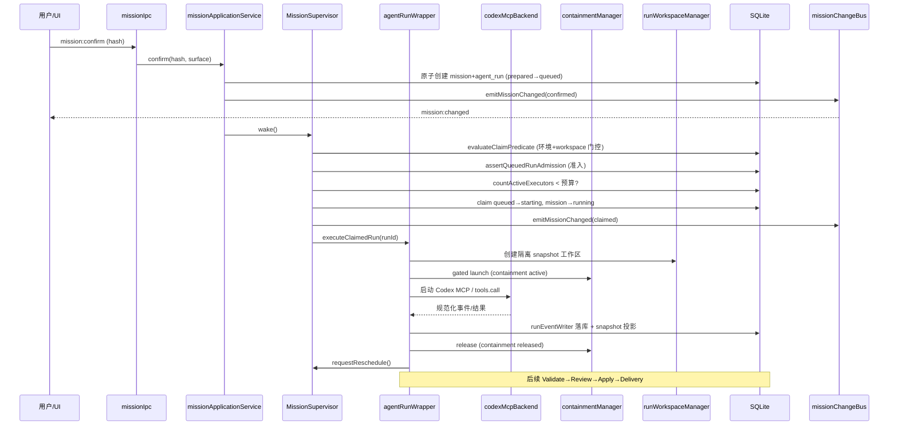

# 后台 Mission 执行层架构图（feat/background-mission-phase0）

> 本文档描述 `feat/background-mission-phase0` 分支当前后台任务执行模块的**实现架构**（截至分支 HEAD `3f297ba`）。以实际代码为准；设计意图与演进动机参见 `docs/develop/background-task-execution-layer-technical-design-v3.md`。

## 1. 模块定位

让 SpaceAssistant 把一个"使命（Mission）"委托给自治 Agent（MVP 后端为 Codex）在隔离沙箱中执行，经过 **Prepare → Confirm → 调度 → 执行 → 验证 → 评审 → 应用 → 交付** 的完整闭环，并具备崩溃恢复、并发预算与硬准入控制。

**核心约束**：控制面全部位于 Electron 主进程；渲染进程只发出用户操作、读取投影，不持有权威运行状态。`MissionSupervisor` 是唯一运行协调器，但只按数据库事实推进生命周期，不解释任务语义。

## 2. 总体分层架构



## 3. 进程与依赖方向

```text
Renderer (只读投影 + 用户操作)
  │  typed IPC
  ▼
Electron Main Process
  ┌──────────────── missionApplicationService ──────────────────┐
  │  prepare / confirm / cancel / resume / manualAccept / apply │
  └──────────┬───────────────────────────┬──────────────────────┘
             ▼                           ▼
     MissionSupervisor            Phase 流水线协调器
     (claim · 并发 · reschedule)   (validation / review / apply / delivery)
             │                           │
             ▼                           ▼
      agentRunWrapper             validationCoordinator / reviewCoordinator
             │                           │
   ┌─────────┼──────────┐                │
   ▼         ▼          ▼                ▼
agentBackend  containment  runWorkspace   hostValidator / reviewerRun
registry      Manager      Manager        (经 containment 执行)
   │
   ▼
codexMcpBackend (MVP) ── sandbox(FS/网络) + admission(硬准入证据)
                          ▼
              RunEventWriter + SnapshotProjector → DB → missionChangeBus → Renderer
```

依赖方向约束：

- `src/shared/backgroundMission/` 是纯契约 / 纯函数，不依赖 Electron。
- Repository 不依赖 Renderer 或具体 Agent 后端。
- `AgentBackend` adapter 不直接改 Mission 表，只向 Wrapper 输出规范化事件与结果。
- Renderer 不能调用内部 create/start/accept 方法；候选接受、generation 提升与终态发布只能经 application service 的事务方法。

## 4. 目录与模块结构（实际实现）

```text
src/shared/backgroundMission/          # 领域契约（主/渲染共享，纯函数）
  types.ts                             # Mission/AgentRun/MissionDraft/ValidationAttempt/Containment 等 DTO
  schemas.ts                           # Zod schema (MissionDraft/handoff/review) + normalizeMissionDraft
  stateMachine.ts                      # 四套状态转换纯函数 + InvalidTransitionError
  api.ts                               # Renderer 可见请求/响应/事件 DTO
  completion.ts                        # criterion/evidence 闭合判定
  confirmationHash.ts                  # 确认哈希（防 prepare 后偷换）
  missionBrief.ts                      # Mission Brief 预览
  missionIntent.ts                     # 任务意图
  usageFold.ts                         # token 用量折叠统计
  applyPlan.ts                         # 应用计划
  sandboxAdmission.ts                  # 沙箱准入模型
  sandboxPolicy.ts                     # 沙箱策略
  missionNotificationCard.ts           # 通知卡片数据

src/shared/backgroundMissionHostMode.ts # 宿主执行模式

electron/backgroundMission/
  missionApplicationService.ts          # 应用服务：prepare/confirm/cancel/resume/manualAccept/apply 事务入口
  missionSupervisor.ts                  # 唯一调度器：claim queued→starting，并发预算+门控+reschedule
  missionIpc.ts                         # IPC 注册与 sender 校验（14 通道）
  missionChangeBus.ts                   # 变更广播 emitMissionChanged
  missionNotificationDeliveryBus.ts     # 通知投递总线
  missionSurfaceRegistry.ts             # 确认面板 surface 注册
  desktopFocusRegistry.ts               # 桌面面板聚焦
  bindDesktopMissionFocus.ts            # 绑定桌面 mission 焦点
  surfaceIdentity.ts                    # surface 身份
  startupRecovery.ts                    # 启动扫描 + RecoveryBundle 恢复
  supervisorWakeRegistry.ts             # 唤醒注册（requestMissionSupervisorWake）
  serialScheduling.ts                   # 串行调度语义
  phase3Pipeline.ts                     # Phase 3 流水线
  needsSoftwareEnvironment.ts           # 判断 draft 是否需要软件环境
  workDirFingerprint.ts                 # 工作目录指纹
  backgroundMissionFlags.ts             # 特性开关
  fakeBackendFlag.ts                    # Fake 后端开关
  intake/                               # 接入与 Prepare
    prepareMissionExecutor.ts           #   Prepare 执行器
    missionDraftBuilder.ts              #   MissionDraft 构建/规范化
    prepareMissionTool.ts               #   LLM 调用的 prepare 工具
    prepareMissionModeGuard.ts          #   prepare 模式守卫
    executionModeBindingRegistry.ts     #   执行模式绑定
    toolContractBindingRegistry.ts      #   工具契约绑定
    validatorProfileRegistry.ts         #   校验器 profile
    confirmationPolicyRegistry.ts       #   确认策略
    zodSchemaToJsonSchema.ts            #   schema 转换
  prepare/                              # Prepare 操作服务
    prepareOperationService.ts
    prepareOperationRecovery.ts
    prepareProgress.ts
  validation/                           # 候选验证
    validationCoordinator.ts            #   持久化 attempt 领取/取消/恢复
    validatorIsolationProbe.ts          #   隔离性探针
    acceptCandidateSubmission.ts        #   接受候选提交
    assertMissionDraftPrepareReady.ts   #   prepare 就绪断言
    hostValidatorExecutor.ts            #   经 containment 执行固定校验命令
    hostValidatorRegistry.ts
    environmentPolicy.ts                #   环境策略
    missionCapabilityPolicy.ts          #   能力策略
  review/                               # 独立评审
    reviewCoordinator.ts                #   评审协调
    reviewerRunPipeline.ts              #   reviewer run 流水线
    reviewResultImporter.ts             #   结果导入
    reviewVerdict.ts / reviewerInputs.ts
    manualAcceptance.ts                 #   手动接受
    reviewAcceptFlow.ts
  decision/                             # 决策停放与恢复
    decisionService.ts
  apply/                                # CodeChangeSet 应用
    applyExecutor.ts                    #   应用执行器
    applyOperationService.ts
    applyRollback.ts                    #   回滚
    applyFsAdapter.ts
  delivery/                             # 交付物版本化
    codeChangeSetImporter.ts
    codeChangeSetMaterializer.ts
    revisionStore.ts                    #   NO_REPLACE blob 发布
    revisionPhysical.ts
    missionNotificationOutbox.ts
  revision/                             # 修订发布
    noReplacePublish.ts
  recovery/                             # 取消 / drain / 恢复包
    cancelCoordinator.ts
    drainService.ts
    recoveryBundleSealer.ts
  agent/                                # 执行后端抽象
    agentBackend.ts                     #   最小后端契约 + 规范化事件
    agentBackendRegistry.ts             #   后端注册/选择/可用性
    agentRunWrapper.ts                  #   与后端无关的 Run try/finally 生命周期
    activeRunRegistry.ts                #   活跃 run 跟踪 / interrupt
    containmentManager.ts               #   gated launch + 持久化身份
    processTreeController.ts            #   已验证 containment 的停止与资源释放证明
    fakeAgentBackend.ts
  backends/codex/                       # Codex 后端实现
    codexMcpBackend.ts                  #   stdio MCP 启动 / tools/call / 结果归一化
    codexRunner.ts
    codexCapabilityProbe.ts             #   安装/版本/配置/沙箱准入探测
    codexAdmission.ts
    codexProductionWiring.ts            #   生产装配
    codexProtocolProfile.ts             #   版本 schema 与事件归一化
    testFixtures/fakeCodex.ts
  sandbox/                              # 文件系统 / 网络隔离
    platformSandboxAdapter.ts           #   平台适配器接口
    createPlatformSandboxAdapter.ts     #   工厂（按平台选择）
    fakeSandboxAdapter.ts
    linuxBubblewrapSandboxAdapter.ts    #   Linux bwrap
    pathBindings.ts                     #   路径绑定
  containment/                          # 进程级强隔离
    platformContainmentAdapter.ts       #   平台适配器接口
    createPlatformContainmentAdapter.ts
    darwinEsContainmentAdapter.ts       #   macOS Endpoint Security
    darwinEsHelperClient.ts
    windowsJobObjectContainmentAdapter.ts  # Windows Job Object
    windowsJobObjectNative.ts
    fakeContainmentAdapter.ts
    unsupportedContainmentAdapter.ts
    strongContainmentSession.ts         #   强隔离会话
    containmentInstanceRepository.ts
    helpers/SpaceAssistantContainmentHelper  # 原生辅助
  workspace/                            # 私有 snapshot 工作区
    runWorkspaceManager.ts              #   创建/封存/删除隔离工作区
    environmentPublisher.ts             #   发布执行环境
    dependencyLayer.ts                  #   依赖链接图验证
    nodeRuntimeProbe.ts                 #   Node 运行时探测
    privateDependencyMaterializer.ts    #   依赖物化
    resolveNodeRuntimeFromConfig.ts
    runDiffReader.ts                    #   读取 run diff
  admission/                            # 硬准入证据
    admissionRepository.ts              #   准入配置/证据存储
    requireValidSandboxAdmission.ts     #   准入校验（fail-closed）
    buildSandboxAdmissionKey.ts
    sandboxEvidenceImporter.ts          #   证据导入
    sandboxFixtureProtocol.ts           #   fixture 协议
    sandboxFixtureRunner.ts             #   fixture 执行器（跑准入用例）
    codexAdmissionSuite.ts              #   Codex 准入测试套件
    seedAdmissionPass.ts
  environment/
    missionProcessEnv.ts                #   mission 进程环境变量策略
  events/
    runEventWriter.ts                   #   有界队列 / 批量落库 / flush
    snapshotProjector.ts                #   权威 RunSnapshot 投影
  repositories/
    missionUsageRepository.ts           #   usage ledger / 并发预算

electron/skills/bundled/
  backgroundMissionIntakeSkill.ts       # Intake Skill：引导 LLM 生成 MissionDraft

src/renderer/components/BackgroundMission/
  MissionPanel.tsx                      # 面板入口
  MissionListPane.tsx                   # 任务列表
  MissionDetailPane.tsx                 # 快照/时间线/决策/交付物
  MissionDecisionCard.tsx               # 决策卡
  MissionAcceptanceCard.tsx             # 接受卡
  MissionApplySection.tsx               # 应用区
  MissionConfirmHost.tsx                # 可信预览与确认
  MissionNotificationCard.tsx           # 通知卡

src/renderer/services/
  missionNotificationDelivery.ts        # 订阅 mission 事件 → 内嵌聊天卡片
```

## 5. Mission 生命周期数据流

```mermaid
graph LR
    A["Intake Skill<br/>生成 MissionDraft"] --> B["Prepare<br/>prepareMissionExecutor<br/>探测后端·构建环境·confirmationHash"]
    B --> C["Confirm<br/>用户确认·hash 校验<br/>原子创建 mission+agent_run"]
    C --> D["Queue<br/>prepared→queued"]
    D --> E["Schedule<br/>MissionSupervisor.wake<br/>claim: 并发+环境+准入门控"]
    E --> F["Execute<br/>agentRunWrapper<br/>Codex@隔离工作区+沙箱+containment"]
    F --> G["Validate<br/>validationCoordinator<br/>hostValidator·isolationProbe"]
    G --> H["Review<br/>reviewCoordinator<br/>独立 reviewer run"]
    H --> I["Decision<br/>decisionService<br/>停放/恢复/手动接受"]
    I --> J["Apply<br/>applyExecutor<br/>CodeChangeSet→用户工作树"]
    J --> K["Delivery<br/>revisionStore·noReplacePublish"]
    K --> L["completed"]
    F -.->|"事件"| M["runEventWriter→snapshotProjector→DB"]
    M -.->|"missionChangeBus"| N["missionNotificationDelivery→UI"]
```



各阶段要点：

1. **Intake**：`backgroundMissionIntakeSkill` 引导 LLM 在受限上下文下生成结构化 `MissionDraft`（`missionDraftBuilder` 规范化）。`intake/` 维护执行模式绑定、工具契约绑定、校验器 profile、确认策略等注册表。
2. **Prepare**：`prepareMissionExecutor` + `prepare/prepareOperationService` 探测后端能力（`codexCapabilityProbe`）、构建执行环境、计算 `confirmationHash`，写入 `prepared_missions`。`prepareMissionModeGuard` 保证只在 prepare 模式下执行。结果经 `mission:prepared` 事件推送预览。
3. **Confirm**：用户经 `MissionConfirmHost` 确认，`missionIpc` 的 `mission:confirm` 通道校验 `confirmationHash` 与 surface，原子创建 `mission` + `agent_run`（`prepared→queued`），写 `missions`/`mission_confirmations`/`agent_runs`。
4. **Schedule**：`MissionSupervisor.wake()` 串行（`wakeChain`）调度：`evaluateClaimPredicate` 评估环境绑定 + workspace binding 门控；`assertQueuedRunAdmission` 校验沙箱准入；`countActiveExecutors` 检查并发预算（status + usage ledger 双重计数，fail-closed）；claim `queued→starting`，executor claim 同步把 `mission→running`。完成后 `requestReschedule` 重新调度。
5. **Execute**：`agentRunWrapper` 执行固定 try/finally 生命周期：经 `agentBackendRegistry` 选后端（`codexMcpBackend`），在 `runWorkspaceManager` 创建的私有 snapshot 工作区 + `sandbox`（FS/网络）+ `containment`（进程级，`containmentManager`）中执行 Codex；`processTreeController` 管理进程树与释放证明；`activeRunRegistry` 支持 interrupt。事件经 `runEventWriter` 落库、`snapshotProjector` 投影。
6. **Validate**：`validationCoordinator` 持久化 attempt 的领取/取消/恢复；`hostValidatorExecutor` 经通用 containment 执行固定校验命令；`validatorIsolationProbe` 验证隔离性；`acceptCandidateSubmission` 接受候选。
7. **Review**：`reviewCoordinator` 创建 `review_assignments`，`reviewerRunPipeline` 运行独立 reviewer AgentRun（reviewer claim 不动 mission 状态），`reviewResultImporter` 导入结果，`manualAcceptance` 处理手动接受。
8. **Decision**：`decisionService` 处理决策停放（parked）与恢复。
9. **Apply**：`applyExecutor` + `applyOperationService` 把 `CodeChangeSet` 应用到用户工作树，`applyRollback` 处理回滚。
10. **Delivery**：`codeChangeSetImporter`/`codeChangeSetMaterializer` + `revisionStore`（NO_REPLACE blob 发布）+ `revision/noReplacePublish` 版本化交付。
11. **Recovery**：`startupRecovery`（`main.ts` 启动时调用，`wakeScheduler=requestMissionSupervisorWake`）扫描未完成 run + `recoveryBundleSealer` 封存恢复包；`cancelCoordinator` 取消，`drainService` 排空。

## 6. 状态机（src/shared/backgroundMission/stateMachine.ts）



| 实体 | 终态 | 关键路径 |
|---|---|---|
| Mission | completed / failed / cancelled | prepared→queued→running→(waiting/validating/reviewing)→completed |
| AgentRun | completed / failed / crashed / cancelled / superseded / parked | queued→starting→running→(waiting/parking/submitting)→reviewing→completed |
| ValidationAttempt | completed / interrupted | queued→starting→submitting→completed |
| Containment | released | gated→active→released |

> Mission 终态不可逆（`completed`/`failed`/`cancelled` 的后继集合为空）。Repository 所有状态更新必须满足 `WHERE id=:id AND generation=:generation AND status IN (...expected)` 的乐观锁。

## 7. IPC 通道（electron/preload.ts + missionIpc.ts）

**请求通道（ipcRenderer.invoke）**

| 通道 | 用途 |
|---|---|
| `mission:get-flags` | 读取特性开关 |
| `mission:list` | 列出 mission |
| `mission:get` | 读取单个 mission |
| `mission:confirm` | 可信确认（校验 hash + surface） |
| `mission:discard-prepared` | 丢弃已准备 mission |
| `mission:list-pending-prepared` | 列出待确认的 prepared mission |
| `mission:get-attention-summary` | 关注摘要 |
| `mission:get-diff` | 读取 run diff |
| `mission:cancel` | 取消 run（interrupt + drain） |
| `mission:resolve-decision` | 解决决策 |
| `mission:resolve-manual-acceptance` | 手动接受裁决 |
| `mission:apply-code-change-set` | 应用变更集 |
| `mission:get-apply-operation` | 读取应用操作状态 |
| `mission:list-events` | 列出 run 事件（时间线） |

**事件通道（ipcRenderer.on，主进程 send）**

| 事件 | 触发 |
|---|---|
| `mission:prepared` | Prepare 完成，推送预览 |
| `mission:changed` | mission 状态变更（claim / confirm / 完成等） |
| `mission:notification-delivered` | 通知已投递 |

## 8. 持久化模型（electron/database/schema.ts）

Background Mission 新增 28+ 张表（迁移 **v3** 基础表集合 / **v6** 重建 `mission_execution_environments` + `prepare_operations` / **v7** 沙箱准入与 containment）：

| 分组 | 表 |
|---|---|
| Mission 主体 | `missions` · `prepared_missions` · `mission_confirmations` · `mission_decisions` · `mission_deliverables` · `mission_notifications` |
| 执行环境 | `mission_execution_environments` · `dependency_layer_entries` |
| AgentRun | `agent_runs` · `run_events` · `run_snapshots` · `run_progress_notes` · `run_workspace_snapshots` |
| 验证 / 评审 | `validation_attempts` · `validation_records` · `review_assignments` · `reviews` · `manual_acceptance_records` · `candidate_submissions` |
| 应用 / 交付 | `code_change_set_apply_operations` · `content_blobs` · `content_revisions` · `revision_store_quota` · `revision_store_operations` |
| 隔离 / 准入 | `execution_containments` · `containment_instances` · `sandbox_admission_profiles` · `sandbox_admission_evidence` |
| 资源 / 恢复 | `mission_usage_ledger` · `resource_drain_operations` · `recovery_bundles` · `prepare_operations` |

## 9. 关键编排时序：Confirm → Schedule → Execute



## 10. 隔离与准入双轨

| 维度 | Sandbox（sandbox/） | Containment（containment/） |
|---|---|---|
| 隔离层面 | 文件系统 / 网络访问 | 进程级强隔离（进程树控制） |
| 平台实现 | Linux bwrap | macOS Endpoint Security · Windows Job Object |
| 适配器 | platformSandboxAdapter (fake / linux) | platformContainmentAdapter (fake / darwin / windows / unsupported) |
| 用途 | 限制 run 的 FS / 网络写边界 | 保证进程可被杀、资源可释放、崩溃可重识别 |
| 状态 | — | gated → active → released |

**硬准入（admission/）**：执行前必须证明沙箱真的隔离。`sandboxFixtureRunner` 跑准入用例 → `sandboxEvidenceImporter` 导入证据 → `admissionRepository` 存储 → `requireValidSandboxAdmission` 在 claim 前 fail-closed 校验。`codexAdmissionSuite` 是 Codex 后端的准入套件。`MissionSupervisor.assertQueuedRunAdmission` 把它作为 claim 的前置门控。

## 11. 与现有系统的集成点

- **Claude 流式聊天**：`backgroundMissionIntakeSkill` 经 `skillRouter` 接入，在普通聊天中触发 mission 接入；`claudeStreamHandlers.ts` 与 `toolChatLoop.ts` 增加 execution-mode / host-execution-mode 绑定（`executionModeBindingRegistry`、`toolContractBindingRegistry`）。
- **数据库**：复用主 SQLite，新增 v3 / v6 / v7 迁移；`DB_SCHEMA_VERSION` 提升。
- **会话备份**：mission 关联 origin session（workDir 指纹），通知经 `missionNotificationDelivery` 内嵌回原会话聊天面板。
- **预加载**：`preload.ts` 暴露 `window.api.mission*` 共 14 个请求方法 + 3 个事件订阅。
- **主进程启动**：`main.ts` 在 app ready 后调用 `startupRecovery.recoverBackgroundMissionOnStartup`，`wakeScheduler=requestMissionSupervisorWake`。
