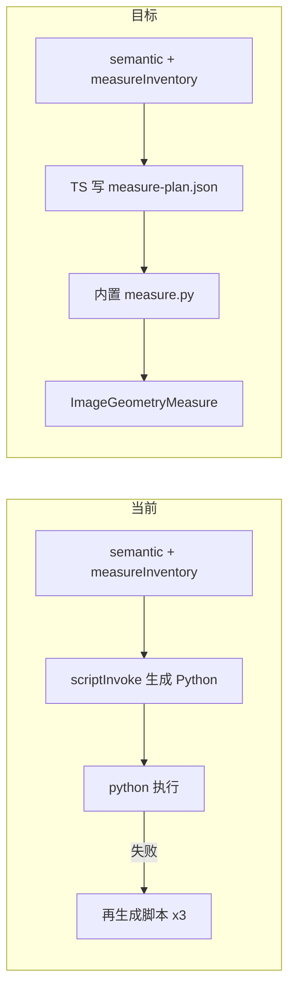
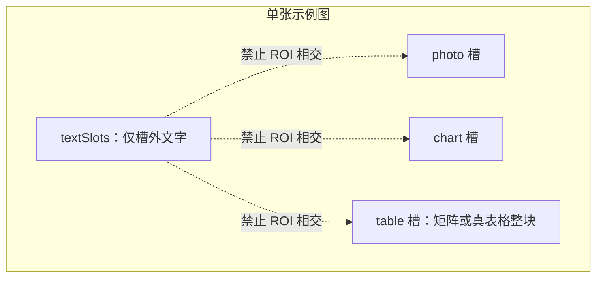
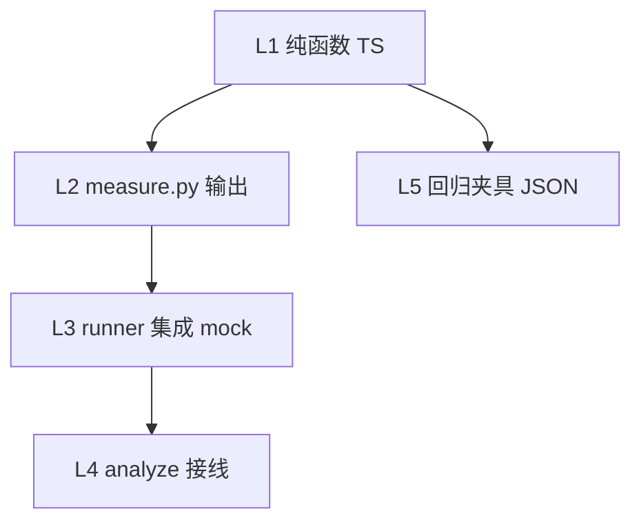

# 内置 measure.py 模板技术方案

> 版本：v1.5  
> 设计日期：2026-07-10  
> 状态：草案（待评审）  
> 变更：v1.5 补充 §10 自动化测试计划（L1–L5 分层 + 夹具目录 + 验收命令）  
> 需求来源：[visual-style-clone-requirement.md](../requirement/visual-style-clone-requirement.md) §5.6  
> 关联模块：`electron/poster/styleClone/`（feat-social-poster 分支）

---

## 0. 摘要

用仓库内置、算法固定的 `measure.py` 替代当前「LLM 每轮生成整段 Python」的几何测量路径。测量计划由 TypeScript 从 semantic（`textSlots` + `imageSlots`）合成 `measureInventory` 后确定性写出。**图片槽位**分三类：`photo` / `chart`（只测外框）与 **`table`**（能力矩阵、带行列线真表格，额外测表头表身样式）；槽内均不拆 `textSlots`。measure 阶段默认零 LLM 调用。

---

## 1. 背景与问题

当前几何测量瓶颈不在 Python 执行（秒级），而在 [`measureScriptRunner.ts`](../../electron/poster/styleClone/measureScriptRunner.ts) 的 **`scriptInvoke` 每轮生成整段 Python**（日志显示单轮常 4–14 分钟，且常需 2–3 轮）。

与此同时，**「测什么、在哪测」** 已由语义层 + TypeScript 确定性合成：

- [`synthesizeMeasureInventory`](../../electron/poster/styleClone/measureInventoryUtils.ts)：先 `normalizeSlotExclusivity`（textSlots 与 imageSlots ROI 互斥），再从槽外 `textSlots`（blocks）+ `imageSlots`（images）+ `appearance`（decorations）+ `decorativeMotifs` 生成 `measureInventory`
- 输出契约已在 [`measureSchema.md`](../../electron/poster/styleClone/measureSchema.md) 与 [`geometryMeasureNormalizer.ts`](../../electron/poster/styleClone/geometryMeasureNormalizer.ts) 固化

**结论**：LLM 不应再负责「写测量算法」，只应（在必要时）负责语义理解——这部分已在 analyze 的 vision 阶段完成。



---

## 2. 模板原生提供什么（固定算法层）

在仓库新增 **`electron/poster/styleClone/measure/measure.py`**（及可选子模块），随 Electron 构建复制到产物；runner 执行时拷贝到 `workDir/measure/`。

模板**原生、固定**实现以下测量项（对齐 `ImageGeometryMeasure` 全字段），算法可测不出则输出空数组/低置信度，**禁止编造**：

| 测量项 | 模板算法（固定） | 输入依赖 |
|--------|------------------|----------|
| `canvas` | `PIL.Image.size`；`contentArea` 由 margins 或全图回退 | 图片路径 |
| `margins` | 四边扫描非背景像素边界（与**四角采样背景色**对比，不依赖 palette） | 全图 |
| `palette` | **轻量主色提取**（见 §2.1，不用 K-means） | 全图 |
| `blocks` | 对每个 `geometryTarget=blocks` 元素：归一化 `bboxHint` → 像素 ROI → 对比度/连通域收紧 bbox；写 `textSlotId`、`widthRatio/heightRatio` | plan.elements |
| `fontMetrics` | 对每个 text block ROI：水平投影估行高、连通域高度估 `estimatedSizePx`；多行样文取最大行高；`confidence` 按 ROI 对比度分级 | plan.elements + `textSlotId` |
| `images` | photo/chart 槽：ROI 收紧 bbox + 占比；**不解析槽内内容** | plan.elements（`slotKind: photo\|chart`） |
| `tables` | **table 槽**：外框 bbox + 表头/表身底色、行高、单元格对齐、边框粗细/颜色（见 §2.3） | plan.elements（`slotKind: table`） |
| `decorations` | 按 `kind` 分发固定算子（逻辑来自 [`decorationsMeasureGuide.ts`](../../electron/poster/styleClone/decorationsMeasureGuide.ts)）：divider 细条检测、border 描边厚度、shape 圆角矩形拟合、icon blob 尺寸 | plan.elements（`geometryTarget=decorations`） |
| `whitespaceRatio` | `1 - union(blocks+images+decorations bbox 面积) / canvas 面积` | 上游 bbox |

**模板不负责**：OCR、识别槽位类型、列举有哪些槽位——这些已在 analyze vision 完成。

### 2.2 图片槽位（photo / chart / table）：语义列举 + 几何测量

**范围说明**：

| 纳入 imageSlots `slotKind: table` | **不**纳入（仍用 textSlots） |
|--------------------------------|------------------------------|
| 能力矩阵 / 网格（产品页型 `matrix`） | 对比表 / 两列（`compare`） |
| 带行列线的真表格 | 清单页（`checklist`，逐条列举） |

**原则**：`imageSlots[]` 槽位内一切视觉内容（含格内文字、表头、网格线）视为**不可分割整体**；与 `textSlots` **ROI 互斥**（§2.2.1）。

- **photo / chart**：几何层只测外框 bbox 与占比（chart 不解析折线数据）。
- **table**：在外框之外，另测表头/表身样式参数（§2.3）；**不** OCR 单元格文字、不逐格建 textSlots。

#### 2.2.1 槽位互斥不变量

对同一张示例图（同一 `imageIndex`）：

1. **imageSlot 内不得有 textSlots**（photo / chart / table 均适用）
2. **textSlots 仅描述槽外页面文字**（页眉、表格外标题、正文、页脚等）
3. **appearance 仅作用于槽外 textSlots**
4. **`normalizeSlotExclusivity(semantic)`** 在 `synthesizeMeasureInventory` 之前剔除相交 textSlot locations



**analyze prompt**：宁可放大 table/photo/chart 外框包住内部文字，也不在槽内建 textSlots；table 槽禁止输出单元格文案、行列数以外的结构数据。

```typescript
export interface ImageSlotContract {
  id: string
  /** photo | chart | table（能力矩阵/网格与真表格均用 table） */
  slotKind: 'photo' | 'chart' | 'table'
  locations: { imageIndex: number; region: SlotRegion; bboxHint?: NormalizedBBox }[]
}
```

#### 蓝图 → 几何流水线（photo / chart / table）

| 阶段 | photo | chart | table |
|------|-------|-------|-------|
| measureInventory | `geometryTarget: images` | `geometryTarget: images` | `geometryTarget: tables` |
| measure.py | 外框 bbox | 外框 bbox | 外框 + 表样式（§2.3） |
| geometry 字段 | `images[]` | `images[]` | **`tables[]`** |

```typescript
// photo/chart → images[]（与现契约扩展 imageSlotId/slotKind/widthRatio/heightRatio）
// table → tables[]（新增）
interface TableElementMeasure {
  imageSlotId: string
  slotKind: 'table'
  bbox: BBox
  widthRatio: number
  heightRatio: number
  header: { backgroundColor: string; rowHeightPx: number }
  body: { backgroundColor: string; rowHeightPx: number }
  cellAlignment: {
    horizontal: 'left' | 'center' | 'right'
    vertical: 'top' | 'middle' | 'bottom'
  }
  border: { widthPx: number; color: string }
  confidence?: 'low' | 'mid' | 'high'
}
```

`ImageGeometryMeasure` 新增 **`tables: TableElementMeasure[]`**（无 table 槽时 `[]`）；`validateMeasureFields` 将其列为必填数组字段（允许空数组）。

**下游**：`inferPreferredPageType` 可据 `slotKind: table` 启发为 `matrix`（可选）；MVP recipe 仍 5 类，table 几何供审阅与后续 matrix recipe。

### 2.3 table 槽：模板固定测量算法（在 ROI 内）

在 `bboxHint` → 像素 ROI 收紧外框后，**不解析单元格内容**，只测版式参数：

| 测量项 | 算法要点 | 输出字段 |
|--------|----------|----------|
| 外框 | 与 photo/chart 相同：边缘收紧 | `bbox`, `widthRatio`, `heightRatio` |
| 表头行底色 | 水平投影找首条「行带」；在该带内采背景像素中位/众数 | `header.backgroundColor` (hex) |
| 表身行底色 | 取第二条及以后典型行带（或中位行带）背景采样 | `body.backgroundColor` (hex) |
| 表头行高 | 首行带投影峰高度 px | `header.rowHeightPx` |
| 表身行高 | 表身行带投影峰高度中位数 px | `body.rowHeightPx` |
| 单元格对齐 | 在代表性单元格 ROI 内，用连通域质心相对单元格中心的偏移推断 | `cellAlignment.horizontal/vertical` |
| 边框粗细 | 沿外框与可见内网格线做法线剖面，估线宽 px | `border.widthPx` |
| 边框颜色 | 边框像素采样 hex | `border.color` |

**能力矩阵 vs 真表格**：同一套算法；真表格网格线更明显，边框/行高通常更准；能力矩阵若无明显行带，表头/表身可退化为「上区/下区」两段采样，`confidence: low`。

**测不出**：单项可省略或给默认值 + `confidence: low`；但 `bbox` 与外框必填，否则该 table 项整体省略（不编造格内文字）。

**安全**：模板为受信代码，不走 [`measureScriptSandbox`](../../electron/poster/styleClone/measureScriptSandbox.ts)；runner 仅 `execFile(python, [measure.py, --plan, plan.json, ...imagePaths])`。

**产物**：[`styleCloneSynthesizer.buildMeasurePy`](../../electron/poster/styleClone/styleCloneSynthesizer.ts) 复制内置模板到 Style 产物 `measure/measure.py`。

### 2.1 palette：不用 K-means 的轻量方案（推荐）

需求文档写的是「K-means 聚色」，那是**理想精度**描述；对内置模板而言，palette 的消费场景是：

- ② synthesize 写 `variables.css` / `themes/default.json`（要 3–6 个 hex + 大致占比）
- ④ verify 做**近似**配色比对

海报类样张通常只有少量大面积色块，**不需要** sklearn/numpy 聚类也能满足下游。推荐算法（仅依赖 **PIL**，可选 numpy 加速计数但非必须）：

```
1. 四角各采 5×5 像素 → 中位色作为 backgroundCandidate（供 margins 共用）
2. 缩略图 resize 至 64×64（或 128×128）
3. Image.quantize(colors=8, method=MEDIANCUT) 或等价的 4-bit RGB 分桶计数
4. 取占比 Top 5–8 色 → 合并 ΔE/曼哈顿距离 < 阈值的近邻色
5. role 启发（无聚类）：
   - 占比最高且亮度高 → background
   - 亮度最低 → text
   - 饱和度最高且非背景 → accent
6. 输出 [{ hex, ratio, role? }]；至少 1 项即通过 validateMeasureFields
```

**为何够用**：克隆产物最终配色还会经 theme/variables 映射到内置 token；verify 也是定性+数值近似，不是印刷级色差。

**何时才需要 K-means**：渐变背景、复杂摄影底图、多色拼贴等边缘 case。可作为 **Phase 2 可选分支**（`plan.paletteMode: "quantize" | "kmeans"`，默认 quantize），不在 Phase 1 实现。

**与 margins 的执行顺序**：先四角采样背景色 → 算 margins → 再跑 palette quantize（margins 不等待 palette 完成）。

---

## 3. LLM 在模板完成后还应生成什么？

### 3.1 推荐：measure 阶段 LLM 零调用（主路径）

| 阶段 | 谁产出 | 产出物 |
|------|--------|--------|
| analyze · 语义 | vision（带图，1 次） | `textSlots` + `imageSlots`（`photo\|chart\|table`）、`decorativeMotifs`、版式 hint |
| analyze · 蓝图 | TypeScript（确定性） | `measureInventory`（[`resolveMeasureInventory`](../../electron/poster/styleClone/measureInventoryUtils.ts)） |
| analyze · 计划 | TypeScript（确定性） | **`measure-plan.json`**：paths + 每图 `elements[]`（即 inventory + `fileName`/`imageIndex`） |
| analyze · 执行 | 内置 `measure.py` | `ImageGeometryMeasure[]` stdout JSON |
| analyze · 后处理 | TypeScript | `normalizeGeometryMeasures` → `enrichTextSlotCapacities` → descriptor |

**LLM 不再生成 Python**；`scriptInvoke` / `buildScriptPrompt` / 多轮 feedback 可废弃或仅作 feature flag 回退。

### 3.2 可选兜底（Phase 2，非 MVP 必须）

仅当模板执行后 `validateMeasureFields` 仍缺关键项时：

- **方案 B1（推荐兜底）**：TypeScript 启发式扩 ROI / 降阈值重跑（仍零 LLM）
- **方案 B2（轻量 LLM）**：`scriptInvoke` 只生成 **`measure-plan.patch.json`**（调整 `bboxHint`、补缺失 decoration `kind`），不生成代码；token 预算远小于整段 Python

不建议保留「整段 Python 生成」作为主路径。

---

## 4. 如何适配不同图的行状态、内容、样式？

适配靠 **语义层描述 + 归一化 ROI 蓝图**，不靠每张图重写脚本。

### 4.1 分工表

| 维度 | 语义层（vision 已做） | 蓝图层（TS 合成） | 模板层（固定算法） |
|------|----------------------|-------------------|-------------------|
| **有哪些字、几行、每行几字** | `sampleText`、`perLineCharCounts`、`observedLines` | blocks ROI 按 `locations.region/bboxHint` | `blocks` 收紧 bbox；`fontMetrics` 在 ROI 内按行高估字号 |
| **容量约束** | 样文统计 | — | 不直接输出 capacity；由 [`slotCapacityDeriver`](../../electron/poster/styleClone/slotCapacityDeriver.ts) 用几何+样文保守合并 |
| **单行 vs 多行** | 样文换行 | 同一 `textSlotId` 一个 ROI（`expandBBoxHint` 可包住多行） | 水平投影多峰 → 行高取 max；`blocks` bbox 覆盖整段文本区 |
| **样式（胶囊/下划线/描边）** | `appearance` 仅用于**槽外** textSlots | 槽外 text → decorations ROI | `decorations` 算子；**槽内不适用** |
| **页级装饰（分割线/圆角卡片）** | `decorativeMotifs` 文案 | `MOTIF_DECORATION_RULES` 正则 → 页级 `bboxHint` | 在启发 ROI 内扫描；测不出则 `decorations=[]` |
| **配色/边距** | 仅定性 | 可选 `backgroundColorHint` / `marginRatioHints`（未来扩展） | 四角背景采样 + `quantize` 主色；hint 仅作 role 加权先验 |
| **照片/图表槽位** | `imageSlots` photo/chart | `geometryTarget: images` | 外框 bbox |
| **表格槽位** | `imageSlots` table（矩阵/真表格；**非** compare/checklist） | `geometryTarget: tables` | 外框 + 表头表身样式（§2.3） |
| **页面文字（槽外）** | `textSlots` | blocks ROI | 与全部 imageSlots **ROI 互斥** |
| **清单/对比** | 仍用多个 `textSlots` 逐条描述 | blocks | 不建 table 槽 |

### 4.2 ROI 适配机制（核心）

```
归一化 bboxHint (0–1)  ×  (width, height)  →  像素 ROI
         ↓
   kind / geometryTarget 选择算法分支
         ↓
   输出像素级 bbox / params / fontMetrics
```

- **无 `bboxHint`**：回退 [`regionToBBoxHint`](../../electron/poster/styleClone/measureInventoryUtils.ts)（top-left/center 等九宫格）
- **装饰包裹文本**：仅对**槽外** textSlots 做 `expandBBoxHint`；imageSlot 内不生成 blocks/decorations 子项
- **互斥校验**：`normalizeSlotExclusivity` 剔除相交 textSlot；vision 违反时 TS 修正并标注
- **测不准**：该项省略或 `confidence: low`；runner 不因单项缺失而触发 LLM，仅当整图缺 `palette`/`canvas` 等必填字段时走 B1/B2 兜底

### 4.3 `measure-plan.json` 形状（建议）

与现有 `PerImageMeasureInventory` + 执行路径对齐，避免新契约：

```json
{
  "version": 1,
  "images": [
    {
      "imageIndex": 0,
      "fileName": "sample.png",
      "path": "/abs/path/sample.png",
      "elements": [
        {
          "id": "title-img0",
          "kind": "text",
          "textSlotId": "title",
          "geometryTarget": "blocks",
          "bboxHint": { "x": 0.08, "y": 0.06, "width": 0.84, "height": 0.12 },
          "measureHint": "文本槽 heading"
        },
        {
          "id": "hero-img0",
          "kind": "image",
          "imageSlotId": "hero",
          "slotKind": "photo",
          "geometryTarget": "images",
          "bboxHint": { "x": 0.05, "y": 0.22, "width": 0.9, "height": 0.45 },
          "measureHint": "主图照片槽"
        },
        {
          "id": "chart-main-img0",
          "kind": "chart",
          "imageSlotId": "chart-main",
          "slotKind": "chart",
          "geometryTarget": "images",
          "bboxHint": { "x": 0.08, "y": 0.35, "width": 0.84, "height": 0.4 },
          "measureHint": "图表槽整块（只测外框，不指定图表子类型）"
        },
        {
          "id": "matrix-main-img1",
          "kind": "table",
          "imageSlotId": "matrix-main",
          "slotKind": "table",
          "geometryTarget": "tables",
          "bboxHint": { "x": 0.06, "y": 0.28, "width": 0.88, "height": 0.55 },
          "measureHint": "表格槽整块（含格内文字，测外框+表样式，不指定矩阵/真表子类型）"
        }
      ]
    }
  ]
}
```

由 `buildMeasurePlan(semantic, imagePaths)` 在 TS 侧生成，**字段直接来自 `semantic.measureInventory`**。

**`measureHint` 文案规范**（避免误导下游大模型）：

| slotKind | 推荐 measureHint | 禁止写法 |
|----------|------------------|----------|
| `photo` | `主图照片槽` / `照片槽` | 不写具体题材（人像、产品图…） |
| `chart` | `图表槽整块（只测外框，不指定图表子类型）` | **禁止** `折线图`/`柱状图`/`饼图` 等子类型词 |
| `table` | `表格槽整块（测外框+表样式，不指定子类型）` | **禁止** 仅写 `能力矩阵` 或仅写 `真表格` |
| `text` (blocks) | `文本槽 {role}` | — |

- `measureHint` 由 **`buildMeasurePlan` / `synthesizeMeasureInventory` 按 slotKind 模板生成**，不透传 vision 对子类型的描述（如「折线图」）。
- 该字段仅供测量脚本/审阅理解 ROI 用途，**不**进入 synthesize recipe 的图表类型约束。

---

## 5. runner 改造要点

修改 [`measureScriptRunner.ts`](../../electron/poster/styleClone/measureScriptRunner.ts)：

1. 新增 `resolveBundledMeasureScript()`：定位内置 `measure.py` 路径
2. `runMeasurementForBatch` 改为：
   - 写 `measure-plan-{batchStart}.json`
   - 拷贝/引用内置 `measure.py`
   - **单次** `execFile`（保留 30s timeout）
   - `parseMeasures` + `validateMeasureFields`（逻辑不变）
3. 删除或 `enableLlmMeasureScript` 门控下保留旧 `scriptInvoke` 回路
4. [`styleCloneService.analyzePhase`](../../electron/poster/styleClone/styleCloneService.ts)：`scriptInvoke` 参数变为可选；进度文案改为「执行内置几何测量…」

[`styleCloneExecutor`](../../electron/tools/styleCloneExecutor.ts) 可不再构造 `scriptInvoke`。

---

## 6. 预期收益与风险

### 6.1 收益

- analyze 几何阶段从 **2–3 次大 token LLM 调用** → **0 次**（主路径）
- 测量结果可复现、可单测（Python 单元测试 + 黄金样张 JSON）
- 与需求 §5.6「脚本保留到 `measure/`」一致，且脚本变为真正可执行

### 6.2 风险与缓解

| 风险 | 缓解 |
|------|------|
| 固定算法在复杂版式上精度低于「定制脚本」 | 语义 ROI + 保守 `confidence`；容量用样文+几何保守合并；④验证阶段标注低分项 |
| palette quantize 在渐变/摄影图上主色不准 | 默认 quantize 够用；Phase 2 可选 kmeans 分支；用户可在审阅后手改 theme variables |
| table 样式测不准（矩阵无显式行带） | `confidence: low`；上/下区退化采样；审阅可手改 |
| vision 将 compare/checklist 误标为 table | prompt 明确范围；误标时靠互斥与页型启发纠偏 |
| 用户环境无 Python | 保持现有 `resolveGeometryMeasureGate` 降级逻辑不变 |
| 装饰 `appearance` 新枚举 | 扩展 `APPEARANCE_DECORATION` 表即可，无需改 Python |

---

## 7. 实施分期

### Phase 1（建议先做）

- 语义层 `imageSlots`（photo/chart/table）+ `normalizeSlotExclusivity` + analyze prompt（table 范围排除 compare/checklist）
- `synthesizeMeasureInventory`：photo/chart → `images`；table → **`tables`**
- 内置 `measure.py`：photo/chart 外框 + **table 表样式** + canvas/margins/palette/blocks/fontMetrics/decorations/whitespaceRatio
- `TableElementMeasure` 类型 + `geometryMeasureNormalizer` + `validateMeasureFields` 增加 `tables[]`
- TS 生成 `measure-plan.json` + runner 接线
- 自动化测试：§10 全部 L1–L4 必过；L2 Python 夹具在无环境时 skip

### Phase 1.5

- **照片槽**可选测 `cornerRadius` / `hasShadow` / `fit`；**图表槽仍只输出尺寸**

### Phase 2（可选）

- plan.patch 轻量 LLM 兜底或 TS 自动扩 ROI 重试
- synthesize 消费 `geometry.decorations` 写 `styles.css`（与测量模板独立）

---

## 10. 自动化测试计划

遵循仓库惯例：**Vitest**、测试文件与实现同目录（`electron/poster/styleClone/**/*.test.ts`）、主进程用 **node** 环境（`vitest.config.ts` `environmentMatchGlobs`）。**不**在单测中调用真实 vision API；Python 相关用 mock 或条件执行。

### 10.1 测试分层



| 层级 | 范围 | 运行环境 | 是否 Phase 1 必做 |
|------|------|----------|-------------------|
| L1 | 槽位互斥、蓝图合成、plan 生成、normalizer、校验 | node / vitest | 是 |
| L2 | `measure.py` 对固定样图的 stdout JSON | node 子进程调 Python；无 Python 时 **skip** | 是 |
| L3 | `runMeasurementLoop` 内置脚本路径、单次执行、解析 `tables[]` | node + `_setMeasureRunners` mock | 是 |
| L4 | `analyzePhase` 不再依赖 `scriptInvoke`（bundled 路径） | node + mock | 是 |
| L5 | 黄金 JSON 快照（防回归） | node | 是 |

### 10.2 L1：单元测试（新增/扩展文件）

| 测试文件 | 用例要点 |
|----------|----------|
| [`slotExclusivity.test.ts`](../../electron/poster/styleClone/slotExclusivity.test.ts)（新） | textSlot 与 photo/chart/table ROI 相交 → 剔除 location；全空槽删除；`approximationNote` |
| [`measureInventoryUtils.test.ts`](../../electron/poster/styleClone/measureInventoryUtils.test.ts) | `imageSlots` → photo/chart `geometryTarget:images`、table → `tables`；**measureHint 中性**（chart 无「折线图」） |
| [`measurePlanBuilder.test.ts`](../../electron/poster/styleClone/measurePlanBuilder.test.ts)（新） | `buildMeasurePlan` 输出 schema、`elements[]` 与 inventory 一致、含 `path`/`imageIndex` |
| [`geometryMeasureNormalizer.test.ts`](../../electron/poster/styleClone/geometryMeasureNormalizer.test.ts) | `tables[]` 解析；缺字段丢弃；`cellAlignment`/`border` 变体 |
| [`measureScriptRunner.test.ts`](../../electron/poster/styleClone/measureScriptRunner.test.ts) | 重写：`validateMeasureFields` 含 `tables`；bundled 脚本执行（mock python）；**移除** scriptInvoke 多轮为主路径的断言 |
| [`semanticAnalyzer.test.ts`](../../electron/poster/styleClone/semanticAnalyzer.test.ts)（扩展） | `buildAnalyzePrompt` 含 `imageSlots`/`slotKind`；互斥与 table 范围说明；禁止子类型词渗入 hint |

### 10.3 L2：`measure.py` 与黄金夹具

**目录**（新）：

```
electron/poster/styleClone/measure/
├── measure.py
└── fixtures/
    ├── images/           # 合成小图（可用测试内 PIL 生成或提交 minimal PNG）
    │   ├── photo-hero.png
    │   ├── chart-block.png
    │   └── table-grid.png
    ├── plans/
    │   ├── photo-plan.json
    │   ├── chart-plan.json
    │   └── table-plan.json
    └── expected/
        ├── photo-measure.json
        ├── chart-measure.json
        └── table-measure.json
```

| 夹具 | 验证重点 |
|------|----------|
| photo | `images[]` 外框 bbox、`widthRatio`/`heightRatio`；无 text blocks 落在槽内 |
| chart | `images[]` 一项；`slotKind:chart`；**不测**折线数据 |
| table | `tables[]` 含 `header/body` 底色与行高、`cellAlignment`、`border`；`confidence` 允许 low |

**执行方式**（[`measure.py.test.ts`](../../electron/poster/styleClone/measure/measure.py.test.ts) 新）：

```typescript
// 伪代码：detectPythonEnv() 不可用则 describe.skip
execFile(python, [measure.py, '--plan', plan.json, imagePath])
parseMeasures(stdout) 与 expected/*.json 深比较（容差：行高 ±2px、hex 允许相近色）
```

无 Python 的 CI/本机：`it.skipIf(!python)`，不失败整条 `npm test`。

### 10.4 L3–L4：集成测试

| 测试文件 | 用例 |
|----------|------|
| `measureScriptRunner.test.ts` | `runMeasurementLoop`：写 plan → 调 bundled `measure.py`（mock `_runPython` 返回 expected stdout）→ `ok:true`；`tables`+`images` 均完整 |
| `styleCloneService.test.ts` | `analyzePhase` 传入 bundled 测量；`scriptInvoke` 可选/未调用；geometry 非空 |
| `styleCloneExecutor.test.ts`（可选） | 执行器不再构造 `scriptInvoke` |

### 10.5 L5：快照与回归策略

- **JSON 快照**：`expected/*.json` 为权威期望；改算法时**显式**更新快照并在 PR 说明。
- **measureHint 断言**：对 plan 内所有 chart 元素 `expect(hint).not.toMatch(/折线图|柱状图|饼图/)`。
- **互斥断言**：合成后任意 textSlot location 与 imageSlot 无相交（property-style 小图随机 bbox 可选）。

### 10.6 验收命令（Phase 1 完成定义）

```bash
npm test                    # 全量 vitest；Python 夹具在无环境时 skip
npm run build:electron      # 确保 measure.py 路径可被 resolve
```

可选（本地有 Python）：单独跑 `measure.py.test.ts` 并 `--no-skip` 验证三张夹具。

### 10.7 实施清单（测试专项）

| ID | 任务 | 阶段 |
|----|------|------|
| test-slot-exclusivity | `slotExclusivity.test.ts` | Phase 1 |
| test-inventory-plan | 扩展 inventory + 新增 `measurePlanBuilder.test.ts` | Phase 1 |
| test-normalizer-tables | `geometryMeasureNormalizer` 覆盖 `tables[]` | Phase 1 |
| test-runner-bundled | 重写 `measureScriptRunner.test.ts`（bundled + tables 校验） | Phase 1 |
| test-measure-py-fixtures | fixtures 目录 + `measure.py.test.ts`（条件 Python） | Phase 1 |
| test-analyze-phase | `styleCloneService.test.ts` analyze 接线 | Phase 1 |

---

## 8. 待确认项

| 项 | 建议 | 状态 |
|----|------|------|
| measure 阶段零 LLM（主路径） | 接受并按 Phase 1 推进 | 待确认 |
| 测不准时 LLM 只改 plan 不改代码 | Phase 1 加 feature flag，默认关闭 | 待确认 |

---

## 9. 实施清单

| ID | 任务 | 阶段 |
|----|------|------|
| image-slots-semantic | `imageSlots` 含 table；排除 compare/checklist；prompt 互斥 | Phase 1 |
| slot-exclusivity | `normalizeSlotExclusivity` | Phase 1 |
| image-slots-inventory | 合成蓝图；measureHint 中性模板（chart 禁子类型词） | Phase 1 |
| table-geometry | `TableElementMeasure` + measure.py 表样式算法 + normalizer | Phase 1 |
| bundled-measure-py | measure.py 全测量项（含 tables） | Phase 1 |
| measure-plan-builder | `buildMeasurePlan()` 生成 `measure-plan.json` | Phase 1 |
| runner-rewire | `measureScriptRunner` 单次执行内置脚本 | Phase 1 |
| synthesizer-copy | `buildMeasurePy` 复制内置模板 | Phase 1 |
| golden-tests | 见 §10 自动化测试计划（L1–L5 分项） | Phase 1 |
| test-slot-exclusivity | slotExclusivity.test.ts | Phase 1 |
| test-measure-py-fixtures | measure/fixtures + measure.py.test.ts | Phase 1 |
| test-runner-bundled | measureScriptRunner 集成 mock | Phase 1 |
| image-slot-extras | 照片槽可选 cornerRadius/shadow；图表槽仍只尺寸 | Phase 1.5 |
