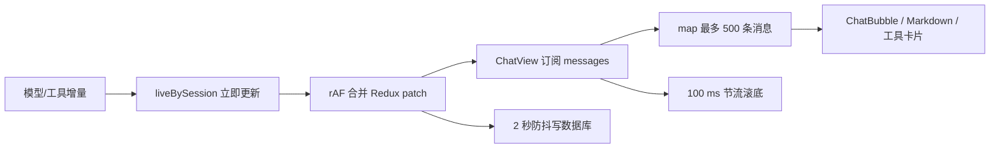

# 消息列表渲染进程性能问题系统审计

| 字段 | 内容 |
| --- | --- |
| 文档状态 | 代码静态审计完成，待性能基线验证 |
| 审计日期 | 2026-07-22 |
| 审计范围 | 消息加载、Redux 更新、列表协调、气泡渲染、Markdown/代码高亮、工具输出、滚动与搜索 |
| 核心文件 | `ChatView.tsx`、`ChatBubble.tsx`、`chatRunnerService.ts`、`ChatMarkdown.tsx`、`shikiHighlighter.ts` |

## 1. 结论摘要

当前实现中存在足以导致渲染进程卡顿的性能风险，风险主要集中在两类场景：

1. **长会话静态浏览**：最多一次加载并挂载 500 条消息，列表没有虚拟化；复杂 Markdown、工具卡片和终端内容会持续占用 DOM、布局与内存。
2. **流式生成或工具执行**：UI patch 已按 `requestAnimationFrame` 合并，正在输出的文本也已使用轻量纯文本渲染，但父组件仍会每帧协调整棵列表；逐消息内联回调使 `ChatBubble` 的 `memo` 比较几乎必然失败，导致历史气泡被连带重渲染。

因此，旧分析《流式生成界面卡顿 — 原因分析与优化方案》中“每 token 同步 Redux”“流式全文 Markdown”“完全没有 `React.memo`”三项已经不再符合当前代码；现阶段优先级最高的是：

- 修复气泡 memo 隔离失效；
- 引入消息列表窗口化/分段挂载；
- 将流式状态从承担发送编排的超大 `ChatView` 中隔离，降低每帧父组件计算和协调范围。

> 说明：本文结论来自代码路径审计，尚未采集目标机器上的 FPS、Long Task、React commit 时长和内存曲线。文中“严重性”表示代码结构导致问题的概率及其最坏影响，不等同于已测得的耗时。

## 2. 当前链路与已有保护

已经存在且应保留的缓解措施：

- `routeStreamPatchMessage` 使用 rAF 合并 Redux UI patch；同一消息一帧最多 dispatch 一次。
- DB patch 使用 2 秒延迟合并，避免每个增量都写数据库。
- 活跃文本段使用普通文本节点；消息完成后才进入 Markdown 与 Shiki 渲染。
- 自动滚底使用 100 ms throttle，并尊重用户是否停留在底部。
- `ChatBubble` 已有自定义 `memo` 比较器，搜索驱动也与列表渲染分离。
- 数据库默认限制单次读取 500 条，避免真正无界读取；但这仍远高于适合同时挂载的复杂消息数量。

这些措施降低了最极端的 token 级抖动，但没有解决整列表协调、DOM 规模和昂贵子树重复渲染。

## 3. 分类标准

### 3.1 严重性

| 等级 | 判定 |
| --- | --- |
| S0 致命 | 常规操作即可持续冻结或崩溃，影响数据安全；本次未发现 |
| S1 高 | 长会话或流式生成中很可能出现明显掉帧、输入迟滞、长任务 |
| S2 中 | 特定内容或使用时长下明显放大卡顿/内存占用 |
| S3 低 | 局部线性扫描或对象分配，单独影响小，但可叠加 |

### 3.2 修改成本

| 等级 | 典型范围 |
| --- | --- |
| C1 低 | 1～2 个文件，约半天，行为风险低 |
| C2 中 | 组件/selector 重构及测试，约 1～3 天 |
| C3 高 | 列表架构、滚动锚点或数据加载协议变化，约 3～8 天 |

## 4. 问题总表

| ID | 问题 | 严重性 | 成本 | 触发条件 | 建议顺序 |
| --- | --- | --- | --- | --- | --- |
| P-01 | `ChatBubble.memo` 被逐项内联回调击穿 | S1 | C1 | 任意父组件重渲染，流式时最明显 | 第一批 |
| P-02 | 消息列表无窗口化，最多同时挂载 500 条复杂消息 | S1 | C3 | 长会话、工具/Markdown 内容多 | 第二批 |
| P-03 | 每帧更新使 `ChatView` 协调整个列表并执行多组 O(N) 派生计算 | S1 | C2 | 流式正文、Thinking、工具状态更新 | 第一批 |
| P-04 | 活跃气泡每帧重建活动时间线并排序/分组 | S2 | C1～C2 | 单条助手消息含很多工具/思考段 | 第一批 |
| P-05 | 完成态 Markdown 重新渲染成本高，配置对象每次重建 | S2 | C1 | 历史气泡隔离失效、设置/计时状态变化 | 第一批随 P-01 |
| P-06 | Shiki 高亮缓存无上限，长时间使用会持续增长 | S2 | C1 | 大量不同代码块/长代码内容 | 第一批 |
| P-07 | 每秒计时状态放在 `ChatView`，无消息变化也刷新整页 | S2 | C1～C2 | 任一会话运行中 | 第一批 |
| P-08 | 消息状态为数组，patch/查找和多处 selector 均线性扫描 | S3 | C2 | 消息数接近 500、更新频率高 | 第三批 |
| P-09 | 工具参数/结果格式化和大文本 DOM 可能造成长任务 | S2 | C2 | 大 JSON、Shell 输出、多个展开工具卡 | 第二批 |
| P-10 | 搜索和跳转依赖完整 DOM，与未来窗口化存在架构冲突 | S2 | C3 | 长列表搜索；实施虚拟化时 | 与 P-02 同批 |
| P-11 | 多处 rAF/定时节流缺少统一取消和生命周期收口 | S3 | C1 | 快速切换会话或组件卸载 | 第三批 |

## 5. 详细问题与建议

### P-01（S1/C1）：`ChatBubble.memo` 被逐项内联回调击穿

**证据**

- `ChatView.tsx:1384-1412` 在 `messages.map` 内为每条消息创建新的 `onArchiveToWiki`，失败消息还创建 `onRetry`，排队消息创建 `onCancelQueued`。
- `ChatBubble.tsx:428-437` 的自定义比较器严格比较这些函数引用。
- `onArchiveToWiki` 对所有消息都传入函数，即使 `showArchiveToWiki` 为 `false`；因此父组件每次 render，几乎所有气泡都会因函数引用变化而绕过 memo。
- 对含确认工具的消息，`resolveMessageToolsInteractive` 还会创建新的对象，比较器又严格比较对象引用。

**影响**

流式期间虽然只有最后一条消息对象变化，历史消息仍会重复执行 `ChatBubble`、时间线构建、Markdown React 树协调和工具卡渲染。消息数越多，每帧成本越高。这是当前最明确、低成本且高收益的问题。

**建议**

- 将处理函数改为稳定的 `(messageId/content)` 事件入口，或让气泡只接收稳定 handler 与必要 id。
- 不可用的回调传 `undefined`，不要为不可见按钮创建函数。
- `toolsInteractive` 只传稳定标量和稳定回调，或按消息 id 缓存结果。
- 增加 render-count 回归测试：patch 最后一条消息时，已完成历史气泡不得重渲染。

### P-02（S1/C3）：消息列表无窗口化，DOM 规模最高可达 500 条复杂消息

**证据**

- `ChatView.tsx:1384` 直接 `messages.map`，没有虚拟列表或分段挂载。
- `electron/database/operations.ts:318-328` 和 IPC 默认值一次读取最多 500 条，并按正序返回；渲染层没有更小的首屏分页。
- 单条消息可能包含 Markdown、图片、多个工具卡、Thinking、Shell/Xterm 内容，其 DOM 成本远高于普通文本行。

**影响**

即便 React 不重渲染，浏览器仍需维护完整 DOM、样式与布局树。长会话初次打开、窗口 resize、字体加载、展开批次和滚动时都可能出现长任务；内存占用也会长期保持。

**建议**

- 采用支持动态高度和滚动锚定的虚拟列表；优先验证“底部追随、向上加载、图片加载后高度变化、展开工具卡、搜索跳转”。
- 数据层改为“先加载最新一页 + 向上游标分页”，不要把 500 条都交给 React 后再隐藏。
- 若完整虚拟化短期风险过高，可先做 `content-visibility: auto`/分段挂载作为过渡，但不能替代数据分页。

### P-03（S1/C2）：流式每帧仍由超大 `ChatView` 协调整个列表

**证据**

- `ChatView.tsx:153` 订阅整个 `messages` 数组；rAF patch 后根组件必然重渲染。
- 同一 render 中会执行消息过滤、多个 `find/map`、队列计数、交互解析和完整 `messages.map`。
- `ChatView.tsx` 总计约 1494 行，同时承担发送编排、流状态、会话加载、列表、滚动和 composer，更新边界过宽。

**影响**

rAF 只把更新上限压到显示帧率，并不保证每帧工作能在 16.7 ms 内完成。若一次 commit 超预算，仍会连续掉帧；同时输入区也处在同一父组件树下。

**建议**

- 拆出 `ChatMessageList`，由消息 id 列表驱动；单个 `ChatMessageRow` 按 id 订阅对应实体。
- 将 `RunningStatus/Elapsed` 放入独立叶子组件，把秒级刷新限制在状态标签。
- 将 composer 与消息列表放入稳定 sibling 边界，避免流式消息更新传播到输入区。
- 在引入实体化 state 前，可先用稳定 props + memo 达到大部分收益。

### P-04（S2/C1～C2）：活动时间线在每次活跃气泡 render 时重复构建

**证据**

- `ChatBubble.tsx:207-219` 每次 render 都重建 thinking/text 数组、两个 Map 和 `buildAssistantActivityTimeline`；只有后续 resolver/group 部分使用 `useMemo`。
- `buildAssistantActivityTimeline` 会组合全部条目并排序；`buildActivityItemTimestampResolver` 对 skill/tool 查询仍包含数组 `find`。

**影响**

工具调用、Thinking 和正文段很多时，单条活跃消息的每帧成本由文本追加放大为 O(A log A)，其中 A 为活动条目数；批次状态又会多次遍历 items。

**建议**

- 以 `message.thinking/contentSegments/toolCalls/skillHints` 的引用为依赖缓存所有派生结构。
- timestamp resolver 同时建立 tool/skill Map，消除循环中的 `find`。
- 更进一步可在流状态层维护增量 timeline，完成时再做一次规范化排序。

### P-05（S2/C1）：完成态 Markdown 渲染仍有可避免的重复分配

**证据**

- `ChatMarkdown.tsx:20-63` 每次 render 都新建 `rehypePlugins` 浅拷贝和 `components` 对象/三个组件函数。
- Markdown 解析本身只能在 `content` 不变且组件没有被父级重新执行时避免；当前 P-01 使历史气泡频繁进入 render。

**影响**

完成态长文、表格、数学公式和多个代码块会产生昂贵 React 子树。它通常不是独立根因，但会显著放大 P-01/P-03。

**建议**

- 先修 P-01；随后将静态 plugin 配置提升到模块级，将 components 通过稳定工厂/memo 管理。
- 视 profiler 结果给 `ChatMarkdown` 增加合适的 memo；不要在没有数据前自行实现 Markdown AST 缓存。

### P-06（S2/C1）：Shiki 缓存无上限

**证据**

- `shikiHighlighter.ts:47-52` 以完整代码字符串作为 key。
- `shikiHighlighter.ts:90-93` 把生成的 HTML 永久放入模块级 `Map`，没有容量、字节数、TTL 或会话清理策略。

**影响**

每个不同代码块同时保留原代码 key 和高亮 HTML value；长时间使用或浏览大量代码会持续抬高渲染进程堆内存，最终引发更频繁 GC 和间歇性卡顿。

**建议**

- 改为按条目数和估算字节数限制的 LRU；超大代码块不缓存。
- 记录 cache hit、entry count 和估算 bytes，便于验证阈值。

### P-07（S2/C1～C2）：秒级计时刷新位于列表根组件

**证据**

- `ChatView.tsx:335-350` 在 session running 时每秒 `setRunningClock`。
- 同一消息的 `MessageMeta` 又维护一个独立的每秒 timer；状态标签存在重复计时源。

**影响**

即使模型暂时没有 delta（工具执行、等待确认、网络停顿），整个 `ChatView` 仍每秒 render。配合 P-01，会刷新所有历史气泡。

**建议**

- 使用一个叶子级 elapsed 组件或共享外部时钟，只让需要显示时间的节点订阅。
- 避免根组件和气泡分别维护相同粒度的 timer。

### P-08（S3/C2）：消息数组导致热路径多次线性扫描

**证据**

- reducer 的 `patchMessage` 使用 `find`；`ChatView` 又多次执行 `find/filter/map`。
- `resolveToolsInteractive` 在列表 map 内再次 `messages.find`，最坏形成 O(N²)；虽然大部分情况下会因 tools disabled 或无确认工具提前返回，但工具开启时仍是结构性风险。

**建议**

- 短期让 `resolveToolsInteractive` 直接接收当前 `message`，消除 map 内二次查找。
- 中期将 store 正规化为 `ids + entities`，按 id O(1) patch/select；需谨慎迁移跨层调用和测试。

### P-09（S2/C2）：大工具输出与序列化工作运行在主线程

**证据**

- `ToolCallCard` 会对非字符串 input/result 执行格式化 `JSON.stringify(..., null, 2)`。
- `ShellOutputView` 对完整文本做规范化并渲染为 `<pre>`；展开的历史终端还会创建 Xterm、FitAddon 与 ResizeObserver。

**影响**

单次大 JSON/stringify、大 `<pre>` 文本节点或同时展开多个终端足以形成 Long Task，且会放大窗口 resize 和列表重渲染成本。

**建议**

- 在数据边界统一限制 UI preview 字节/行数，完整内容落盘后按需打开。
- 仅在展开时做 stringify/normalize，并缓存结果；超阈值考虑 worker。
- 确保折叠批次不挂载昂贵子树，而非只通过 CSS 隐藏。

### P-10（S2/C3）：搜索/跳转依赖 DOM 全量存在

**证据与影响**

当前搜索通过容器 DOM 适配器工作，消息跳转使用 `[data-message-id=...]` 查询。这在非虚拟列表中简单有效，但与 P-02 的窗口化直接冲突。若只替换列表组件，未挂载消息将无法搜索或定位。

**建议**

- 搜索数据源改为消息实体/数据库索引，结果返回 message id/sequence。
- 跳转时先让虚拟列表滚到 sequence，再在行挂载后处理高亮。
- 将这项作为虚拟化方案的验收条件，而不是上线后的补丁。

### P-11（S3/C1）：调度器生命周期未完全收口

**证据与影响**

`scrollBottomThrottled` 是组件内长期对象，当前可见代码未在卸载时调用 cancel；多处裸 `requestAnimationFrame` 也没有保存 id。快速切换会话/卸载时可能执行一次过期滚动或保留闭包到调度结束。影响通常较小，但会造成难复现的滚动抖动。

**建议**

- throttle 暴露并在 effect cleanup 中调用 `cancel`。
- 对必须跨帧的滚动任务保存 rAF id，并在会话变化/卸载时取消。

## 6. 按“严重性 × 成本”的治理分组

### A. 高严重性、低/中成本：立即处理

1. P-01 稳定气泡 props，恢复 memo 隔离。
2. P-03 拆出消息列表/计时叶子边界，避免根组件传播更新。
3. P-04 缓存活动时间线派生结构。

这组不改变消息加载协议和滚动语义，适合先落地并建立性能回归测试。

### B. 高严重性、高成本：单独设计并实施

1. P-02 最新页加载、向上分页、动态高度窗口化。
2. P-10 数据搜索与虚拟列表定位协议。

两项必须一起设计，重点保护底部追随、搜索跳转、图片高度变化、工具卡展开与无障碍阅读顺序。

### C. 中严重性、低成本：穿插处理

1. P-05 稳定 Markdown 配置（以前提 P-01 已修复为准）。
2. P-06 Shiki LRU/字节上限。
3. P-07 叶子级共享计时。

### D. 中低严重性、中成本：由 profiler 决定

1. P-08 Redux 消息实体化。
2. P-09 工具输出预览限额与 worker。
3. P-11 调度清理。

## 7. 建议验证方案与通过标准

### 7.1 固定样本

建立至少四组可复现 fixture：

- 20 条纯文本消息；
- 500 条混合消息（Markdown、表格、代码块、图片占位）；
- 单条含 100 个活动条目的助手消息；
- 1 MB JSON 工具结果和接近现有限额的 Shell 输出。

### 7.2 采集指标

| 指标 | 场景 | 建议门槛 |
| --- | --- | --- |
| 历史气泡 render 次数 | 最后一条流式更新 100 次 | 非目标历史气泡为 0 次 |
| React commit p95 | 500 条 fixture 流式输出 | 小于 8 ms（目标机器） |
| Long Task | 30 秒流式/滚动 | 不出现大于 50 ms 的常态任务 |
| 首次可交互时间 | 打开 500 条会话 | 设基线后至少降低 50% |
| DOM 节点数 | 500 条会话 | 窗口化后与可视行数同阶，不随总消息数线性增长 |
| JS heap | 连续浏览 1000 个不同代码块后返回空会话 | GC 后接近稳态，Shiki cache 不再单调增长 |

门槛需在团队约定的最低配置机器上校准；上述数值是工程目标，不是现有实测结果。

### 7.3 自动化回归

- 为 `ChatBubble` 包装测试探针，断言不相关消息更新不会触发 render。
- 为 Shiki cache 导出仅测试可见的统计接口，验证容量/字节上限。
- 为虚拟列表补充：底部追随、用户上滚不抢焦点、搜索跳转、图片载入后锚点稳定、展开工具卡后定位稳定。
- 保留现有 `chatRunnerService.uiBatch` 测试，继续保证同帧 patch 合并与完成前 flush。

## 8. 推荐实施路线

1. **基线**：用 React Profiler 与 Performance 面板记录四组 fixture。
2. **第一批（低风险高收益）**：P-01、P-04、P-06、P-07；复测并确认历史气泡不再重渲染。
3. **边界拆分**：完成 P-03，把列表、运行状态、composer 更新域分开。
4. **架构批次**：联合设计 P-02/P-10，实施最新页加载和动态高度虚拟列表。
5. **按数据收尾**：仅在 profiler 仍显示热点时实施 P-08/P-09，避免无依据的大规模状态重构。

## 9. 本次审计未判定为现存问题的旧结论

为避免后续重复治理，明确记录以下旧问题已被当前实现缓解：

- **“每个 token 立即 dispatch Redux”**：现为 rAF 合并，但仍可能每帧一次。
- **“流式期间全量 Markdown/Shiki”**：活跃正文段现使用纯文本；完成态才渲染 Markdown。
- **“ChatBubble 完全未 memo”**：已添加 memo，但因回调引用不稳定而效果受损。
- **“每个 token 强制滚底”**：主要流式路径已使用 100 ms throttle，并检查用户是否接近底部。
- **“数据库写入与 UI 同频”**：DB patch 已做 2 秒合并。

后续评审应以本文和实时 profiler 为准，不应直接照搬 2026-05-24 文档中的实现状态。
