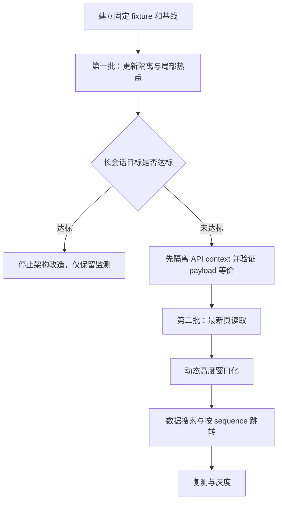

# 消息列表渲染进程性能优化技术方案

| 字段 | 内容 |
| --- | --- |
| 文档状态 | v1.6，**第一批 / 第二批默认实施范围已落地**（worktree `chat-message-list-perf`）；P-09 Worker / FTS / ids+entities 等非目标仍待定 |
| 设计日期 | 2026-07-22 |
| 实施进度 | 见下方「实施进度」；门禁记录：[batch1](./chat-message-list-batch1-remeasure-gate.md)、[batch2](./chat-message-list-batch2-remeasure-gate.md) |
| 依据 | [消息列表渲染进程性能问题系统审计](./chat-message-list-renderer-performance-audit.md) |
| 评审输入 | [技术方案首次评审](../review/chat-message-list-renderer-performance-optimization-design-review.md) |
| 二次评审 | [技术方案复审 v2](../review/chat-message-list-renderer-performance-optimization-design-review-v2.md) |
| 三次评审 | [技术方案复审 v3](../review/chat-message-list-renderer-performance-optimization-design-review-v3.md) |
| 四次评审 | [技术方案复审 v4](../review/chat-message-list-renderer-performance-optimization-design-review-v4.md) |
| 适用范围 | `ChatView`、消息列表/气泡、Markdown/Shiki、工具输出、消息加载、搜索与滚动 |

## 实施进度

| 阶段 | 状态 | 说明 |
| --- | --- | --- |
| 第一批 §4（P-01/03/04/05/06/07/08/11） | ✅ 已完成 | 稳定 actions、viewport/计时叶子、activity/Markdown/Shiki、折叠延迟格式化、throttle/rAF 清理 |
| 第一批 §5 门禁复测 | ✅ 已完成并触发第二批 | 见 [batch1-remeasure-gate](./chat-message-list-batch1-remeasure-gate.md)；500 条挂载长任务与 DOM 线性增长命中 |
| 第二批 §6.3 API context 隔离 | ✅ 已完成 | `apiContextService`、baseline IPC、payload 等价；queued/retry → `ApiContextRequest` + mutation gateway |
| 第二批 §6.2 / §6.3.7–6.3.9 最新页 + 摘要 | ✅ 已完成 | `chatGetMessagePage`、`displayEntries`、`contextHistorySummaryService`、`ContextUsageRing` 标量 |
| 第二批 §6.5 结构化搜索 | ✅ 已完成（含全会话语料） | `SearchFragment` / markdown 投影 / `chatGetSearchCorpusPage`；live 覆盖；未加载命中走 `scrollToMessageId` |
| 第二批 §6.4 / §6.6 Virtuoso + sequence 跳转 | ✅ 已完成 | 锁定 `react-virtuoso@4.12.8`；`ChatMessageViewport`；`displayPageLoader` 每轮读最新游标 |
| 第二批复测门禁 | ✅ 已完成 | 见 [batch2-remeasure-gate](./chat-message-list-batch2-remeasure-gate.md)；最新页 60 相对全量 500 挂载约 0.10×、DOM 约 0.12× |
| 评审阻断跟进 | ✅ v1+v2+v3 已修复 | [v1](../review/feat-chat-message-list-renderer-perf-review.md) / [v2](../review/feat-chat-message-list-renderer-perf-review-v2.md) / [v3](../review/feat-chat-message-list-renderer-perf-review-v3.md)：activeTarget + reveal + fragmentId/range 高亮 |
| 非目标 / 按需项 | ⏸ 不做（默认） | Redux `ids+entities`、Markdown AST 缓存、Worker、SQLite FTS、API「最新 500」策略变更 |

默认两批实施路线已走完；后续仅在 profiler 再证明有必要时单独开题。

## 1. 目标与结论

本方案分两批实施：先用小改动恢复 React 更新隔离并限制无界缓存，再根据实测结果决定是否进入“最新页加载 + 动态高度窗口化”。不把 Redux 消息实体化、Markdown AST 缓存、Web Worker 或统一调度框架作为前置条件。

预期结果：

1. 流式更新最后一条消息时，已完成的历史气泡不再重渲染，输入区不因秒级计时刷新。
2. 单条活动消息的时间线派生只在相关字段变化时计算。
3. Shiki 缓存达到上限后保持稳定，不随使用时长单调增长。
4. 若第一批优化后长会话仍不达标，消息列表只挂载可视区附近的行，初始只读取最新一页；向上翻页、底部追随和搜索跳转保持可用。

### 1.1 设计原则

- 先修复已确认的热路径，再引入列表架构变化。
- 展示消息与模型请求历史是不同的数据需求，分页不能缩短模型上下文。
- 展示页的加载、卸载、滚动和搜索不得改变下一次 LLM payload；API 上下文禁止读取 `displayEntries`。
- 展示顺序必须由数据库 `sequence` 或显式 optimistic 顺序决定，禁止退化为 `timestamp` 排序。
- 搜索结果必须能映射到具体渲染片段；“命中消息”不等于“可高亮”。
- 上下文摘要由拥有 live 状态的 renderer 合并，主进程只提供低频 DB 基线。
- 不自研虚拟列表核心算法；窗口化采用成熟的动态高度列表库。
- 阈值集中为常量并由基线校准，不建设通用性能配置中心。
- 每一批都可独立上线和回退。

### 1.2 非目标

- 不在本次方案中修改 rAF 合并 Redux patch 和 2 秒 DB 合并写入机制。
- 不把 `chat.messages` 迁移为 `ids + entities`；P-08 仅做已知的局部 O(N²) 消除。
- 不解析、持久化或缓存 Markdown AST。
- 不首发 Worker 化 JSON/Markdown/Shiki。
- 不改变模型历史现有“DB 基线按 sequence 正序读取前 500 条，并叠加当前会话生命周期内新增/live 消息”的兼容语义；是否改为“最新 500 条连续历史”另立方案。
- 不建设通用时钟、通用 LRU 包或通用列表框架。

## 2. 现状约束

### 2.1 必须保留的行为

| 行为 | 约束 |
| --- | --- |
| 流式展示 | 活跃文本继续使用纯文本，完成后才渲染 Markdown |
| 自动滚底 | 仅用户停留在底部附近时追随；用户上滚后不得抢回位置 |
| 会话切换 | DB、live 快照和 Redux 中的待处理消息仍需按 id 合并 |
| 工具交互 | confirming、executing、测试预览的确认/取消入口保持可用 |
| 搜索跳转 | 能定位到未挂载或尚未加载的消息；定位后再高亮 |
| 消息顺序 | 以数据库 `sequence` 为准；不能用 `timestamp` 充当分页游标 |
| 模型上下文 | 发送前由独立 `apiContextService` 构建；展示页不得成为上下文数据源 |
| 上下文环 | 历史图片和最近 Thinking 的估算不能因展示分页而丢失 |

### 2.2 关键风险

当前 `chat.messages` 同时被用于 UI 展示、live 消息种子和 `MessageInput` 的上下文占用估算。若直接把它替换为最新 60 条：

- `resolveSessionMessagesForApi` 仍可从 DB 读取请求历史，模型请求本身不会立即截断；
- 但若继续把 Redux 展示页参与合并，超过 500 条的会话会形成“DB 前 500 条 + UI 最新页”的非连续并集，改变 payload；
- 但 `ContextUsageRing` 会漏算未加载页中的图片和最近 Thinking；
- `initLiveSessionFromStore` 只能用已加载页种子化 live 快照；
- DOM 搜索无法发现未挂载消息。

因此第二批必须显式拆分“展示窗口”和“请求/估算/搜索数据”，不能只替换 `messages.map`。

### 2.3 历次评审阻断项的设计决策

| 阻断项 | 修订决策 |
| --- | --- |
| 搜索 offset 无法映射实际节点 | 语料拆成带稳定身份的 `SearchFragment`；Markdown 使用“可见文本投影 + 节点锚点”生成和渲染同源映射；折叠内容按 reveal path 展开后再标记 |
| 分页丢失逐消息 sequence | UI 分页返回 `DisplayMessageEntry[]`；Redux 展示状态保存 sequence/optimisticOrdinal；展示路径禁止调用按 timestamp 排序的 `mergeDbAndLive` |
| DB 摘要无法覆盖 live | renderer 的 `contextHistorySummaryService` 是单一所有者；低频 DB 基线与逐消息 live override 在本地合并，完成持久化后再原子校准 |
| UI 分页污染 LLM 上下文 | 新增独立 `apiContextService`；API 基线和 live overlay 均携带顺序身份，禁止读取 `displayEntries` 或复用展示合并函数 |
| Thinking 候选语义漂移 | 摘要合并后只在 `assistant && thinkingTokens > 0` 中选择最后一项；零值 override 仍参与同 id 替换，但不能遮住其他历史候选 |
| KaTeX/Shiki 无法使用 remark nodeKey | 搜索 fragment 按真实渲染边界分型：普通文本使用 AST anchor，代码由 Shiki 组件按源码 range 标记，数学公式搜索源码并高亮整个 KaTeX 容器 |
| queued -> sent 绕过 API overlay | 所有影响 API 资格的持久化变更经过统一 mutation gateway；出队先提交 sent，再以 required current user 构建上下文 |
| failed 重试依赖展示页 | 主进程按 sequence 解析 retry target；请求级排除 failed assistant 并显式补入目标 user，展示删除不再承担上下文语义 |
| 摘要要求裸 sequence，乐观消息无法建模 | 摘要值与顺序身份分离；DB 行在 renderer 边界转换为 persisted order，routeAdd 直接使用 optimistic order，append ack 只原子校准顺序 |

## 3. 总体实施路线



第一批覆盖 P-01、P-03、P-04、P-05、P-06、P-07、P-08 的明确局部问题及 P-11。第二批覆盖 P-02、P-10，并顺带降低 P-09 的常驻 DOM 成本。P-09 的进一步截断/Worker 化只由 profiler 触发。

> **进度（2026-07-22）**：上图 A→B→C→E→F→G→H→I 已全部落地；门禁见 batch1 / batch2 remasure 文档。D 路径未采用（第一批复测未达标）。

## 4. 第一批：低风险高收益优化 ✅ 已完成

### 4.1 稳定气泡属性，恢复 memo 隔离（P-01） ✅

#### 方案

在 `ChatView` 与气泡之间增加薄组件 `ChatMessageList`，把操作入口聚合为引用稳定的对象：

```ts
export type ChatMessageActions = {
  archiveToWiki: (content: string) => void
  retryAssistant: (messageId: string) => void
  cancelQueued: (messageId: string) => void
  confirmTool: ToolsInteractiveProps['onToolConfirm']
  cancelTool: ToolsInteractiveProps['onToolCancel']
}
```

- `ChatView` 用 `useCallback` 创建上述入口，再用 `useMemo` 创建 `actions`。
- `ChatMessageList` 向每个 `ChatBubble` 传同一个 `actions`；是否显示按钮仍由消息状态和配置标量决定。
- `ChatBubble` 内部在真实按钮的 `onClick` 上绑定 `message.id` 或 `message.content`。这些闭包只在该气泡自身 render 时创建，不再作为气泡 props 参与 memo 比较。
- 不可用的交互状态传 `undefined`。只有当前 confirming/executing 消息或测试预览消息获得 `toolRequestId`、`confirmMode` 等交互标量。
- `resolveToolsInteractive` 改为直接接收当前 `message`，禁止在列表 map 内再次 `messages.find`。

`ChatBubble` 继续使用 `memo`，比较器必须覆盖所有会影响视图的字段：`message`、`enter`、工具交互标量、`focusToolUseId`、`workDir`、`shellConfig`、`sessionMetadata`、`onOpenFile`、wiki 配置和稳定 `actions`。当前比较器遗漏的配置字段一并补齐。若 props 收敛后均为稳定引用或标量，可删除自定义比较器，使用默认浅比较。

#### 不采用的方案

- 不按消息 id 在每一行单独订阅 Redux。现有 reducer 仍是数组，先做此改动会引入 selector 和状态正规化的半套架构。
- 不在比较器里做消息深比较。流式对象大且字段复杂，深比较会把渲染成本转移到比较阶段。

#### 测试

- 更新最后一条 streaming 消息 100 次，历史完成气泡 render probe 计数为 0。
- `workDir`、shell 配置、wiki 开关改变时，受影响气泡必须更新。
- 失败重试、排队取消、工具确认/取消各验证一次 id 透传。

### 4.2 收窄 `ChatView` 更新边界（P-03、P-07） ✅

组件边界调整为：

```text
ChatView（会话与发送编排）
├── ChatMessageViewport（滚动容器、消息列表、跳转）
├── ChatRunningStatus（运行状态与自己的秒级时钟）
├── ChatDecisionPanels（已有确认面板）
└── MessageInput（稳定 props）
```

具体处理：

1. 删除 `ChatView` 的 `runningClock` state。
2. 顶部/输入区附近的运行状态由 `ChatRunningStatus` 自己每秒更新时间；`MessageMeta` 保留其叶子计时器。首批不建设共享外部时钟，因为同屏通常只有一个活跃气泡，两个叶子 timer 的成本远低于根组件刷新。
3. `ChatMessageViewport` 用 `memo` 包裹，集中持有 `scrollRef`、stick-to-bottom、跳转和“回到最新”按钮状态。
4. `MessageInput` 接收的对象/数组用 `useMemo` 保持引用稳定。流式正文变化时如果 `historyMessages` 的估算确实需要更新，限制到 `ContextUsageRing`，不要让输入编辑控件主体随之更新。
5. 不为了缩短文件而迁移发送编排。`ChatView` 的体积不是独立性能指标，本批只移动有明确更新边界收益的 UI。

### 4.3 缓存活动时间线派生（P-04） ✅

在 `ChatBubble` 中以消息子字段为依赖，合并计算以下数据：

```ts
const activityModel = useMemo(() => {
  const thinkingSegments = ...
  const textSegments = ...
  const toolById = new Map(...)
  const skillById = new Map(...)
  const timeline = buildAssistantActivityTimeline(message)
  const getTimestamp = buildActivityItemTimestampResolver(message)
  return { thinkingSegments, textSegments, toolById, skillById,
           segments: groupActivityTimeline(timeline, getTimestamp) }
}, [message.thinking, message.content, message.contentSegments,
    message.toolCalls, message.skillHints, message.role])
```

- `activityBatchGrouping` 的 timestamp resolver 同时建立 tool/skill Map，消除循环内 `find`。
- 不在流状态服务中维护增量 timeline。单条含 100 个活动条目的 fixture 优化后若仍超过目标，再单独评估；首批不复制一套派生状态。

### 4.4 稳定 Markdown 配置（P-05） ✅

- `remarkPlugins`、`rehypePlugins` 直接使用模块级只读数组，不在 render 中浅拷贝。
- 用 `useMemo` 创建依赖 `wikiRootPath`、`baseRelPath`、`onOpenFile` 的 `components`。
- `ChatMarkdown` 用 `memo` 包裹，按 `content` 和链接相关 props 浅比较。
- 保持 Shiki 异步渲染现状，不增加 AST/HTML 的第二套缓存。

这项优化只作为 P-01 的放大器治理；验收重点仍是历史气泡不进入 render。

### 4.5 Shiki 有界 LRU（P-06） ✅

将模块级 `Map` 替换为文件内的简单 LRU，初始阈值：

| 常量 | 初值 | 说明 |
| --- | ---: | --- |
| `MAX_HIGHLIGHT_CACHE_ENTRIES` | 200 | 防止大量短代码块占满缓存 |
| `MAX_HIGHLIGHT_CACHE_BYTES` | 8 MiB | key 与 HTML 按 UTF-16 `length * 2` 粗估 |
| `MAX_CACHEABLE_CODE_BYTES` | 256 KiB | 超大代码仍可高亮，但不进入缓存 |

命中时删除并重新插入条目；插入后从最旧项开始淘汰，直到条数和估算字节均达标。只导出测试用 `getHighlightCacheStats`/`clearHighlightCacheForTest`，生产 UI 不增加缓存面板。阈值经 heap fixture 校准后固化为常量。

### 4.6 大工具输出的最小处理（P-09） ✅（最小方案；Worker 未做）

首批只做两件事：

- `ToolCallCard` 仅在展开时执行 `JSON.stringify`/normalize，并以 `record.input`、`record.result` 引用为依赖 memo。
- 确认折叠的 `ActivityBatch` 不挂载 Xterm、大 `<pre>` 和完整结果子树。

暂不统一截断数据。工具结果可能承载 diff、诊断和确认信息，未先定义“查看完整内容”的可靠入口前不能直接截断。若 profiler 仍显示单次 stringify 或大文本节点产生超过 50 ms 的长任务，再增加“预览 + 打开完整内容”，而不是直接上 Worker。

### 4.7 调度器清理（P-11） ✅

- `scrollBottomThrottled` 在 effect cleanup 中调用 `cancel()`。
- 保存组件内滚动 rAF id，会话切换和卸载时取消。
- 不抽象统一 scheduler；仅收口本组件创建的 timer/rAF/throttle。

## 5. 第一批性能门禁 ✅ 已完成（结论：进入第二批）

先增加开发/测试 fixture，不把性能数字写成易抖动的普通 CI 断言。CI 只验证确定性行为：

| 场景 | 自动化断言 |
| --- | --- |
| 流式 patch 最后一条 | 历史气泡 render 次数为 0 |
| 每秒计时 | `ChatView` 和 `MessageInput` 主体不重渲染 |
| 100 活动条目 | 无关 props 更新不重建 timeline |
| Shiki 1000 个不同代码块 | entry/bytes 不超过阈值 |
| 会话切换/卸载 | 无过期滚动、无未清 timer |

在约定最低配置机器采集 20 条和 500 条混合 fixture：React commit p95、Long Task、首次可交互时间、DOM 节点数和 GC 后 heap。若 500 条会话首次打开仍有明显长任务、DOM 节点仍是主要内存来源，进入第二批；否则停止，不为理论上的规模继续改造。

> **复测结论（2026-07-22）**：门禁命中，已进入第二批。详见 [chat-message-list-batch1-remeasure-gate.md](./chat-message-list-batch1-remeasure-gate.md)。

## 6. 第二批：最新页加载与动态高度窗口化 ✅ 已完成

### 6.1 触发条件 ✅ 已触发

满足以下任一条件才实施：

- 500 条混合 fixture 打开时存在可复现的 >50 ms 长任务；
- 首次可交互时间相比 20 条 fixture 增长超过 2 倍；
- DOM/布局为 profiler 主热点，第一批后仍无法达到审计建议的 commit p95 目标；
- 实际用户会话经常超过 100 条复杂消息且反馈仍有滚动卡顿。

进入第二批后，必须先落地第 6.3 节 API context 隔离并通过 payload 等价测试，再修改 UI 初始加载协议。不能在同一个提交中同时把 Redux 改成最新页和修补上下文构建。

### 6.2 数据协议：读取最新页并向上翻页 ✅

新增专用于 UI 的 IPC，不复用面向备份的正向 `getMessagesPage`：

```ts
type DisplayOrder =
  | { kind: 'persisted'; sequence: number }
  | { kind: 'optimistic'; ordinal: number }

type DisplayMessageEntry = {
  message: Message
  order: DisplayOrder
}

type ChatMessagePage = {
  entries: Array<{
    message: Message
    sequence: number
  }>                           // 页面内按 sequence ASC 返回
  oldestSequence: number | null
  hasMoreBefore: boolean
}

chatGetMessagePage(payload: {
  sessionId: string
  beforeSequence?: number      // 排他上界；缺省表示从最新消息开始
  limit?: number               // renderer 固定传 60，主进程 clamp 到 20..100
}): Promise<ChatMessagePage>
```

SQL 使用现有 `(session_id, sequence)` 索引：

```sql
SELECT * FROM messages
WHERE session_id = ?
  AND (? IS NULL OR sequence < ?)
ORDER BY sequence DESC
LIMIT ?;
```

主进程多读一条或额外做存在性查询得到 `hasMoreBefore`，再反转为升序返回。游标必须来自 DB `sequence`，不把 `sequence` 加入公共 `Message` 领域模型。

Renderer 初始页建议 60 条，向上接近首项时读取上一页。`chatSlice` 的展示状态使用 `DisplayMessageEntry[]`；公共 `Message` 类型、模型请求和数据库备份协议不增加 sequence。业务组件通过 selector 获得 `entry.message`，只有 viewport、分页 reducer、搜索定位和 live 路由接触 `DisplayOrder`。

#### 6.2.1 展示顺序不变量

1. persisted entry 严格按 `sequence ASC` 排列。
2. optimistic entry 使用当前会话单调递增的 `ordinal`，始终位于所有 persisted entry 之后，并按 ordinal 排列。
3. 同一 message id 在展示数组中最多出现一次。
4. DB 页面命中已有 id 时，只原位更新 `message` 并把 order 校准为 persisted sequence；不得按 timestamp 重新插入。
5. live patch 只替换同 id entry 的 `message`，保留原 order。
6. live append 先创建 optimistic entry；DB append 成功后用返回的 sequence 把同 id entry 原位升级为 persisted entry，再按 sequence 校准位置。
7. `timestamp` 仅用于显示时间和现有模型历史兼容逻辑，不参与展示排序、分页或搜索 index 计算。

当前 `chatRunnerService.mergeDbAndLive` 会按 timestamp 排序，第二批的展示与 API context 路径均禁止调用。展示使用 `mergeDisplayEntries`，API 使用第 6.3 节的 sequence 合并；迁移完成且无其他调用后删除该旧函数。

#### 6.2.2 append sequence 回填

现有 renderer 调用均忽略 `chatAppendMessage` 返回值，因此第二批将其返回类型收敛为：

```ts
type PersistedMessageAck = {
  messageId: string
  sequence: number
}
```

主进程在同一个 `appendMessage` 数据库操作中取得刚分配的 sequence 并返回，renderer 收到 ack 后 dispatch `ackDisplayMessagePersisted`。不另发“按 id 查询 sequence”IPC，也不依赖异步备份事件。远程入口直接写 DB；当前会话下次分页/刷新时自然取得 persisted entry。

若 append 失败，保留 optimistic entry 并按现有错误流程标记失败；不得伪造 sequence。若多个 append ack 乱序到达，各 entry 按真实 sequence 重排，最终顺序仍满足不变量。

#### 6.2.3 页面合并算法

`mergeDisplayEntries(current, incomingPage)` 按以下顺序执行：

1. 建立 current 的 id -> entry 映射，但不改变现有相对顺序。
2. 对 incoming 按 sequence ASC 处理：不存在则加入；已存在则以 DB message 为基线，再叠加该 id 尚未持久化的 live patch，并将 order 改为 persisted sequence。
3. 最终只按 `DisplayOrder` 比较器排序：persisted sequence 在前，optimistic ordinal 在后；比较器不得读取 timestamp。
4. 更新 `oldestSequence`/`hasMoreBefore`；使用 `loadingBefore` 和 session generation token 防止重复请求及旧会话响应串入新会话。

该算法必须作为 shared/renderer 纯函数单测，不把去重与排序散落在 effect 中。

### 6.3 展示状态与请求历史分离 ✅

- `chat.messages` 在第二批迁移为 `displayEntries`，其语义是“当前会话已加载的展示消息 + 顺序身份”。这不是 `ids + entities` 实体化；仍是单一数组，只增加分页正确性所需的 order。
- 新增 `apiContextService` 作为模型上下文唯一入口。它只合并 API DB baseline 与 API live overlay，不读取 Redux `displayEntries`。
- `liveBySession` 不再从 Redux/展示页种子化；现有 routeAdd/patch/getLive 能力迁入或委托给 `apiContextService` 的 overlay，避免维护两份含义接近的 live 全量快照。
- `ContextUsageRing` 的 props 从完整 `historyMessages` 收敛为已合并的 `historyImageTokens`、`thinkingTokensToExclude`。
- 删除 `ChatView` 中从展示数组派生的 `composerHistoryMessages`；`MessageInput/ContextUsageRing` 只接收摘要标量，避免以后又把展示页误当作历史真相源。

这一拆分是分页上线条件。必须证明打开会话、加载最新页、向上翻页、虚拟行卸载和搜索加载语料均不会改变 API context。

#### 6.3.1 API 上下文单一入口

新增专用 IPC 和 renderer 服务：

```ts
type ApiContextEntry = {
  message: Message
  order: DisplayOrder
}

type ApiContextBaseline = {
  sessionId: string
  entries: Array<{
    message: Message
    sequence: number
  }>
}

chatGetApiContextBaseline(payload: {
  sessionId: string
}): Promise<ApiContextBaseline>
```

`chatGetApiContextBaseline` 首版严格复用当前 DB 业务范围：`ORDER BY sequence ASC LIMIT 500`。返回逐消息 sequence 是为了正确合并，而不是改变裁剪策略。它与 UI 的“最新 60 条”分页 IPC 完全独立。

renderer 服务只持有当前/运行中会话发生过变更的消息：

```ts
type ApiContextSessionState = {
  generation: number
  nextOptimisticOrdinal: number
  overlayById: Map<string, ApiContextEntry>
}
```

- `routeAddMessage` 把完整消息写入 overlay，初始 order 为 optimistic ordinal。
- append ack 返回 sequence 后，把同 id overlay 升级为 persisted order。
- `routePatchMessage`/`routeStreamPatchMessage` 用 patch 更新 overlay 中的完整消息；流式目标由 `routeAddMessage` 保证已存在，若不存在则抛出开发期错误，不能用不完整 patch 创建 overlay。
- overlay 不得由 `displayEntries`、搜索语料或 DOM 初始化。
- overlay 中已经持久化但不属于 DB 前 500 条的新增尾部消息，在当前会话服务生命周期内继续保留；否则同一会话下一轮请求会丢掉刚完成的对话。它只在会话安全淘汰时释放。
- `finishSessionRun`/现有 `clearLiveSession` 不得清除 API overlay；终态只清理控制器、定时器和已完成的 UI live 资源。
- 当前会话和运行中后台会话不得淘汰；非当前、非运行且无 pending persist 的会话可清理，之后再次进入时按 DB baseline 重新建立，这与现有 reload 语义一致。

#### 6.3.2 API 合并算法与不变量

每次发送必须提供显式请求变换，不再使用含义模糊的 `skipUserMessage`：

```ts
type ApiContextRequest = {
  sessionId: string
  requiredCurrentUser: ApiContextEntry
  excludeMessageIds?: string[]
}
```

普通发送使用刚创建的 sent user entry；队列出队和失败重试使用第 6.3.4/6.3.5 节解析出的 persisted user entry。

发送编排把现有布尔选项替换为判别联合：

```ts
type SendContextIntent =
  | { kind: 'create-user'; text: string; attachments?: ChatImageAttachment[] }
  | {
      kind: 'reuse-user'
      currentUser: ApiContextEntry
      excludeMessageIds?: string[]
    }
```

`prepareSendContext(intent)` 负责新消息落 overlay/append 或复用已有 entry，最终统一产出 `ApiContextRequest`；后续发送逻辑不再判断 queue/retry 来源。

`resolveSessionContextForApi(request)` 的算法固定为：

1. 请求 `request.sessionId` 的 `ApiContextBaseline`，并用 generation 丢弃串会话/过期响应。
2. 在 baseline 返回后读取一次最新 overlay 快照，保证请求期间发生的 routeAdd/patch 不丢失。
3. baseline 同 id 被 overlay 完整消息原位覆盖，保留 persisted sequence。
4. baseline 不含的 overlay entry 按 `DisplayOrder` 加入；persisted sequence 排序，尚未 ack 的 optimistic entry 位于其后。
5. 在 baseline + overlay 合并结果上删除 `excludeMessageIds`；排除作用于最终并集，不能只删 overlay，否则 baseline 会让消息复活。
6. 按 id 删除 required current user 的旧副本，再以传入的完整 entry 和 order 补入一次。
7. 全程禁止读取 timestamp 排序，禁止调用当前 `mergeDbAndLive` 或 `mergeDisplayEntries`。
8. 得到有序 `ApiContextEntry[]` 后调用 `filterMessagesForChatApi`。若 required current user 不是 `role='user' && status='sent'`，或过滤后不是恰好一次，抛出 `ApiContextInvariantError` 并中止发送；禁止静默发送残缺 payload。
9. 校验通过后剥离 order，返回唯一 `historyForApi: Message[]`。

必须保持以下不变量：

- UI 加载/卸载任意页面前后，`resolveSessionContextForApi` 返回的 message ids 和内容一致。
- DB 旧版本与 overlay 新版本同 id 时，以 overlay 为准但位置不变。
- timestamp 逆序或相同时，API 历史仍按 sequence/optimistic order。
- queued 和 streaming 消息仍由现有 filter 排除；当前正在发送的 user 消息按现有发送流程显式纳入。
- `historyForApi` 是 Skill 路由、视觉模型判断、发送预警、tool payload 和非 tool payload 的共同输入，任何消费者不得自行从展示列表重建历史。
- `currentUserMessageId` 必须等于 `requiredCurrentUser.message.id`，图片 hydration 和视觉路由不得从文本参数或展示页重新猜测当前 user。

最低 payload 等价 fixture：DB 中有 1000 条消息，API baseline 为 `m0..m499`，UI 初始页为 `m940..m999`。依次执行“打开最新页、向上加载一页、虚拟行卸载、搜索加载全量语料”后，API context ids 必须始终为 `m0..m499`；执行 `routeAddMessage(m1000)` 后只能追加一个 `m1000`，append ack、流式 patch 和 DB 校准均不得改变其位置或产生重复。tool 与非 tool 发送路径必须消费相同 ids。

队列 fixture：同一 user 分别经历 optimistic queued、persisted queued、gateway sent。`resolveSessionContextForApi` 在 sent 前必须因资格断言失败或不被调用，sent 后 `historyForApi` 恰好包含一次该 user；图片附件、视觉模型判断和 `currentUserMessageId` 均来自 sent entry。

重试 fixture：目标为 `user(sequence=998) -> failed assistant(sequence=999)`，二者均不在 `m0..m499` baseline。通过 retry query 得到完整 target 后，变换结果包含 user 一次、failed assistant 零次；带图片 user 和含残缺 toolCalls 的 failed assistant 使用相同断言。所有下游消费者必须接收同一对象或同一 ids 签名的 `historyForApi`。

现有 `mergeDbAndLive` 可在 API/展示迁移完成后删除；若仍有其他兼容调用，必须改名体现 timestamp 语义，且不得被上下文或展示路径引用。

#### 6.3.3 API context mutation gateway

影响消息是否进入 API 的状态变更不能直接 dispatch Redux。提供三个明确入口，不建设任意 command bus：

```ts
type PersistedMessageEntry = {
  message: Message
  sequence: number
}

routeAddMessage(entry)

commitMessagePatch({
  sessionId,
  messageId,
  patch
}): Promise<PersistedMessageEntry>

commitMessageDelete({
  sessionId,
  messageId
}): Promise<void>
```

- `routeAddMessage` 负责 display（当前会话）、API overlay 和 summary override；DB append 仍由调用方 await，ack 回填 sequence。
- `commitMessagePatch` 使用返回 `{ message, sequence }` 的持久化 patch IPC；先 await DB 更新及权威完整行回读，成功后原子更新 API overlay、已加载 display entry 和 summary override。这样重启后首次出队的 queued 消息即使不在 overlay，也不会用 partial patch 创建上下文。DB 失败时三个 renderer 投影均不提前提交。
- `commitMessageDelete` 先 await 专用 DB 删除；成功后从 API overlay、display 和 summary 同时移除。取消 queued message 使用该入口。
- stream patch 继续使用现有 rAF/2 秒批处理，但其内存态更新必须委托同一组“更新完整消息投影”的纯函数，不能另写资格判断。
- 至少将 `status: queued -> sent`、queued 删除、failed 状态、可能改变 attachments/thinking/toolCalls 的最终 patch 纳入 gateway 审计清单。

Redux reducer 仍可供 gateway 内部使用，但业务编排代码禁止直接 `dispatch(patchMessage/removeMessage/setMessages)` 来表达 API 语义。

#### 6.3.4 排队消息出队协议

分页后不能从当前展示数组寻找下一条 queued user。新增：

```ts
chatGetNextQueuedMessage({ sessionId }): Promise<{
  message: Message
  sequence: number
} | null>
```

主进程按 `session_id + status='queued' + sequence ASC LIMIT 1` 查询。出队流程固定为：

1. 查询 next queued entry；验证 role=user、status=queued。
2. 调用并 await `commitMessagePatch(..., { status: 'sent' })`，取得状态为 sent 的完整 `PersistedMessageEntry`。
3. 转为 `{ message, order: { kind: 'persisted', sequence } }`，作为 `requiredCurrentUser` 调用 `resolveSessionContextForApi`，不传 exclude。
4. resolver 必须断言该 user 在过滤后恰好一次；失败则停止 Skill 路由和模型调用并记录错误，不能退回文本参数拼装。
5. `historyForApi`、`currentUserMessageId`、attachments 和图片 hydration 均来自同一个 sent entry。

因此 `drainQueueForSession` 不再直接 dispatch status，也不再传 `skipUserMessage: true`。纯文本和带图片 queued user 走完全相同的协议。

#### 6.3.5 失败回复重试协议

重试不能从 `displayEntries` 向前扫描。新增主进程只读查询：

```ts
type RetryContextTarget = {
  failedAssistant: { message: Message; sequence: number }
  currentUser: { message: Message; sequence: number }
}

chatResolveRetryContext({
  sessionId: string
  failedAssistantMessageId: string
}): Promise<RetryContextTarget | null>
```

主进程在同一 DB snapshot 中：

1. 按 sessionId + id 读取目标，验证 role=assistant、status=failed，并取得 sequence。
2. 按 `sequence < failedSequence` 逆序寻找第一条满足共享 `isMessageEligibleForChatApi` 且正文非空的 user，返回完整附件和 persisted sequence；不得受 UI 是否加载上一页影响。`filterMessagesForChatApi` 改为复用该单条 predicate，避免主进程定位与 renderer 过滤形成两套资格规则。
3. 找不到、目标状态已变化或 session 不匹配时返回 null，renderer 提示并停止重试。

renderer 构造：

```ts
resolveSessionContextForApi({
  sessionId,
  requiredCurrentUser: {
    message: retryTarget.currentUser.message,
    order: { kind: 'persisted', sequence: retryTarget.currentUser.sequence }
  },
  excludeMessageIds: [retryTarget.failedAssistant.message.id]
})
```

- failed assistant 的排除发生在 baseline + overlay 合并之后，因此 DB 行、残留 toolCalls 和 overlay 新版本都不会复活。
- required user 按 id 去重后显式补入；即使其 sequence > 499、不在冻结 baseline，仍进入 `historyForApi` 恰好一次。
- `currentUserMessageId`、图片附件和 hydration 均来自 retry target，不从展示消息或输入 text 推断。
- display 中隐藏 failed assistant 只是 UI 操作，可在上下文构建成功后执行；它不承担排除语义。首版不删除 DB failed 行，后续普通请求是否永久排除 failed 历史不在本性能方案中改变。
- 含残缺 toolCalls 的 failed assistant 必须整体排除，不能尝试在本批修复其工具配对。

普通发送、出队和重试最终都产出同一种 `ApiContextRequest`，此后 Skill 路由、视觉判断、预警、tool/non-tool payload 不再分支。

#### 6.3.6 与现有 500 条策略的关系

本次性能改造冻结而不修正现有策略：DB baseline 仍为最早 500 条，当前会话生命周期内新产生的消息通过 overlay 追加。这样避免把 UI 改造和上下文裁剪策略绑在同一批变更中。

该兼容策略对超长会话并不理想：重启或重新进入后可能缺少最近历史。后续若改为“最新 500 条连续历史”，必须单独评审 tool use/result 配对、图片历史、system/skill 消息、token 裁剪和远程会话行为，不能作为本方案的顺手优化。

#### 6.3.7 上下文摘要单一所有者

新增 renderer 服务 `contextHistorySummaryService`，它是上下文环历史摘要的单一所有者。主进程不维护 live 摘要，只提供会话切换和显式校准时使用的 DB 基线：

```ts
type ContextSummaryValue = {
  messageId: string
  role: Message['role']
  imageTokens: number
  thinkingTokens: number
}

// IPC 传输行；sequence 只表示 DB 已持久化顺序。
type ContextHistoryDbRow = ContextSummaryValue & {
  sequence: number
}

type ContextHistoryDbBaseline = {
  sessionId: string
  entries: ContextHistoryDbRow[] // 仅返回 imageTokens > 0 或 thinkingTokens > 0 的项
}

type ContextSummaryEntry = ContextSummaryValue & {
  order: DisplayOrder
}

type PersistedContextSummaryEntry = ContextSummaryValue & {
  order: Extract<DisplayOrder, { kind: 'persisted' }>
}
```

DB 基线按现有 `chatGetMessages` 的最多 500 条范围计算，以保持改造前语义；返回轻量逐消息摘要而不是两个总数，是为了让 renderer 能按 message id 用 live 新版本覆盖 DB 旧版本而不重复计数。

`ContextHistoryDbRow` 仅存在于 IPC 边界。renderer 收到响应并通过 session generation 校验后，必须先调用唯一转换函数，再写入状态：

```ts
function toPersistedContextSummaryEntry(
  row: ContextHistoryDbRow
): PersistedContextSummaryEntry {
  assertValidPersistedSequence(row.sequence)
  const { sequence, ...value } = row
  return { ...value, order: { kind: 'persisted', sequence } }
}
```

转换后的内存模型不再保留裸 `sequence`。非法 sequence 使本次 baseline 校准整体失败并继续使用旧状态，不能降级为 optimistic order 或伪造顺序。

服务内部状态为：

```ts
type ContextHistorySummaryState = {
  sessionId: string
  generation: number
  baseById: Map<string, PersistedContextSummaryEntry>
  overrideById: Map<string, ContextSummaryEntry>
}
```

#### 6.3.8 摘要 DB 基线与 live 覆盖协议

1. 会话切换：增加 generation、清空旧摘要状态、请求一次 DB baseline，并读取该 session 的 API overlay 摘要作为初始 override；旧 generation 响应直接丢弃。这样切回仍在后台运行的会话时不会漏掉尚未进入 DB baseline 的消息。
2. `routeAddMessage`：使用与 API overlay、展示 entry 相同的 optimistic ordinal，同步计算 image/thinking tokens 并写入 `overrideById`；此路径不要求也不接受 sequence。即使 append 已落 DB，在下一次校准前也保留 override。
3. `routePatchMessage`/`routeStreamPatchMessage`：与 UI patch 同步更新对应 override。流式 Thinking 在 renderer 内计算，不发 IPC。
4. 合并时以 id 为键，override 完整替换同 id base，产物统一为 `ContextSummaryEntry[]`；历史图片 token 为合并后所有 entry 的 imageTokens 之和。
5. 最近 Thinking 必须在 base + override 完整替换后，仅从 `role === 'assistant' && thinkingTokens > 0` 的 entry 中按 `DisplayOrder` 选择最后一项。较新的无 Thinking assistant 不参与候选，不能用它的 0 覆盖更早的有效候选；同 id 的零值 override 仍会替换旧 base，使该消息正确退出候选集合。排序不能使用 timestamp。
6. 当前尚未发送的图片继续由 `pendingImageAttachments` 单独估算，不进入 history override；用户消息 routeAdd 后从 pending 转入 override，避免双算。
7. append ack 通过 `ackContextSummaryPersisted(messageId, sequence)` 原子地把同 id override 的 order 从 optimistic 升级为 persisted；保留 role 和 token 值，不删除、不重算 override。找不到对应 optimistic override 视为开发期不变量错误，不能用空摘要补建 entry。
8. 运行完成、取消、失败或显式 reload 在所有 DB patch 已 `await` 后请求一次新 baseline；新 baseline 到达时原子替换 base，并清理已经被该 baseline 覆盖且当前不再有待持久化 patch 的 override。
9. 若校准失败，继续使用旧 baseline + override；下次会话 reload/终态再重试，不把环形估算回退为 0。

为避免清理时猜测 DB 是否已追上，`chatRunnerService` 暴露只读的 `hasPendingPersistPatch(sessionId, messageId)`；只有 baseline 已含该 id 且没有 pending patch 时才删除 override。正常流式过程中没有任何摘要 IPC，ContextUsageRing 只订阅服务合并后的两个标量。

展示、API overlay 与摘要服务复用同一个纯函数 `compareDisplayOrder`：persisted 按 sequence，optimistic 按 ordinal，且所有 optimistic 位于 persisted 之后。三个服务不共享状态，只共享这一顺序规则和由 routeAdd 分配的 order，避免各自生成 ordinal 后产生相互矛盾的“最新消息”。

当前 `flushStreamPersist` 是 fire-and-forget，不能作为校准屏障。第二批增加 `flushStreamPersistAndWait`（或把现函数改为返回 `Promise<void>`），终态流程必须依次 await：pending persist flush、包含最终完整字段的 patch、baseline refresh。摘要校准不得依赖固定延时。

#### 6.3.9 摘要一致性边界

- 该服务只负责 UI 上下文环估算；真正发送时仍对 `resolveSessionContextForApi` 产出的 `historyForApi` 现场调用现有估算函数，二者共享 `summarizeContextMessage(message, order)` 纯函数。
- DB baseline 返回期间产生的 routeAdd/patch 进入 override，响应落地不会覆盖它们。
- `clearLiveSession` 不直接清除 summary override；必须先完成终态 DB 写入和 baseline 校准。会话切换则整体按 generation 丢弃。
- 不把每帧完整 Thinking 文本复制进摘要 store，只保存估算 token 数和顺序身份。
- 摘要标量不得反向参与 LLM payload、Skill 路由或视觉判断；它只是同源数据的 UI 投影。
- 回归测试至少覆盖：`有 Thinking assistant -> 无 Thinking assistant` 仍选择前者；base 中旧 Thinking + 后续 live 零 Thinking 仍选择 base 候选；同 id live override 把 Thinking 清为 0 时该候选被移除。三种结果必须与当前 `ContextUsageRing` 从后向前查找含 Thinking assistant 的语义一致。
- append ack 前的图片 user 必须以 optimistic order 计入 history image tokens；流式 assistant 的 Thinking token 在 ack 前可持续更新并成为最近有效候选。
- 多个未 ack 消息按 optimistic ordinal 选择最近 Thinking；多个 ack 乱序返回时，以真实 sequence 校准最终顺序，任何中间状态都不得重复累计同 id token，也不得因“缺少 sequence”把已有 Thinking 候选瞬时清零。

### 6.4 窗口化组件 ✅

引入 `react-virtuoso`（锁定具体版本后更新 lockfile），使用其动态高度、prepend 锚定和 follow-output 能力，不自研高度树。选择理由是聊天行高度不可预知，且会因图片加载、Thinking/工具批次展开、Shiki 完成而变化。

组件职责：

```text
ChatMessageViewport
├── Virtuoso
│   ├── startReached -> loadPreviousPage
│   ├── itemContent(index, message) -> ChatBubble
│   ├── computeItemKey -> message.id
│   └── followOutput -> stickToBottom ? 'auto' : false
└── ScrollToLatestButton
```

实现约束：

- 传消息对象数组作为 `data`，`computeItemKey` 固定为 `message.id`。
- 初始定位最后一项；用户上滚后 `followOutput=false`，收到 delta 不改变视口。
- prepend 后用库提供的首项索引/滚动位置保持机制保留锚点，禁止手算所有行高度。
- 图片、代码高亮和工具展开导致高度变化时由 `ResizeObserver`/库测量处理；不得在每条消息上常驻自定义 observer。
- overscan 初值使用约一个视口（或库等价像素配置），由滚动空白与 DOM 数量实测校准。
- 新消息入场动画只用于真正 append 的消息；prepend 历史页不播放动画。
- 保持 DOM 阅读顺序与消息顺序一致；可视行上的 `aria-live` 规则不变。

### 6.5 搜索与跳转（P-10） ✅（首版结构化搜索已落地）

窗口化前先把聊天搜索从 DOM 全文搜索改为“结构化片段搜索”。搜索单位不是整条消息拼接字符串，而是能映射到实际 UI 子树的片段：

```ts
type SearchSource =
  | { kind: 'user-content' }
  | { kind: 'assistant-markdown-text'; segmentIndex: number; fragmentIndex: number }
  | { kind: 'assistant-code'; segmentIndex: number; codeIndex: number; inline: boolean }
  | { kind: 'assistant-math'; segmentIndex: number; mathIndex: number; display: boolean }
  | { kind: 'thinking'; segmentIndex: number }
  | { kind: 'skill'; hintId: string }
  | { kind: 'tool-label'; toolUseId: string }
  | { kind: 'tool-input'; toolUseId: string }
  | { kind: 'tool-result'; toolUseId: string }

type SearchRevealPath = {
  batchKey?: string
  thinkingSegmentIndex?: number
  toolUseId?: string
  toolSection?: 'input' | 'result'
}

type SearchTextAnchor = {
  textStart: number
  textEnd: number
  nodeKey: string
  nodeTextStart: number
}

type SearchFragmentBase = {
  fragmentId: string            // messageId + source identity，确定性生成
  messageId: string
  order: DisplayOrder
  source: SearchSource
  revealPath?: SearchRevealPath
}

type SearchFragment =
  | (SearchFragmentBase & {
      renderStrategy: 'anchored-text'
      searchableText: string
      anchors: SearchTextAnchor[]
    })
  | (SearchFragmentBase & {
      renderStrategy: 'code-source'
      searchableText: string    // 规范化后的代码源码
    })
  | (SearchFragmentBase & {
      renderStrategy: 'math-source'
      searchableText: string    // 规范化后的 TeX 源码
    })

type ChatSearchMatch = {
  fragmentId: string
  messageId: string
  order: DisplayOrder
  start: number                 // fragment 内 range
  end: number
}
```

搜索面板打开时按 session 加载一次 DB 语料（生命周期绑定 `sessionId + 面板打开`，不随 query 重扫）；renderer 按 message id 用 live fragments 覆盖 DB 旧片段，optimistic 消息使用其 `DisplayOrder`，因此未持久化的当前消息也可搜索且不会重复。关闭面板或切换会话后释放语料。定位时发布完整 `ChatSearchActiveTarget`（含 `fragmentId`、range、`revealPath`）：先按 `messageId` 触发分页/Virtuoso，目标气泡按 reveal 临时展开 Thinking/Tool/ActivityBatch，再按 `data-search-fragment-id` + range 高亮（不再用全局 `matchIndex` 索引局部 DOM marks）。沿用现有大小写、整词、正则和匹配上限，但结果保留 fragment 身份与 fragment 内 range。流式消息只重建本消息 fragments 并防抖重搜，不通过 `MutationObserver` 重扫整棵列表。

#### 6.5.1 Markdown 搜索按真实渲染边界分型

Markdown 源文本不能用同一种 anchor 覆盖普通 remark 文本、KaTeX 和异步 Shiki DOM。`markdownSearchProjection` 使用与 `ChatMarkdown` 一致的 normalize/remark 解析链，但按最终渲染所有者生成三类 fragment。

##### A. 普通 Markdown 文本：`anchored-text`

1. 收集普通文本节点，链接取 label，Markdown 标记字符不进入语料；代码和 math 节点从该语料排除并单独生成 fragment。
2. 为普通文本节点生成确定性 `nodeKey` 和 `SearchTextAnchor[]`。投影函数与渲染 remark plugin 共用 nodeKey 规则。
3. 活动目标映射到一个或多个普通文本节点，并包裹 `<mark class="search-highlight">`；跨普通文本节点匹配允许产生多个连续 mark。
4. 没有活动目标时不启用标记 plugin，也不缓存 AST。

##### B. 代码：`code-source`

- 语料定义为规范化后的代码源码；inline code 和 fenced/block code 分别用稳定的 segmentIndex + codeIndex 标识。
- inline code 由 `ChatMarkdown` 的 `code` renderer 直接按源码 range 拆分 React 文本并插入 mark。
- block code 把活动 `sourceRange` 和 `fragmentId` 传给 `ShikiCodeBlock`/`ShikiHighlightedCodeBody`。占位 `<pre>` 与 Shiki HTML 完成态都必须支持同一 range。
- Shiki 当前通过 `dangerouslySetInnerHTML` 注入 HTML，因此不使用 remark nodeKey。组件只在高亮正文的内层容器（不含复制按钮）建立文本 offset map，断言规范化 `textContent` 与代码搜索语料一致，再仅对目标 range 应用 mark；异步 HTML 替换后重新应用一次并触发 `onSearchTargetReady`。
- 组件级标记必须幂等：target/html 变化前先通过 `clearCodeSearchMarks` 解包本组件创建的 mark，再应用新 range；effect cleanup 同样清理，禁止嵌套 mark 或污染 Shiki 缓存 HTML。
- 若 Shiki DOM 文本与源码投影不一致，视为实现错误并走片段 fallback，不静默报告精确高亮成功。首版不改写 Shiki token 化和缓存结构。

##### C. 数学公式：`math-source`

- 搜索语义明确为 TeX 源码，不承诺搜索 KaTeX 最终视觉字形或 MathML 辅助文本。inline/display math 分别用稳定的 segmentIndex + mathIndex 标识。
- `rehypeKatex` 执行后追加轻量 rehype plugin。plugin 接收 projection 已生成的 math fragment descriptors，按确定性 math 顺序给 KaTeX 最外层容器添加 `data-search-fragment-id`，不在 rehype 阶段另算一套 id。活动命中高亮整个公式容器，并在容器上提供命中源码的 title/aria-label；不尝试把 TeX range 映射到 KaTeX 多层 DOM 内的单个字形。
- `start/end` 仍用于匹配计数和前后导航；公式容器级高亮是该 fragment 明确的展示契约，不属于超时 fallback。

普通文本、Thinking、skill 和已格式化工具文本使用 `anchored-text`；工具 label 必须调用与 UI 相同的 `formatToolLabel`，input/result 使用与展开视图相同的 normalize/format 纯函数。

契约测试必须渲染真实 `ChatMarkdown`：

- 链接、表格、转义和跨普通节点匹配验证实际 mark 与 nodeKey。
- inline code 验证源码 range；block code 分别等待 placeholder 和异步 Shiki 完成态，断言两种状态都存在目标 mark。
- inline/display math 验证搜索 TeX 源码能定位实际 KaTeX 容器，且不会声称存在字形级 mark。
- user content、Thinking、skill、tool label/input/result 分别验证“fragment -> reveal -> 可见节点”。

#### 6.5.2 折叠内容 reveal 协议

搜索状态只保存一个 `activeTarget`，不把所有匹配注入所有气泡。定位命中时：

1. persisted 目标根据 sequence 加载目标页；optimistic 目标已在展示数组中。随后滚动到 message index。
2. 目标 `ChatBubble` 挂载后接收 `activeTarget`。
3. 气泡根据 `revealPath` 临时强制展开所属 `ActivityBatch`、Thinking 和 ToolCallCard section；这是搜索覆盖状态，不改用户原有 pin/展开偏好。
4. 子树通过 `onSearchTargetReady(fragmentId)` 报告目标 node 已挂载；viewport 在下一次 animation frame 校正滚动到 mark。
5. 用户切换匹配或关闭搜索时撤销搜索覆盖，恢复原展开状态。

`ActivityBatch`、`ThinkingBlock`、`ToolCallCard` 只增加可选的 `searchReveal`/`activeSearchTarget` props，不引入全局展开 store。

若 message 在定位期间被删除或流式更新使 range 失效，先只重建该消息 fragments 并按 `fragmentId + 当前匹配序号` 重定位一次；仍无法映射则移除该 stale match、更新总数并跳到下一个。ready 等待设置 1 秒保护超时，超时后保留消息行定位，并在已展开的 `[data-search-fragment-id]` 容器显示片段级 fallback 高亮和记录开发日志；若片段容器也不存在，则回退到消息行高亮。任何分支都必须结束 updating 状态。

#### 6.5.3 范围控制

首版不建 FTS 表。若真实会话规模使按需构建语料超过 200 ms，再单独评估 SQLite FTS5；FTS 只负责候选召回，结构化 fragment 映射仍是高亮真相源。不能在没有数据时同时引入 FTS、窗口化和状态正规化。

全局跨会话搜索继续使用现有 `searchMessages`，不与当前面板内搜索合并。

### 6.6 跳转协议 ✅

普通待办跳转继续使用 `scrollToMessageId`；搜索跳转使用包含 `ChatSearchMatch` 的 renderer 搜索状态，两者共享 viewport 定位器：

1. 普通跳转先调用轻量 IPC 查询目标消息的 sequence；搜索结果已自带 `DisplayOrder`，无需重复查询。
2. 若 persisted sequence 早于 `oldestSequence`，按页加载直到覆盖目标或无更多页；optimistic 目标直接在展示数组定位。
3. 在消息数组中找到 index，调用 `scrollToIndex({ align: 'center' })`。
4. 普通跳转在目标行挂载后设置工具 focus 并清除 `scrollToMessageId`；搜索跳转执行第 6.5.2 节 reveal/ready/highlight 协议。
5. 任一步发生 session 切换都由 generation token 取消后续动作。

不再用 `querySelector([data-message-id])` 作为“消息是否存在”的唯一依据；`data-message-id` 仍保留，供测试和行内高亮使用。

## 7. 文件改动建议

### 7.1 第一批 ✅ 已落地

| 文件 | 改动 |
| --- | --- |
| `src/renderer/components/Chat/ChatView.tsx` | 稳定 actions；移除根计时；提取 viewport/status；清理调度器 |
| `src/renderer/components/Chat/ChatMessageList.tsx`（新增） | 列表映射、行级交互标量计算 |
| `src/renderer/components/Chat/ChatMessageViewport.tsx`（新增） | 滚动容器和回到最新按钮，首批仍普通列表 |
| `src/renderer/components/Chat/ChatBubble.tsx` | 稳定 props；缓存 activity model；补全 memo 语义 |
| `src/shared/activityBatchGrouping.ts` | timestamp 查找 Map 化 |
| `src/renderer/components/Chat/ChatMarkdown.tsx` | 稳定 plugins/components；memo |
| `src/renderer/utils/shikiHighlighter.ts` | 有界 LRU 与测试统计 |
| `src/renderer/components/Chat/ToolCallCard.tsx` | 展开后才格式化并 memo |

### 7.2 第二批 ✅ 已落地

| 文件 | 改动 |
| --- | --- |
| `electron/database/operations.ts` | 最新页、API baseline、next queued、retry context、message sequence 查询 |
| `electron/appIpc.ts`、`electron/preload.ts`、`src/shared/api.ts` | UI 分页、API context、队列/重试定位、上下文摘要 IPC 类型 |
| `src/renderer/store/chatSlice.ts` | `DisplayMessageEntry`、persist ack、prepend page、分页元数据和 session 防串状态 |
| `src/renderer/services/displayMessageMerge.ts`（新增） | sequence/optimistic 保序合并纯函数；展示路径不复用 timestamp merge |
| `src/renderer/services/apiContextService.ts`（新增） | API baseline + overlay、mutation gateway、请求级 exclude/required user、资格断言 |
| `src/renderer/services/contextHistorySummaryService.ts`（新增） | DB row 边界转换、带判别顺序的 baseline/live override、ack 校准及合并 selector |
| `src/shared/chatMessageQueue.ts` | 提取 `isMessageEligibleForChatApi`，供 filter、retry 定位和 current user 断言复用 |
| `ChatMessageViewport.tsx` | 接入 Virtuoso、prepend 锚定、底部追随 |
| `ChatMessageListSearch.tsx`、`chatSearchAdapter.ts` | 结构化 fragment 搜索、reveal/ready 定位替代 DOM 全表扫描 |
| `src/shared/chatSearchFragments.ts`（新增） | 消息到结构化搜索片段的共享投影 |
| `src/renderer/components/Chat/markdownSearchProjection.ts`（新增） | 普通文本、code-source、math-source 三类投影与稳定 fragment id |
| `ChatMarkdown.tsx`、`markdownPlugins.ts` | 普通文本 mark、inline code range、KaTeX 容器 id/highlight |
| `ShikiCodeBlock.tsx`、`ShikiHighlightedCode.tsx` | block code 源码 range 在 placeholder/异步 Shiki DOM 上的组件级标记 |
| `ContextUsageRing.tsx` | 使用轻量上下文摘要 |
| `chatRunnerService.ts` | routeAdd/patch/delete 委托 gateway；移除展示页种子化和 timestamp merge；同步 summary override |
| `ChatView.tsx` | 出队和重试改用显式 `ApiContextRequest`；禁止直接 dispatch 表达 API 状态；所有消费者共享 historyForApi |
| `package.json`、lockfile | 增加并锁定虚拟列表依赖 |

文件名是建议拆分，不要求一次提交完成；若提取后只有转发 props，应合并回相邻组件，避免空壳组件。

## 8. 测试与验收

### 8.1 功能回归

| 分类 | 必测场景 |
| --- | --- |
| 消息操作 | wiki 归档、失败重试、取消排队、工具确认/取消 |
| 流式 | 文本、Thinking、工具状态交错；完成前 flush；错误/取消 |
| 滚动 | 初次到底部、底部追随、上滚不抢位置、回到最新、减少动态效果 |
| 分页 | 空会话、少于一页、整页、多页、翻页间新增消息、快速切换会话 |
| 展示顺序 | timestamp 逆序/相同、跨页重复 id、多个乱序 append ack、live 持久化覆盖后仍严格按 sequence |
| API 上下文隔离 | UI 分页不改变 payload；DB/live 合并；current user 资格断言；timestamp 不改变 sequence 顺序 |
| 队列出队 | optimistic/persisted queued -> sent gateway；纯文本/图片 user 均恰好一次；视觉路由和 currentUserMessageId 正确 |
| 失败重试 | 普通/跨页/sequence>499/图片 user/残缺 toolCalls；failed assistant 为 0 次、目标 user 恰好 1 次 |
| 动态高度 | 图片加载、Markdown 高亮完成、Thinking 展开、工具批次展开、Xterm 展开 |
| 搜索 | 未加载消息、多匹配前后跳转、普通 Markdown 跨节点、inline/block code、Shiki 异步完成、TeX 源码与 KaTeX 容器、折叠内容、stale match、搜索中切会话 |
| 上下文摘要 | 最近含 Thinking 的 assistant、后续零 Thinking 不遮挡、同 id 清零退出候选；图片/Thinking 在 ack 前生效；多 optimistic ordinal 与 ack 乱序按真实 sequence 校准；DB/live、终态校准；不重复 token、不产生逐帧 IPC且不参与 payload |
| 无障碍 | 可视消息阅读顺序、搜索定位焦点、回到最新按钮键盘操作 |

### 8.2 性能验收

沿用审计 fixture，并以同一机器、同一构建模式前后对比：

- 历史气泡 render：最后一条流式更新时为 0。
- React commit p95：500 条 fixture 流式场景目标 `< 8 ms`。
- Long Task：30 秒流式/滚动无常态 `> 50 ms` 任务。
- 窗口化后消息 DOM 行数与可视区同阶，不随总消息数线性增长。
- 打开 500 条混合会话的首次可交互时间相对基线至少降低 50%。
- 浏览 1000 个不同代码块并主动 GC 后，Shiki cache 统计不超过配置上限，heap 不再随缓存单调增长。

绝对耗时只在性能基准任务记录，不放入普通 Vitest 作为硬断言，避免不同 CI 机器产生噪声。

### 8.3 建议验证命令

```bash
npx vitest run src/renderer/components/Chat/ChatBubble.test.tsx
npx vitest run src/renderer/utils/shikiHighlighter.test.ts
npx vitest run src/renderer/services/displayMessageMerge.test.ts
npx vitest run src/renderer/services/apiContextService.test.ts
npx vitest run src/renderer/services/apiContextQueueAndRetry.test.ts
npx vitest run src/renderer/services/contextHistorySummaryService.test.ts
npx vitest run src/renderer/components/Chat/markdownSearchProjection.test.ts
npx vitest run src/renderer/components/Chat/ChatMarkdown.search.test.tsx
npx vitest run src/renderer/components/Chat/ShikiHighlightedCode.search.test.tsx
npx vitest run electron/database/operations.test.ts
npm test
npm run typecheck:renderer
npm run typecheck:shared
```

第二批增加虚拟列表后，jsdom 只验证协议和状态；动态高度与滚动锚点用 Electron/浏览器集成测试及人工性能录制验证，不伪造不可信的布局数字。

## 9. 提交拆分与回退

建议按可独立验证的纵向提交拆分（**进度标注以 worktree 实现为准，不要求与 git commit 一一对应**）：

1. ✅ 性能 fixture/render probe，不改行为。
2. ✅ 稳定气泡 actions 与 memo 回归测试。
3. ✅ activity/Markdown/Shiki/工具格式化局部优化。
4. ✅ viewport 与计时边界拆分、调度清理。
5. ✅ 第二批若触发：先建立独立 API context baseline/overlay、mutation gateway 与 payload 等价测试，不改 UI。
6. ✅ 将 queued 出队和 failed 重试迁入显式 `ApiContextRequest`，通过纯文本/图片/跨页/超长会话测试。
7. ✅ sequence 展示类型、统一 `DisplayOrder` 比较器、append ack、保序合并测试。
8. ✅ DB 分页协议、上下文摘要 DB row 转换与 baseline/live override；覆盖 pre-ack 和 ack 乱序，不接虚拟列表。
9. ✅ 结构化搜索投影；分别落地普通 Markdown anchor、Shiki code range、KaTeX 容器协议和折叠 reveal 契约。
10. ✅ 接入窗口化、未加载消息定位和滚动保护。

第一批可逐提交回退。第二批的 API context baseline 和 UI 分页是两个独立 IPC；窗口化出现问题时可把 `ChatMessageViewport` 切回普通 map，模型上下文仍走 `apiContextService`，无需回滚 DB schema，也不影响消息持久化。

## 10. 问题映射与最终取舍

| 审计项 | 本方案处理 | 取舍 | 进度 |
| --- | --- | --- | --- |
| P-01 | 第一批稳定 actions/交互标量 | 必做 | ✅ |
| P-02 | 第二批分页 + Virtuoso | 达到触发条件才做 | ✅ 已触发并完成 |
| P-03 | viewport/status/input 更新边界 | 必做，但不搬迁发送编排 | ✅ |
| P-04 | 一次 memo 派生 + Map 查找 | 必做，不做增量 timeline | ✅ |
| P-05 | 稳定配置 + memo | 随 P-01 做，不缓存 AST | ✅ |
| P-06 | 条数/字节双限 LRU | 必做 | ✅ |
| P-07 | 叶子计时 | 必做，不建全局时钟 | ✅ |
| P-08 | 消除 map 内二次 find | 局部做，不实体化 Redux | ✅（局部） |
| P-09 | 延迟格式化、折叠卸载 | 先做最小方案，Worker 由数据决定 | ✅ 最小方案；Worker ⏸ |
| P-10 | 第二批数据搜索 + sequence 跳转 | 与窗口化同批上线 | ✅ |
| P-11 | 定向 cleanup | 必做，不建统一 scheduler | ✅ |

最终推荐先完成第一批并复测。只有 DOM 与布局仍是主要瓶颈时才进入第二批；P-08 的全量状态正规化、P-09 的 Worker、SQLite FTS 均不进入当前默认实施范围。

> **落地说明（2026-07-22）**：第一批复测已触发第二批；第二批默认范围已完成复测。详见 [batch1](./chat-message-list-batch1-remeasure-gate.md) / [batch2](./chat-message-list-batch2-remeasure-gate.md)。默认两批路线关闭；非目标项仍按上表取舍，不自动开第三批。
