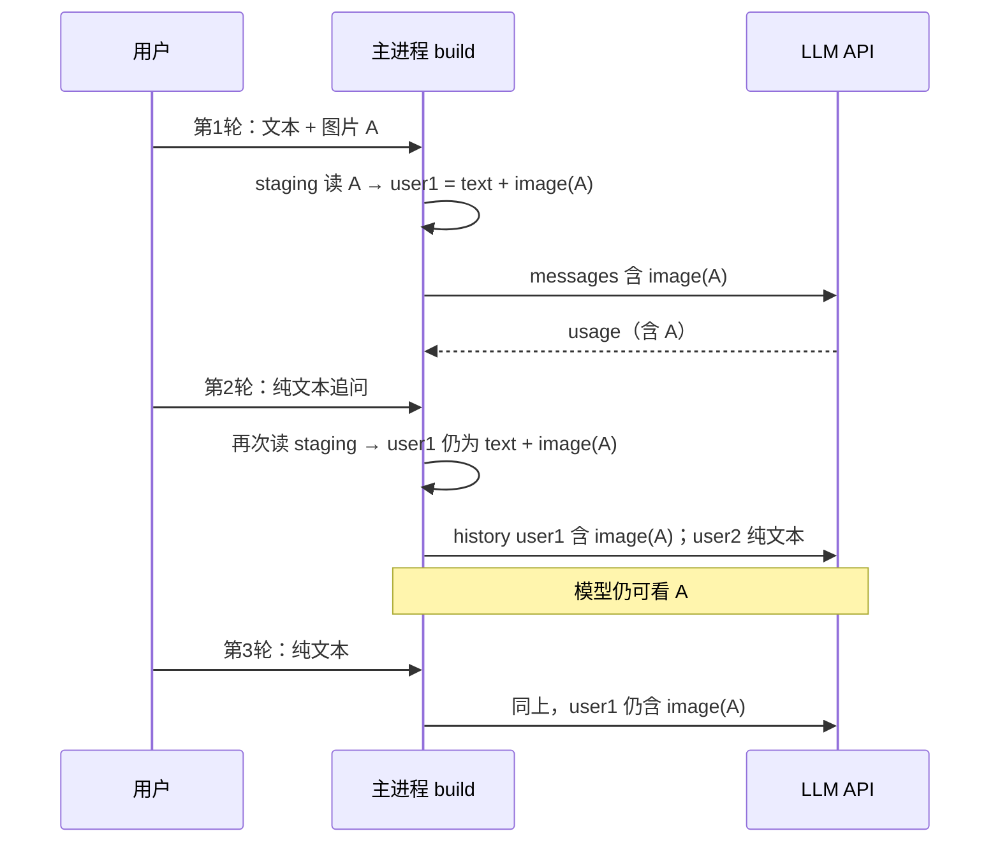

# 聊天视觉上下文：策略 A（历史全量 hydrate）优化方案

> 版本：v1.0  
> 设计日期：2026-06-17  
> 状态：草案  
> 前置实现：[chat-vision-image-context-design.md](./chat-vision-image-context-design.md) v1.2（策略 B：§3.6 当轮-only + 历史占位符）  
> 动机：用户反馈「首条带图发送后，隔多轮追问图片细节时模型无法再看图」——根因是 **API payload 历史被占位符替换**，非视觉模型能力缺失。

---

## 0. 摘要

| 项 | 策略 B（现网 v1.2） | 策略 A（本方案） |
|----|---------------------|------------------|
| 历史带图 user 消息 | `text-placeholder-only` | **`full` hydrate（始终含 image block）** |
| 后续纯文本追问 | 模型只见占位符 + 首轮 assistant 文字 | **每次请求 history 仍含 image block，模型可再看图** |
| 单次请求内图片 token（单图会话） | 当轮 0～1× | **稳定 1×**（同一条 user 消息在 history 中重复出现，不叠加为 N 张） |
| 每次 API 调用的视觉成本 | 仅首条带图轮 | **凡 history 仍含该条消息，每轮都计 1× 图** |
| `imagesDeliveredToApi` | 控制「不再 re-hydrate」 | **废弃语义**（字段可保留只读兼容，不再写入） |

**结论：** 策略 A 用 **可预期的每轮视觉 token** 换取 **多轮看图会话体验**；与标准多模态 Chat API「history 重发」语义一致。

---

## 1. 背景与问题

### 1.1 用户现象

1. 首条消息「+」上传截图并提问，模型能描述大致布局。
2. 第 2、3 轮纯文本追问细节（如「Progress 面板第 2 行倒数第二个字是什么」）。
3. 模型 Thinking 出现「无法直接看到之前发送的图片」「只能回顾上一轮文字描述」，并可能 fallback 到 `run_script` / OCR。

### 1.2 机制澄清（避免误判为模型缺陷）

多模态 API 为 **无状态**：每次 HTTP 请求将 **裁剪后的 messages** 整体送入 Transformer。  
若 history 中首条 user 消息仍含 `image` content block，则 **每一轮请求模型都能再次处理该图像**。

现网问题来自 **应用层策略 B**（`claudeToolHistory.ts`）：

```typescript
// 现网：仅当轮 full；历史 + imagesDeliveredToApi → 占位符
const hydrationMode =
  shouldHydrateImagesForMessage(m, currentUserMessageId) && !m.imagesDeliveredToApi
    ? 'full'
    : 'text-placeholder-only'
```

后续请求中，首条带图消息变为：

```text
用户正文
[此前发送的图片: cowork-界面截图.png]
```

**payload 中无像素** → 模型行为与输入一致，非模型「遗忘」。

### 1.3 产品目标（策略 A）

1. **同一会话内**，只要 history 仍保留带 `attachments` 的 user 消息且 staging 可读，**任意后续轮次**均可基于原图回答细节问题。
2. 不改变 DB / UI 存储模型（仍 `attachments` 元数据 + staging，气泡仍缩略图，**不落 base64**）。
3. 上下文环、发送前预警与 **真实 prompt** 对齐（含历史 image block 的 token 占用）。
4. 与多服务视觉路由、tool loop、历史裁剪 **兼容**。

### 1.4 非目标

- 不解决「纯文本指 workDir 路径读图」（仍见 v1.2 §3.7）。
- 首版不接入 Anthropic Files API `file_id`（列为 P2，见 §8）。
- 不做「跨会话图片 Handle」或云端图库。
- 不保证裁掉 history 后仍能看图（见 §5.3）。

---

## 2. 策略 A 定义

### 2.1 Hydration 规则

```typescript
type ImageHydrationMode = 'full' | 'text-placeholder-only'  // 保留枚举，占位仅用于 staging 失效

function resolveHydrationMode(msg: Message): ImageHydrationMode {
  if (!msg.attachments?.length) return /* N/A */
  // 策略 A：凡有 attachments 且 staging 可解析 → full
  // staging 不可读 → text-placeholder-only + [图片附件已失效: ...]
  return 'full'
}
```

**删除对以下条件的依赖：**

- `currentUserMessageId === msg.id`
- `imagesDeliveredToApi === true` → 占位

`currentUserMessageId` **仍保留**，用于：tool loop 首轮标记、日志、队列 drain；**不再**用于限制 hydrate 范围。

### 2.2 序列图



### 2.3 与「N 倍图片占上下文」的关系

**单图、单条带图 user 消息**（最常见）：

| 对话轮次 | 单次 API 请求内 image block 数量 |
|----------|----------------------------------|
| 第 1 轮 | 1 |
| 第 2 轮 | 1（history 里同一条 user₁） |
| 第 N 轮 | 1 |

- **不是**第 N 轮 = N 张图叠在同一次 prompt 里。
- **是**每发一条消息，**重新为整段 history 付一次**该图的视觉 token（与标准 Chat API 一致）。

**多图 / 多条带图 user**（例如 3 条 user 各带 1 图且均未被 trim 掉）：

- 单次请求内 image block 数 = **仍在 history 中的带图 user 条数**（最多叠加，需预警）。

---

## 3. 架构改动

### 3.1 核心：`claudeToolHistory.ts`

| 改动 | 说明 |
|------|------|
| `shouldHydrateImagesForMessage` | **删除**或改为恒 `true`（有 attachments 即 hydrate） |
| `buildClaudeToolChatMessages` | `hydrationMode` 默认 `'full'`；仅 `resolveImage` 返回 null 时走失效文案 |
| `formatHistoricalImagePlaceholder` | 保留，用于 **staging 失效** 或 **调试日志**；正常路径不再写入 API |
| 单测 | 重写 §3.5 中「第二条不含第一条 base64」等用例为策略 A 期望 |

### 3.2 主进程：`chatMessageBuild.ts`

现网仅 preload **当轮** attachment 进 cache：

```typescript
for (const m of args.sourceMessages) {
  if (m.id !== args.currentUserMessageId || !m.attachments?.length) continue
  // ...
}
```

**策略 A：预加载所有带 attachments 的消息：**

```typescript
for (const m of args.sourceMessages) {
  if (!m.attachments?.length) continue
  for (const a of m.attachments) {
    if (imageCache.has(a.stagingKey)) continue
    const resolved = await resolveChatAttachmentBase64(args.userDataDir, a.stagingKey)
    if (resolved) imageCache.set(a.stagingKey, resolved)
  }
}
```

**性能：** 同一 `stagingKey` 只读盘一次 / 请求；大图会话注意并行上限（可顺序读，N≤4 可接受）。

### 3.3 废弃 `imagesDeliveredToApi` 写入

| 位置 | 现网 | 策略 A |
|------|------|--------|
| `ChatView.tsx` 流式完成后 patch | 写 `true` | **删除** |
| `toolChatLoop.ts` | 写 `true` | **删除** |
| `domainTypes` / DB 列 | 保留 | **只读兼容**；新消息不写；迁移无需清库 |
| Agent 日志 / 备份 | 可忽略 | 无影响 |

字段保留原因：避免 schema 回退；旧备份 JSON 仍可导入。

### 3.4 视觉模型路由（**必改**）

现网仅 **当轮 user** 含 attachments 才 `resolveVisionRouteForImageSend`：

```typescript
if (userMsgForVision && messageHasImageAttachments(userMsgForVision)) { ... }
```

策略 A 下，**纯文本追问** 的 payload 仍含 history image block，若 session 绑定 **非视觉模型**，上游可能拒收或忽略 image。

**新增检测（`visionModelRouting.ts`）：**

```typescript
export function historyHasImageAttachments(messages: Message[]): boolean {
  return messages.some(
    (m) => m.role === 'user' && (m.attachments?.length ?? 0) > 0
  )
}

export function requestNeedsVisionModel(
  historyForApi: Message[],
  currentUserMessageId: string
): boolean {
  // 任一将进入 API 的 user 消息含 attachments（含 history）
  return filterMessagesForChatApi(historyForApi).some(messageHasImageAttachments)
}
```

**`ChatView.sendInternal`：**

```typescript
if (requestNeedsVisionModel(historyForApi, currentUserMessageId)) {
  const visionRoute = resolveVisionRouteForImageSend(cfg, chatModelName, chatLlmServiceId)
  // 同现网：非视觉 session 当次切视觉优选；已选视觉则不阻塞
}
```

**`hasImageAttachments` system hint（`claudeStreamHandlers` / `toolChatLoop`）：**

- 现网：`currentUserMessageHasImages(sourceMessages, currentUserMessageId)`
- 改为：`historyHasImageAttachments(sourceMessages)`（或与 `builtMessages` 一致：任一 user content 含 image block）

tool loop **中间轮**（`loopRound > 1`）现网强制 `hasImageAttachments: false`；策略 A 应改为 **true**（messages 仍含 history 图片）。

### 3.5 上下文环与估算（`contextUsageEstimate` / UI）

| 时机 | 策略 B | 策略 A |
|------|--------|--------|
| 发图后第 2 轮纯文本 | usage 应「明显下降」 | **usage 仍含 1× 图 token**（与第 1 轮同量级 input） |
| Ring tooltip | `lastTurnIncludedImages` 解读「上一轮含图、下轮应下降」 | 改为 **「本会话 history 含图片，后续请求将持续计入视觉输入」** |
| 发送前预警 | 仅 pending 附件 | **追加**：`estimateHistoryImageTokens(historyForApi) + estimatedOccupancy > 0.8 * cap` |

**新增辅助函数：**

```typescript
export function estimateTokensFromHistoryImages(messages: Message[]): number {
  let total = 0
  for (const m of messages) {
    if (m.role === 'user' && m.attachments?.length) {
      total += estimateTokensFromImageAttachments(m.attachments)
    }
  }
  return total
}
```

注意：此为 **粗估**；实际上游 usage 仍以 API 返回为准。

### 3.6 Agent 日志

`llm.request` 脱敏规则不变（省略 base64）；验收改为：

- 第 2 轮请求日志中 user 消息 **类型** 仍为 `image`（可记录 `imageBlockCount` / `hydratedAttachmentIds`，不记录 data）。

---

## 4. 边界与风险

### 4.1 Staging 失效

| 场景 | 行为 |
|------|------|
| 文件被删 / TTL / 越权 | 该条 user 输出 `[图片附件已失效: fileName]`，**无** image block |
| 会话很长后 staging 清理 | 早期带图消息集体失效 → 模型只能看后续 assistant 文字 |

**缓解：**  生命周期与会话绑定；会话存在期间 **不** 因 `imagesDeliveredToApi` 删文件（现网已如此）；文档注明「归档会话可能丢图」。

### 4.2 历史裁剪 `trimClaudeToolChatMessages`

按 **条数** 裁剪；带图 user 消息被裁掉后，**策略 A 与 B 一样无法再看图**。

**可选增强（P1，非首版）：**

- 裁剪时优先保留「含 attachments 的 user 消息」直至条数上限（与 v1.2 §3.6.3 曾禁止的「含图权重」不同——此处是 **显式产品开关**，默认仍按条数 FIFO）。

### 4.3 请求体体积

每轮 HTTP body 含 history 内全部 base64 图（非当轮-only 省体积）。

| 风险 | 缓解 |
|------|------|
| 超 32MB / 网关限制 | 保持单图 5MB、最多 4 张；发送前 `byteLength` 合计预警 |
| 延迟 | staging 读盘 + base64 编码仅主进程一次 / 请求；P2 可换 Files API |

### 4.4 多图会话

用户分 3 次各发 1 图 → history 中 3 条 user 各 1 image block → **单次请求 3× 图 token**。

**缓解：** 发送前 warning；设置页说明；P1「仅保留最近 K 张图 full hydrate」可作为策略 A'（本方案首版 **不做**，避免再次引入「后续看不到旧图」）。

### 4.5 语言模型误选

用户手动固定非视觉模型 + history 含图 → 必须 **强制视觉路由**（§3.4）。

---

## 5. 实施计划

### Phase 1：Hydration 与构建（P0）

1. 修改 `buildClaudeToolChatMessages` / `buildUserMessageContent` 为策略 A。
2. 扩展 `buildToolChatMessagesFromSource` 预加载全部 attachments。
3. 删除 `imagesDeliveredToApi` 写入路径。
4. 更新 `claudeToolHistory.test.ts`。

**验收：** 单测：2 轮对话 mock payload，第 2 轮 built messages 中 **第 1 条 user 仍含 `type:image`**。

### Phase 2：路由与 System Hint（P0）

1. `requestNeedsVisionModel` + `ChatView` 集成。
2. `claudeStreamHandlers` / `toolChatLoop` 的 `hasImageAttachments` 改为 history 级。
3. tool loop 中间轮不再清零 `hasImageAttachments`。

**验收：** 首条带图 + 第 2 轮纯文本，请求模型为视觉模型；system 含「图片附件」hint。

### Phase 3：上下文环与 i18n（P1）

1. `estimateTokensFromHistoryImages` + 发送前预警。
2. 更新 `contextUsage.json` tooltip 文案（去掉「下轮 usage 应下降」暗示）。
3. `ContextUsageRing` 可选展示「history 含 N 张图约 M tokens」。

### Phase 4：文档与 v1.2 关系（P1）

1. 在 [chat-vision-image-context-design.md](./chat-vision-image-context-design.md) 顶部增加 **「§3.6 已被本方案替代」** 链接。
2. 更新 §7.2 手工验收：增加「第 3 轮追问 Progress 面板文字细节，不应出现无法看图」。

---

## 6. 文件改动清单

| 模块 | 文件 | 改动 |
|------|------|------|
| 历史组装 | `src/shared/claudeToolHistory.ts` | 策略 A hydrate；弱化 `shouldHydrateImagesForMessage` |
| 测试 | `src/shared/claudeToolHistory.test.ts` | 重写当轮/历史期望 |
| 主进程构建 | `electron/chatMessageBuild.ts` | 全量 attachment cache |
| 视觉路由 | `src/shared/visionModelRouting.ts` | `historyHasImageAttachments`、`requestNeedsVisionModel` |
| 测试 | `src/shared/visionModelRouting.test.ts` | history 级视觉需求 |
| 渲染 | `src/renderer/components/Chat/ChatView.tsx` | 视觉路由条件；删除 `imagesDeliveredToApi` patch |
| 主进程 | `electron/claudeStreamHandlers.ts` | `hasImageAttachments` 判定 |
| 主进程 | `electron/toolChatLoop.ts` | 同上；删除 delivered patch |
| 估算 | `src/shared/contextUsageEstimate.ts` | `estimateTokensFromHistoryImages` |
| UI | `ContextUsageRing.tsx`、i18n | tooltip / 预警 |
| 文档 | `chat-vision-image-context-design.md` | 交叉引用 |

**不改：** staging 协议、IPC 形态、`Message.attachments` DB 结构、Composer UI。

---

## 7. 测试计划

### 7.1 自动化

```bash
npm test -- src/shared/claudeToolHistory.test.ts
npm test -- src/shared/visionModelRouting.test.ts
npm test -- src/shared/contextUsageEstimate.test.ts
npm test -- electron/chatAttachmentManager.test.ts
```

**新增 / 调整用例：**

| 用例 | 期望 |
|------|------|
| 两条 user，仅第一条带图；build 第 2 轮 | 第一条 **full image**，第二条纯文本 |
| `imagesDeliveredToApi: true` 的旧消息 | 仍 **full hydrate**（策略 A 忽略该字段） |
| staging 缺失 | 失效 text block，无 image |
| `requestNeedsVisionModel` | 当轮无 attachments 但 history 有 → `true` |
| `estimateTokensFromHistoryImages` | 2 条带图 user → 约 2× 单图估算 |

### 7.2 手工验收

1. 新建会话，「+」上传 `cowork-界面截图.png`，问布局概况。
2. **不重新选图**，第 2 轮问：「Progress 面板里有哪些文字？」
3. **不重新选图**，第 3 轮问：「Progress 第 2 行倒数第二个字符是什么？」
4. 期望：均能基于图片回答；Thinking **不应**出现「无法看到之前发送的图片」；无 `run_script` OCR fallback。
5. 查看 Agent 日志：第 2、3 轮 `llm.request` 仍报告含 image content（脱敏后可见 block 类型或 count）。
6. 上下文环：第 2 轮 input usage **不应**相对第 1 轮断崖式下跌（仍含图）。

---

## 8. 后续演进（P2+）

### 8.1 策略 A+：Anthropic Files API

上传一次得 `file_id`，history 中引用 `{ type: 'file', file_id }`：

- **省 HTTP body**，不必每轮传 base64 字符串；
- **视觉 token 是否仍每轮计 1×** 取决于上游，需实测；
- 需检测网关是否支持（Bedrock / 国内代理可能不支持）。

### 8.2 策略 A'：可配置 hydrate 模式

`AppConfig.chat.imageHistoryMode: 'full' | 'placeholder'`：

- 默认 `'full'`（策略 A）；
- 高级用户可切回 `'placeholder'`（策略 B）省 token。

### 8.3 会话级「活跃图」

多图会话仅对 `metadata.activeImageAttachmentIds` full hydrate，其余占位——在 **多图 token 爆炸** 与 **单图体验** 之间折中。

---

## 9. 决策记录

| ID | 问题 | 决策 |
|----|------|------|
| D-1 | 是否彻底删除 `imagesDeliveredToApi` | **保留字段、停止写入**；避免 DB 迁移 |
| D-2 | 纯文本追问是否强制视觉模型 | **是**（history 含 image block 时） |
| D-3 | tool loop 中间轮 system hint | **与首轮一致**（history 含图） |
| D-4 | 裁剪策略是否优先保留带图消息 | **首版否**；P1 可选 |
| D-5 | 相对 v1.2 §3.6 | **本方案替代 §3.6**；v1.2 其余章节仍有效 |

---

## 10. 参考

- [chat-vision-image-context-design.md](./chat-vision-image-context-design.md) — v1.2 实现基线  
- [Anthropic Vision](https://platform.claude.com/docs/en/build-with-claude/vision) — history 重发与 Files API  
- 现网实现：`src/shared/claudeToolHistory.ts`、`electron/chatMessageBuild.ts`
