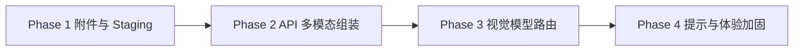
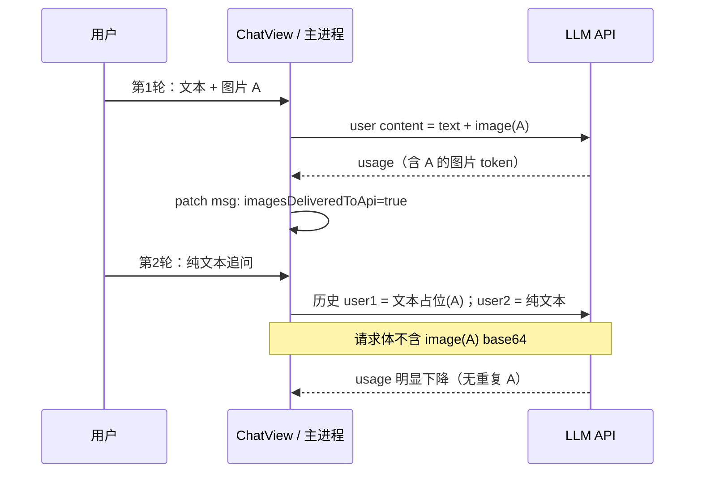
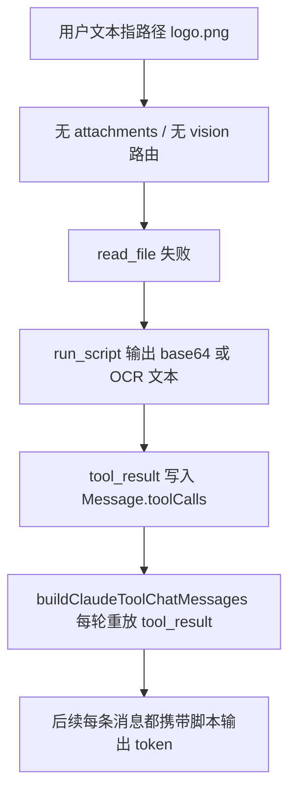

# 聊天视觉上下文（图片附件 → 多模态 API）技术方案

> 版本：v1.2  
> 设计日期：2026-06-17  
> 修订：2026-06-17 — v1.1 上下文环 + 当轮-only；v1.2 补充「工作目录路径指图」边界与风险  
> 状态：草案  
> 需求来源：[llm-multi-service-model-config-requirement.md](../requirement/llm-multi-service-model-config-requirement.md) §8.3（含图消息 → `preferredVisionModelId`，标注为后续实现）  
> 关联文档：[feishu-integration-phase2-design.md](./feishu-integration-phase2-design.md) §5（飞书图片注入，可复用 staging 思路）

---

## 0. 背景与问题

### 0.1 用户现象

用户在聊天区手动选择**视觉大模型**，要求「查看并复述一张图片」时，模型往往：

- 不直接理解图片内容；
- 转而调用 `run_script` / 其他工具，尝试 OCR 或脚本解析图片路径。

### 0.2 根因（现网代码）

| 环节 | 现网行为 | 后果 |
|------|----------|------|
| `Message` 数据结构 | 仅 `content: string`，无附件字段 | 图片无法随消息持久化 |
| `buildClaudeToolChatMessages` | 用户消息恒为纯文本 | API 请求无 `image` content block |
| 会话模型绑定 | `resolveSessionModelBinding` 默认语言优选 | 选视觉模型仅改 `session.model`，**不含图时不会自动切视觉** |
| `read_file` 工具 | 二进制文件直接拒绝 | 模型无法用现有文件工具「读图」 |
| 系统提示 | 无「已附带图片请直接理解」类说明 | 非主因；缺多模态输入时模型只能走工具 fallback |

结论：**主因是调用链路未传递图片**，不是提示词写错。设置页的 `isVision` / `preferredVisionModelId` 仅完成配置层，未接入聊天发送路径。

### 0.3 设计目标

1. 用户在聊天 composer **可添加图片附件**（本阶段：本地选图；不含粘贴/拖拽的扩展可列为 P1）。
2. 发送时主进程将图片以 **Anthropic Messages API 多模态格式**（base64 `image` block）注入**当轮**用户消息。
3. 检测到附件时 **自动解析视觉模型绑定**（`preferredVisionModelId` + 服务凭证），必要时覆盖当前会话的非视觉模型（仅当次请求，是否回写 session 见 §4.3）。
4. UI / 历史 / 日志中 **不重复泄露整段 base64**（DB 存引用，API 边界组装）。
5. **历史轮次不重复注入图片 block**——图片仅在「首次发送该条用户消息」时进入 API 上下文；后续纯文本追问不再携带历史 base64（见 §3.6）。
6. 与多服务配置（`llmServiceId`、`resolveLlmCredentialsForModel`）兼容。

### 0.4 非目标（本方案不做）

- 聊天输入框外的图片来源（飞书 inbound 图片）—— Phase 2 飞书方案单独接入，复用 §2 staging 协议。
- 海报 `posterStageImage` 零 base64 进 LLM 的完整 poster 链路（见 [2026-06-14-poster-zero-base64-upload.md](../superpowers/plans/2026-06-14-poster-zero-base64-upload.md)）；本方案可共用 staging 目录约定，但不阻塞 poster 专项。
- 视频、PDF 内嵌页、多图轮播编辑器。
- 非 Anthropic 兼容网关的 OpenAI `image_url` 形态（可列 OQ，首版按 Claude `image` + `source.base64`）。

---

## 1. 实施顺序（四阶段）



| 阶段 | 交付 | 验收 |
|------|------|------|
| **Phase 1** | Composer 选图 + IPC staging + `Message.attachments` 持久化 + 气泡展示 | 选图后发送，DB/Redux 可见 attachment 元数据，API 尚未带图 |
| **Phase 2** | `buildClaudeToolChatMessages` 输出 image blocks；**当轮-only** hydrate；主进程校验 block | 带图消息请求体含 `image` block；**第二条纯文本请求不含第一条 base64** |
| **Phase 3** | 含图消息自动 `preferredVisionModelId` + `llmServiceId` 解析 | 未手动选视觉模型时，发图仍走视觉优选 |
| **Phase 4** | 系统提示、错误态、**上下文环联动**、测试 | 不再频繁 `run_script` 读图；环与 payload 一致；有清晰失败文案 |

---

## 2. Phase 1：聊天附件与 Staging

### 2.1 领域类型（`src/shared/domainTypes.ts`）

```typescript
/** 用户消息附带的图片（DB 只存引用，不存 base64） */
export interface ChatImageAttachment {
  id: string
  /** staging 文件名或相对 userData 的路径键 */
  stagingKey: string
  fileName: string
  mimeType: string
  byteLength: number
  width?: number
  height?: number
}

export interface Message {
  // ...existing
  attachments?: ChatImageAttachment[]
  /**
   * 该条用户消息的图片 block 已成功送达 API。
   * 为 true 时，后续轮次 build/hydrate 仅输出文本占位，不再 re-hydrate base64。
   */
  imagesDeliveredToApi?: boolean
}
```

- `schemaVersion`：若现有消息迁移无需 bump，attachments 缺省视为无图。
- 单条用户消息 **最多 N 张图**（建议 `MAX_CHAT_IMAGE_ATTACHMENTS = 4`，与 Claude 文档常见限制对齐，可配置）。

### 2.2 Staging 服务（主进程）

**目录：** `{userData}/chat-attachments/{sessionId}/{attachmentId}.{ext}`

| 规则 | 说明 |
|------|------|
| 写入时机 | 渲染进程选图后立即 `chat:stage-image` IPC，**发送前**完成 |
| 大小上限 | 单文件 ≤ 5MB（与 `MAX_FILE_READ_SIZE` 对齐或略小） |
| 格式 | `fileTypes.getImageMimeType` 白名单：png/jpeg/webp/gif（首版可不含 svg/bmp） |
| 清理 | 会话删除时删目录；可选 TTL 7 天（与飞书 cache 一致） |
| 安全 | 路径仅允许 `chat-attachments/` 下；禁止 `..` |

**IPC（`electron/preload.ts` + `electron/appIpc.ts`）：**

```typescript
// 渲染 → 主
'chat:stage-image': (args: {
  sessionId: string
  fileName: string
  mimeType: string
  dataBase64: string
}) => Promise<ChatImageAttachment | { error: string }>

// 主进程内部（toolChatLoop / claudeStreamHandlers 用）
resolveChatAttachmentBase64(stagingKey: string): Promise<{ mimeType: string; data: string }>
```

- 选图时在**渲染进程**读 `File` → base64 传 IPC（Electron 常规做法）；**DB 与 Redux 不存 base64**。
- Agent 日志沿用 `agentLogError` 对 image 的 `_omitted: 'binary_or_image_content'` 脱敏。

### 2.3 UI（`MessageInput` / `ChatView` / `ChatBubble`）

| 组件 | 改动 |
|------|------|
| `MessageInput` | 增加「添加图片」按钮；`accept="image/png,image/jpeg,image/webp,image/gif"` |
| Composer 状态 | `pendingAttachments: ChatImageAttachment[]`，可移除单个 chip |
| `ChatView.sendInternal` | `onSend(text, attachments)`；写入 `userMsg.attachments` |
| `ChatBubble` | 用户消息展示缩略图 chip（`file://` 或 `chat:get-attachment-thumbnail` IPC 返回 data URL） |

**i18n：** `chat.input.addImage`、`chat.input.imageTooLarge`、`chat.input.unsupportedImage`、`chat.attachment.alt`

### 2.4 Phase 1 测试

- 主进程：`chat-attachments` 路径校验、超大文件拒绝、mime 白名单。
- 渲染：`MessageInput` staging mock IPC。
- 快照：带 attachment chip 的用户气泡（可选）。

---

## 3. Phase 2：API 多模态消息组装

### 3.1 Content block 形态（Anthropic Messages）

当轮用户消息（有 attachments 且 role=user）：

```typescript
content: [
  { type: 'text', text: '请描述这张图片的内容' },
  {
    type: 'image',
    source: {
      type: 'base64',
      media_type: 'image/jpeg',
      data: '<base64>'
    }
  }
]
```

- 纯文本历史消息仍为 `string` 或单 `text` block（与现网 tool 历史兼容）。
- **历史轮次（已送达 API 的用户消息）**：**禁止** re-hydrate 图片 base64；仅输出轻量文本占位（见 §3.6）。UI 气泡仍展示缩略图 chip（读 staging），与 API 载荷解耦。
- **当轮新消息 / 尚未送达 API 的用户消息**：正常注入 `image` block；staging 丢失则降级占位：`[图片附件已失效: filename]`。

### 3.1.1 与 §3.6 的关系（摘要）

| 消息状态 | API content | DB `attachments` | UI 气泡 |
|----------|-------------|------------------|---------|
| 当轮待发 / `imagesDeliveredToApi !== true` | text + image block(s) | 元数据 + staging | 缩略图 |
| 历史已送达 / `imagesDeliveredToApi === true` | 仅文本占位（~数十 token） | 元数据 + staging（可选） | 缩略图 |
| staging 已删 | 占位「附件已失效」 | 元数据保留 | 失效态 |

### 3.2 共享层（`src/shared/claudeToolHistory.ts`）

扩展 `buildClaudeToolChatMessages`：

```typescript
export type ClaudeUserContentBlock =
  | { type: 'text'; text: string }
  | { type: 'image'; source: { type: 'base64'; media_type: string; data: string } }

// 签名扩展：content: string | unknown[] 已存在于 ClaudeChatMessageWithBlocks
```

新增纯函数（便于单测）：

```typescript
export type ImageHydrationMode = 'full' | 'text-placeholder-only'

buildUserMessageContent(
  text: string,
  attachments: ChatImageAttachment[] | undefined,
  options: {
    /** full = 注入 image block；text-placeholder-only = 历史占位，不占图片 token */
    hydrationMode: ImageHydrationMode
    resolveImage: (a: ChatImageAttachment) => { mimeType: string; data: string } | null
  }
): string | ClaudeUserContentBlock[]

/** 历史占位文案（i18n key 或固定中/英模板） */
formatHistoricalImagePlaceholder(attachments: ChatImageAttachment[]): string
// 例：「[此前发送的图片: a.png, b.jpg]」
```

- `buildToolChatPayload` 仍调用 `buildClaudeToolChatMessages`；图片 base64 解析在**主进程**二次 pass（渲染进程不应把 base64 再塞进 IPC payload）。
- `buildClaudeToolChatMessages` 扩展：user 分支读取 `m.attachments` + `m.imagesDeliveredToApi`，决定 `hydrationMode`。

**推荐数据流：**

1. 渲染进程 payload：`messages` 中 user 消息带 `attachments` 元数据（无 base64）；**额外携带** `currentUserMessageId`（本次新发送的用户消息 id）。
2. 主进程 `normalizeAndValidateClaudeMessagesWithContentBlocks` 之前：调用 `hydrateMessageImages(messages, resolveChatAttachmentBase64, { currentUserMessageId })`。
3. API **成功返回**后：`chat:patch-message` 将 `currentUserMessageId` 对应消息的 `imagesDeliveredToApi` 置为 `true`（与 assistant 落库同一事务边界，失败则不标记）。

```typescript
function shouldHydrateImagesForMessage(msg: Message, currentUserMessageId: string): boolean {
  if (!msg.attachments?.length) return false
  if (msg.id === currentUserMessageId) return true
  return msg.imagesDeliveredToApi !== true // 防御：历史消息若未标记，仍仅 hydrate 一次
}
// hydrate 判定：shouldHydrate → mode 'full'，否则 'text-placeholder-only'
```

### 3.3 主进程校验（`electron/claudeStreamHandlers.ts`）

在 `assertValidClaudeContentBlocks` 增加：

```typescript
if (type === 'image') {
  const source = (b as { source?: { type?: string; media_type?: string; data?: string } }).source
  if (source?.type !== 'base64') throw ...
  if (!/^image\//.test(source.media_type ?? '')) throw ...
  if (typeof source.data !== 'string' || source.data.length === 0) throw ...
  if (source.data.length > MAX_IMAGE_BASE64_CHARS) throw ... // 例如 7_000_000
  continue
}
```

### 3.4 Token / 体积

| 项 | 策略 |
|----|------|
| 图片 token | 由上游模型计费；**仅当轮**注入 API，历史不占重复图片 token |
| 请求体大小 | 单图 base64 上限 + 附件数量上限 |
| 历史裁剪 | `trimClaudeToolChatMessages` 保留最近 K 轮；含图**占位**轮与纯文本轮同等权重（不再因历史 base64 放大裁剪压力） |
| 送达标记 | API 成功后 `imagesDeliveredToApi = true`，防止下轮 re-hydrate |

### 3.5 Phase 2 测试

- `buildUserMessageContent` 单元测试：0/1/多图、空 text、失效 attachment。
- **当轮 vs 历史**：同一 session 两条带图 user 消息，第二条发送时 API payload 仅含第二条 image block；第一条为文本占位。
- **`imagesDeliveredToApi`**：首轮成功后 patch；下轮 build 不再含第一条 base64。
- 主进程 integration：`hydrateMessageImages` + mock staging 文件。
- 手工：选 `kimi-k2.6` / `claude-sonnet-4-6` 等 `isVision: true` 模型，发图应直接描述，不应先 `run_script`。

### 3.6 历史图片不重复占上下文（已决）

#### 3.6.1 问题

若每条历史 user 消息的 `attachments` 在**每一轮**发送时都 re-hydrate 为 base64 `image` block：

- 单张图常占 **数百～数千 token**（视分辨率而定），多轮对话会 **线性叠加** 图片成本；
- 上下文占用环在纯文本追问时仍显示上一轮含图请求的 `input_tokens`，但 **下一请求实际 prompt 若再次注入全部历史图片，真实占用远高于环所示**；
- 与用户预期不符：「我已经问过这张图了，为什么后面每句话还在付图片钱？」

#### 3.6.2 策略：**仅当轮注入（current-turn-only）**



**规则：**

1. **仅** `currentUserMessageId` 对应消息（或 `imagesDeliveredToApi !== true` 的首次发送）执行 `hydrationMode: 'full'`。
2. 已送达消息：`hydrationMode: 'text-placeholder-only'`，占位约 20–80 token/条，**不含** base64。
3. DB 保留 `attachments` 供 UI 缩略图；staging 文件生命周期独立（会话删除 / TTL），**不**因「已送达 API」立即删除（用户可能滚动回看）。
4. **重新编辑并重发**某条历史带图消息（若产品支持）：视为新的 `currentUserMessageId`，可再次 full hydrate；旧条目标记逻辑由产品决定是否清除 `imagesDeliveredToApi`（首版可不支持编辑重发带图消息）。
5. **工具 loop 中间轮**：图片只在进入 loop 前的**首条 user 消息**注入；tool_result 轮不附加历史图片。

#### 3.6.3 与 `trimClaudeToolChatMessages` 的配合

- 裁剪按 **API 消息条数**（`MAX_CHAT_API_MESSAGES`），不按图片字节。
- 历史带图 user 消息被裁剪掉后，占位一并消失——acceptable，与纯文本历史一致。
- **禁止**「含图轮次权重高所以优先保留」的旧思路（§3.4 旧稿已删除）：该策略会导致保留的 history 仍带 base64，与当轮-only 冲突。

#### 3.6.4 边界

| 场景 | 行为 |
|------|------|
| API 失败 / 用户取消 | 不设置 `imagesDeliveredToApi`；用户重试同一条消息仍 full hydrate |
| 用户第 2 轮再发**新**图片 B | 仅 B 为 image block；A 为占位 |
| 模型「还记得」第 1 轮图片吗？ | 靠 assistant 第 1 轮回复中的文字描述进入文本上下文；**不**靠重复发图 |
| 用户要求「再看一下刚才那张图」 | 首版：提示重新附加图片；P1 可做「重新发送图片到上下文」按钮（单次 full hydrate） |

### 3.7 边界：用户在工作目录中指名图片文件（非 Composer 选图）

典型输入：「请描述 `assets/logo.png` 的内容」「看看 workDir 里 screenshot.jpg 写了什么」。

**本方案（Composer + `Message.attachments`）完全不覆盖此路径**——下列问题仍会出现，且 §3.6 的「历史不重复占上下文」**帮不上忙**。

#### 3.7.1 视觉链路未触发

| 环节 | 行为 | 后果 |
|------|------|------|
| `messageHasImageAttachments` | 仅查 `msg.attachments?.length` | 纯文本里写路径 → **false** |
| `resolveVisionModelBinding` | 仅当 attachments 非空 | 仍走 session **语言模型**（即使用户在 picker 选了视觉模型，API 也无 image block，等同 §0.1 现象） |
| `hydrateMessageImages` | 无 attachments 元数据 | 请求体**无** `image` block |
| §5.1 system hint | `hasImageAttachments: true` 未设 | 模型收不到「请直接看图」指引 |

用户手动选视觉模型 + 文本指路径：**仍无法看图**（根因是 API 未注入图片，不是模型能力）。

#### 3.7.2 工具 fallback（现网行为，与设计目标冲突）

工作目录内图片可通过路径访问，但**没有**一等公民「读图进上下文」工具：

| 工具 | 对 `.png/.jpg/...` 的行为 |
|------|---------------------------|
| `read_file` | `isBinaryBuffer` → **失败**：「文件为二进制格式，无法读取」（`builtinExecutors.ts`） |
| `grep` | 跳过二进制文件 |
| `list_directory` | 仅列名，无像素内容 |
| `run_script` | **可以**（PIL / base64 等），cwd 为 `workDir` |

模型常见路径：`read_file` 失败 → `run_script` OCR 或 `open()` + base64 打印——正是 §0.1 / §5.1 想禁止的 fallback。

#### 3.7.3 对「后续对话持续占上下文」的危害 **大于** Composer 附件

§3.6 解决的是 **`Message.attachments` 每轮 re-hydrate base64**。路径指图走的是另一条更糟的链路：



- `toolResultContent` 将 `result.data` **JSON.stringify** 进 `tool_result`（`claudeToolHistory.ts`），**无** `imagesDeliveredToApi` 一类标记。
- `run_script` stdout 上限 **100KB**（`SCRIPT_IO_MAX`），足够把截断 base64 长期留在上下文。
- `projectUsageAfterToolResults` 会把这段当**文本 token** 投影到环上；与真实 image token 口径不一致，但占用同样巨大。
- `trimClaudeToolChatMessages` 按**条数**裁剪，不按 token；含巨型 tool_result 的轮次可能长期留在窗口内。

**结论：** Composer 方案的 §3.6 **不能**防止「路径指图 → 脚本读图 → tool_result 永久占上下文」；这是独立风险。

#### 3.7.4 上下文占用监视器

| 期望 | 实际 |
|------|------|
| 发图前预警 | 无 `pendingAttachments`，**无** §5.4.2 估算 |
| 含图轮 usage | 无 image block，usage 不含视觉输入；脚本成功后 tool_result 膨胀 |
| 下轮纯文本 usage 下降 | tool_result **仍随历史重放**，usage **不会**像 §3.6 那样自然回落 |

#### 3.7.5 与详情面板 / 引用文件的关系

- 用户在右侧文件树**打开**图片预览 ≠ 聊天 `attachments`；**不会**自动注入 API。
- `ReferencedFilesPanel` 仅统计 **completed** 的 `read_file`/`write_file`/`edit_file`；对图片 `read_file` 失败 → **通常不进引用列表**。

#### 3.7.6 建议对策（分阶段）

| 优先级 | 方案 | 说明 |
|--------|------|------|
| **P0 文档 / UX** | 首版明确：**要看工作区图片请用 Composer「添加图片」**（或从文件树 P1「发送到对话」） | 文本指路径不保证视觉能力 |
| **P1** | 文件树 / 引用列表：**「附加到消息」** → 走 `chat:stage-image`，与 Composer 选图同链路 | 统一 attachments + §3.6 |
| **P1** | 主进程 **路径指图检测**（可选）：user 文本匹配 `workDir` 下存在的图片相对路径 → 发送前 toast「是否附加 logo.png？」 | 降低误报：需 resolveSafePath + 扩展名白名单 |
| **P2** | 新工具 `read_image_file`（或 vision 模式下 `read_file` 分支）：读 workDir 图片 → **当轮**注入 image block（不写 base64 进 tool_result） | 与 §3.6 对齐：仅当轮 hydrate，结果用 assistant 文字描述进历史 |
| **P2** | `run_script` / tool_result：**检测并折叠**超长 base64（替换为 `[binary omitted, N bytes]`） | 防止脚本路径污染上下文，与 attachments 治理并列 |

**首版 MVP 不阻塞项：** 不自动从 user 文本解析路径并 silent 注入（误报高、安全边界复杂）；但必须写清 §3.7 限制，避免误以为「有了视觉模型 + 路径字符串 = 能看图」。

---

## 4. Phase 3：视觉模型与服务路由

### 4.1 触发条件

```typescript
function messageHasImageAttachments(msg: Message): boolean {
  return msg.role === 'user' && (msg.attachments?.length ?? 0) > 0
}
```

当 **本次发送** 的 `userMsg` 含 attachments（即 `currentUserMessageId` 对应消息有图）。**历史**消息含 attachments **不**触发视觉路由，除非用户正在重发该条（首版不支持）。

### 4.2 解析算法（`src/shared/llmModelConfig.ts` 或新文件 `visionModelRouting.ts`）

```typescript
export function resolveVisionModelBinding(
  cfg: AppConfig,
  options: ChatModelOption[]
): { modelName: string; llmServiceId: string; displayName: string; model: ModelEntry } | null
```

步骤：

1. `available = getAvailableModels(...)`，过滤 `isVision === true`。
2. `preferred = resolvePreferredModelEntry('vision', cfg.models, available, cfg.preferredVisionModelId)`。
3. `matched = findChatModelOption(options, undefined, preferred.name)`（多服务时取服务列表顺序第一项，与 §8.2 一致）。
4. 若无可用视觉模型 → 返回 `null`，发送前 **阻塞并 toast**（i18n：`errors.chat.noVisionModel`），不 silently 降级到语言模型。

**与用户手动选择的关系（已决）：**

| 场景 | 行为 |
|------|------|
| 用户未选模型 / 当前为语言模型，**本次带图** | 当次请求使用 `resolveVisionModelBinding`；**可选** toast「已临时切换至视觉模型 xxx」 |
| 用户已在 picker 选了 `isVision: true` 的模型 | 尊重会话绑定，不覆盖 |
| 用户选了 `isVision: false` 的模型但带图 | **当次请求仍强制视觉优选**（带图语义优先）；发送后 **不回写** session（避免用户下一条纯文本误留视觉模型） |

> 若产品希望「严格尊重用户所选非视觉模型」，改为 toast 警告并阻止发送；默认采用上表第三行。

### 4.3 `ChatView.sendInternal` 集成点

在 `buildToolChatPayload` 之前：

```typescript
const hasImages = messageHasImageAttachments(userMsg)
let model = chatModelName
let llmServiceId = chatLlmServiceId

if (hasImages) {
  const vision = resolveVisionModelBinding(cfg, listChatModelOptions(cfg))
  if (!vision) { message.error(...); return }
  const sessionModel = cfg.models.find(m => m.name === chatModelName)
  if (!sessionModel?.isVision) {
    model = vision.modelName
    llmServiceId = vision.llmServiceId
  }
}
```

`resolveEffectiveOutputMaxTokens`、`chatBaseUrl` 同步改用解析后的 service。

### 4.4 Phase 3 测试

- `resolveVisionModelBinding`：无视觉模型、单服务、多服务、preferred 禁用。
- `sessionModelBinding.test.ts` 扩展：带图路由不修改 session 持久字段（若采用 §4.2 不回写策略）。

---

## 5. Phase 4：系统提示与体验加固

### 5.1 系统提示（`src/shared/skillPrompt.ts` 或 `electron/llmSystemPrompt.ts`）

当 **当次请求** 含图片 attachments 时，在 system 末尾追加短 hint（中英文随 `locale`）：

```text
## 图片附件
用户消息已附带图片，请直接根据图片内容回答。
不要为读取图片编写 run_script / OCR 脚本；不要使用 read_file 读取二进制图片文件。
若图片无法识别，请明确说明无法查看图片，而不是猜测。
```

- 通过 `buildFinalSystemPrompt({ ..., hasImageAttachments: true })` 注入，避免纯文本会话污染。

### 5.2 错误与边界

| 情况 | UX |
|------|-----|
| 无可用视觉模型 | 发送前阻止 + 引导去设置 |
| staging 文件丢失 | API 降级文本占位；助手说明附件失效 |
| 非 vision 模型误用（防御） | 主进程二次校验 `modelEntry.isVision`；否则返回明确错误 |
| 上下文超长 | 现有 trim；历史图片已为占位，不额外放大 |
| 纯文本追问后占用环仍很高 | 见 §5.4：上一轮含图 API 的 usage 仍含图片 token，直到下轮 API 返回后更新；tooltip 可注明「含上一轮图片输入」 |

### 5.3 可选增强（P1，不阻塞 MVP）

- Composer 粘贴图片 / 拖拽。
- 发送后自动恢复 composer 模型 chip 展示（仍显示 session 语言模型）。
- 「重新注入历史图片」单条消息操作（见 §3.6.4）。

### 5.4 上下文占用监视器联动（必做）

> 现网：`ContextUsageRing` ← Redux `chat.lastUsage` ← API `usage`；`projectUsageAfterToolResults`（`contextUsageEstimate.ts`）仅投影 **文本** tool_result。  
> 参考：[context-usage-estimated-occupancy-requirement.md](../requirement/context-usage-estimated-occupancy-requirement.md)、MarkItDown 需求 §8.4 附件估算模式。

#### 5.4.1 现网缺口（支持图片后）

| 缺口 | 说明 | 本方案 |
|------|------|--------|
| G1 历史 re-hydrate | 若全量 re-hydrate，**实际**下轮 prompt ≫ 环上 `lastUsage` | §3.6 当轮-only，消除系统性偏差 |
| G2 发送前无预估 | Composer `pendingAttachments` 未反映到环 | 发送前启发式叠加（见下） |
| G3 tool 投影不含图 | `projectUsageAfterToolResults` 只估 UTF-8 文本 | 工具 loop **不**注入图片；无需改投影 |
| G4 临时视觉模型 | 带图当次可能走 `preferredVisionModelId`，环仍用 session 语言模型的 `maximumContext` | 当次请求在 payload 附带 `effectiveModelForUsage`；环在 streaming 期间可选读该字段重算分母 |
| G5 API 无 image 分项 | 多数网关只给 aggregate `input_tokens` | 以 API 为准；发送前用启发式 |

#### 5.4.2 图片 token 启发式（发送前 / tooltip）

新增 `src/shared/contextUsageEstimate.ts`：

```typescript
/** 保守估计单张图片 prompt token（非精确；Anthropic 按分辨率分块） */
export function estimateTokensFromImageAttachment(a: ChatImageAttachment): number {
  if (a.width != null && a.height != null && a.width > 0 && a.height > 0) {
    // 按 512px 分块粗算，单块 ~400 token，下限 85
    const blocks = Math.ceil(a.width / 512) * Math.ceil(a.height / 512)
    return Math.max(85, blocks * 400)
  }
  // 无尺寸：按字节粗算（JPEG 5MB ≈ 1500–2500 token 量级）
  return Math.max(85, Math.ceil(a.byteLength / 2000))
}

export function estimateTokensFromImageAttachments(
  attachments: ReadonlyArray<ChatImageAttachment>
): number {
  return attachments.reduce((sum, a) => sum + estimateTokensFromImageAttachment(a), 0)
}
```

#### 5.4.3 监视器更新时机

| 时机 | 行为 |
|------|------|
| 用户选图后（composer pending） | **可选** footer 旁文字：「待发送图片约 N tokens」；**不**写 Redux（避免与 lastUsage 混淆） |
| 点击发送、API 未返回 | **不**投影图片到 `lastUsage`（与 tool_result 投影不同：图片已在首轮 request 内，等 API usage 即可） |
| API 成功（含图当轮） | 照常 `applyContextUsageUpdate`；`input_tokens` 已含图片 |
| 下轮纯文本 | 因 §3.6 无历史 base64，新 `input_tokens` 应 **显著低于** 含图轮；环自然下降 |
| tool loop 中间轮 | 沿用 `projectUsageAfterToolResults`；无 image block |

#### 5.4.4 Tooltip 补充（i18n）

在 `contextUsage.json` 增加（有数据时按需展示）：

- `tooltip.pendingImages`：「待发送图片约 {{count}} tokens」（composer 有 pending 时，由 `MessageInput` 或 footer 展示，不一定进 Ring tooltip）
- `tooltip.lastTurnIncludedImages`：「上一轮请求含图片输入」（当 session 最近一条已送达 user 消息 `imagesDeliveredToApi` 且 `lastUsage` 来自该轮时，Ring tooltip 提示解读）

#### 5.4.5 预警

- 发送前：`estimateTokensFromImageAttachments(pending) + estimatedOccupancy > 0.8 * maximumContext` → composer 附件条警告色（与 MarkItDown §8.4 一致）。
- 单条消息图片数 / 总估算超过模型上下文 50% → 发送前 `message.warning`，不阻断（可配置为阻断）。

#### 5.4.6 测试

```bash
npm test -- src/shared/contextUsageEstimate.test.ts  # 新增 image 估算用例
```

- 用例：发图 → usage 上升 → 纯文本追问 → mock usage 下降；build payload 无历史 base64。

## 6. 文件改动清单

| 模块 | 文件 | 改动摘要 |
|------|------|----------|
| 类型 | `src/shared/domainTypes.ts` | `ChatImageAttachment`、`Message.attachments` |
| API 类型 | `src/shared/api.ts` | IPC 类型、`SpaceAssistantApi` |
| 历史组装 | `src/shared/claudeToolHistory.ts` | 多模态 user content、当轮-only hydrate、历史占位 |
| 上下文估算 | `src/shared/contextUsageEstimate.ts` | `estimateTokensFromImageAttachment(s)` |
| 路由 | `src/shared/llmModelConfig.ts` 或 `visionModelRouting.ts` | `resolveVisionModelBinding` |
| 主进程 | `electron/chatAttachmentManager.ts`（新） | staging 读写清理 |
| 主进程 | `electron/appIpc.ts` | `chat:stage-image`、hydrate 钩子 |
| 主进程 | `electron/claudeStreamHandlers.ts` | image block 校验、hydrate |
| 主进程 | `electron/toolChatLoop.ts` | 请求前 hydrate messages |
| 预加载 | `electron/preload.ts` | 暴露 IPC |
| 渲染 | `MessageInput.tsx`、`ChatView.tsx`、`ChatBubble.tsx` | 选图、发送、展示、发送前 token 预警 |
| 渲染 | `ContextUsageRing.tsx` | tooltip 含图轮次提示（§5.4.4） |
| 渲染 | `chatToolSessionService.ts` | payload 透传 attachments、`currentUserMessageId` |
| 提示 | `skillPrompt.ts` / `llmSystemPrompt.ts` | 含图 system hint |
| i18n | `chat.json`、`errors.json`、`contextUsage.json` | 文案 |
| 测试 | `*.test.ts` | 各阶段单测 |

---

## 7. 测试计划

### 7.1 自动化

```bash
npm test -- src/shared/contextUsageEstimate.test.ts
npm test -- src/shared/claudeToolHistory.test.ts
npm test -- src/shared/llmModelConfig.test.ts
npm test -- electron/chatAttachmentManager.test.ts
npm test -- src/renderer/services/sessionModelBinding.test.ts
npm test -- src/renderer/components/Chat/MessageInput.test.tsx  # 若新增
```

### 7.2 手工验收

1. 设置 → 模型：配置 `preferredVisionModelId` 为 `kimi-k2.6`（或任一 `isVision`）。
2. 聊天区添加 PNG/JPEG，文本「请复述图片文字」。
3. 期望：无 `run_script` 读图；助手直接描述。
4. 会话模型仍为语言模型时发图：当次走视觉模型，下一条纯文本仍走语言模型。
5. 禁用所有视觉模型后发图：明确错误，不发送。
6. 重启应用后打开含图历史：UI 缩略图仍在；**续聊纯文本**时 API 不含历史 base64；staging 删后占位「附件已失效」。
7. **上下文环**：发图一轮后 usage 上升；下一条纯文本发送后 usage 下降（mock 或 DevTools 看 payload 无重复 image block）。
8. **发送前预警**：超大图 / 多图接近上下文上限时 composer 有警告。

---

## 8. 开放问题（OQ）

| ID | 问题 | 决议 |
|----|------|------|
| OQ-1 | 用户手动选非视觉模型 + 带图是否允许发送 | **已决**：强制视觉优选，不回写 session |
| OQ-2 | 历史多轮图片均 re-hydrate 是否耗 token | **已决**：**仅当轮** full hydrate；历史 `text-placeholder-only` + `imagesDeliveredToApi`（§3.6） |
| OQ-3 | OpenAI 兼容网关 image 格式差异 | 首版仅 Claude native；网关适配另开 |
| OQ-4 | 是否与飞书 Phase 2 共用 staging 模块 | 共用 `chatAttachmentManager` 命名空间，`feishu-media` 保持独立 |
| OQ-5 | 用户要求「再看刚才那张图」 | 首版提示重新附加；P1 单条「重新注入上下文」 |
| OQ-6 | 用户在工作目录文本中指名图片路径 | **首版不覆盖**；UX 引导 Composer 附加；P1 文件树附加 / P2 `read_image_file`（§3.7） |

---

## 9. 里程碑建议

| 里程碑 | 内容 | 预估 |
|--------|------|------|
| M1 | Phase 1 合入 | 1–2 天 |
| M2 | Phase 2 + 手工视觉验证 | 1–2 天 |
| M3 | Phase 3 路由 + Phase 4 提示 | 1 天 |
| M4 | 文档 / i18n / 回归 | 0.5 天 |

---

## 10. 参考代码位置（现网）

- 纯文本 user 消息：`src/shared/claudeToolHistory.ts` → `ensureApiTextContent`
- 上下文占用估算：`src/shared/contextUsageEstimate.ts` → `computeContextUsageDisplay`、`projectUsageAfterToolResults`
- 上下文环 UI：`src/renderer/components/Chat/ContextUsageRing.tsx`
- 聊天 payload：`src/renderer/services/chatToolSessionService.ts` → `buildToolChatPayload`
- 会话模型绑定：`src/renderer/services/sessionModelBinding.ts` → `resolveSessionModelBinding`
- 配置层视觉优选（未接入聊天）：`docs/requirement/llm-multi-service-model-config-requirement.md` §8.3
- `read_file` 拒二进制：`electron/tools/builtinExecutors.ts`
- 图片 mime 白名单：`src/shared/fileTypes.ts` → `IMAGE_EXT`
