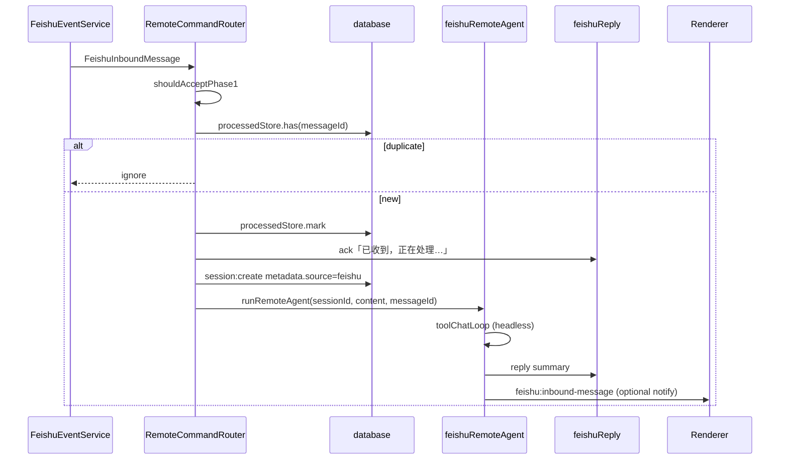

# 飞书集成 Phase 1 技术方案（MVP）

> 版本：v1.0  
> 设计日期：2026-05-25  
> 状态：草案  
> 需求来源：[feishu-integration-requirement.md](../requirement/feishu-integration-requirement.md) §16 Phase 1  
> 前置依赖：系统托盘（建议并行，非硬阻塞）

---

## 0. 设计总纲

### 0.1 Phase 1 范围

| 交付项 | 本阶段实现 |
|--------|-----------|
| `run_lark_cli` 内置工具 | ✅ 含写操作确认与安全校验 |
| `LarkCliRunner` | ✅ 统一 CLI 进程封装 |
| CLI 检测与设置页 | ✅ 安装引导、config、auth 状态 |
| 飞书 Skill 集成 | ✅ 自动激活 + 安装引导 |
| `FeishuEventService` | ✅ 私聊 Bot 文本指令 |
| `RemoteCommandRouter` | ✅ 新会话、去重、飞书 reply |
| 远程只读策略 | ✅ `remote_read_only` 默认 |
| 群聊 @Bot / 前缀 | ❌ Phase 2 |
| 会话合并 / 白名单 | ❌ Phase 2 |
| 飞书内 Y/N 确认 | ❌ Phase 2 |

### 0.2 核心原则

1. **不自研飞书 API 客户端**，所有出站操作经 `lark-cli` 子进程。
2. **凭据不落 SpaceAssistant DB**，仅镜像状态字段（`appConfigured`、`userAuthorized`）。
3. **远程 Agent 在主进程驱动**，不依赖渲染进程窗口是否打开（为托盘后台铺路）。
4. **最小侵入**：复用 `toolChatLoop`、`toolConfirmRegistry`、现有 IPC 与配置读写模式。

### 0.3 新增目录结构

```
electron/
├── feishu/
│   ├── larkCliRunner.ts           # CLI spawn、超时、输出截断
│   ├── larkCliSecurity.ts         # 参数校验、写操作判定
│   ├── larkCliErrors.ts           # stderr 解析、scope 提示
│   ├── feishuEventService.ts      # event +subscribe 长连接
│   ├── feishuInboundParser.ts     # NDJSON → FeishuInboundMessage
│   ├── remoteCommandRouter.ts     # 过滤、去重、会话创建、Agent 触发
│   ├── feishuReply.ts             # Bot reply 封装
│   ├── feishuProcessedStore.ts    # message_id 去重持久化
│   ├── feishuRemoteAgent.ts       # 主进程侧远程 Agent 执行编排
│   └── feishuIpc.ts               # feishu:* IPC 注册
├── tools/
│   └── runLarkCliExecutor.ts      # run_lark_cli 执行器（或并入 builtinExecutors）
src/renderer/
├── components/Config/
│   └── FeishuSettingsTab.tsx      # 飞书设置 Tab
├── services/
│   └── feishuService.ts           # 渲染进程 IPC 封装
src/shared/
├── feishuTypes.ts                 # FeishuConfig、FeishuInboundMessage 等
└── feishuPrompts.ts               # 远程指令 system 片段
```

---

## 1. 类型与配置

### 1.1 新增 `src/shared/feishuTypes.ts`

```typescript
export type FeishuEventConnectionState =
  | 'stopped'
  | 'connecting'
  | 'connected'
  | 'error'

export interface FeishuConfig {
  enabled: boolean
  cliPath?: string
  appConfigured: boolean
  appIdSuffix?: string
  userAuthorized: boolean
  userDisplay?: string
  remoteEnabled: boolean
  remoteNotifyOnReceive: boolean
  remoteConfirmPolicy: 'inherit' | 'always' | 'remote_read_only'
  remoteAllowLocalWrite: boolean
  larkCliDefaultTimeoutSec: number
  larkCliWriteRequiresConfirm: boolean
}

export const DEFAULT_FEISHU_CONFIG: FeishuConfig = { /* 同需求文档 §11.1 */ }

export interface FeishuInboundMessage {
  messageId: string
  chatId: string
  chatType: 'p2p' | 'group' | string
  senderOpenId: string
  senderName?: string
  content: string
  rawContent?: string
  createTime: string
  mentionsBot: boolean
}

export interface FeishuCliDetectResult {
  installed: boolean
  version?: string
  path?: string
  nodeAvailable: boolean
  npmAvailable: boolean
}

export interface FeishuEventStatus {
  state: FeishuEventConnectionState
  lastError?: string
  processedCount: number
  startedAt?: number
}
```

### 1.2 扩展 `AppConfig`（`domainTypes.ts`）

```typescript
export interface AppConfig {
  // ...existing
  feishu: FeishuConfig
}

export function mergeFeishuConfig(partial?: Partial<FeishuConfig> | null): FeishuConfig {
  if (!partial || typeof partial !== 'object') return { ...DEFAULT_FEISHU_CONFIG }
  return { ...DEFAULT_FEISHU_CONFIG, ...partial }
}
```

### 1.3 Session metadata 约定（Phase 1 不扩展 Session 接口）

复用现有 `Session.metadata`：

```typescript
// 写入 session.metadata
{
  source: 'feishu',
  feishuChatId: string,
  feishuMessageId: string,
  feishuSenderOpenId: string,
}
```

后续 Phase 2 可提升为 typed 字段；Phase 1 避免 DB 迁移。

### 1.4 去重存储（`feishuProcessedStore.ts`）

路径：`{userData}/feishu-processed-messages.json`

```typescript
interface FeishuProcessedStore {
  entries: Array<{ messageId: string; processedAt: number }>
}
```

- 启动时 purge `processedAt < now - 7d`
- `has(messageId)` / `mark(messageId)` 原子写（写 tmp + rename，与 database.ts 一致）

---

## 2. LarkCliRunner

### 2.1 职责

统一所有 `lark-cli` 子进程调用：检测、安装、config、auth、工具执行、reply。

### 2.2 接口

```typescript
// electron/feishu/larkCliRunner.ts

export interface LarkCliRunOptions {
  args: string[]
  timeoutSec?: number
  cwd?: string
  onStdout?: (chunk: string) => void
  signal?: AbortSignal
}

export interface LarkCliRunResult {
  exitCode: number
  stdout: string
  stderr: string
  timedOut: boolean
}

export class LarkCliRunner {
  constructor(private resolveCliPath: () => string) {}

  resolveExecutable(): string  // cliPath 或 which lark-cli
  async detect(): Promise<FeishuCliDetectResult>
  async run(options: LarkCliRunOptions): Promise<LarkCliRunResult>
  async runInteractive(args: string[]): Promise<{ stdout: string; stderr: string }>
}
```

### 2.3 实现要点

| 项 | 规格 |
|----|------|
| spawn | `spawn(cliPath, args, { shell: false, windowsHide: true, env: { PATH, HOME/USERPROFILE } })` |
| 超时 | `timeoutSec` 默认读 `feishu.larkCliDefaultTimeoutSec`（120） |
| 输出上限 | stdout/stderr 各 512KB，超出追加 `\n[输出被截断]` |
| Windows | `lark-cli.cmd` 回退：`where lark-cli` 或 npm global bin |
| 取消 | `AbortSignal` → `SIGTERM`，500ms 后 `SIGKILL` |

### 2.4 检测逻辑（`feishu:detect-cli`）

```typescript
async detect(): Promise<FeishuCliDetectResult> {
  const node = await runWhich('node')
  const npm = await runWhich('npm')
  try {
    const r = await this.run({ args: ['--version'], timeoutSec: 10 })
    const version = r.stdout.trim()
    return { installed: r.exitCode === 0, version, path: this.resolveExecutable(), nodeAvailable: !!node, npmAvailable: !!npm }
  } catch {
    return { installed: false, nodeAvailable: !!node, npmAvailable: !!npm }
  }
}
```

---

## 3. 安全层：`larkCliSecurity.ts`

### 3.1 参数校验

```typescript
const SHELL_METACHAR_RE = /[;|&><`$(){}[\]\\]/
const ALLOWED_SUBCOMMANDS = new Set([
  'message', 'doc', 'calendar', 'bitable', 'mail', 'task',
  'wiki', 'contact', 'search', 'api', 'auth', 'config', 'schema', 'help'
])
// Phase 1: event 子命令禁止经 run_lark_cli 调用（仅 FeishuEventService 使用）

export function assertSafeLarkCliArgs(args: unknown): string[] {
  if (!Array.isArray(args) || args.length === 0) throw new Error('args 必须为非空数组')
  const normalized = args.map((a) => {
    if (typeof a !== 'string') throw new Error('args 元素必须为 string')
    if (SHELL_METACHAR_RE.test(a)) throw new Error('参数含非法 shell 字符')
    return a
  })
  if (!ALLOWED_SUBCOMMANDS.has(normalized[0])) {
    throw new Error(`不允许的 lark-cli 子命令: ${normalized[0]}`)
  }
  if (normalized[0] === 'event') throw new Error('event 子命令不可通过 Agent 工具调用')
  return normalized
}
```

### 3.2 写操作判定

```typescript
export function isLarkCliWriteOperation(args: string[]): boolean {
  const [cmd, sub, ...rest] = args
  if (cmd === 'api') {
    const method = (sub ?? '').toUpperCase()
    return ['POST', 'PUT', 'PATCH', 'DELETE'].includes(method)
  }
  const writePairs: Array<[string, string?]> = [
    ['message', 'send'], ['message', 'reply'],
    ['doc', 'create'], ['doc', 'update'],
    ['calendar', 'create'], ['calendar', 'update'],
    ['mail', 'send'], ['mail', 'reply'],
    ['task', 'create'], ['task', 'update'],
  ]
  return writePairs.some(([a, b]) => cmd === a && (b === undefined || sub === b))
  // bitable 写操作：cmd==='bitable' && !['list','read','get'].includes(sub)
}
```

### 3.3 扩展 `domainTypes.ts`

```typescript
export function builtinToolNeedsConfirmation(name: string): boolean {
  return name === 'edit_file' || name === 'write_file' || name === 'run_script' || name === 'run_lark_cli'
}

export function builtinToolRiskLevel(name: string): ToolRiskLevel {
  switch (name) {
    case 'run_lark_cli':
      return 'high'
    // ...
  }
}
```

写操作确认逻辑在 `toolChatLoop` 中增加分支：`run_lark_cli` 且 `isLarkCliWriteOperation(args)` 且 `feishu.larkCliWriteRequiresConfirm`。

---

## 4. `run_lark_cli` 工具

### 4.1 工具定义（`builtinToolDefinitions.ts`）

按需求文档 §7.1.1 追加定义；**仅当 `feishu.enabled === true`** 时注入 API（见 §4.4）。

### 4.2 执行器（`runLarkCliExecutor.ts`）

```typescript
export const runLarkCliExecutor: ToolExecutor = {
  name: 'run_lark_cli',
  async execute(input, ctx): Promise<ToolExecutorResult> {
    const started = Date.now()
    let args: string[]
    try {
      args = assertSafeLarkCliArgs(input.args)
    } catch (e) {
      return { success: false, error: String(e), duration: Date.now() - started }
    }
    const timeoutSec = typeof input.timeout === 'number'
      ? input.timeout
      : ctx.feishuConfig?.larkCliDefaultTimeoutSec ?? 120

    const runner = ctx.larkCliRunner as LarkCliRunner
    const r = await runner.run({
      args,
      timeoutSec,
      onStdout: (t) => ctx.sendProgress('lark-cli', t.slice(-4000)),
      signal: ctx.signal,
    })

    if (r.timedOut) return { success: false, error: 'lark-cli 执行超时', ... }
    if (r.exitCode !== 0) {
      const parsed = parseLarkCliError(r.stderr)
      return { success: false, error: parsed.message, data: { stdout: r.stdout, stderr: r.stderr, hint: parsed.hint }, ... }
    }
    return { success: true, data: { stdout: r.stdout, stderr: r.stderr }, ... }
  }
}
```

### 4.3 扩展 `ToolExecutorContext`

在 `builtinExecutors.ts` 的 context 类型中增加：

```typescript
feishuConfig?: FeishuConfig
larkCliRunner?: LarkCliRunner
remoteContext?: { source: 'feishu'; messageId: string; confirmPolicy: FeishuConfig['remoteConfirmPolicy'] }
```

### 4.4 工具注入过滤（`toolsConfigRuntime.ts`）

```typescript
export function filterBuiltinToolsForApi(tools: unknown[], feishu?: FeishuConfig): unknown[] {
  let list = tools
  if (!feishu?.enabled) {
    list = list.filter((t) => (t as { name?: string }).name !== 'run_lark_cli')
  }
  // ...existing allowedTools filter
  return list
}
```

### 4.5 远程只读策略（`toolChatLoop.ts`）

在 `waitForToolConfirm` 之前插入：

```typescript
if (
  toolName === 'run_lark_cli' &&
  remoteContext?.source === 'feishu' &&
  remoteContext.confirmPolicy === 'remote_read_only' &&
  isLarkCliWriteOperation(args)
) {
  return {
    success: false,
    error: '远程飞书指令不允许自动执行写操作。请在桌面端 SpaceAssistant 中确认后执行。',
    blockedReason: 'feishu_remote_write_blocked',
  }
}
```

本地文件写操作（`edit_file` / `write_file`）在远程上下文且 `!remoteAllowLocalWrite` 时同样 block。

### 4.6 UI 展示（`toolCallDisplay.ts` / `ToolCallCard.tsx`）

- 展示：`lark-cli ${args.join(' ')}`（截断 200 字符）
- 隐藏 `--secret`、token 类参数（正则 redact）
- 新增 progress label：`lark-cli`

---

## 5. FeishuEventService

### 5.1 生命周期

```typescript
// electron/feishu/feishuEventService.ts

export class FeishuEventService {
  private proc: ChildProcess | null = null
  private state: FeishuEventConnectionState = 'stopped'
  private restartAttempts = 0
  private readonly maxRestartsPerHour = 12

  constructor(
    private runner: LarkCliRunner,
    private onMessage: (msg: FeishuInboundMessage) => void,
    private onStateChange: (s: FeishuEventStatus) => void,
  ) {}

  async start(): Promise<void>
  async stop(): Promise<void>
  getStatus(): FeishuEventStatus
}
```

### 5.2 启动命令

```typescript
const args = [
  'event', '+subscribe',
  '--event-types', 'im.message.receive_v1',
  '--compact', '--quiet',
]
this.proc = spawn(cliPath, args, { shell: false, stdio: ['ignore', 'pipe', 'pipe'] })
```

### 5.3 stdout 解析

使用 `readline` 按行读取；每行 `JSON.parse` → `parseCompactInboundEvent(line)`：

```typescript
// feishuInboundParser.ts — 兼容 compact 格式的字段映射
export function parseCompactInboundEvent(raw: unknown): FeishuInboundMessage | null {
  // 期望字段：message_id, chat_id, chat_type, sender_open_id, content, create_time
  // content 可能是 JSON 字符串 {"text":"..."}，需二次解析
}
```

解析失败：log warning，不 crash 服务。

### 5.4 Phase 1 过滤规则

```typescript
function shouldAcceptPhase1(msg: FeishuInboundMessage): boolean {
  if (msg.chatType !== 'p2p') return false  // Phase 1 仅私聊
  if (!msg.content.trim()) return false
  if (msg.content.length > 4000) return false
  return true
}
```

超长消息：调用 `feishuReply.replyText(messageId, '消息过长，请控制在 4000 字以内')`。

### 5.5 崩溃重启

```
proc.on('exit', (code) => {
  if (intentionalStop) return
  scheduleRestart(exponentialBackoff(restartAttempts++))
})
```

- 退避：5s → 10s → 30s → 60s（上限）
- 1 小时内超过 `maxRestartsPerHour` → state=`error`，停止重启，IPC 通知 UI

### 5.6 应用退出

`app.on('before-quit')` → `feishuEventService.stop()`，`SIGTERM` 子进程，等待 3s。

---

## 6. RemoteCommandRouter

### 6.1 流程



### 6.2 会话创建

```typescript
// remoteCommandRouter.ts
const title = `[飞书] ${truncate(msg.content, 30)}`
const session = await createSession({
  name: title,
  model: config.defaultModel, // 见 OQ-2：Phase 1 用全局默认
  metadata: {
    source: 'feishu',
    feishuChatId: msg.chatId,
    feishuMessageId: msg.messageId,
    feishuSenderOpenId: msg.senderOpenId,
  },
})
```

### 6.3 并行上限

复用 `maxParallelChatSessions`：远程 Agent 启动前检查 `countRunningChatSessions()`，超限则 reply「当前并行任务已满，请稍后再试」。

---

## 7. feishuRemoteAgent（主进程 Headless Agent）

### 7.1 设计动机

远程指令可能在主窗口隐藏时到达；**不能**依赖 Renderer 订阅 stream 事件来驱动 tool confirm（部分 confirm 仍需 Renderer，见 §7.3）。

Phase 1 策略：

- **读操作 + 本地只读工具**：主进程完整跑 `runBuiltinToolChatLoop`
- **写操作需确认**：loop 返回 blocked → 汇总到飞书 reply「需桌面确认」；同时 `webContents.send('feishu:pending-confirm', { sessionId, toolCallId })`

### 7.2 接口

```typescript
// electron/feishu/feishuRemoteAgent.ts

export async function runFeishuRemoteAgent(ctx: {
  db: AppDatabase
  sessionId: string
  userMessage: string
  replyMessageId: string
  feishuConfig: FeishuConfig
  workDir: string
  getMainWebContents: () => WebContents | null
}): Promise<{ summary: string; pendingConfirm: boolean }>
```

### 7.3 System Prompt 注入

在 `buildSystemPrompt` 调用链增加 optional 片段（`feishuPrompts.ts`）：

```typescript
export const FEISHU_REMOTE_SYSTEM_APPENDIX = `
<feishu_remote_command>
来源：飞书 Bot 远程指令。
完成后：用 run_lark_cli 向 message_id=${messageId} 回复摘要（api POST .../reply --as bot）。
写操作：当前 remoteConfirmPolicy=${policy}，禁止未确认的飞书写操作。
</feishu_remote_command>`
```

### 7.4 完成回复（`feishuReply.ts`）

```typescript
export async function replyFeishuText(
  runner: LarkCliRunner,
  messageId: string,
  text: string,
): Promise<void> {
  const body = JSON.stringify({ msg_type: 'text', content: JSON.stringify({ text }) })
  await runner.run({
    args: [
      'api', 'POST', `/open-apis/im/v1/messages/${messageId}/reply`,
      '--data', body, '--as', 'bot', '--format', 'data',
    ],
    timeoutSec: 30,
  })
}
```

摘要截断 4000 字；超出则截断 + 提示桌面会话标题。

### 7.5 与现有 stream 的关系

远程 Agent 使用与 `claude-chat-send-stream` 相同的 `runBuiltinToolChatLoop`，但：

- `sender` 为 `getMainWebContents()`，可能为 null → progress/confirm 事件缓存到 session，窗口恢复后 replay（Phase 1 简化：**confirm 必须聚焦窗口**，否则 auto-block 写操作）
- 流式 delta **不**推送飞书（Phase 1）；仅最终 reply

---

## 8. IPC 与 Preload

### 8.1 新增通道（`feishuIpc.ts` + `preload.ts` + `api.ts`）

| 通道 | 实现 |
|------|------|
| `feishu:detect-cli` | `larkCliRunner.detect()` |
| `feishu:install-cli` | spawn `npm install -g @larksuite/cli`，返回 stdout |
| `feishu:install-skill` | spawn `npx -y skills add https://open.feishu.cn --skill -y` |
| `feishu:config-init` | 交互式：`lark-cli config init --new`（spawn + 日志回传 UI） |
| `feishu:auth-login` | `lark-cli auth login --recommend`，regex 提取 URL → `shell.openExternal` |
| `feishu:auth-status` | `lark-cli auth status` 解析 |
| `feishu:event-start` | `feishuEventService.start()` |
| `feishu:event-stop` | `feishuEventService.stop()` |
| `feishu:event-status` | `getStatus()` |
| `feishu:inbound-message` | main→renderer 推送 |
| `feishu:pending-confirm` | main→renderer 写操作待确认 |

`config:get/set` 扩展 `feishu` 字段；`CONFIG_KEYS.feishu = 'config.feishu'`。

### 8.2 启动时自动监听

```typescript
// main.ts after app.whenReady
const feishu = mergeFeishuConfig(readFeishuConfig(db))
if (feishu.enabled && feishu.remoteEnabled && feishu.appConfigured) {
  feishuEventService.start().catch(log)
}
```

---

## 9. 设置 UI（`FeishuSettingsTab.tsx`）

### 9.1 Phase 1 界面范围

- 启用飞书集成 Switch
- CLI 状态 + 安装 + 重新检测 + cliPath Input
- 应用配置状态 + 「配置飞书应用」按钮（打开终端日志 Modal 或分步向导）
- 用户授权状态 + 「登录飞书账号」
- 远程监听 Switch + 连接状态 Badge + 启动/停止
- 安全：`remoteConfirmPolicy` Select（Phase 1 固定默认 `remote_read_only`，UI 可展示但不可改或仅 advanced）
- `remoteAllowLocalWrite` Checkbox
- 开放平台 checklist（静态 Ant Design Steps，链到官方文档）

### 9.2 状态轮询

远程监听开启时，每 5s `feishu:event-status` 刷新 Badge。

---

## 10. Skill 集成

### 10.1 安装引导

启用飞书 Switch 时，若未检测到飞书 Skill（扫描 user skills dir 无 `lark` / `feishu` 相关名），Modal 提示安装并调用 `feishu:install-skill`。

### 10.2 自动激活（`skillMatcher.ts`）

增加匹配规则：

```typescript
if (session.metadata?.source === 'feishu') {
  forceActivateSkillByName('lark-cli') // 或官方 skill 实际名称
}
// 用户输入含 飞书|lark|feishu|群消息|日历|多维表格 等关键词时加权
```

---

## 11. 错误解析（`larkCliErrors.ts`）

| stderr 模式 | 用户/Agent 提示 |
|------------|----------------|
| `command not found` | 请先安装 lark-cli |
| `not configured` / `config init` | 请完成应用配置 |
| `scope` / `permission` | 提取 scope 名 + 「设置 → 飞书 → 补充授权」 |
| `authorization` / `token expired` | 重新登录 |
| `99991662` 等飞书错误码 | 映射简短中文说明 |

---

## 12. 测试计划

### 12.1 单元测试（Node 环境）

| 文件 | 用例 |
|------|------|
| `larkCliSecurity.test.ts` | 拒绝 shell 元字符；写操作判定 |
| `feishuInboundParser.test.ts` | compact JSON 解析；text content 二次解析 |
| `feishuProcessedStore.test.ts` | 去重；7 天 purge |
| `larkCliErrors.test.ts` | stderr 模式匹配 |

### 12.2 集成测试（mock spawn）

| 场景 | 验证 |
|------|------|
| EventService 收到 NDJSON | onMessage 回调 |
| 重复 messageId | 不二次创建 session |
| remote_read_only + write | tool loop block |

### 12.3 手工验收

按需求文档 §17 验收清单。

---

## 13. 实施任务拆分

| 序号 | 任务 | 预估 | 依赖 |
|------|------|------|------|
| T1 | `feishuTypes` + `AppConfig` 扩展 + config merge | 0.5d | — |
| T2 | `LarkCliRunner` + detect | 1d | T1 |
| T3 | `larkCliSecurity` + `run_lark_cli` executor | 1d | T2 |
| T4 | `toolChatLoop` 远程策略 + 工具过滤 | 1d | T3 |
| T5 | `FeishuEventService` + parser | 1.5d | T2 |
| T6 | `RemoteCommandRouter` + processed store | 1d | T5 |
| T7 | `feishuRemoteAgent` + reply | 2d | T4,T6 |
| T8 | IPC + preload + api.ts | 1d | T2,T5 |
| T9 | `FeishuSettingsTab` | 1.5d | T8 |
| T10 | Skill 激活 + UI 角标 | 0.5d | T9 |
| T11 | 单元测试 | 1d | T3,T5 |
| **合计** | | **~11d** | |

---

## 14. 风险与缓解

| 风险 | 缓解 |
|------|------|
| 用户未装 Node/npm | 设置页前置检测 + 文档链接 |
| `config init` 需浏览器交互 | 专用 Modal 展示 CLI 输出 + 步骤说明 |
| 远程 confirm 无窗口 | Phase 1 block 写操作并 reply 提示；Phase 2 飞书 Y/N |
| lark-cli 版本 breaking change | detect 记录 version；CI 不 pin；文档注明最低版本 |
| 主进程 Agent 与 Renderer 双轨 | 远程仅主进程 loop；桌面聊天仍走 Renderer stream |

---

## 15. Phase 2 预留接口

以下字段/钩子 Phase 1 预留但不实现逻辑：

- `FeishuConfig.remoteGroupTrigger` / `remoteCommandPrefix` / `remoteSenderAllowlist` / `remoteSessionMergeMinutes`
- `RemoteCommandRouter.shouldAcceptGroupMessage()`
- `feishu:reply-message` 公开 IPC（Phase 1 仅内部 module）

---

**文档结束**
