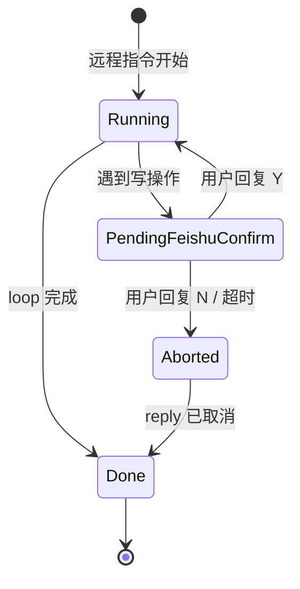

# 飞书集成 Phase 2 技术方案（增强）

> 版本：v1.0  
> 设计日期：2026-05-25  
> 状态：草案  
> 需求来源：[feishu-integration-requirement.md](../requirement/feishu-integration-requirement.md) §16 Phase 2  
> 前置依赖：[feishu-integration-phase1-design.md](./feishu-integration-phase1-design.md) 全部交付

---

## 0. 设计总纲

### 0.1 Phase 2 范围

| 交付项 | 说明 |
|--------|------|
| 群聊 @Bot / 前缀触发 | 完整 `remoteGroupTrigger` 规则 |
| 会话合并 | 同 `chat_id` 在 T 分钟内续接 |
| 发送者白名单 | `remoteSenderAllowlist` |
| 飞书内 Y/N 确认写操作 | 远程写操作二次确认闭环 |
| 富文本 / 图片消息 | 下载附件注入 Agent |
| Wake Word / 妙记待办 | 会议逐字稿 → 待办提取 |
| Lark 国际版 | config 区域 + 完整测试 |
| 审计日志 | `feishu-audit.log` 轮转 |
| CLI 打包策略评估 | OQ-1 结论落地 |

### 0.2 设计原则

1. **在 Phase 1 模块上扩展**，不重写 EventService / Router 主干。
2. **确认闭环优先于功能广度**：Y/N 确认方案先于妙记 Wake Word 实现。
3. **富媒体走 CLI 下载 + 本地临时文件**，不引入飞书 SDK 直连。

---

## 1. 群聊触发规则

### 1.1 扩展 `RemoteCommandRouter`

Phase 1 的 `shouldAcceptPhase1` 替换为：

```typescript
// electron/feishu/remoteCommandRouter.ts

export function shouldAcceptInbound(
  msg: FeishuInboundMessage,
  config: FeishuConfig,
): { accept: boolean; reason?: string } {
  if (!msg.content.trim()) return { accept: false, reason: 'empty' }
  if (msg.content.length > 4000) return { accept: false, reason: 'too_long' }

  if (msg.chatType === 'p2p') return { accept: true }

  if (msg.chatType === 'group') {
    const trigger = config.remoteGroupTrigger ?? 'mention'
    const prefix = config.remoteCommandPrefix ?? '/sa '
    const byMention = msg.mentionsBot
    const byPrefix = msg.content.startsWith(prefix)

    switch (trigger) {
      case 'mention':
        return byMention ? { accept: true } : { accept: false, reason: 'no_mention' }
      case 'prefix':
        return byPrefix
          ? { accept: true, /* strip prefix */ }
          : { accept: false, reason: 'no_prefix' }
      case 'both':
        return byMention || byPrefix ? { accept: true } : { accept: false, reason: 'no_trigger' }
    }
  }

  return { accept: false, reason: 'unsupported_chat_type' }
}
```

### 1.2 前缀剥离

前缀触发时，注入 Agent 的 `userMessage` 为 `content.slice(prefix.length).trim()`，metadata 保留 `rawContent`。

### 1.3 compact 事件 @Bot 检测（`feishuInboundParser.ts`）

解析 compact NDJSON 中的 `mentions` 数组或 `_mention_bot` 布尔字段（以 lark-cli 实际输出为准，实现时对照 CLI 版本写 adapter）：

```typescript
export function extractMentionsBot(raw: Record<string, unknown>): boolean {
  if (raw.mentions_bot === true) return true
  const mentions = raw.mentions
  if (Array.isArray(mentions)) {
    return mentions.some((m) => m?.name === 'bot' || m?.id?.type === 'app')
  }
  return false
}
```

### 1.4 测试

- 群聊无 @：ignore
- 群聊 @Bot：accept
- 群聊 `/sa hello` + trigger=prefix：accept，内容为 `hello`
- trigger=both：任一满足即可

---

## 2. 发送者白名单

### 2.1 配置

`FeishuConfig.remoteSenderAllowlist?: string[]` — open_id 列表；**空数组或未设置 = 不限制**。

### 2.2 校验位置

在 `shouldAcceptInbound` 之后：

```typescript
if (config.remoteSenderAllowlist?.length) {
  if (!config.remoteSenderAllowlist.includes(msg.senderOpenId)) {
    await replyFeishuText(runner, msg.messageId, '您暂无权限向此 Bot 发送指令。')
    return
  }
}
```

### 2.3 设置 UI

`FeishuSettingsTab` 增加 Tag 输入框（open_id），附「如何获取 open_id」折叠说明（通过 `lark-cli contact search` 示例）。

---

## 3. 会话合并

### 3.1 配置

`remoteSessionMergeMinutes: number`，默认 `0`（每条新会话）。建议值 `15`。

### 3.2 会话选择算法

```typescript
// electron/feishu/feishuSessionResolver.ts

export async function resolveFeishuSession(
  db: AppDatabase,
  msg: FeishuInboundMessage,
  config: FeishuConfig,
): Promise<{ sessionId: string; isNew: boolean }> {
  const mergeWindowMs = (config.remoteSessionMergeMinutes ?? 0) * 60_000
  if (mergeWindowMs <= 0) {
    return { sessionId: await createNewFeishuSession(msg), isNew: true }
  }

  const existing = db.listSessions().find((s) => {
    const m = s.metadata as Record<string, unknown>
    return (
      m?.source === 'feishu' &&
      m?.feishuChatId === msg.chatId &&
      Date.now() - s.updatedAt < mergeWindowMs
    )
  })

  if (existing) {
    await db.updateSession(existing.id, {
      updatedAt: Date.now(),
      metadata: { ...existing.metadata, feishuMessageId: msg.messageId },
    })
    return { sessionId: existing.id, isNew: false }
  }

  return { sessionId: await createNewFeishuSession(msg), isNew: true }
}
```

### 3.3 Agent 上下文

续接会话时：

- append 新 user message 到已有 session
- system appendix 更新 `message_id` 为最新（用于 reply 目标）
- 不重复发送「已收到」ack（可配置）

### 3.4 UI

会话列表中 `[飞书]` 会话在 merge 窗口内收到新指令时，置顶并闪烁（可选）。

---

## 4. 飞书内 Y/N 确认写操作

### 4.1 问题

Phase 1 `remote_read_only` 直接 block 所有远程写操作。Phase 2 允许用户在飞书内确认。

### 4.2 状态机



### 4.3 新增模块 `feishuConfirmManager.ts`

```typescript
interface FeishuPendingConfirm {
  id: string
  sessionId: string
  toolCallId: string
  toolName: string
  toolInput: Record<string, unknown>
  messageId: string        // 原始指令 message_id
  confirmMessageId?: string // Bot 发出的确认卡片 message_id
  chatId: string
  createdAt: number
  expiresAt: number        // 默认 10 分钟
}

export class FeishuConfirmManager {
  async requestConfirm(pending: Omit<FeishuPendingConfirm, 'id' | 'createdAt' | 'expiresAt'>): Promise<'y' | 'n' | 'timeout'>
  tryResolveFromInbound(msg: FeishuInboundMessage): boolean  // 若 msg 是对确认的回复，consume 并 resolve
}
```

### 4.4 确认消息格式

Bot reply 文本：

```
⚠️ 需要确认以下操作：
工具：run_lark_cli
命令：lark-cli message send --chat-id oc_xxx --text "..."
回复 Y 确认执行，N 取消（10 分钟内有效）
```

### 4.5 入站消息拦截

`RemoteCommandRouter` 入口：

```typescript
if (feishuConfirmManager.tryResolveFromInbound(msg)) return  // 不当作新指令
```

解析规则（Phase 2）：

- 私聊 Bot 且存在 pending confirm 且 `chatId` 匹配
- `content.trim()` 匹配 `/^[Yy]$|^[Nn]$|^确认$|^取消$/`

### 4.6 与 `toolChatLoop` 集成

当 `remoteConfirmPolicy === 'always'` 或用户设置允许远程写：

```typescript
if (needsConfirm && remoteContext?.source === 'feishu') {
  const decision = await feishuConfirmManager.requestConfirm({ ... })
  if (decision !== 'y') return { success: false, error: '用户已在飞书取消操作' }
  // 继续执行
}
```

`remoteConfirmPolicy` 新增枚举值 `'feishu_confirm'`（Phase 2 默认推荐）。

### 4.7 并发

同一 session 同时最多 1 个 pending confirm；新写操作排队或 reply「请先完成上一项确认」。

---

## 5. 富文本与图片消息

### 5.1 支持的消息类型（Phase 2）

| msg_type | 处理 |
|----------|------|
| `text` | Phase 1 已有 |
| `post`（富文本） | 提取 plain text + 保留结构摘要 |
| `image` | 下载图片 → 临时文件 → 注入 Agent |

### 5.2 解析扩展（`feishuInboundParser.ts`）

```typescript
export interface FeishuInboundMessage {
  // ...Phase 1 fields
  msgType: 'text' | 'post' | 'image' | string
  attachments?: FeishuInboundAttachment[]
}

export interface FeishuInboundAttachment {
  kind: 'image' | 'file'
  localPath: string      // 下载后的绝对路径
  fileName?: string
  mimeType?: string
}
```

### 5.3 图片下载

通过 `lark-cli api GET` 或 CLI 内置 `message download`（以 CLI schema 为准）：

```typescript
async function downloadMessageImage(
  runner: LarkCliRunner,
  messageId: string,
  imageKey: string,
  destDir: string,
): Promise<string>
```

- 临时目录：`{userData}/feishu-media/cache/{messageId}/`
- 定期清理：7 天未访问删除

### 5.4 注入 Agent

**方案 A（Phase 2 推荐）**：主进程将图片转为 base64，append 到 user message：

```xml
<feishu_attachment type="image" path="{localPath}" />
```

若模型支持 vision：在 `claude-chat-send-stream` payload 增加 `images[]`（需扩展 API，评估模型能力）。

**方案 B（无 vision）**：Agent 仅收到路径说明 + `read_file` 不可用（路径在 workDir 外）→ 专用工具 `read_feishu_attachment`（Phase 2 小工具，读 userData 下缓存）。

### 5.5 新增工具 `read_feishu_attachment`（可选）

```typescript
// 只读 userData/feishu-media 下文件，防路径遍历
name: 'read_feishu_attachment'
input: { relativePath: string }  // 相对于 feishu-media 根
```

---

## 6. Wake Word / 妙记待办

### 6.1 场景

用户指令示例：「读一下这个妙记，提取待办并执行」或配置 Wake Word「龙虾龙虾」。

### 6.2 实现路径

不单独做语音识别；依赖用户提供的**妙记链接**或 **lark-cli 视频会议/妙记命令**：

```
lark-cli meeting minutes --url <minutes_url>
# 或
lark-cli api GET /open-apis/minutes/v1/...
```

### 6.3 新增 Skill 片段（用户级）

`feishu-minutes-todo` Skill（可随官方 Skill 更新）：

1. 用 `run_lark_cli` 拉取逐字稿
2. LLM 提取待办列表
3. 向用户展示计划（桌面或飞书 reply）
4. 逐项执行（受 confirm 策略约束）

### 6.4 Wake Word 配置（`FeishuConfig` 扩展）

```typescript
interface FeishuConfig {
  // Phase 2
  wakeWords?: string[]           // 默认 []
  wakeWordAutoExecute: boolean   // 默认 false，仅提取待办不自动执行
}
```

处理逻辑（在 minutes 文本中）：

```typescript
function extractWakeWordCommands(transcript: string, wakeWords: string[]): string[] {
  // 逐行匹配包含 wakeWord 的句子
}
```

### 6.5 与 Remote Router 关系

Wake Word 场景主要由**桌面对话**触发；若妙记链接通过飞书消息发来，走标准 inbound 流程 + Skill。

---

## 7. Lark 国际版

### 7.1 配置扩展

```typescript
interface FeishuConfig {
  region: 'feishu' | 'lark'   // 默认 feishu
}
```

### 7.2 CLI 行为

- 安装引导文案分支：Lark 用户使用 `https://github.com/larksuite/cli` 文档
- `config init` 时传入 region（若 CLI 支持 `--region lark`）
- 设置页「国际版 Lark」Switch 切换 region，提示重新 `config init`

### 7.3 测试矩阵

| 项 | 飞书国内 | Lark 国际 |
|----|---------|----------|
| detect-cli | ✓ | ✓ |
| event subscribe | ✓ | ✓ |
| auth login | ✓ | ✓ |
| message send/reply | ✓ | ✓ |

---

## 8. 审计日志

### 8.1 路径

`{userData}/logs/feishu-audit.log` — JSON Lines

### 8.2 事件类型

```typescript
type FeishuAuditEvent =
  | { type: 'inbound'; messageId: string; chatId: string; senderOpenId: string; accepted: boolean; reason?: string }
  | { type: 'agent_start'; sessionId: string; messageId: string }
  | { type: 'agent_done'; sessionId: string; success: boolean; summaryLen: number }
  | { type: 'lark_cli'; sessionId?: string; args: string[]; success: boolean; writeOp: boolean }
  | { type: 'confirm_request'; confirmId: string; decision?: string }
  | { type: 'reply'; messageId: string; len: number }
```

### 8.3 轮转

单文件 5MB，保留 5 个备份；使用 `agentLogger` 同类简单实现。

### 8.4 隐私

日志不记录 message 全文，仅 length + hash 前 8 位；不记录 App Secret。

---

## 9. CLI 打包策略（OQ-1 结论）

### 9.1 Phase 2 推荐方案

| 模式 | 说明 |
|------|------|
| **默认** | 仍依赖用户全局 `npm install -g @larksuite/cli` |
| **可选内置** | 设置页「使用内置 CLI」→ 应用携带 `{appResources}/lark-cli/` 或通过 `npx @larksuite/cli@x.y.z` pin 版本 |

### 9.2 内置实现 sketch

```
resources/
└── lark-cli/
    └── wrapper.mjs   # 动态 import @larksuite/cli/bin
```

`cliPath` 指向 wrapper；首次启动解压到 `{userData}/lark-cli-cache/`（electron-builder extraResources）。

### 9.3 自动更新

设置页显示 CLI 版本；「检查更新」调用 `npm view @larksuite/cli version` 对比。

---

## 10. 远程默认模型（OQ-2）

### 10.1 配置

```typescript
interface FeishuConfig {
  remoteDefaultModelId?: string  // 空 = 全局默认模型
}
```

### 10.2 应用

`resolveFeishuSession` / `runFeishuRemoteAgent` 创建会话时：

```typescript
const model = config.remoteDefaultModelId ?? appConfig.defaultModel
```

设置页：模型下拉（仅 enabled 模型），附说明「远程指令建议使用快速模型以降低成本」。

---

## 11. UI 增强

### 11.1 设置页 Phase 2 增量

- 群聊触发：Radio（@Bot / 前缀 / 两者）
- 前缀输入框
- 会话合并分钟数 InputNumber
- 白名单 Tags
- 远程写确认策略：新增「飞书内确认 (Y/N)」
- 区域：飞书 / Lark
- 远程默认模型 Select
- Wake Word Tags（高级折叠）

### 11.2 托盘（若已实现）

- Tooltip「飞书监听中 · 已处理 N 条」
- 角标：pending confirm 数量

### 11.3 系统通知

- 收到群聊 @ 指令
- 等待飞书 Y/N 确认超时

---

## 12. IPC 增量

| 通道 | 说明 |
|------|------|
| `feishu:pending-confirms` | invoke 列出当前 pending |
| `feishu:cancel-confirm` | invoke 取消指定 confirm |
| `feishu:audit-tail` | invoke 返回最近 50 条审计（Phase 3 UI 复用） |

---

## 13. 测试计划

| 类别 | 用例 |
|------|------|
| 群聊规则 | mention/prefix/both 组合 |
| 白名单 | 拒绝非白名单 sender |
| 会话合并 | 15min 内同 chat 续接 |
| Y/N confirm | Y 执行 / N 取消 / 超时 |
| 图片消息 | 下载 + attachment 注入 |
| Lark region | mock CLI config |

---

## 14. 实施任务拆分

| 序号 | 任务 | 预估 | 依赖 |
|------|------|------|------|
| P2-T1 | 群聊触发 + parser mentions | 1d | Phase 1 |
| P2-T2 | 白名单 | 0.5d | P2-T1 |
| P2-T3 | 会话合并 resolver | 1d | Phase 1 |
| P2-T4 | FeishuConfirmManager + loop 集成 | 2d | Phase 1 |
| P2-T5 | 富文本/图片下载 + attachment | 2d | Phase 1 |
| P2-T6 | 妙记 Skill + Wake Word | 1.5d | P2-T5 |
| P2-T7 | Lark 区域 + 测试 | 1d | Phase 1 |
| P2-T8 | 审计日志 | 0.5d | Phase 1 |
| P2-T9 | CLI 内置可选 + 更新检测 | 1.5d | — |
| P2-T10 | 设置 UI 增量 + 测试 | 1.5d | P2-T1~T9 |
| **合计** | | **~12.5d** | |

---

## 15. 迁移与兼容

- `FeishuConfig` 新字段均有默认值，旧 config JSON 自动 merge
- `remoteConfirmPolicy` 新值 `feishu_confirm`；旧 `remote_read_only` 行为不变
- Phase 1 私聊-only 行为：`remoteGroupTrigger` 默认 `mention` 不影响私聊

---

**文档结束**
