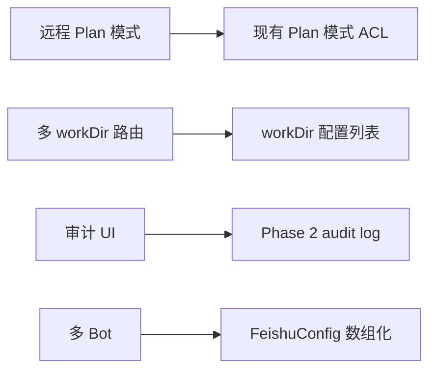
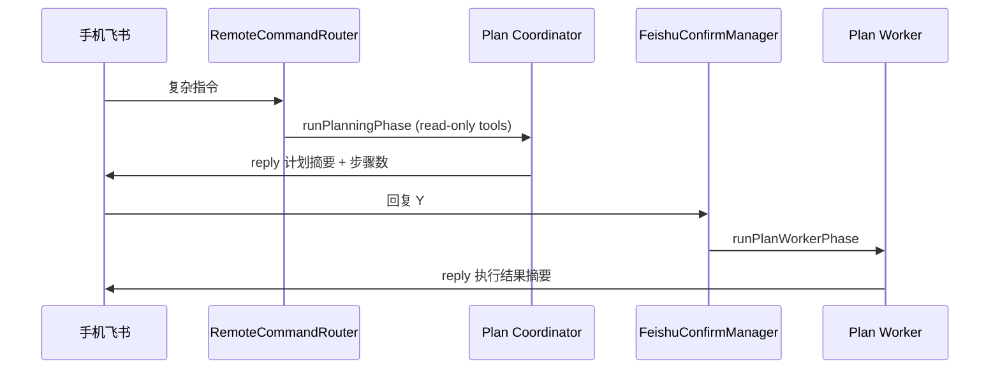

# 飞书集成 Phase 3 技术方案（可选增强）

> 版本：v1.0  
> 设计日期：2026-05-25  
> 状态：草案  
> 需求来源：[feishu-integration-requirement.md](../requirement/feishu-integration-requirement.md) §16 Phase 3  
> 前置依赖：
> - [feishu-integration-phase1-design.md](./feishu-integration-phase1-design.md)
> - [feishu-integration-phase2-design.md](./feishu-integration-phase2-design.md)

---

## 0. 设计总纲

### 0.1 Phase 3 范围

| 交付项 | 说明 |
|--------|------|
| 远程 Speculative Plan 模式 | 飞书先发计划，用户确认后再执行 |
| 多工作目录路由 | 指令内指定项目名切换 workDir |
| 审计日志 UI | 可视化查询飞书集成操作记录 |
| 多 Bot / 工作区（可选） | 企业多应用配置 |
| MCP 飞书服务器并存指引 | 配置层文档化，非必须实现 |

### 0.2 定位

Phase 3 为**体验与规模增强**，不影响 Phase 1/2 核心路径。各子项可独立交付。

### 0.3 依赖关系



---

## 1. 远程 Speculative Plan 模式

### 1.1 用户价值

复杂远程指令（如「重构 XX 模块并更新飞书文档」）直接执行风险高。Phase 3 允许：

1. 手机飞书发指令
2. 桌面 Agent **只读探索** + 生成 `<plan-doc>`
3. Bot 回复计划摘要 + 「回复 Y 开始执行 / N 取消」
4. 用户飞书确认后进入 Worker 执行阶段

### 1.2 与现有 Plan 模式关系

复用 `electron/plan/` 模块：

| 现有组件 | 远程 Plan 复用方式 |
|---------|-------------------|
| `planModeAcl.ts` | 远程 Plan 阶段同样禁止写工具 |
| `runPlanningPhase` | Coordinator 生成 plan-doc |
| `runPlanWorkerPhase` | 用户 Y 确认后触发 |
| 审批 UI | 桌面端仍展示；飞书侧仅摘要 |

### 1.3 会话模式扩展

```typescript
// session.metadata
{
  source: 'feishu',
  feishuRemoteMode: 'direct' | 'plan',  // Phase 3
  planState?: PlanSessionState,          // 复用现有 plan 状态字段
}
```

### 1.4 触发条件

`FeishuConfig` 扩展：

```typescript
interface FeishuConfig {
  remotePlanMode: 'off' | 'auto' | 'always'
  remotePlanKeywords?: string[]  // auto 时匹配，默认 ['重构','迁移','全面','计划']
}
```

| 模式 | 行为 |
|------|------|
| `off` | 与 Phase 2 相同，直接 Agent |
| `auto` | 指令含关键词或 LLM 预判 complexity=high → Plan |
| `always` | 所有远程指令先 Plan |

### 1.5 流程



### 1.6 飞书 Plan 摘要格式

```
📋 执行计划（共 5 步）
目标：重构 auth 模块并更新 Wiki
1. 扫描 auth 相关文件 …
2. …
回复 Y 开始执行，N 取消（30 分钟内有效）
```

### 1.7 FeishuConfirmManager 扩展

新增 confirm 类型：

```typescript
type FeishuConfirmKind = 'tool_write' | 'plan_execute'

interface FeishuPendingPlanConfirm {
  kind: 'plan_execute'
  sessionId: string
  planDocPath: string      // workDir 下临时 plan 文件或内存
  expiresAt: number
}
```

`tryResolveFromInbound` 优先匹配 plan_execute pending。

### 1.8 超时

Plan 确认默认 30 分钟（长于 tool confirm 的 10 分钟）。

### 1.9 桌面同步

Plan 生成后：

- 会话切换为 Plan 模式 UI（现有 ChatView plan 卡片）
- 飞书与桌面**共享同一 plan 状态**；任一渠道 Y 确认即可执行

---

## 2. 多工作目录路由

### 2.1 问题

用户可能有多个项目 workDir；远程指令「在 SpaceAssistant 项目里跑测试」需解析目标目录。

### 2.2 配置：工作目录注册表

```typescript
interface WorkDirProfile {
  id: string
  name: string           // 显示名，如 "SpaceAssistant"
  path: string           // 绝对路径
  aliases?: string[]     // ["SA", "space-assistant"]
  isDefault?: boolean
}

interface AppConfig {
  // 扩展
  workDirProfiles: WorkDirProfile[]
  activeWorkDirProfileId: string
}
```

Phase 3 将单一 `workDir` 升级为 profiles 列表；**向后兼容**：仅配置 `workDir` 时自动生成 default profile。

### 2.3 指令解析

```typescript
// electron/feishu/feishuWorkDirResolver.ts

const PROJECT_HINT_RE = /(?:在|针对|项目[:：]?)\s*[「"']?([^「"'\n]+)[」"']?\s*(?:项目|仓库|里|中)/

export function resolveWorkDirFromFeishuCommand(
  content: string,
  profiles: WorkDirProfile[],
): WorkDirProfile | null {
  // 1. 显式前缀：/sa @SpaceAssistant ...
  // 2. 正则 PROJECT_HINT_RE
  // 3. 别名 fuzzy match（Levenshtein 或 includes）
  // 4. null → 使用 activeWorkDirProfile
}
```

### 2.4 远程 Agent 上下文

```typescript
runFeishuRemoteAgent({
  workDir: resolvedProfile.path,
  // ...
})
```

metadata 写入：

```json
{ "workDirProfileId": "...", "workDirProfileName": "SpaceAssistant" }
```

### 2.5 歧义处理

匹配到多个 profile 时，Bot reply：

```
检测到多个匹配项目：1) SpaceAssistant  2) SpaceAssistant-Docs
请回复数字选择，或下次使用：/sa @SpaceAssistant 你的指令
```

下一轮 inbound 若仅为 `1` / `2`，由 `FeishuConfirmManager` 或专用 `FeishuDisambiguationManager` 消费。

### 2.6 设置 UI

通用 Tab「工作目录」升级为「工作目录配置」：

- Profile 列表（名称、路径、别名）
- 默认 profile 标记
- 飞书远程「未指定时使用默认目录」说明

---

## 3. 审计日志 UI

### 3.1 入口

- 设置 → 飞书 Tab → 「查看操作记录」
- 或独立「飞书审计」Drawer（宽度 720px）

### 3.2 界面结构

```
┌─ 飞书操作记录 ─────────────────────────────────┐
│ 筛选：[全部▾] [入站] [CLI] [确认] [回复]        │
│ 时间：最近 24h ▾    [刷新] [导出 JSON]          │
├────────────────────────────────────────────────┤
│ 05-25 14:32  inbound   ✓  accepted   oc_p2p...  │
│ 05-25 14:32  agent_start        session abc...  │
│ 05-25 14:33  lark_cli  ✓  message search ...    │
│ 05-25 14:35  confirm_request  Y                 │
│ 05-25 14:35  lark_cli  ✓  message send ...      │
│ 05-25 14:36  reply            len=256           │
└────────────────────────────────────────────────┘
```

### 3.3 数据源

- 读取 `{userData}/logs/feishu-audit.log`（Phase 2）
- IPC：`feishu:audit-query` `{ since?, types?, limit? }`

```typescript
interface FeishuAuditQueryResult {
  entries: FeishuAuditEvent[]
  truncated: boolean
}
```

### 3.4 导出

导出选中时间范围为 JSON 文件（系统保存对话框）。

### 3.5 性能

- 单次最多加载 500 条
- 文件大于 5MB 时只读尾部（类似 `tail`）

---

## 4. 多 Bot / 多应用配置（可选）

### 4.1 场景

用户参与多个飞书组织，或测试/生产两套 Bot。

### 4.2 配置模型

```typescript
interface FeishuAppProfile {
  id: string
  name: string
  cliConfigProfile: string   // lark-cli config profile 名（若 CLI 支持多 profile）
  region: 'feishu' | 'lark'
  remoteEnabled: boolean
}

interface FeishuConfig {
  apps: FeishuAppProfile[]
  activeAppId: string
}
```

### 4.3 实现前提

调研 `lark-cli config` 是否支持 `--profile` 或多配置文件；若不支持，Phase 3 降级为「单 Bot + 文档说明手动切换 config」。

### 4.4 EventService 多实例

每个 `remoteEnabled` 的 app 一个 `FeishuEventService` 实例，或 CLI 支持多订阅时合并。

**复杂度较高**，建议 Phase 3 末尾或 Phase 4 交付。

---

## 5. MCP 与 CLI 并存（指引层）

### 5.1 不做的事

Phase 3 **不强制实现** MCP 飞书 Server。

### 5.2 文档与设置提示

在设置页增加说明：

> SpaceAssistant 默认通过飞书 CLI 集成。若你已配置 MCP 飞书工具，请在「工具」Tab 中避免重复启用冲突能力。

### 5.3 工具命名冲突

若未来 MCP 工具名与 `run_lark_cli` 并存，在 `filterBuiltinToolsForApi` 增加互斥配置：

```typescript
feishu: {
  integrationMode: 'cli' | 'mcp' | 'both'  // 默认 cli
}
```

---

## 6. 可观测性与运维

### 6.1 健康检查 IPC

```typescript
feishu:health-check → {
  cli: FeishuCliDetectResult
  event: FeishuEventStatus
  lastInboundAt?: number
  lastReplyAt?: number
  pendingConfirms: number
  pendingPlans: number
}
```

### 6.2 诊断包导出

一键导出（不含 secret）：

- feishu config 状态镜像
- audit log 最近 200 条
- event service 最近 error
- 应用版本 + lark-cli 版本

供用户反馈问题时上传。

---

## 7. 安全增强（Phase 3）

| 项 | 说明 |
|----|------|
| 指令速率限制 | 同一 sender 每分钟最多 N 条远程指令（默认 10） |
| Plan 远程执行上限 | Worker 最多 M 步（默认 20），超出 reply 提示桌面继续 |
| workDir 切换审计 | audit 记录 profile 切换 |
| 敏感项目标记 | profile.flag `sensitive: true` → 禁止远程执行，仅桌面 |

---

## 8. 测试计划

| 模块 | 关键用例 |
|------|---------|
| 远程 Plan | 复杂指令 → 计划 reply → Y → Worker 完成 |
| workDir 路由 | 别名匹配、歧义、默认 fallback |
| 审计 UI | 筛选、分页、导出 |
| 速率限制 | 超限 reply 提示 |
| sensitive profile | 远程拒绝 |

---

## 9. 实施任务拆分

| 序号 | 任务 | 预估 | 可独立交付 |
|------|------|------|-----------|
| P3-T1 | 远程 Plan 模式 + Confirm 扩展 | 3d | ✅ |
| P3-T2 | workDir profiles + resolver | 2d | ✅ |
| P3-T3 | 歧义消歧对话 | 1d | 依赖 T2 |
| P3-T4 | 审计 UI | 1.5d | ✅ |
| P3-T5 | 健康检查 + 诊断导出 | 1d | ✅ |
| P3-T6 | 速率限制 + sensitive flag | 1d | ✅ |
| P3-T7 | 多 Bot（若 CLI 支持） | 3d | 可选 |
| P3-T8 | MCP 并存配置 + 文档 | 0.5d | ✅ |
| **合计（不含 T7）** | | **~10d** | |

---

## 10. 验收标准

### 10.1 远程 Plan

- [ ] 远程发送「制定重构计划」类指令，飞书收到计划摘要
- [ ] 飞书回复 Y 后 Worker 执行，结果 reply 回飞书
- [ ] 桌面会话同步显示 Plan 卡片与步骤进度

### 10.2 多 workDir

- [ ] 「在 SA 项目跑测试」路由到正确 profile.path
- [ ] 歧义时 Bot 要求选择编号
- [ ] 未指定时使用默认 profile

### 10.3 审计 UI

- [ ] 可查看 24h 内 inbound / lark_cli / reply 记录
- [ ] 导出 JSON 不含 secret 与完整消息正文

---

## 11. 长期演进（Phase 3 之后）

| 方向 | 说明 |
|------|------|
| 飞书卡片消息 | 交互式卡片替代纯文本 Y/N |
| 流式进度推送 | 长任务向飞书推送进度卡片 |
| 企业策略 | 管理员禁用远程写 / 限定 workDir |
| OpenClaw 插件互操作 | 共享 lark-cli config |

---

**文档结束**
