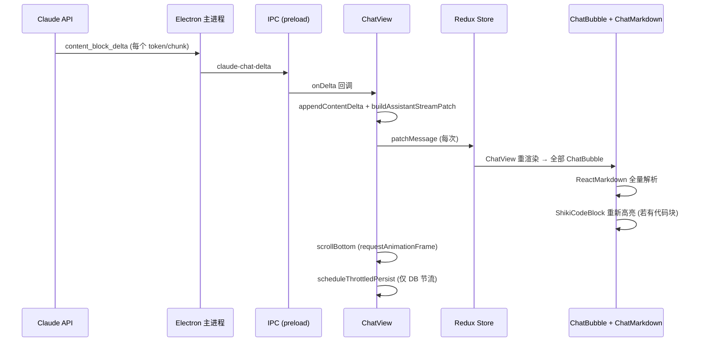
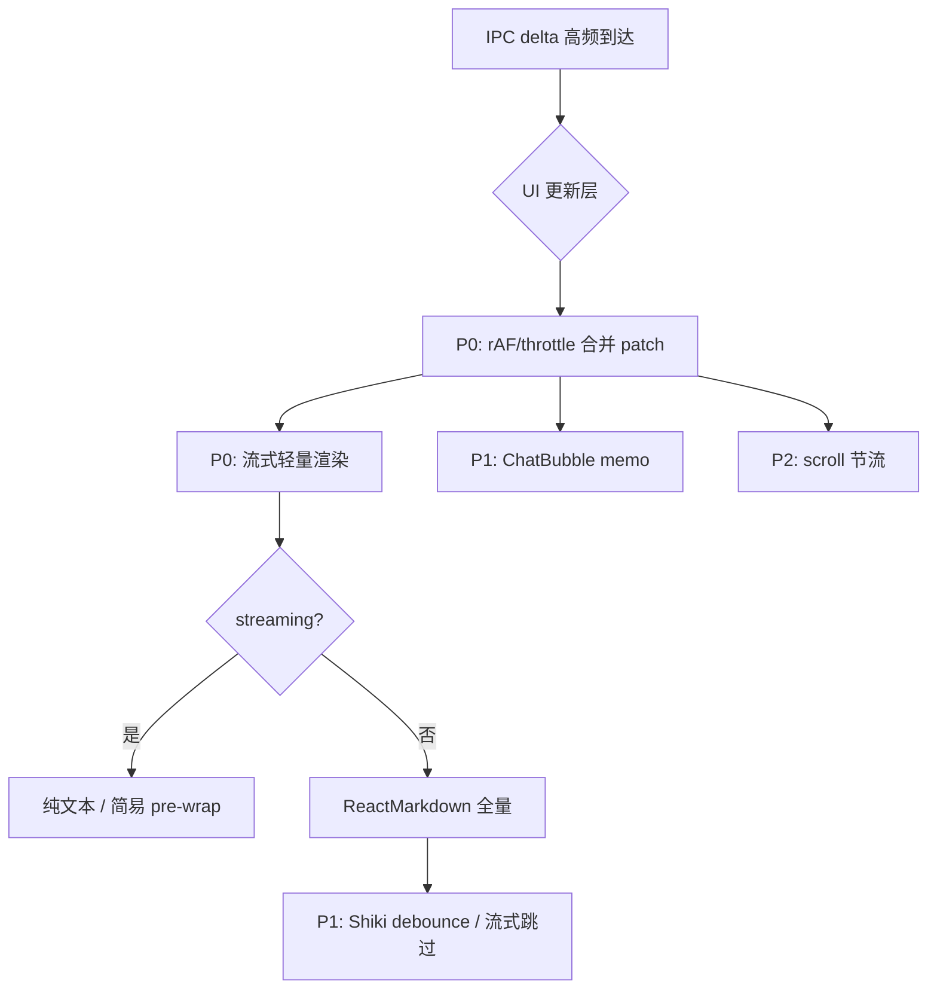

# 流式生成界面卡顿 — 原因分析与优化方案

| 字段 | 内容 |
|------|------|
| 文档版本 | v1.0 |
| 状态 | 分析完成，待实施 |
| 分析日期 | 2026-05-24 |
| 分析范围 | 大模型流式输出期间渲染进程 UI 交互卡顿 |
| 相关模块 | `ChatView`、`chatRunnerService`、`ChatBubble`、`ChatMarkdown`、`ShikiCodeBlock` |

---

## 1. 执行摘要

用户在 SpaceAssistant 中发起对话、大模型开始流式生成时，**整个界面（不仅是正在输出的气泡）交互明显卡顿**，包括滚动迟滞、输入区响应变慢等。

经代码链路分析，结论如下：

- **根因不在 API 延迟或 IPC 本身**，而在于渲染进程对 **每个 token/chunk 都执行一次完整的 UI 更新链**。
- **DB 持久化已做 2 秒节流**，但 **Redux 状态与 React 渲染未做任何 batch / throttle**，形成「写盘节流、画屏不节流」的不对称设计。
- 叠加 **全量 Markdown 解析**、**流式代码块 Shiki 高亮**、**整列表无隔离重渲染**，在长回复、含代码、历史消息多、开启 Thinking / 工具模式时卡顿显著放大。

**建议优化方向（按优先级）**：

1. **P0**：流式 UI 更新节流 / rAF 合并（50–100ms）
2. **P0**：流式期间轻量文本渲染，完成后一次性 Markdown
3. **P1**：`ChatBubble` 隔离重渲染（`React.memo` + 细粒度 selector）
4. **P1**：Shiki 高亮 debounce，流式代码块跳过高亮
5. **P2**：滚动节流、Patch  payload 瘦身、工具事件合并

---

## 2. 数据流概览

### 2.1 端到端链路



### 2.2 涉及的关键文件

| 层级 | 文件 | 职责 |
|------|------|------|
| 主进程 | `electron/claudeStreamHandlers.ts` | 纯聊天流：逐 `text_delta` 发送 `claude-chat-delta` |
| 主进程 | `electron/toolChatLoop.ts` | 工具循环流：同样逐 delta 发送 IPC |
| 预加载 | `electron/preload.ts` | `claudeChatOnDelta` 等 IPC 订阅 |
| 渲染 | `src/renderer/services/chatStreamService.ts` | 封装流式订阅与 requestId 过滤 |
| 渲染 | `src/renderer/components/Chat/ChatView.tsx` | onDelta → patch Redux + scroll |
| 渲染 | `src/renderer/services/chatRunnerService.ts` | `routeStreamPatchMessage`：同步 Redux + 节流 DB |
| 渲染 | `src/renderer/components/Chat/ChatBubble.tsx` | 消息气泡与活动时间线 |
| 渲染 | `src/renderer/components/Chat/ChatMarkdown.tsx` | react-markdown 渲染 |
| 渲染 | `src/renderer/components/Chat/ShikiCodeBlock.tsx` | Shiki 代码高亮 |

### 2.3 两种聊天路径

| 路径 | 触发条件 | 流式更新方式 |
|------|----------|--------------|
| 纯聊天 | `cfg.tools.enabled === false` 或无可用工具 | `runClaudeChatStream` → `onDelta` |
| 工具聊天 | 工具已启用 | `claudeChatCreateWithTools` 阻塞 await，期间通过 `claudeChatOnDelta` 订阅增量 |

两条路径在 `ChatView.tsx` 中的 **onDelta 处理逻辑一致**，卡顿机制相同。

---

## 3. 根因分析（按影响排序）

### 3.1 【P0】UI 更新无节流 — 每个 token 触发完整更新链

`routeStreamPatchMessage` 注释为「同步 live/Redux，并按节流写入 DB」：

```typescript
// src/renderer/services/chatRunnerService.ts
/** 流式增量：同步 live/Redux，并按节流写入 DB（阶段 3） */
export function routeStreamPatchMessage(sessionId: string, messageId: string, patch: Partial<Message>): void {
  routePatchMessage(sessionId, messageId, patch)      // ← 每次 delta 立即 dispatch
  scheduleThrottledPersist(sessionId, messageId, patch) // ← 仅 DB 写入节流 2s
}
```

`routePatchMessage` 在当前查看会话时会 **立即** `dispatch(patchMessage(...))`：

```typescript
export function routePatchMessage(sessionId: string, messageId: string, patch: Partial<Message>): void {
  patchLiveMessage(sessionId, messageId, patch)
  if (store.getState().chat.currentSessionId === sessionId) {
    store.dispatch(patchMessage({ id: messageId, patch }))
  }
}
```

`ChatView` 中每次 delta 的处理：

```typescript
// src/renderer/components/Chat/ChatView.tsx (纯聊天 & 工具聊天路径相同)
onDelta: (t) => {
  // ... appendContentDelta ...
  routeStreamPatchMessage(runSessionId, assistantId, buildAssistantStreamPatch(thinkingState, contentState))
  scrollBottom()
}
```

**量化影响**：

- Claude 流式输出常见 **几十～上百次/秒** 的 chunk（取决于网关与模型）。
- 每次 chunk → 1 次 Redux dispatch → 1 次 React 协调 → N 个 ChatBubble 重渲染。
- 这是卡顿的 **第一根因**。

**设计不对称**：持久化层已意识到高频写入问题（`STREAM_PERSIST_MS = 2000`），UI 层未做对应优化。

---

### 3.2 【P0】每次更新全量 Markdown 解析 — 成本随内容长度线性增长

流式正文通过 `ChatMarkdown` 渲染：

```typescript
// src/renderer/components/Chat/ChatMarkdown.tsx
export function ChatMarkdown({ content }: Props) {
  return (
    <div className="sa-prose chat-md-assistant">
      <ReactMarkdown
        remarkPlugins={[remarkGfm]}
        rehypePlugins={[[rehypeExternalLinks, { target: '_blank', rel: ['noopener', 'noreferrer'] }]]}
        components={{ /* pre/code → ShikiCodeBlock */ }}
      >
        {content}
      </ReactMarkdown>
    </div>
  )
}
```

**问题**：

- 每来一个 token，`content` 字符串变长，`ReactMarkdown` 对 **整段内容** 重新走 remark → rehype → React 元素树。
- 含 GFM 表格、列表、链接时，单次解析可达数毫秒～数十毫秒。
- 与 3.1 的高频更新相乘，主线程极易被占满。

**现象关联**：回复越长、Markdown 结构越复杂，卡顿越明显（纯短文本相对较轻）。

---

### 3.3 【P0】代码块流式输出时 Shiki 反复高亮

代码块使用 `ShikiCodeBlock`，`code` prop 变化即重新高亮：

```typescript
// src/renderer/components/Chat/ShikiCodeBlock.tsx
useEffect(() => {
  let cancelled = false
  void highlightCode(code, language, resolved).then((result) => {
    if (!cancelled) setHtml(result)
  })
  return () => { cancelled = true }
}, [code, language, resolved])
```

**问题**：

- 流式输出 ```python ... ``` 代码块时，**每个字符**都可能触发 `highlighter.codeToHtml()`。
- Shiki 单次不慢，但高频调用 + 与 Markdown 解析叠加，代码场景卡顿 **显著重于纯文本**。

---

### 3.4 【P1】整页消息列表无渲染隔离

`ChatView` 订阅整个 `messages` 数组，直接 map 渲染，**无 `React.memo`、无按消息 id 的细粒度 selector**：

```typescript
// src/renderer/components/Chat/ChatView.tsx
messages.map((m) => (
  <ChatBubble
    key={m.id}
    message={m}
    toolsInteractive={m.id === streamingAssistantId ? toolsInteractive : undefined}
    focusToolUseId={m.id === streamingAssistantId ? confirmFocusToolUseId : undefined}
    onOpenFile={handleOpenFile}
  />
))
```

**问题**：

- `patchMessage` 修改单条消息后，Immer 产生新 state，`useTypedSelector((s) => s.chat.messages)` 触发 `ChatView` 重渲染。
- 父组件重渲染 → **所有** `ChatBubble` 子组件重跑（未 memo）。
- 每条 assistant 消息还会执行 `buildAssistantActivityTimeline`、工具卡片渲染等。

**放大效应**：历史消息越多，**每次 delta 的固定开销越大**（即使只有最后一条在变）。

---

### 3.5 【P1】每次 delta 强制滚底 — 布局抖动

```typescript
// src/renderer/components/Chat/ChatView.tsx
const scrollBottom = () => {
  requestAnimationFrame(() => {
    const el = scrollRef.current
    if (el) el.scrollTop = el.scrollHeight
  })
}
```

每个 token 都调用 `scrollBottom()`：

- 读取 `scrollHeight`（触发布局计算）
- 写入 `scrollTop`
- delta 密集时同一帧可能排队多个 rAF

与 Markdown 解析争抢主线程，加重「滚不动、输入迟滞」的体感。

---

### 3.6 【P2】次要放大因素

| 因素 | 位置 | 说明 |
|------|------|------|
| Patch 携带完整状态 | `buildAssistantStreamPatch` | 每次带完整 `content` + `contentSegments` 数组拷贝 |
| segments 数组拷贝 | `appendContentDelta` / `appendThinkingDelta` | 每次 `[...state.segments]` |
| Extended Thinking | `onThinkingDelta` | 与正文 delta 同等频率更新 Redux + 渲染 |
| 思考块默认展开 | `ThinkingBlock` | `active` 时展示全文，DOM 节点随 token 增长 |
| 工具模式 | `createToolChatController` | 工具状态变化 `flush()` → `routePatchMessage`，叠加文本流 |
| 活动时间线排序 | `buildAssistantActivityTimeline` | 每条 assistant 气泡每次 render 重算 |
| 持久化定时器 | `scheduleThrottledPersist` | 每次 delta `clearTimeout` + `setTimeout` + 对象 merge |
| 输入区间接影响 | `MessageInput` 为 `ChatView` 子组件 | 父组件高频重渲染会连带重渲染 composer |
| IPC 粒度 | 主进程 | 每个 `text_delta` 独立 IPC，无 batch（影响相对较小） |

---

## 4. 场景差异矩阵

| 场景 | 预期卡顿 | 主要因素 |
|------|----------|----------|
| 短纯文本回复 | 较轻 | 高频 Redux 更新，Markdown 尚轻 |
| 长文 + 列表/表格/GFM | 明显 | Markdown 解析成本 ↑ |
| 含代码块（尤其长代码） | 很重 | Shiki 高频重算 |
| 开启 Extended Thinking | 偏重 | 双倍 delta 流 + 大段思考 DOM |
| 工具模式（Agent / Plan） | 偏重 | 文本流 + 工具卡片 + timeline |
| 历史消息很多（50+） | 更重 | 全列表每次重渲染 |

---

## 5. 验证方法（实施前基线）

不改代码即可在 Electron DevTools 中采集证据：

### 5.1 Performance 面板

1. 打开 DevTools → Performance，录制一次完整流式生成。
2. 观察 Main Thread 是否大量 `Scripting`。
3. 展开火焰图，关注调用栈是否指向：
   - `react-markdown` / `remark` / `rehype`
   - `shiki` / `codeToHtml`
   - React `reconcileChildFibers`

### 5.2 React DevTools Profiler

1. 录制流式生成过程。
2. 确认 `ChatView` 是否 **高频 commit**（预期：每秒数十次）。
3. 确认 **非 streaming 的历史 `ChatBubble` 是否跟着 commit**（预期：是，且无 memo）。

### 5.3 Redux DevTools

- 流式期间 `patchMessage` action 频率（预期：与 token chunk 频率一致，每秒几十次）。

### 5.4 对比实验

| 对比项 | 操作 | 预期差异 |
|--------|------|----------|
| 纯文本 vs 代码 | 让模型输出大段 Python | 含代码明显更卡 |
| 短历史 vs 长历史 | 同 prompt，5 条 vs 50 条历史 | 长历史更卡 |
| 关 Thinking vs 开 | 设置中切换 | 开 Thinking 更卡 |

记录 FPS、单次 commit 耗时、主线程 Long Task（>50ms）数量作为优化前后对比基线。

---

## 6. 优化方案

### 6.1 方案总览



| 优先级 | 方案 | 预期收益 | 改动面 | 风险 |
|--------|------|----------|--------|------|
| P0 | UI patch 节流 / rAF batch | 极高 | `chatRunnerService` 或 `ChatView` | 流式视觉略「跳帧」，可接受 |
| P0 | 流式期间跳过 Markdown | 极高 | `ChatBubble` / `ChatMarkdown` | 流式阶段格式简陋，完成后恢复 |
| P1 | ChatBubble `React.memo` | 高（长会话） | `ChatBubble.tsx`、`ChatView.tsx` | 需注意 props 稳定性 |
| P1 | Shiki 流式 debounce | 高（代码场景） | `ShikiCodeBlock.tsx` | 代码块闪烁/延迟高亮 |
| P2 | scrollBottom 节流 | 中 | `ChatView.tsx` | 滚底略滞后 |
| P2 | 工具 flush 合并 | 中（工具场景） | `chatToolSessionService.ts` | 工具 UI 更新略延迟 |
| P3 | IPC 主进程 batch | 低～中 | `claudeStreamHandlers.ts` 等 | 需测延迟体感 |

---

### 6.2 【P0】流式 UI 更新节流 / rAF 合并

**目标**：将 Redux dispatch 频率从「每 token」降到「每帧或每 50–100ms」。

**思路 A — 在 `routeStreamPatchMessage` 层统一节流（推荐）**：

```typescript
// 伪代码 — chatRunnerService.ts
const pendingUiPatches = new Map<string, Partial<Message>>()
const uiFlushScheduled = new Set<string>()

function scheduleUiFlush(sessionId: string, messageId: string) {
  const key = persistKey(sessionId, messageId)
  if (uiFlushScheduled.has(key)) return
  uiFlushScheduled.add(key)

  requestAnimationFrame(() => {
    uiFlushScheduled.delete(key)
    const patch = pendingUiPatches.get(key)
    pendingUiPatches.delete(key)
    if (patch) routePatchMessage(sessionId, messageId, patch)
  })
}

export function routeStreamPatchMessage(sessionId, messageId, patch) {
  const key = persistKey(sessionId, messageId)
  const prev = pendingUiPatches.get(key) ?? {}
  pendingUiPatches.set(key, { ...prev, ...patch })
  scheduleUiFlush(sessionId, messageId)
  scheduleThrottledPersist(sessionId, messageId, patch) // DB 逻辑不变
}
```

**思路 B — 在 `ChatView` onDelta 内节流**：仅影响单组件，但纯聊天与工具聊天有两处订阅，易遗漏；不如服务层统一。

**参数建议**：

- 默认：`requestAnimationFrame`（~16ms，与显示器刷新对齐）
- 低配机器可选：`throttle(50ms)` 或 `throttle(100ms)`

**注意**：

- `onDone` / 取消 / 错误时必须 **立即 flush** 剩余 pending patch。
- 后台非当前查看会话：可只写 `liveBySession`，不写 Redux（当前 `routePatchMessage` 已区分）。

---

### 6.3 【P0】流式期间轻量渲染，完成后 Markdown

**目标**：流式阶段避免 `ReactMarkdown` 全量解析。

**实现要点**：

```typescript
// ChatBubble.tsx 伪代码
const activeText = streaming && seg.endTime === undefined
const body = activeText && !seg.content ? '…' : seg.content

{activeText ? (
  <div className="chat-bubble-streaming chat-md-assistant">
    <pre className="chat-stream-plain">{body}</pre>  {/* white-space: pre-wrap */}
  </div>
) : (
  <ChatMarkdown content={body} />
)}
```

或使用极简组件 `StreamingPlainText`：

- `white-space: pre-wrap`
- 可选：仅做基础 HTML escape，不做 Markdown
- 流式结束后 `status === 'completed'` 再切 `ChatMarkdown`

**CSS 补充**（`styles.css`）：

```css
.chat-stream-plain {
  margin: 0;
  white-space: pre-wrap;
  word-break: break-word;
  font-family: inherit;
}
```

**收益**：消除流式阶段最大的 CPU 热点（remark/rehype 解析）。

**体验权衡**：流式时看不到加粗/列表/代码高亮，完成后一次性呈现格式化内容（与 ChatGPT、Cursor 等常见产品一致）。

---

### 6.4 【P1】ChatBubble 渲染隔离

**目标**：仅 streaming 消息重渲染，历史消息跳过。

**步骤**：

1. 用 `React.memo` 包裹 `ChatBubble`，自定义比较：

```typescript
export const ChatBubble = React.memo(function ChatBubble(props: Props) {
  // ...
}, (prev, next) => {
  return (
    prev.message === next.message &&
    prev.focusToolUseId === next.focusToolUseId &&
    prev.toolsInteractive === next.toolsInteractive &&
    prev.onOpenFile === next.onOpenFile
  )
})
```

2. **`toolsInteractive` 必须稳定**：当前每 render 新建对象，需 `useMemo`：

```typescript
const toolsInteractive = useMemo(
  () =>
    cfg?.tools.enabled && streamingRequestId && streamingAssistantId
      ? { requestId: streamingRequestId, /* ... */ }
      : undefined,
  [cfg?.tools.enabled, cfg?.tools.confirmMode, streamingRequestId, streamingAssistantId, onToolConfirm, onToolCancel]
)
```

3. **进阶**：消息列表改为按 id 订阅（react-redux `shallowEqual` 或自定义 hook），避免 `messages` 数组引用变化导致 `ChatView` 全量 diff。

**收益**：长会话下每次 delta 从 O(N) 气泡渲染降到 O(1)。

---

### 6.5 【P1】Shiki 流式 debounce / 跳过

**目标**：代码块在流式期间不高亮或延迟高亮。

**方案 A — streaming 标志跳过高亮**：

```typescript
// ShikiCodeBlock 增加 prop: deferHighlight?: boolean
useEffect(() => {
  if (deferHighlight) return
  // ... highlightCode ...
}, [code, language, resolved, deferHighlight])
```

`ChatBubble` 在 `streaming && activeText` 时对 code block 传 `deferHighlight`，或直接流式阶段不识别 code fence（配合 6.3 纯文本）。

**方案 B — debounce 300ms**：

```typescript
useEffect(() => {
  const t = setTimeout(() => { void highlightCode(...) }, 300)
  return () => clearTimeout(t)
}, [code, language, resolved])
```

**方案 C — 完成后统一高亮**：与 6.3 一致，流式 plain text，完成后 Markdown + Shiki 一次。

推荐 **6.3 + 方案 C** 组合，实现最简单、收益最大。

---

### 6.6 【P2】scrollBottom 节流

**目标**：减少布局读写频率。

```typescript
const scrollBottomThrottled = useMemo(
  () =>
    throttle(() => {
      requestAnimationFrame(() => {
        const el = scrollRef.current
        if (el) el.scrollTop = el.scrollHeight
      })
    }, 100),
  []
)
```

或使用 **「仅在用户已贴底时自动滚」** 策略：用户手动上滚查看历史时不强制拉回底部（改善交互，不仅性能）。

---

### 6.7 【P2】其他优化

| 项 | 说明 |
|----|------|
| Patch 瘦身 | 流式 patch 仅 `{ content }` 或 `{ content, contentSegments }` 必要字段；避免重复传 `thinking` 若未变化 |
| 工具 flush 合并 | `createToolChatController.flush` 用 rAF 合并多次工具状态变更 |
| IPC batch（可选） | 主进程 16ms 内合并 text delta 再 send；降低 IPC 次数，收益次于 UI 层优化 |
| `ThinkingBlock` | 流式思考可用 plain text；折叠态减少 DOM |
| 虚拟列表（远期） | 消息数 >100 时考虑 `react-window`；当前优先 memo 即可 |

---

## 7. 推荐实施顺序

### 阶段 1 — 快速见效（1～2 天）

1. `routeStreamPatchMessage` 增加 rAF UI flush
2. `ChatBubble` 流式阶段改用 plain text，完成后 `ChatMarkdown`
3. `scrollBottom` 节流至 100ms
4. 用 Performance / Profiler 验证 Long Task 下降

**预期**：纯文本与长文场景卡顿显著缓解。

### 阶段 2 — 长会话与代码（1～2 天）

1. `ChatBubble` + `toolsInteractive` useMemo
2. 流式代码块禁用 Shiki（完成后高亮）
3. onDone / cancel / error 路径 flush pending UI patch

**预期**：多轮对话、Agent 写代码场景可接受。

### 阶段 3 —  polish（可选）

1. 用户上滚时暂停 auto-scroll
2. 工具事件 batch
3. 主进程 IPC batch（若仍有瓶颈）

---

## 8. 验收标准

| 指标 | 优化前（基线） | 目标 |
|------|----------------|------|
| Redux `patchMessage` 频率 | ~token 频率（50+/s） | ≤10/s（rAF）或 ≤20/s（50ms throttle） |
| Profiler：单次 commit 耗时（50 条历史） | 待测 | 仅 1 个 ChatBubble commit |
| Long Task（>50ms）占比 | 待测 | 流式期间下降 70%+ |
| 流式纯文本 FPS | 待测 | ≥30（理想 60） |
| 含大代码块流式 | 明显卡顿 | 可输入、可滚动，无明显冻结 |
| 功能回归 | — | 完成后 Markdown/高亮正确；切会话不丢增量；取消/出错状态正确 |

---

## 9. 非目标与风险

### 9.1 非目标

- 不改变主进程 API 调用逻辑或工具执行语义。
- 不在本阶段引入 Web Worker Markdown（复杂度高，阶段 2 后若仍不足再评估）。
- 不改为虚拟列表（除非消息量极大且阶段 2 仍不够）。

### 9.2 风险与缓解

| 风险 | 缓解 |
|------|------|
| 节流导致切走会话时 Redux 落后 live | 切回会话时 `mergeDbAndLive` 已从 live 合并；切走期间只写 live 即可 |
| 流式 plain text 体验降级 | 仅 streaming 阶段；完成后立即 Markdown |
| memo 比较遗漏导致 UI 不更新 | 仅比较 `message` 引用；Immer 保证变更消息新引用 |
| onDone 前最后一帧 patch 丢失 | finish / error / cancel 强制 `flushUiPatch` |

---

## 10. 相关文档

- [多会话并行执行 — 改造技术方案](./multi-session-parallel-execution.md)（`liveBySession` / `routeStreamPatchMessage` 设计背景）
- [工具机制分析](../analysis/tools_mechanism_analysis.md)（工具模式 IPC 与展示流程）
- [聊天消息 UI 需求](../requirement/chat-message-ui-requirement.md)（流式展示产品预期）

---

## 11. 附录：关键代码索引

| 符号 | 路径 |
|------|------|
| 流式 onDelta | `src/renderer/components/Chat/ChatView.tsx` L524–538, L361–379 |
| UI + DB 路由 | `src/renderer/services/chatRunnerService.ts` L71–106 |
| Redux patch | `src/renderer/store/chatSlice.ts` L62–65 |
| Markdown 渲染 | `src/renderer/components/Chat/ChatMarkdown.tsx` |
| Shiki 高亮 | `src/renderer/components/Chat/ShikiCodeBlock.tsx` |
| 主进程 delta | `electron/claudeStreamHandlers.ts` L370–382 |
| 工具循环 delta | `electron/toolChatLoop.ts` L342–356 |
| Stream patch 构建 | `src/shared/assistantStreamPatch.ts` |
| Content 增量 | `src/shared/contentSegments.ts` L13–23 |
