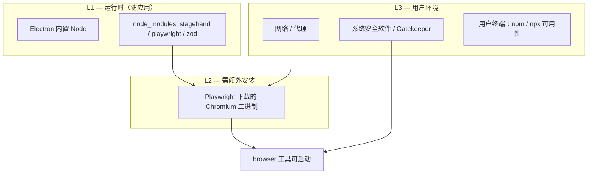

# 浏览器工具 Playwright / Chromium 依赖检测与安装引导 — 产品需求

**版本：** 1.1  
**日期：** 2026-05-31  
**状态：** 部分已实现  

**关联文档：**
- [web-browser-tools-requirement.md](./web-browser-tools-requirement.md)（浏览器工具总需求）
- [settings-requirement.md](./settings-requirement.md)（设置 Tab 结构）
- [tools-requirement.md](./tools-requirement.md)（内置工具与错误文案）
- **[browser-setup-skill-requirement.md](./browser-setup-skill-requirement.md)** — §8 Skill + Agent 对话式修复、设置页一键引导（**待开发，合并至该文档一并实现**）

**变更记录：**

| 版本 | 日期 | 说明 |
|------|------|------|
| 1.0 | 2026-05-28 | 初稿 |
| 1.1 | 2026-05-31 | 同步代码实现状态；§8 Skill/对话引导与设置页精简迁移至 browser-setup-skill-requirement.md |

**参考实现（现状）：**
- `electron/browser/browserDependencyDetect.ts` — 检测逻辑与 `BrowserDetectResult`
- `electron/browser/stagehandService.ts` — `detectDependencies()`
- `electron/browser/playwrightBrowserHost.ts` — Chromium 路径解析（Win / macOS / Linux）
- `src/renderer/components/Config/BrowserSettingsTab.tsx` — **工具 → 网络访问**子 Tab（非独立「浏览器」Tab）
- `src/renderer/components/Browser/BrowserSetupGuide.tsx` — 设置页与聊天内分步引导 UI
- `electron/browser/browserUserErrors.ts`、`electron/tools/toolUserErrors.ts` — 运行时错误映射
- `electron/browser/browserDependencyRecovery.ts` — 恢复 Skill 名 `browser-setup-guide`（**Skill 本体未实现**）

---

## 目录

1. [概述](#1-概述)
2. [实现状态总览](#2-实现状态总览)
3. [现状与差距](#3-现状与差距)
4. [依赖模型与失败场景](#4-依赖模型与失败场景)
5. [目标与非目标](#5-目标与非目标)
6. [用户故事](#6-用户故事)
7. [检测能力需求](#7-检测能力需求)
8. [提示与引导（设置页）](#8-提示与引导设置页)
9. [提示与引导（对话与工具）](#9-提示与引导对话与工具)
10. [跨平台差异（Windows / macOS）](#10-跨平台差异windows--macos)
11. [可选：应用内一键安装](#11-可选应用内一键安装)
12. [数据模型与 IPC](#12-数据模型与-ipc)
13. [文案与可访问性](#13-文案与可访问性)
14. [非功能需求](#14-非功能需求)
15. [验收标准](#15-验收标准)
16. [发布阶段建议](#16-发布阶段建议)
17. [待解决问题](#17-待解决问题)

---

## 1. 概述

### 1.1 背景

SpaceAssistant 的**网页访问工具**（内置 `browser`）基于 **Stagehand + Playwright + 本机 Chromium**。npm 包（`@browserbasehq/stagehand`、`playwright`、`zod`）可随应用安装包打入 `node_modules`，但 **Chromium 浏览器二进制默认不会随 `npm install` 自动下载**——需用户或安装流程额外执行：

```bash
npx playwright install chromium
```

在 Windows 与 macOS 上，常见问题是：用户已启用浏览器工具，但首次调用 `browser` 时出现 `Executable doesn't exist`、仅有 `headless_shell`、CDP 连接失败等。当前产品已有**基础检测**与**复制命令**能力，但对**打包用户 vs 开发者**、**工作目录**、**下载进度**、**系统安全策略**等场景引导不足，错误信息也未统一指向「设置 → 浏览器」。

本需求专门细化：**如何在依赖缺失时合理提示，并引导用户完成安装与验证**，且兼顾 **Windows 与 macOS**（Linux 作为第三平台沿用同一套逻辑，不单独展开 UI）。

### 1.2 产品价值

| 价值 | 说明 |
|------|------|
| 降低启用门槛 | 用户无需阅读 Playwright 官方文档即可知道「缺什么、在哪执行、执行什么」 |
| 减少无效对话 | Agent 调用 `browser` 失败时，**在对话中直接引导安装**，用户无需离开聊天界面 |
| 跨平台一致 | Win / Mac 使用同一套状态机，仅命令外壳与路径说明不同 |
| 与飞书 CLI 引导对齐 | 复用「检测 → 分步引导 → 重新检测」的成熟模式（见 feishu-integration） |

---

## 2. 实现状态总览

**结论（2026-05-31）：** MVP 中 **§7 检测**、**§9 设置页静态引导（当前形态）**、**§10 跨平台文案**、**§12 结构化错误与安全 IPC** 已在代码中落地；**§9「对话与工具」中的 `browser-setup-guide` Skill + Agent 对话式修复** 以及 **设置页改为一键跳转聊天** 尚未实现，需求已合并至 **[browser-setup-skill-requirement.md](./browser-setup-skill-requirement.md)**，与该文档一并开发。

| 章节 | 状态 | 说明 |
|------|------|------|
| §7 检测能力 | ✅ 已实现 | `browser:detect`、`BrowserDetectResult`、`browserDependencyDetect.ts` + 单测 |
| §8 设置页引导 | ⚠️ 临时形态 | 完整 `BrowserSetupGuide` 在 **工具 → 网络访问**；将按 browser-setup-skill **§8 精简** |
| §9 对话与工具 | ⚠️ 部分实现 | 结构化 `dependencyRecovery`、静态引导卡片、`toolChatLoop` 改写 tool_result ✅；**Skill 激活、Agent 对话、`browser_detect`** ❌ → browser-setup-skill |
| §10 跨平台 | ✅ 已实现 | 平台 troubleshooting、`browser:open-terminal` Win/Mac |
| §11 应用内安装 | ❌ 未实现 | Phase 2（P1） |
| §12 IPC | ✅ 已实现 | `browser:detect`、`browser:open-terminal`（路径白名单） |

**开发指引：** 新功能开发请优先阅读 [browser-setup-skill-requirement.md](./browser-setup-skill-requirement.md)；本文档保留依赖模型、检测规则与历史验收基线。

---

## 3. 现状与差距

### 3.1 已实现

| 能力 | 位置 | 说明 |
|------|------|------|
| 依赖检测 IPC | `browser:detect` → `detectBrowserDependencies()` | `primaryFailure`、`recommendedCwd`、`installContext`、`canInitialize` |
| 设置页展示 | `BrowserSettingsTab`（工具 → 网络访问） | 自动检测、分步引导、复制、故障排除 |
| 聊天内静态卡片 | `BrowserDependencyGuideCard` + `BrowserSetupGuide` | 工具失败时展示引导（**临时方案**） |
| 运行时结构化错误 | `browserExecutor` → `dependencyRecovery` | `errorCode`、`detectResult`、`installCommand` |
| toolChatLoop 分支 | `resolveDependencyRecoverySkill` | 改写 tool_result（**未激活 Skill**） |
| 打开终端 IPC | `browser:open-terminal` | 白名单路径，`openTerminalAtCwd` |
| 运行时错误映射 | `browserUserErrors` / `toolUserErrors` | 用户向文案，含安装提示 |
| 平台路径 | `resolveFullChromiumExecutable` | Win / macOS / Linux |

### 3.2 差距（本需求要补齐）

| # | 差距 | 状态 |
|---|------|------|
| G1 | 检测未区分 npm 包 vs Chromium | ✅ 已解决 |
| G2 | 未告知在哪个目录执行 npx | ✅ 已解决（`recommendedCwd`） |
| G3 | 启用 browser 开关时不阻断 | ⚠️ 按设计不阻断；设置页 Alert 提示 |
| G4 | 无下载进度/网络失败专门文案 | ⚠️ 故障排除折叠有说明；无应用内进度 |
| G5 | Gatekeeper / Defender 说明 | ✅ 故障排除已含 |
| G6 | 工具失败无对话内引导 | ⚠️ 有静态卡片；**Agent+Skill 待** browser-setup-skill |
| G7 | 「项目目录」开发者用语 | ✅ 已改为源码根目录/应用安装目录 |
| G8 | npm/npx PATH 检测 | 需求已删除（DET-08） |
| G9 | 无依赖恢复 Skill | ⚠️ 部分；**合并文档待开发** |

---

## 4. 依赖模型与失败场景

### 4.1 依赖分层



| 层级 | 组件 | 典型安装方式 | 检测要点 |
|------|------|--------------|----------|
| L1 | `@browserbasehq/stagehand` | 应用 `dependencies` / 用户 `npm install` | `require` 包与版本 |
| L1 | `playwright` npm 包 | 同上 | `require.resolve('playwright')` |
| L1 | Node 主版本 | Electron 捆绑 | `process.version`，满足 Stagehand 要求（当前 ≥ 20） |
| L2 | Chromium 可执行文件 | `npx playwright install chromium` | 解析路径，**不得**落在 `headless_shell` |
| L3 | 网络、杀毒、Gatekeeper | 用户环境 | 安装/启动失败时的分类提示 |

### 4.2 失败场景分类

| 场景 ID | 现象 | 根因 | 用户应执行的动作 |
|---------|------|------|------------------|
| F1 | `未安装 playwright` / Stagehand | L1 包缺失（多见于源码 clone 未 install） | 在**应用资源目录**执行 `npm install`（仅开发/便携场景） |
| F2 | `Executable doesn't exist` | L2 未下载 Chromium | `npx playwright install chromium` |
| F3 | 仅有 headless_shell | 安装了错误变体或未装完整 chromium | 同上，必要时 `npx playwright install --force chromium` |
| F4 | CDP 连接失败 / Target closed | 进程被系统杀掉、端口冲突、不完整 Chromium | 重启应用 → 重装 Chromium → 检查安全软件 |
| F5 | `playwright install` 超时或 ECONNRESET | L3 网络/代理 | 配置代理、`PLAYWRIGHT_DOWNLOAD_HOST`（高级）或离线包（OQ） |
| F6 | macOS「无法打开 Chromium」 | Gatekeeper 隔离 | 系统设置允许 / `xattr` 说明（文档链接） |
| F7 | Windows 杀毒隔离 chrome.exe | Defender SmartScreen | 添加排除项或允许运行 |
| F8 | 用户在错误目录执行 npx | 使用了无 `playwright` 的目录 | 在设置页展示的**推荐工作目录**执行 |

---

## 5. 目标与非目标

### 5.1 目标

| # | 目标 | 优先级 |
|---|------|--------|
| G1 | 细化 `browser:detect` 结果，明确 **chromiumReady**、**failureCode**、**recommendedCwd** | P0 |
| G2 | 设置页按失败类型展示**分步引导**（非一律两条 npm 命令） | P0 |
| G3 | 启用浏览器工具前/时提示依赖未就绪，并提供「去安装引导」 | P0 |
| G4 | Win / Mac 命令与说明**分支展示**（终端类型、路径示例） | P0 |
| G5 | 工具/初始化失败时，在对话中引导安装（Skill + 引导卡片），无需离开聊天界面 | P0 |
| G6 | 安装完成后「重新检测」一键验证，通过后方可显示「可初始化：是」 | P0 |
| P1 | 应用内触发 `playwright install chromium` 并展示进度（见 §10） | P1 |
| P1 | 检测 npm/npx 是否可用于「在外部终端安装」 | P1 |

### 5.2 非目标

| 非目标 | 说明 |
|--------|------|
| 安装包内置 Chromium | 体积与更新策略另立 OQ；MVP 仍以下载为主 |
| 自动配置企业代理 | 仅文档级说明环境变量 |
| Linux 专属 UI | 逻辑复用，不单独设计安装向导 |
| Browserbase 云端浏览器 | 属 web-browser-tools Phase 2 |

---

## 6. 用户故事

### US-01：打包应用用户首次启用浏览器

**作为** 从官网安装 `.exe` / `.dmg` 的用户，**当** 我在设置中打开「启用浏览器工具」时，**我希望** 立即看到 Chromium 是否已就绪及一键复制的安装命令（含正确目录说明），**以便** 不必搜索文档。

### US-02：开发者 clone 仓库

**作为** 执行 `npm install` 的开发者，**当** 我忘记 `playwright install` 时，**我希望** 检测明确指出「缺 Chromium」而非笼统「Playwright 未安装」，**以便** 只执行必要步骤。

### US-03：聊天中工具失败 — 对话内引导安装

**作为** 用户，**当** Agent 调用 `browser` 因缺少 Chromium 失败时，**我希望** Agent 在对话中**直接引导我完成安装**（展示检测结果、分步命令、终端打开入口），**以便** 无需离开聊天界面即可修复并重试。

### US-06：依赖恢复 Skill 触发

**作为** 系统，**当** `browser` 工具因 Chromium 未安装等依赖缺失而失败时，**我希望** `toolChatLoop` 自动识别该错误码并触发 `browser-setup-guide` Skill，在对话中引导用户完成修复。

> **→ 完整规格与实现任务见 [browser-setup-skill-requirement.md](./browser-setup-skill-requirement.md)。** 当前仅实现 errorCode 识别与静态 UI 卡片。

### US-04：macOS 安全拦截

**作为** Mac 用户，**当** Chromium 已下载但首次启动被系统阻止时，**我希望** 看到 Gatekeeper 相关说明而非「请 reinstall playwright」，**以便** 快速放行。

### US-05：安装后确认

**作为** 用户，**当** 我在终端执行完安装命令后，**我希望** 在设置页点「重新检测」看到绿色通过状态，**以便** 确认可以关闭终端。

---

## 7. 检测能力需求

### 7.1 检测结果扩展（`BrowserDetectResult`）

在现有字段基础上扩展（向后兼容：旧客户端可忽略新字段）：

```typescript
export type BrowserDependencyFailureCode =
  | 'ok'
  | 'stagehand_missing'
  | 'playwright_missing'
  | 'chromium_missing'           // 包在，可执行文件不存在
  | 'chromium_headless_only'     // 仅有 headless_shell
  | 'chromium_path_unresolved'
  | 'node_version_low'
  | 'init_probe_failed'          // 试启动失败（码保留，MVP 不实现探针逻辑）

export type BrowserDetectResult = {
  stagehand: { installed: boolean; version?: string }
  playwright: { installed: boolean; browsers: string[] }
  /** Chromium 二进制是否满足 browser 启动要求 */
  chromium: {
    ready: boolean
    executableHint?: string  // 不含完整路径时可省略，或仅显示末级目录名
    revision?: string
  }
  node: { version: string; meetsRequirement: boolean }
  canInitialize: boolean
  /** 主失败码，用于 UI 分支；多项失败时按优先级取最高 */
  primaryFailure: BrowserDependencyFailureCode
  errors: string[]  // 面向用户的中文短句，不含绝对路径
  /** 推荐在此目录执行 npx playwright install chromium */
  recommendedCwd: string
  /** development | packaged */
  installContext: 'development' | 'packaged'
}
```

**`canInitialize` 定义（修订）：**

`stagehand.installed && playwright.installed && chromium.ready && node.meetsRequirement`

（不再仅凭 `browsers: ['chromium']` 字符串判断。）

### 7.2 检测逻辑需求

| ID | 需求 | 优先级 |
|----|------|--------|
| DET-01 | 保留现有 Stagehand / playwright 包检测 | P0 |
| DET-02 | 调用 `resolveFullChromiumExecutable`；若路径含 `headless_shell` → `chromium_headless_only` | P0 |
| DET-03 | 若 `executablePath` 指向文件但 `access` 失败 → `chromium_missing` | P0 |
| DET-04 | `recommendedCwd`：开发模式为**项目根**（含 `package.json` 的目录）；打包模式为 **`app.getAppPath()`** 或资源目录（与 Playwright 解析 `node_modules` 一致）。路径示例见下表。 | P0 |
| DET-05 | `installContext`：根据 `app.isPackaged` 或等价标志区分 | P0 |
| DET-05.1 | `recommendedCwd` 仅需**可读**（确认 `node_modules/playwright` 存在），写权限不是必要条件。Playwright 默认将 Chromium 下载到用户缓存目录，不写入 `recommendedCwd`。若用户遇到权限错误，引导检查 Playwright 缓存目录权限。 | P0 |

**`recommendedCwd` 路径示例：**

| 场景 | 平台 | 典型值 |
|------|------|--------|
| 开发模式 | 通用 | 项目根目录，如 `E:\Develop\SpaceAssistant` |
| 打包模式 Win | Windows | `%LOCALAPPDATA%\Programs\SpaceAssistant\resources\app.asar`（实际由 `app.getAppPath()` 返回） |
| 打包模式 Mac | macOS | `/Applications/SpaceAssistant.app/Contents/Resources/app.asar`（实际由 `app.getAppPath()` 返回） |

| DET-06 | `errors[]` 文案不得包含「项目目录」等仅适用于 clone 的表述；打包场景改为「应用安装目录」 | P0 |
| DET-07 | ~~探针启动~~（删除）：检测阶段能做到的最佳验证是路径存在 + 非 headless_shell + 文件可执行权限。运行时失败（安全软件、Gatekeeper）恰恰是启动后才能暴露的，探针无法覆盖。`init_probe_failed` 码保留供未来使用，MVP 不实现。 | 删除 |
| DET-08 | ~~检测主机 npx 可用性~~（删除）：Electron 内置 Node 与用户终端 Node 是两套独立环境，检测结果无实际引导意义——即便检测到 npx 不可用，文档也没有给出对应的用户动作路径。 | 删除 |

### 7.3 职责边界

| 层 | 职责 | 不负责 |
|----|------|--------|
| 主进程（`stagehandService`） | 检测、返回 `BrowserDetectResult`（含 `primaryFailure`、`recommendedCwd`、`installContext`） | 决定展示哪套引导 UI |
| 渲染进程（UI 组件） | 根据 `primaryFailure` 渲染对应引导卡片 | 做检测逻辑判断 |
| 编排层（`toolChatLoop`） | 识别 `errorCode`，决定是否触发恢复 Skill | 检测逻辑、UI 渲染 |

**原则：** `BrowserDetectResult` 包含渲染所需的全部信息，渲染进程只做「按 `primaryFailure` 查表渲染」，不做 `if/else` 检测分支。

1. `node_version_low`
2. `stagehand_missing` / `playwright_missing`
3. `chromium_headless_only` / `chromium_missing` / `chromium_path_unresolved`
4. `init_probe_failed`
5. `ok`

---

## 8. 提示与引导（设置页）

> **演进说明：** 本节描述的**完整分步引导 UI** 已在代码中实现（`BrowserSettingsTab` + `BrowserSetupGuide`）。后续将按 [browser-setup-skill-requirement.md §8](./browser-setup-skill-requirement.md#8-设置页精简替代原-7-分步-ui) **精简为状态摘要 +「在对话中修复」**，分步逻辑迁移至 Skill + Agent 对话。

### 8.1 入口与触发时机

| 时机 | 行为 |
|------|------|
| 打开设置 → 浏览器 Tab | 若 `browser.enabled === true`，自动执行一次检测（保持现状，可配置防抖） |
| 用户打开「启用浏览器工具」Switch 为 ON | **立即检测**；若 `!canInitialize`，Switch 下方展示 **Warning Alert**（Switch 可保持开启，但需显著警告；**P1 可选**：禁止开启直至检测通过） |
| 用户点击「检测依赖」/「重新检测」 | 刷新结果；检测中按钮 loading |

### 8.2 状态展示（信息架构）

```
┌─ 浏览器工具 ─────────────────────────────────────────┐
│ [i] Stagehand + Playwright Chromium 说明            │
│ [Switch] 启用浏览器工具                              │
│                                                      │
│ ── 运行环境检测 ──                                   │
│ ● Stagehand    已安装 v3.x.x                         │
│ ● Playwright   已安装                                │
│ ○ Chromium     未安装  ← 红色/橙色突出               │
│ ● Node         v22.x（应用内置）✓                    │
│                                                      │
│ 总体：不可初始化 · 原因：缺少 Chromium 浏览器        │
│ [重新检测]                                           │
│                                                      │
│ ── 安装引导（按 primaryFailure 显示单一工作流）──    │
│ 步骤 1：打开终端（Windows：PowerShell / macOS：终端）│
│ 步骤 2：进入目录（显示 recommendedCwd + [复制]）     │
│ 步骤 3：执行命令（见 7.3）+ [复制] [在终端中打开] P1 │
│ 步骤 4：完成后点击 [重新检测]                        │
│                                                      │
│ [?] 安装很慢 / 失败？展开故障排除（网络、杀毒、Mac） │
└──────────────────────────────────────────────────────┘
```

### 8.3 分场景引导内容

#### 7.3.1 `chromium_missing` / `chromium_headless_only`（最常见，P0）

| 项 | 开发模式 `installContext=development` | 打包模式 `installContext=packaged` |
|----|----------------------------------------|-------------------------------------|
| 说明 | Chromium 需单独下载，约 150–200MB，需联网 | 同上 |
| 主命令 | `npx playwright install chromium` | 同上 |
| 目录说明 | 「请在 SpaceAssistant **源码根目录**（含 package.json）打开终端」 | 「请在下方目录打开终端（应用安装位置）」并展示 `recommendedCwd` |
| 勿展示 | 若 L1 包已就绪，**不展示** `npm install @browserbasehq/stagehand playwright zod` | 同上 |
| 进阶 | 折叠项：`npx playwright install --force chromium`（覆盖损坏安装） | 同上 |

#### 7.3.2 `playwright_missing` / `stagehand_missing`（P0）

| installContext | 引导 |
|----------------|------|
| development | 展示 `npm install`（与现网一致的三包），并注明「安装后继续执行 Chromium 步骤」 |
| packaged | **不应出现**（视为安装包缺陷）；展示「请重新安装应用或联系支持」，并写日志 |

#### 7.3.3 `node_version_low`（P0）

说明：浏览器依赖由**应用内置 Node** 运行，用户系统 Node 版本不影响；若仍报错，引导「升级 SpaceAssistant 到最新版本」。**不**引导用户自行升级系统 Node 来修浏览器。

#### 7.3.4 `init_probe_failed`（P1）

在 Chromium 路径检测通过后仍启动失败：引导「完全退出应用后重试」→「重新检测」→ 故障排除（F4/F6/F7）。

### 8.4 故障排除折叠区（Win / Mac 分支）

| 主题 | Windows 文案要点 | macOS 文案要点 |
|------|------------------|----------------|
| 终端 | 推荐使用 Windows Terminal / PowerShell | 使用「终端.app」 |
| 网络 | 检查代理；公司网络可能需要 IT 放行 `cdn.playwright.dev` | 同左 |
| 杀毒 | Windows Defender 可能隔离 `%LOCALAPPDATA%\ms-playwright` 下 chrome.exe | 较少见 |
| Gatekeeper | — | 若提示无法验证开发者，到「隐私与安全性」允许，或参考官方文档移除隔离属性 |
| 磁盘空间 | 至少预留 500MB | 同左 |
| 仍失败 | 提供「复制诊断信息」按钮（failureCode、platform、playwright 版本，**无** API Key） | 同左 |

---

## 9. 提示与引导（对话与工具）

> **⚠️ 合并说明：** 本节 **§9.3–§9.7（Skill 触发、`browser-setup-guide`、Agent 对话引导、设置页一键修复）** 的**待实现规格**已合并至 **[browser-setup-skill-requirement.md](./browser-setup-skill-requirement.md)**（§6–§7、§9–§12），开发时以该文档为准。  
> **§9.2 结构化错误** 已实现；**§9.5 完整引导卡片** 为当前临时方案，合并文档实施后改为 Agent 对话 + 精简 UI 条。

### 9.1 核心思路：对话内引导优先

当 `browser` 工具因依赖缺失失败时，**不应把用户踢到设置页**。聊天界面本身就具备 Agent + 工具 + Markdown 渲染能力，足以完成安装引导。设置页作为**备选入口**和**状态确认面板**保留。

```
┌─ 聊天界面 ──────────────────────────────────────────────┐
│                                                          │
│  [User] 帮我打开百度首页                                  │
│                                                          │
│  [Agent] 我来帮你打开百度。                               │
│          🔧 调用 browser navigate                        │
│          ❌ 工具返回：chromium_missing                    │
│                                                          │
│  [Agent] 检测到 Chromium 浏览器尚未安装，让我帮你完成     │
│         安装。                                            │
│                                                          │
│         ┌─ 依赖修复引导 ─────────────────────┐           │
│         │ 🔍 检测结果                         │           │
│         │ ✅ Stagehand  已安装 v3.x           │           │
│         │ ✅ Playwright 已安装                 │           │
│         │ ❌ Chromium   未安装                 │           │
│         │                                    │           │
│         │ 📋 安装步骤                         │           │
│         │ 1. 打开终端（PowerShell）           │           │
│         │ 2. 进入目录：                       │           │
│         │    E:\SpaceAssistant\  [📋 复制]   │           │
│         │ 3. 执行命令：                       │           │
│         │    npx playwright install chromium  │           │
│         │    [📋 复制] [🖥️ 在终端中打开]      │           │
│         │ 4. 完成后点击下方按钮               │           │
│         │                                    │           │
│         │ [🔄 重新检测] [📋 复制全部步骤]     │           │
│         │ [❓ 安装失败？查看故障排除]          │           │
│         └────────────────────────────────────┘           │
│                                                          │
│  [User] (点击「在终端中打开」，执行安装，回来后点重新检测)  │
│                                                          │
│  [Agent] ✅ 检测通过！Chromium 已就绪。现在帮你打开百度。 │
│          🔧 调用 browser navigate → ✅ 成功               │
│                                                          │
└──────────────────────────────────────────────────────────┘
```

### 9.2 工具失败 → 结构化错误

当 `browserExecutor` 因依赖缺失初始化失败时，返回给 Agent 的 `tool_result` **不仅是自然语言**，还包含**结构化错误码**，使 Agent 能决定下一步行为：

```typescript
// tool_result 中的 isError: true 返回体
{
  error: true,
  errorCode: 'chromium_missing',        // BrowserDependencyFailureCode
  errorMessage: 'Chromium 浏览器未安装。需要执行 npx playwright install chromium 下载。',
  recommendedCwd: 'E:\\SpaceAssistant',  // 推荐执行命令的目录
  installCommand: 'npx playwright install chromium',
  detectResult: { /* BrowserDetectResult 摘要 */ }
}
```

**要求：**
- `errorMessage` 为面向 Agent 的中文短句，Agent 可据此向用户解释。
- 不暴露 `node_modules`、用户主目录绝对路径、堆栈。
- `recommendedCwd` 仅展示目录名（不暴露完整绝对路径给 Agent 上下文），但完整路径保留在 `detectResult` 中供 UI 组件渲染。
- 与 `toBrowserUserError` 映射保持一致；新增 `failureCode` 时同步更新 `browserUserErrors.test.ts` / `toolUserErrors` 测试。

### 9.3 依赖缺失 → 自动触发恢复 Skill

> **实现状态：** `resolveDependencyRecoverySkill` + `formatDependencyRecoveryToolContent` 已实现；**Skill 文件、session 激活、system prompt 注入未实现**。详见 [browser-setup-skill-requirement.md §7.8、§10](./browser-setup-skill-requirement.md)。

**设计目标：** 工具层的依赖缺失错误不应只是一个死胡同的 `isError: true`。`toolChatLoop` 在工具返回结构化错误时，识别 Chromium 相关 `errorCode`，自动触发 `browser-setup-guide` Skill 在对话中引导修复。

```
工具执行失败(errorCode)
       │
       ▼
┌────────────────────────────┐
│ toolChatLoop               │  硬编码检查 errorCode 是否以 chromium_ 开头
│ checkDependencyRecovery()  │  （或为 init_probe_failed）
└──────┬─────────────────────┘
       │
       ├── 命中 ──→ 触发 browser-setup-guide Skill
       │              │
       │              ├── Skill 调用 browser:detect 获取当前状态
       │              ├── 渲染分步引导卡片（检测结果 + 命令 + 操作按钮）
       │              ├── 等待用户完成安装并点击「重新检测」
       │              ├── 检测通过 → 提示用户手动重试
       │              └── 用户重新发送请求 → Agent 正常调用 browser
       │
       └── 未命中 ──→ 按现有流程返回 isError: true 给 Agent
```

**MVP 实现：** `toolChatLoop` 中直接硬编码判断，不建通用注册表。当第二个依赖场景出现时再抽取。

**不触发的场景：** `stagehand_missing` / `playwright_missing` 在打包场景属于安装包缺陷，不触发恢复 Skill，直接返回错误提示。

### 9.4 恢复 Skill：`browser-setup-guide`

> **→ 完整规格见 [browser-setup-skill-requirement.md §7](./browser-setup-skill-requirement.md#7-skillbrowser-setup-guide继承-8387)。** 以下为原设计摘要（卡片方案已修订为 Agent 对话优先）。

该 Skill 是系统内置的**依赖恢复技能**，由 Hook 自动触发或 Agent 主动调用。其行为：

| 步骤 | 动作 | 说明 |
|------|------|------|
| 1 | 调用 `browser:detect` | 获取当前完整检测结果 |
| 2 | 渲染安装引导卡片 | 在聊天中展示 §7.2 同款的分步引导 UI（复用组件） |
| 3 | 等待用户操作 | 用户可：复制命令、打开终端、点击重新检测 |
| 4 | 用户点击「重新检测」→ 再次 `browser:detect` | 若通过 → 步骤 5；若仍失败 → 回到步骤 2（更新卡片状态） |
| 5 | Skill 完成，提示用户手动重试 | 用户重新发送请求 → Agent 正常调用 `browser` |

**Skill 元数据：**

```yaml
name: browser-setup-guide
description: 引导用户安装 Playwright Chromium 浏览器依赖
trigger: auto  # 由 toolChatLoop 在检测到 chromium_* 错误码时自动触发
```

### 9.5 对话内引导卡片（UI 组件）

> **实现状态：** ✅ 当前已实现（`BrowserDependencyGuideCard` + `BrowserSetupGuide` mode=chat）。  
> **计划变更：** 合并文档实施后 **移除** 完整卡片，改为精简条 + Agent 对话（[browser-setup-skill §12.3](./browser-setup-skill-requirement.md#123-聊天--工具失败精简条替代原-85-guide-卡片)）。

聊天中的安装引导卡片与设置页的安装引导**共享同一 UI 组件**（`BrowserSetupGuide`），但嵌入在 `ChatView` 的消息流中：

```
┌─ BrowserSetupGuide 卡片（在消息流中）──────────────────┐
│ 🔧 浏览器依赖修复                                      │
│                                                        │
│ ● Stagehand    ✅ 已安装 v3.6.2                        │
│ ● Playwright   ✅ 已安装                               │
│ ● Chromium     ❌ 未安装                               │
│                                                        │
│ ── 安装步骤 ──                                         │
│ 1. 打开终端（PowerShell）                              │
│ 2. 进入目录：                                          │
│    ┌──────────────────────────────────────────────┐    │
│    │ E:\Develop\SpaceAssistant        [📋 复制]   │    │
│    └──────────────────────────────────────────────┘    │
│ 3. 执行安装命令：                                      │
│    ┌──────────────────────────────────────────────┐    │
│    │ npx playwright install chromium  [📋 复制]   │    │
│    └──────────────────────────────────────────────┘    │
│                                                        │
│ [🖥️ 在终端中打开]  [🔄 重新检测]                       │
│                                                        │
│ ▶ 安装失败？查看故障排除                                │
└────────────────────────────────────────────────────────┘
```

**组件复用：** 该卡片同时用于：
1. 聊天消息流中（由恢复 Skill 触发）
2. 设置页「浏览器」Tab（手动检测入口）

**卡片交互：**
- 「复制」按钮：复制对应文本到剪贴板，显示 Ant Design `message.success('已复制')`
- 「在终端中打开」：通过 IPC 调用 `shell.openPath` 或 `open -a Terminal`（见 §9.3）
- 「重新检测」：调用 `browser:detect`，更新卡片状态。通过后卡片变为绿色 ✅ 状态
- 检测通过后 3 秒自动折叠卡片（或用户手动关闭）

### 9.6 启用开关但依赖未就绪

- 聊天系统在 `browser.enabled && !lastDetect.canInitialize` 时，Agent 首次调用 `browser` 前，`browserExecutor` 在 init 阶段快速失败并返回结构化错误（§8.2），触发恢复 Skill（§8.3），**无需前置警告**——让失败自然触发引导。
- 工具注册：若 `!canInitialize`，`browserExecutor` 在 init 前快速失败并返回 §8.2 结构化错误（避免长时间挂起）。

### 9.7 Agent 重试（MVP：手动重试）

恢复 Skill 完成后提示用户：「Chromium 已就绪，请重新发送你的请求或告诉我继续。」

**为什么 MVP 不做自动重试：** Agent 自动重试依赖 Agent 理解 `dependencyResolved` 信号并主动重新调用 `browser` 工具。这是 Agent 行为层面的协议假设，不同模型表现不一，可靠性不可控。MVP 选择确定性更高的方案：用户手动重试。

**Phase 2 可选：** Skill 完成后，系统在 Agent 上下文中追加一条系统消息：「[系统] Chromium 依赖已修复，browser 工具现在可用。如果用户刚才的任务需要用到浏览器，请重新执行。」由 Agent 自行判断是否重试。

### 9.8 与 web-browser-tools 的衔接

- [web-browser-tools-requirement.md](./web-browser-tools-requirement.md) 中 US-04、§9.2「安装引导」由本文档**取代细化**；总需求文档保留链接指向本文档。

---

## 10. 跨平台差异（Windows / macOS）

### 10.1 Chromium 安装位置

检测逻辑已支持；设置页「故障排除」可展示**示意**（非用户机器真实路径）：

| 平台 | Playwright 默认缓存目录（示意） |
|------|--------------------------------|
| Windows | `%USERPROFILE%\AppData\Local\ms-playwright\` |
| macOS | `~/Library/Caches/ms-playwright/` |

完整 Chromium 相对路径（与 `playwrightBrowserHost` 一致）：

| 平台 | 相对结构 |
|------|----------|
| Windows | `chromium-<rev>/chrome-win64/chrome.exe` 或 `chrome-win/chrome.exe` |
| macOS | `chromium-<rev>/chrome-mac/Chromium.app/Contents/MacOS/Chromium` |

### 10.2 推荐终端命令外壳

| 平台 | 复制到剪贴板的「单条复合命令」可选形式 |
|------|----------------------------------------|
| Windows PowerShell | `Set-Location '<recommendedCwd>'; npx playwright install chromium` |
| Windows cmd | `cd /d "<recommendedCwd>" && npx playwright install chromium` |
| macOS / Linux bash | `cd "<recommendedCwd>" && npx playwright install chromium` |

**P0**：至少提供**分步**（先复制目录，再复制 `npx playwright install chromium`）。  
**P1**：根据 `process.platform` 提供「一键复制复合命令」下拉（PowerShell / bash）。

### 10.3 「在终端中打开」

| 平台 | 行为 |
|------|------|
| Windows | `start cmd.exe /K "cd /d …"` 或 PowerShell `-NoExit`（需转义路径中的空格） |
| macOS | `open -a Terminal "<recommendedCwd>"` 或 AppleScript 等价 |

**注意：** 仅打开终端并 `cd`，**不默认**自动执行 install（避免无确认下载）；**P1** 可增加二次确认后由应用 spawn install。

**优先级调整：** 「在终端中打开」功能在对话内引导场景中为 **P0**（用户需要快速从聊天界面打开终端）；设置页中为 P1（用户已可手动操作）。

### 10.4 权限与签名

| 平台 | 需求 |
|------|------|
| macOS | 故障排除中说明：首次运行 Chromium 可能触发 Gatekeeper；与公证后的 Electron 主应用不同，Chromium 为 Playwright 分发二进制 |
| Windows | SmartScreen 可能拦截首次下载；允许后重试检测 |

---

## 11. 可选：应用内一键安装

**优先级 P1**（MVP 可仅复制命令 + 文档）。

| ID | 需求 |
|----|------|
| INS-01 | IPC `browser:install-chromium`：在 `recommendedCwd` spawn `npx playwright install chromium`（使用与主进程一致的 `node` + `npm_execpath` 解析出的 npx，而非假设用户 PATH） |
| INS-02 | 向渲染进程推送进度事件 `browser:install-progress`：`{ phase: 'download' \| 'done' \| 'error', percent?, message }` |
| INS-03 | 设置页按钮「下载 Chromium」：点击前 Confirm「约需下载 150–200MB，是否继续？」 |
| INS-04 | 安装中禁用重复点击；完成后自动调用 `browser:detect` |
| INS-05 | 失败时映射 F5/F7，展示 stderr 摘要（脱敏） |

**安全：** 禁止任意 cwd 注入；`recommendedCwd` 仅来自主进程白名单路径（appPath / 开发根目录）。

---

## 12. 数据模型与 IPC

| 通道 | 方向 | 说明 |
|------|------|------|
| `browser:detect` | invoke → `BrowserDetectResult` | 扩展字段见 §6.1 |
| `browser:open-terminal` | invoke | 在 `recommendedCwd` 打开系统终端（见 §9.3） |

**存储：** 无需持久化；可选在内存缓存最近一次 `detect` 结果供 `browserExecutor` 快速失败（TTL 与设置页共享）。

### 12.1 依赖恢复 Skill 触发（MVP：硬编码）

> **→ 待实现部分见 [browser-setup-skill-requirement.md §7.8、§10](./browser-setup-skill-requirement.md)。** 以下为原设计说明。

MVP 阶段**不建通用 Hook 注册表**。当前只有一个场景（Chromium 缺失），直接在工具编排层做硬编码判断：

```typescript
// electron/toolChatLoop.ts — 工具结果返回前
function checkDependencyRecovery(errorCode: string): string | null {
  // 当前仅 browser 工具的 Chromium 相关错误触发恢复 Skill
  if (['chromium_missing', 'chromium_headless_only', 'chromium_path_unresolved', 'init_probe_failed'].includes(errorCode)) {
    return 'browser-setup-guide'
  }
  return null
}
```

**触发流程：**

1. `browserExecutor` 返回 `{ isError: true, errorCode: 'chromium_missing', ... }`
2. `toolChatLoop` 在工具结果返回给 Agent 前检查 `errorCode`
3. 若命中 Chromium 相关码：不将原始 `isError` 暴露给 Agent，注入系统消息告知依赖缺失，触发 `browser-setup-guide` Skill
4. Skill 在聊天中渲染引导卡片（§8.5），等待用户完成安装
5. 安装完成后 Skill 返回成功，**提示用户手动重试原任务**（MVP 不实现 Agent 自动重试，见 §8.7）
6. 若 `errorCode` 为 `stagehand_missing` / `playwright_missing`（打包场景）：**不触发** Skill，直接返回错误提示

**未来演进：** 当第二个依赖场景（如 ffmpeg 缺失）出现时，再将此逻辑抽取为 `Record<errorCode, skillName>` 注册表。当前硬编码是最简可行方案。

**安全：** `errorCode` 来自主进程 `browser:detect` 结果，不可被渲染进程或外部输入伪造。仅白名单内的码可触发 Skill。

---

## 13. 文案与可访问性

| 原则 | 说明 |
|------|------|
| 语言 | 全中文（zh-CN），命令行保留英文 |
| 不说「项目目录」 | 打包用户用「应用安装目录」；开发者用「源码根目录」 |
| 错误码 | 内部日志用 `failureCode`；用户界面用自然语言 |
| 对比度 | 未就绪项使用 Ant Design `warning` / `error` Alert，不仅灰色小字 |
| 链接 | 「故障排除」可链到 `docs/` 用户向安装说明（待建 `docs/user/browser-setup.md`，OQ） |

---

## 14. 非功能需求

| 项 | 要求 |
|----|------|
| 检测耗时 | 单次 `browser:detect` ≤ 3s |
| 离线 | 无网络时 install 必然失败，检测应明确 `chromium_missing` 而非超时挂起 |
| 隐私 | 检测与诊断信息不得上传；复制诊断仅本地剪贴板 |

---

## 15. 验收标准

> **Skill + Agent 对话、设置页一键修复** 的验收见 [browser-setup-skill-requirement.md §16](./browser-setup-skill-requirement.md#16-验收标准)。

### 15.1 检测

- [x] Win / Mac 未执行 `playwright install chromium` 时，`chromium.ready === false`，`primaryFailure` 为 `chromium_missing`（逻辑 + 单测）
- [x] 仅 headless shell 时，`primaryFailure === 'chromium_headless_only'`
- [x] 完整 Chromium 后，`canInitialize === true`，`errors` 为空
- [x] `recommendedCwd` 开发/打包模式分别指向项目根 / `appPath`（单测）

### 15.2 设置页（当前临时形态）

- [x] 缺 Chromium 时不显示多余 `npm install`（L1 已满足时）
- [x] 分步引导 + 复制目录 + 复制 install 命令
- [x] Win / Mac 故障排除折叠各含平台说明
- [x] 「重新检测」可用
- [ ] **精简为「在对话中修复」** → browser-setup-skill §8

### 15.3 对话

- [x] `browser` init 失败时 tool result 含结构化 `errorCode`、`detectResult`、`installCommand`
- [ ] `toolChatLoop` **自动触发并激活** `browser-setup-guide` Skill → browser-setup-skill
- [x] 聊天内 **静态** 安装引导卡片（临时方案）
- [x] 复制、在终端中打开、重新检测
- [ ] Agent **对话式**引导 + Skill 完成后提示手动重试 → browser-setup-skill
- [~] `browserUserErrors` 单测有覆盖；`failureCode` 映射表专项测试可加强
- [x] packaged `stagehand_missing` / `playwright_missing` 不触发恢复 Skill

### 15.4 安全

- [x] `browser:open-terminal` 路径白名单（不接受渲染进程自定义路径）
- [x] 恢复 Skill 触发 errorCode 白名单

### 15.5 跨平台

- [ ] E2E：Win + Mac 各完成一次检测失败 → install → 通过 → navigate（需人工）

---

## 16. 发布阶段建议

| 阶段 | 范围 | 状态 |
|------|------|------|
| **MVP（P0）** | §7 检测、§8 设置页引导（当前形态）、§9 结构化错误 + 静态卡片、§10 平台文案 | **大部分已完成** |
| **MVP 续（P0）** | [browser-setup-skill-requirement.md](./browser-setup-skill-requirement.md) 全文 | **待开发** |
| **Phase 2（P1）** | §11 应用内安装 + 进度、Agent 自动重试 | 未开始 |
| **Phase 3** | 安装包预置 Chromium（OQ-1） | 未开始 |

---

## 17. 待解决问题

| ID | 问题 | 说明 |
|----|------|------|
| OQ-1 | 打包是否内置 Chromium？ | 显著增大安装包；需更新策略与 CDN |
| OQ-2 | 启用开关是否在未就绪时禁止打开？ | 体验更严但减少误启用；默认建议 Warning 不禁用 |
| OQ-3 | 企业离线环境 | 是否提供「从指定路径导入 Chromium」高级设置。MVP 可接受的最简解法：故障排除中告知用户可通过 `PLAYWRIGHT_BROWSERS_PATH` 环境变量指定已有 Chromium 路径（纯文档层面，无需代码实现） |
| OQ-4 | `PLAYWRIGHT_BROWSERS_PATH` | 是否支持自定义浏览器缓存目录并在检测中识别 |
| OQ-5 | 用户文档 | 是否在 repo 增加 `docs/user/browser-setup.md` 并由设置页链接 |
| OQ-6 | 恢复 Skill 是否允许 Agent 主动调用 | **已迁移至** [browser-setup-skill OQ-5](./browser-setup-skill-requirement.md#18-待解决问题) |

---

## 附录 A：与现有命令常量对照

当前 `BrowserSettingsTab` 常量：

```text
INSTALL_CMD = 'npm install @browserbasehq/stagehand playwright zod'
CHROMIUM_CMD = 'npx playwright install chromium'
```

本需求实施后：

- `CHROMIUM_CMD` 保留为引导主命令。
- `INSTALL_CMD` **仅**在 `primaryFailure` 为 `stagehand_missing` / `playwright_missing` 且 `installContext === 'development'` 时展示。

---

## 附录 B：相关文件（实现时）

| 文件 | 变更类型 |
|------|----------|
| `electron/browser/stagehandService.ts` | 扩展 `detectDependencies` |
| `src/shared/api.ts` | 扩展 `BrowserDetectResult`、新增 `errorCode` 字段 |
| `src/renderer/components/Config/BrowserSettingsTab.tsx` | 分步引导 UI（提取共享组件） |
| `src/renderer/components/Browser/BrowserSetupGuide.tsx` | 设置 + 聊天引导 UI（**临时**；browser-setup-skill 实施后精简/删除） |
| `src/renderer/components/Chat/BrowserDependencyGuideCard.tsx` | 工具失败引导卡片 |
| `electron/browser/browserDependencyRecovery.ts` | 恢复 Skill 名与 tool_result 格式化 |
| `electron/toolChatLoop.ts` | errorCode 分支（Skill 激活待 browser-setup-skill） |
| `electron/appIpc.ts` / `electron/preload.ts` | `browser:detect`、`browser:open-terminal` |
| **待建** | `browser-setup-skill-requirement.md` §19 所列 Skill、Launch Intent、`browser_detect` |
