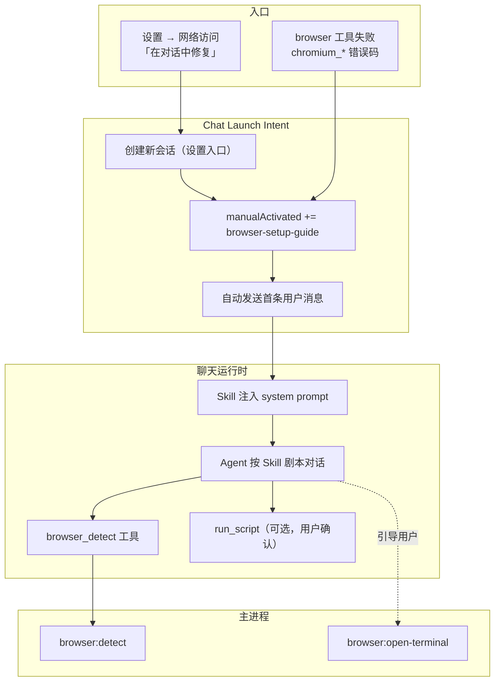
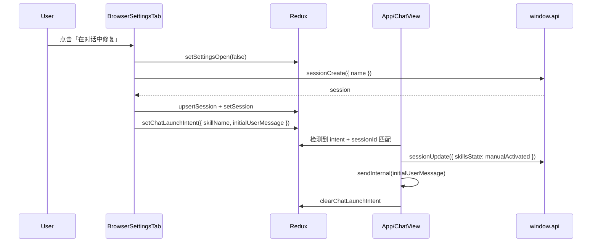

# 网络访问组件修复 Skill 化与设置页一键引导 — 需求规格

**版本：** 1.1  
**日期：** 2026-05-31  
**状态：** 待评审  

**文档定位：** 本文是 **[browser-playwright-install-guide-requirement.md](./browser-playwright-install-guide-requirement.md) §8「对话与工具引导」及 Skill 方案的合并落地规格**，并与「设置页一键跳转聊天」需求一并开发。原总需求文档 §6 检测、§9 跨平台等仍有效；§7 设置页分步 UI、§8 Skill/对话引导的**待实现部分**以本文为准。

**关联文档：**
- [browser-playwright-install-guide-requirement.md](./browser-playwright-install-guide-requirement.md)（依赖检测与安装引导总需求；§8 已合并至本文）
- [browser-network-access-settings-requirement.md](./browser-network-access-settings-requirement.md)（网络访问子 Tab 结构）
- [skills-requirement.md](./skills-requirement.md)（Skill 机制）
- [web-browser-tools-requirement.md](./web-browser-tools-requirement.md)（browser 工具总需求）

**参考实现（现状）：**
- `src/renderer/components/Browser/BrowserSetupGuide.tsx` — 设置页与聊天内共用的复杂分步引导 UI
- `src/renderer/components/Config/BrowserSettingsTab.tsx` — 网络访问子 Tab，内嵌完整引导
- `electron/browser/browserDependencyRecovery.ts` — 已定义恢复 Skill 名 `browser-setup-guide`，但未落地 Skill 文件
- `electron/toolChatLoop.ts` — 工具失败时返回结构化 `dependencyRecovery`，未真正注入 Skill
- `src/renderer/services/wikiCommandService.ts` — `/wiki query` 的「激活 Skill + 自动发消息」模式可复用

**变更记录：**

| 版本 | 日期 | 说明 |
|------|------|------|
| 1.0 | 2026-05-31 | 初稿：将网络组件修复收敛为对话内 Skill；设置页改为一键跳转聊天并自动执行 |
| 1.1 | 2026-05-31 | 合并原 browser-playwright §8（Skill 触发、结构化错误、toolChatLoop、对话流程）；与总需求文档实现对齐说明 |

---

## 目录

1. [概述](#1-概述)
2. [现状与问题](#2-现状与问题)
3. [目标与非目标](#3-目标与非目标)
4. [用户故事](#4-用户故事)
5. [总体方案](#5-总体方案)
6. [工具失败 → 结构化错误（继承 §8.2）](#6-工具失败--结构化错误继承-82)
7. [Skill：`browser-setup-guide`（继承 §8.3–§8.7）](#7-skillbrowser-setup-guide继承-8387)
8. [设置页精简（替代原 §7 分步 UI）](#8-设置页精简替代原-7-分步-ui)
9. [聊天启动意图（Chat Launch Intent）](#9-聊天启动意图chat-launch-intent)
10. [工具失败时的 Skill 激活与 UI](#10-工具失败时的-skill-激活与-ui)
11. [Agent 可用能力与工具扩展](#11-agent-可用能力与工具扩展)
12. [UI 与文案](#12-ui-与文案)
13. [数据模型与 IPC](#13-数据模型与-ipc)
14. [与现有组件的取舍](#14-与现有组件的取舍)
15. [非功能需求](#15-非功能需求)
16. [验收标准](#16-验收标准)
17. [发布阶段](#17-发布阶段)
18. [待解决问题](#18-待解决问题)
19. [相关文件](#19-相关文件)

---

## 1. 概述

### 1.1 背景

SpaceAssistant 的**网络访问**能力（内置 `browser` 工具）依赖 Stagehand + Playwright npm 包，以及用户本机额外下载的 **Chromium 二进制**。后者需执行：

```bash
npx playwright install chromium
```

当前产品在依赖未就绪时，通过 `BrowserSetupGuide` 在**设置 → 工具 → 网络访问**与**聊天工具失败卡片**两处展示几乎相同的复杂 UI：检测状态、分步说明、复制命令、打开终端、故障排除折叠区等。用户需自行理解终端操作、目录含义与失败分类，**操作路径长、认知负担高**。

与此同时，代码中已预留 `browser-setup-guide` 恢复 Skill 名称（`browserDependencyRecovery.ts`），以及 `toolChatLoop` 对 Chromium 依赖错误的结构化处理，但 **Skill 本体未实现**，对话内仍主要靠静态卡片而非 Agent 协助。

### 1.2 产品价值

| 价值 | 说明 |
|------|------|
| 降低修复门槛 | 由 Agent 按 Skill 规范逐步引导，用户用自然语言交互即可，无需阅读长篇静态步骤 |
| 设置页极简化 | 网络访问 Tab 只保留状态摘要 + 一个主按钮，复杂逻辑全部交给对话 |
| 体验一致 | 设置入口、工具失败、用户主动修复三条路径统一走同一 Skill |
| 可演进 | 后续可在 Skill 中增加代理配置、一键脚本执行等，无需反复改设置页 UI |

### 1.3 核心原则

- **对话内修复优先**：复杂引导不在设置页展开，而在聊天中由 Agent + Skill 完成。
- **设置页只做入口与状态**：检测是否就绪、提供「在对话中修复」一键跳转。
- **Skill 是唯一修复剧本**：检测逻辑、分场景话术、重试策略均写在 Skill 中，避免 UI 与 Agent 双份维护。
- **复用现有检测 IPC**：`browser:detect` 仍是权威状态来源，Skill 通过 Agent 工具间接调用。

---

## 2. 现状与问题

### 2.1 已实现

| 能力 | 位置 | 说明 |
|------|------|------|
| 依赖检测 | `browser:detect` → `StagehandService.detectDependencies()` | 区分 L1 包缺失 / L2 Chromium 缺失 / headless_only 等 |
| 设置页引导 | `BrowserSettingsTab` + `BrowserSetupGuide` | 完整分步 UI，进入 Tab 时自动检测 |
| 工具失败卡片 | `BrowserDependencyGuideCard` + `ToolCallCard` | browser 失败时展示同款引导 + 「打开设置」链接 |
| 恢复 Skill 名常量 | `browserDependencyRecovery.ts` | `browser-setup-guide` |
| 工具层结构化错误 | `browserExecutor` → `dependencyRecovery` | 含 `errorCode`、`detectResult`、`installCommand` |
| 打开终端 | `browser:open-terminal` | 在 `recommendedCwd` 打开系统终端 |

### 2.2 问题

| # | 问题 | 影响 |
|---|------|------|
| P1 | 设置页与聊天内各维护一套等价的静态引导 UI | 文案/逻辑变更需改多处；用户要在设置与聊天间来回切换 |
| P2 | 用户需自行执行终端命令、判断失败类型 | 非技术用户容易在目录、网络、杀毒等环节卡住 |
| P3 | `browser-setup-guide` Skill 未落地 | `resolveDependencyRecoverySkill` 仅有名称，Agent 无法按剧本协助 |
| P4 | 无「从设置一键进入修复对话」机制 | 设置页只能就地展示长表单，无法利用 Agent 能力 |
| P5 | Agent 无法调用 `browser:detect` | Skill 只能依赖用户口述或静态卡片，无法动态复检 |
| P6 | 工具失败路径未自动激活 Skill | 用户看到卡片但仍需手动操作，Agent 上下文未注入修复规范 |

---

## 3. 目标与非目标

### 3.1 目标

| # | 目标 |
|---|------|
| G1 | 实现产品内置 Skill **`browser-setup-guide`**，覆盖 Chromium / Playwright 依赖修复全流程 |
| G2 | 设置 → 工具 → **网络访问** Tab 精简为：**状态摘要 +「在对话中修复」按钮**（依赖未就绪时）；就绪时仅展示简要通过状态 |
| G3 | 点击按钮后：**关闭设置弹窗 → 创建新会话 → 自动激活 Skill → 自动发送首条引导消息 → 开始 Agent 流式回复** |
| G4 | `browser` 工具因 Chromium 类错误失败时，**当前会话自动激活** `browser-setup-guide` 并注入修复上下文（无需用户再点设置） |
| G5 | 提供 Agent 可调用的 **`browser_detect` 内置工具**（封装 `browser:detect`），供 Skill 驱动下的复检 |
| G6 | 设置页、工具失败、主动修复三条路径**共用同一 Skill 剧本**，避免分叉 |

### 3.2 非目标

- **不在本需求中实现应用内静默下载 Chromium**（见 [browser-playwright-install-guide-requirement.md §10](./browser-playwright-install-guide-requirement.md) 可选能力，后续独立迭代）
- 不改造 Stagehand / Playwright 底层集成
- 不新增通用「任意 Skill 从任意页面一键启动」框架（本需求仅定义 **Chat Launch Intent** 的 MVP，供网络修复与未来 1～2 个类似场景复用）
- 不在 Skill 管理 Tab 展示或允许用户删除 `browser-setup-guide`（与 `llm-wiki` 同为产品内置 Skill）
- MVP 不做「修复完成后 Agent 自动重试原 browser 任务」（见 §10.4，Phase 2）

---

## 4. 用户故事

### US-01：设置页一键修复

**作为** 刚启用网络访问但 Chromium 未安装的用户，**当** 我在设置里看到「浏览器依赖未就绪」时，**我希望** 点一次「在对话中修复」就能进入聊天并由助手一步步带我完成安装，**以便** 我不必在设置里读长步骤、复制命令。

### US-02：对话内动态协助

**作为** 正在修复依赖的用户，**我希望** 助手能根据当前检测结果告诉我「缺什么、下一步做什么」，并在我说「装好了」时自动重新检测，**以便** 我不必自己判断该跑哪条命令。

### US-03：工具失败不中断任务流

**作为** 在聊天中让 Agent 打开网页的用户，**当** browser 因 Chromium 缺失失败时，**我希望** Agent 立即切换到修复模式协助我，**以便** 我修完后能继续原任务，而不被赶到设置页。

### US-04：就绪状态可确认

**作为** 已完成安装的用户，**当** 我打开设置 → 网络访问时，**我希望** 看到简洁的「网络访问功能正常」状态，**以便** 确认环境 OK，而不必展开冗长面板。

### US-05：打包用户不被开发者命令误导

**作为** 使用安装包的用户，**当** L1 npm 包缺失（安装包缺陷）时，**我希望** 助手明确告知「请重新安装应用或联系支持」，**而不是** 让我执行 `npm install`。

### US-06：系统自动识别依赖错误（继承原 US-04）

**作为** 系统，**当** `browser` 工具因 Chromium 未安装等依赖缺失而失败时，**我希望** 自动识别 `errorCode`、激活 `browser-setup-guide` Skill，并在对话中由 Agent 引导用户完成修复，**以便** 用户无需手动查找解决方案或离开聊天界面。

---

## 5. 总体方案

### 5.1 架构概览



### 5.2 三条路径对比

| 路径 | 会话 | Skill 激活 | 首条消息 | 说明 |
|------|------|------------|----------|------|
| **设置 → 在对话中修复** | **新建** | 手动激活 `browser-setup-guide` | 系统自动发送（用户可见） | 避免污染原任务会话 |
| **browser 工具失败** | **当前会话** | 手动激活 + 可选 LLM 路由 | 无（Agent 在 tool_result 后继续） | 保留原任务上下文 |
| **用户输入 `/skill use browser-setup-guide`** | 当前 | 手动激活 | 用户自行输入 | 高级用户兜底 |

### 5.3 与旧方案关系

| 原 [browser-playwright-install-guide-requirement.md](./browser-playwright-install-guide-requirement.md) 章节 | 处置 |
|------|------|
| §6 检测能力 | **已实现**，仍以总需求为准 |
| §7 设置页分步引导 UI | **本文 §8 替代**：降级为状态摘要 +「在对话中修复」 |
| §8 对话与 Skill | **本文 §6–§7、§10 合并落地**（原静态卡片方案改为 Agent 对话优先） |
| §9 跨平台 | **已实现**，仍以总需求为准 |
| §10 应用内安装 | **未实现**，Phase 2，不在本文 MVP |

---

## 6. 工具失败 → 结构化错误（继承 §8.2）

> 本节对应原总需求 §8.2。**已实现**（`browserExecutor`、`toBrowserDependencyToolError`、`toolChatLoop` 分支）；开发时保持兼容，Skill 激活在此基础上扩展。

当 `browserExecutor` 因依赖缺失初始化失败时，返回给 Agent 的 `tool_result` **不仅是自然语言**，还包含结构化错误码：

```typescript
// dependencyError / BrowserDependencyToolError
{
  errorCode: 'chromium_missing',        // BrowserDependencyFailureCode
  errorMessage: 'Chromium 浏览器未安装。需要执行 npx playwright install chromium 下载。',
  recommendedCwd: 'E:\\Develop\\SpaceAssistant',
  installCommand: 'npx playwright install chromium',
  detectResult: { /* BrowserDetectResult */ }
}
```

**要求（已实现，维持）：**

| 项 | 说明 |
|----|------|
| `errorMessage` | 面向 Agent 的中文短句 |
| 路径 | 不暴露 `node_modules`、用户主目录绝对路径、堆栈给 Agent 上下文 |
| `recommendedCwd` | 完整路径保留在 `detectResult` 供 UI；Agent 话术用语义标签 |
| 映射一致性 | 与 `toBrowserUserError` / `mapErrorToFailureCode` 对齐 |
| init 前快速失败 | `browserExecutor` 在 `getOrCreate` 前检测，`!canInitialize` 时快速返回（§8.6） |

**启用 browser 但依赖未就绪：** 不在聊天前弹警告；首次调用 `browser` 时自然失败并进入修复流程（原 §8.6）。

---

## 7. Skill：`browser-setup-guide`（继承 §8.3–§8.7）

### 7.1 定位

| 属性 | 值 |
|------|-----|
| 名称 | `browser-setup-guide` |
| 类型 | **产品内置 Skill**（与 `llm-wiki` 同级，写入 `PRODUCT_BUILTIN_SKILL_NAMES`） |
| 安装位置 | 应用资源目录模板，首次使用时安装到 `<userData>/skills/browser-setup-guide/`（或打包内只读加载，实现时二选一，**对用户不可见、不可删**） |
| 激活方式 | 手动激活（设置按钮 / 工具失败 Hook / `/skill use`） |
| 自动匹配 | **关闭** — 不依赖 LLM 路由关键词触发，避免误激活 |

### 7.2 Front Matter（示例）

```yaml
---
name: browser-setup-guide
description: "引导用户安装并验证 Playwright Chromium，修复网络访问（browser 工具）依赖。"
triggers: []   #  intentionally empty — 仅手动 / Hook 激活
version: "1.0.0"
author: "SpaceAssistant"
---
```

### 7.3 Skill 正文必须覆盖的剧本

Skill 正文（`SKILL.md`）须 instruct Agent 按以下状态机工作：

| 阶段 | Agent 行为 | 依赖 |
|------|------------|------|
| **S0 开场** | 简短说明将要修复什么；**立即调用 `browser_detect`** | `browser_detect` 工具 |
| **S1 解读结果** | 根据 `primaryFailure` 向用户解释（中文、非技术优先） | [browserTypes.ts](../../src/shared/browserTypes.ts) 错误码 |
| **S2 分场景引导** | 见 §7.4 | — |
| **S3 等待用户** | 用户完成终端操作或确认已执行命令 | — |
| **S4 复检** | 用户表示完成 → 再次 `browser_detect` | — |
| **S5 结束** | `canInitialize === true` → 祝贺并提示「请重新发送你的请求或让我继续」；仍失败 → 回到 S2 或故障排除 | — |

**约束（写入 Skill）：**
- 一次只推进一步，等待用户确认后再下一步。
- **禁止**向用户展示 API Key、完整 `node_modules` 路径、堆栈。
- `recommendedCwd` 可以告知用户并在需要时建议「在终端中打开」；完整路径由 UI 按钮处理，Agent 话术用「应用安装目录 / 项目根目录」等语义标签。
- 打包场景下 `stagehand_missing` / `playwright_missing`：**不得**引导 `npm install`，应建议重装应用。
- 网络/杀毒/Gatekeeper 问题：按平台给出简短建议（可引用 `browserSetupGuideContent` 中的 troubleshooting 文案，但由 Agent 口述而非展示大段 UI）。

### 7.4 分场景引导（与检测 errorCode 对齐）

| primaryFailure | installContext | Agent 引导要点 |
|----------------|----------------|----------------|
| `chromium_missing` / `chromium_headless_only` / `chromium_path_unresolved` | 任意 | 说明需下载 Chromium；给出命令 `npx playwright install chromium`；说明工作目录；可建议用户在设置曾用的「打开终端」或自行在正确目录执行 |
| 同上 | development 且 L1 缺失 | 先 `npm install` 三包，再 Chromium 步骤 |
| `stagehand_missing` / `playwright_missing` | packaged | 安装包缺陷，引导重装 / 联系支持 |
| `node_version_low` | 任意 | 引导升级 SpaceAssistant，**不**引导升级系统 Node |
| `init_probe_failed` | 任意 | 完全退出重试 → 强制重装 Chromium → 安全软件 / Gatekeeper |

### 7.5 可选：Agent 代跑安装命令（Phase 1.5）

Skill 可 instruct Agent 在用户明确同意时，通过 `run_script` 在 `recommendedCwd` 执行：

```bash
npx playwright install chromium
```

**要求：**
- 必须经 **`run_script` 用户确认卡片**（现有机制），不可静默执行。
- 脚本超时建议 ≥ 10 分钟（下载体积大）。
- 失败时将 stderr 摘要反馈用户并进入故障排除话术。

MVP 可仅引导用户手动终端执行；若实现 `run_script` 路径，须在验收中覆盖。

### 7.6 对话内目标体验（继承 §8.1，方案修订）

原总需求 §8.1 线框图为「Agent + 静态引导卡片」；**本文改为 Agent 对话为主、精简 UI 为辅**：

```
┌─ 聊天界面 ──────────────────────────────────────────────┐
│  [User] 帮我打开百度首页                                  │
│  [Agent] 🔧 browser navigate → ❌ chromium_missing       │
│          [Skill] 已加载：browser-setup-guide（手动）       │
│          ⚠ 网络访问依赖未就绪 · 助手将引导修复 [在终端打开] │
│  [Agent] 我检查了一下，Chromium 还没装。我们先下载它…     │
│          （调用 browser_detect，分步口述 + 回答用户追问）  │
│  [User] 装好了                                            │
│  [Agent] 🔧 browser_detect → ✅ 已就绪                   │
│          请重新发送你的请求，或告诉我继续打开百度。         │
└──────────────────────────────────────────────────────────┘
```

**与原 §8.5 的差异：** 不再在消息流中嵌入完整 `BrowserSetupGuide` 分步卡片；复制命令、故障排除由 Agent 对话完成；工具结果区仅保留 §12.3 精简条 +「在终端中打开」。

### 7.7 Agent 重试策略（继承 §8.7）

| 阶段 | 行为 |
|------|------|
| **MVP** | Skill 完成后 Agent 提示：「Chromium 已就绪，请重新发送你的请求或告诉我继续。」**不**自动重试原 `browser` 调用 |
| **Phase 2** | 可选在 `session.metadata` 记录 `pendingBrowserRetry`，注入系统提示供 Agent 判断是否重试 |

**MVP 不做自动重试的原因：** 依赖模型理解「修复完成」信号并主动再调工具，可靠性因模型而异；用户手动重试更确定。

### 7.8 toolChatLoop 恢复逻辑（继承 §8.3、§11.1）

MVP **不建通用 Hook 注册表**，沿用硬编码白名单（已实现 `resolveDependencyRecoverySkill`，**待扩展 Skill 激活**）：

```typescript
// electron/browser/browserDependencyRecovery.ts（已有）
const CHROMIUM_RECOVERY_CODES = [
  'chromium_missing',
  'chromium_headless_only',
  'chromium_path_unresolved',
  'init_probe_failed'
]
// → 'browser-setup-guide'

// electron/toolChatLoop.ts — 待补齐
// 1. 命中时：formatDependencyRecoveryToolContent（已有）
// 2. 渲染进程：sessionUpdate manualActivated（待实现）
// 3. 下一 LLM 轮：system prompt 含 Skill（待实现）
```

**不触发 Skill：** `stagehand_missing` / `playwright_missing`（packaged 安装包缺陷）— 直接错误提示。

**安全：** `errorCode` 来自主进程 `browser:detect` / `browserExecutor`，仅白名单可触发；不可由渲染进程伪造。

---

## 8. 设置页精简（替代原 §7 分步 UI）

### 8.1 网络访问 Tab — 依赖区域改造

**移除：** `BrowserSetupGuide` 在设置页的完整分步 UI（安装步骤列表、复制按钮组、故障排除 Collapse 等）。

**保留：**

| 元素 | 说明 |
|------|------|
| 顶部 Alert | `!canInitialize` 时 warning：「浏览器依赖未就绪」+ 一行摘要（`detect.errors[0]`） |
| 运行环境检测 | 标题 + 刷新按钮（行为不变） |
| **状态摘要行** | 只读四行：Stagehand / Playwright / Chromium / Node（✓/✗，无展开步骤） |
| **主操作按钮** | 见 §8.2 |
| 操作引擎、域名等配置 | 不变（见 [browser-network-access-settings-requirement.md](./browser-network-access-settings-requirement.md)） |

### 8.2 主操作按钮

| 检测状态 | 按钮文案 | 行为 |
|----------|----------|------|
| `!canInitialize` | **在对话中修复** | 触发 [§9 Chat Launch Intent](#9-聊天启动意图chat-launch-intent) |
| `canInitialize` | 无（或可选「再次检测」仅保留 refresh 图标） | 展示绿色摘要「网络访问功能正常」，可点击展开四行状态（只读，无修复步骤） |

**按钮样式：** `type="primary"`，位于状态摘要下方，全宽或左对齐，与 Config 其它主操作一致。

### 8.3 设置页线框图（依赖未就绪）

```
┌─ 工具 → 网络访问 ─────────────────────────────────────┐
│ ⚠ 浏览器依赖未就绪                                      │
│   Chromium 浏览器未安装，网络访问暂不可用。              │
│                                                         │
│ 运行环境检测                                    [↻]    │
│ ┌─────────────────────────────────────────────────────┐ │
│ │ Stagehand   ✗ 未安装                                │ │
│ │ Playwright  ✓ 已安装                                │ │
│ │ Chromium    ✗ 未安装                                │ │
│ │ Node        ✓ 20.x（应用内置）                      │ │
│ │                                                     │ │
│ │  [  在对话中修复  ]  ← primary                      │ │
│ └─────────────────────────────────────────────────────┘ │
│                                                         │
│ ── 操作引擎（Stagehand）──                              │
│ ...（其余配置不变）                                     │
└─────────────────────────────────────────────────────────┘
```

### 8.4 设置页线框图（已就绪）

```
┌─ 运行环境检测 ─────────────────────────────────────────┐
│ ✅ 网络访问功能正常                              [↻]   │
│    （点击可展开 Stagehand / Playwright / Chromium 详情）│
└────────────────────────────────────────────────────────┘
```

---

## 9. 聊天启动意图（Chat Launch Intent）

### 9.1 需求说明

设置页「在对话中修复」不能直接调用 Agent API，需通过渲染进程统一编排：

1. 关闭设置 Modal（`setSettingsOpen(false)`）
2. 创建新会话（`sessionCreate`，名称建议：`网络访问修复` 或 `网络组件修复`）
3. 切换当前会话（`setSession`）
4. 写入 **Chat Launch Intent**（Redux 或等价单次消费状态）
5. `ChatView` 在 session 就绪后消费 Intent：更新 `sessionSkillsState.manualActivated`，并 **自动调用 `sendInternal`** 发送首条消息

### 9.2 Intent 数据结构

```typescript
/** 一次性聊天启动意图，消费后清空 */
export interface ChatLaunchIntent {
  /** 要手动激活的 Skill 名称 */
  skillName: 'browser-setup-guide'
  /** 自动发送的用户消息（会话消息列表中可见） */
  initialUserMessage: string
  /** 来源，用于日志与埋点 */
  source: 'browser-settings-repair'
  /** 创建会话时写入 session.metadata，便于排查 */
  metadata?: Record<string, unknown>
}
```

**建议 `initialUserMessage` 固定文案：**

> 请帮我检查并修复网络访问（browser 工具）所需的浏览器依赖。

（固定文案有利于测试与 Skill 路由稳定；用户可在 Agent 回复后继续追问。）

### 9.3 消费时序



### 9.4 并发与失败

| 场景 | 行为 |
|------|------|
| 无 API Key | 创建会话后 `sendInternal` 现有逻辑提示「请先配置 API Key」；Intent 仍消费，Skill 状态已写入 |
| 当前有 streaming 任务 | 新会话独立，不影响其它会话；新会话 `sendInternal` 正常校验 |
| 用户快速连点按钮 | 按钮 `loading` + 防抖；仅创建一次会话 |
| Intent 未消费前切换会话 | Intent 绑定目标 `sessionId`；仅当 `currentSessionId === intent.sessionId` 时消费 |

### 9.5 扩展性（非 MVP 必须）

Intent 结构预留 `skillName: string` 泛化，但 **MVP 仅实现 `browser-setup-guide` 一条路径**。后续飞书 CLI 修复等场景可复用同一机制。

---

## 10. 工具失败时的 Skill 激活与 UI

### 10.1 行为（完整落地原 §8.3）

当 `toolChatLoop` 执行 `browser` 工具得到 `dependencyError`，且 `resolveDependencyRecoverySkill(errorCode)` 返回 `browser-setup-guide`：

| 步骤 | 动作 |
|------|------|
| 1 | 向 Agent 返回 `formatDependencyRecoveryToolContent`（**更新文案**：引导用户在**当前对话**继续，不再强调「聊天界面已展示安装引导卡片」） |
| 2 | **渲染进程**：收到 `tool:result` 且含 `dependencyRecovery` 时，**自动** `sessionUpdate` 将 `browser-setup-guide` 加入 `manualActivated`（若尚未激活） |
| 3 | **下一 LLM 轮** system prompt 已含 Skill，Agent 按剧本继续 |
| 4 | UI：**移除** `BrowserDependencyGuideCard` 内嵌的完整 `BrowserSetupGuide`；改为 **精简提示条**（见 §12.3） |

**仍不触发 Skill 的错误码：** `stagehand_missing` / `playwright_missing`（packaged 缺陷）— 保持现有错误返回，不激活 Skill。

### 10.2 tool_result 文案更新

`formatDependencyRecoveryToolContent` 中 `message` 建议改为：

> 检测到 Chromium 尚未就绪。已为你加载「网络访问修复」引导，请根据对话中的步骤完成安装；完成后告诉我，我会重新检测。

### 10.3 与设置入口的差异

| 项 | 设置入口 | 工具失败 |
|----|----------|----------|
| 会话 | 新建 | 当前 |
| 首条用户消息 | 系统自动发送 | 无（沿用用户原消息上下文） |
| Skill 激活 | Launch Intent | tool:result 副作用 |

### 10.4 修复后重试（Phase 2）

MVP：Skill 完成后 Agent 提示用户手动重试原请求（§7.7）。  
Phase 2：在 `session.metadata` 记录 `pendingBrowserRetry: { url?, action? }`，系统注入提示供 Agent 决定是否重试。

---

## 11. Agent 可用能力与工具扩展

### 11.1 新增内置工具：`browser_detect`

| 属性 | 值 |
|------|-----|
| 名称 | `browser_detect` |
| 描述 | 检测 browser 工具依赖（Stagehand、Playwright、Chromium、Node）是否就绪 |
| 输入 | `{ "force": boolean }` 可选，默认 false |
| 输出 | `BrowserDetectResult` JSON（与 IPC 一致） |
| 确认 | **不需要**用户确认 |
| 注册 | 纳入内置工具列表；**仅当** `browser` 工具 enabled 时可用（或始终可用以便修复前检测 — **推荐始终可用**） |

**实现：** `electron/tools/builtinExecutors.ts` 调用现有 `StagehandService.detectDependencies()`。

### 11.2 保留的 IPC（Agent 不直接调用，供 UI / Skill 间接使用）

| IPC | 用途 |
|-----|------|
| `browser:open-terminal` | 聊天内 **快捷按钮**「在终端中打开」（见 §12.3），非 Agent 工具 |
| `browser:detect` | `browser_detect` 工具后端 |

### 11.3 Skill 安装/加载

实现时择一：

| 方案 | 说明 |
|------|------|
| **A. userData 内置模板** | 应用启动或首次修复时，将 `resources/skills/browser-setup-guide/` 复制到 `<userData>/skills/`，并标记为 product builtin |
| **B. 内存内置** | `skillManager` 硬编码加载打包内 `SKILL.md`，不占用用户目录 |

推荐 **B** 减少复制与版本漂移；需在 `skillList` / 设置页 **过滤** 不展示。

---

## 12. UI 与文案

### 12.1 设置页

| 文案 key | 内容 |
|----------|------|
| 主按钮 | 在对话中修复 |
| 就绪摘要 | 网络访问功能正常 |
| Alert 标题 | 浏览器依赖未就绪 |

### 12.2 聊天 — Skill 激活提示

沿用现有 Skill Hint 条：`[Skill] 已加载：browser-setup-guide（手动）` 或等价 `formatSkillRouteHint`。

### 12.3 聊天 — 工具失败精简条（替代原 §8.5 Guide 卡片）

```
┌────────────────────────────────────────────────────────┐
│ ⚠ 网络访问依赖未就绪                                    │
│   助手将引导你完成修复。                                │
│   [在终端中打开]  ← 调用 browser:open-terminal         │
└────────────────────────────────────────────────────────┘
```

- **移除**「打开设置 → 网络访问」链接（修复已在对话内完成）。
- **移除** 卡片内分步列表、复制命令、故障排除 Collapse（改由 Agent 对话提供）。

### 12.4 新会话默认标题

创建修复会话时名称：`网络访问修复`。  
若启用 [session-auto-title-requirement.md](./session-auto-title-requirement.md)，可在首轮完成后覆盖为更具体标题。

### 12.5 错误文案统一（待开发时修正）

部分运行时文案仍写「设置 → **浏览器**」，UI 已迁至 **设置 → 工具 → 网络访问**。开发本文时需同步更新：

- `electron/browser/browserUserErrors.ts`
- `electron/tools/toolUserErrors.ts`

---

## 13. 数据模型与 IPC

### 13.1 domainTypes 变更

```typescript
// PRODUCT_BUILTIN_SKILL_NAMES 增加：
export const PRODUCT_BUILTIN_SKILL_NAMES = ['llm-wiki', 'browser-setup-guide'] as const

// 可选：session.metadata
interface SessionMetadata {
  // ...
  chatLaunchSource?: 'browser-settings-repair'
}
```

### 13.2 Redux 变更

```typescript
// configSlice 或独立 chatLaunchSlice
interface ChatLaunchState {
  intent: (ChatLaunchIntent & { sessionId: string }) | null
}
// actions: setChatLaunchIntent, clearChatLaunchIntent
```

### 13.3 无新增 IPC（MVP）

复用：`session:create`、`session:update`、`browser:detect`、`browser:open-terminal`。  
新增工具执行路径：`browser_detect` 走现有 tool loop。

---

## 14. 与现有组件的取舍

| 组件 / 模块 | 当前状态 | 本文处置 |
|-------------|----------|----------|
| `BrowserSetupGuide.tsx` | 设置 + 聊天完整 UI | **删除**两处完整模式；用 §12.3 精简条替代聊天内卡片 |
| `browserSetupGuideContent.ts` | 文案与 troubleshooting | **保留**，供 Skill 正文参考、`buildDiagnosticText`、Agent 话术源 |
| `BrowserDependencyGuideCard.tsx` | 内嵌 Guide + 设置链接 | **重写**为 §12.3 |
| `BrowserSettingsTab.tsx` | 内嵌完整 Guide | 按 §8 改造 |
| `browserDependencyRecovery.ts` | 常量 + tool_result 格式化 | 更新文案；Skill 激活逻辑在渲染进程 / ChatView |
| `toolChatLoop.ts` | 改写 tool_result，未激活 Skill | 保持 tool_result 分支；Skill 注入见 §7.8、§10 |

---

## 15. 非功能需求

| 类别 | 要求 |
|------|------|
| 性能 | 「在对话中修复」从点击到首 token 流式输出 ≤ 3s（不含 LLM 延迟） |
| 安全 | Skill 与 Agent 不得输出 secrets；`browser_detect` 不暴露多余路径 |
| 可测试性 | `ChatLaunchIntent` 消费逻辑、`browser_detect`  executor、Skill 激活副作用需单元测试 |
| 兼容性 | 旧会话中已有的 `BrowserSetupGuide` 卡片消息无需迁移；新失败使用新 UI |
| 日志 | Agent 日志记录 `chatLaunch.source=browser-settings-repair`、Skill 激活来源 |

---

## 16. 验收标准

> 本节覆盖原总需求 §14.2–§14.3 中**尚未实现**的 Skill/对话项，以及本文新增项。§14.1 检测、§14.4 安全见 [browser-playwright-install-guide-requirement.md §14](./browser-playwright-install-guide-requirement.md#14-验收标准)。

### 16.1 Skill 与 Agent 对话（原 §14.3 未完成项）

- [ ] 存在可加载的 `browser-setup-guide` Skill，列入 `PRODUCT_BUILTIN_SKILL_NAMES`
- [ ] 设置页 Skill 列表 **不展示** 该 Skill
- [ ] 激活后 system prompt 含 Skill 正文
- [ ] Agent 首轮回复包含检测结论（调用 `browser_detect`）

### 16.2 设置页（原 §14.2 修订 + 本文 §8）

- [ ] 依赖未就绪时 **无** 分步安装 UI，仅有状态摘要 +「在对话中修复」
- [ ] 点击按钮：设置关闭、新会话创建、自动发送首条消息、Skill 激活、Agent 开始回复
- [ ] 依赖就绪时显示「网络访问功能正常」摘要

### 16.3 工具失败与结构化错误（原 §14.3 部分已实现）

- [x] `browser` init 失败时 tool result 含 `dependencyRecovery`（`errorCode`、`detectResult`、`installCommand`）— **已实现**
- [ ] `chromium_missing` 等码时 **自动激活** Skill 并注入 system prompt
- [ ] Agent 对话引导修复（**非**完整 `BrowserSetupGuide` 卡片）
- [ ] 检测通过后 Agent 提示用户手动重试（§7.7）
- [x] packaged `stagehand_missing` **不**触发恢复 Skill — **已实现**
- [ ] 工具结果区精简条 +「在终端中打开」

### 16.4 browser_detect 工具

- [ ] Agent 在 tool loop 中可调用并拿到与 IPC 一致的 JSON
- [ ] 无需用户确认

### 16.5 端到端（手动）

- [ ] Windows：从未安装 Chromium → 设置入口 → 对话引导 → 终端安装 → Agent 复检通过
- [ ] macOS：同上
- [ ] 聊天中 browser navigate 失败 → 对话内修复 → 用户重试原任务成功

---

## 17. 发布阶段

| 阶段 | 范围 |
|------|------|
| **Phase 1（MVP）** | Skill 文件 + `browser_detect` + 设置页一键启动 + 精简工具失败 UI + 工具失败 Skill 激活 |
| **Phase 1.5** | Skill 引导 Agent 使用 `run_script` 代跑 `playwright install`（带确认） |
| **Phase 2** | 修复完成后可选自动重试原 browser 请求；应用内下载进度（若做 §10 可选能力） |

---

## 18. 待解决问题

| # | 问题 | 倾向 |
|---|------|------|
| OQ-1 | 内置 Skill 用内存加载还是复制到 userData | 倾向内存 / 打包只读 |
| OQ-2 | `browser_detect` 是否在 browser 工具禁用时仍注册 | 倾向始终注册，便于修复 |
| OQ-3 | 修复会话是否复用已有「网络访问修复」会话 | MVP 每次新建 |
| OQ-4 | 是否保留设置页「复制诊断信息」 | MVP 不提供；Agent 对话按需给出 |
| OQ-5 | 恢复 Skill 是否允许 Agent 主动调用（原 OQ-6） | MVP：`/skill use` + 工具失败/设置按钮；可选 LLM 路由关键词后续再加 |

---

## 19. 相关文件

| 区域 | 文件 |
|------|------|
| Skill 内容 | `resources/skills/browser-setup-guide/SKILL.md`（待建）或 `electron/skills/bundled/browser-setup-guide.ts` |
| 内置 Skill 名 | `src/shared/domainTypes.ts` |
| 设置页 | `src/renderer/components/Config/BrowserSettingsTab.tsx` |
| Launch Intent | `src/renderer/store/chatLaunchSlice.ts`（待建）、`src/renderer/components/Chat/ChatView.tsx` |
| 工具失败 UI | `src/renderer/components/Chat/BrowserDependencyGuideCard.tsx`、`ToolCallCard.tsx` |
| 检测 / 恢复 | `electron/browser/browserDependencyRecovery.ts`、`electron/browser/browserDependencyDetect.ts` |
| 新工具 | `electron/tools/builtinExecutors.ts`、`src/shared/toolsConfig*.ts` |
| 引导文案源 | `src/shared/browserSetupGuideContent.ts` |
| 测试 | `electron/browser/browserDependencyRecovery.test.ts`、`BrowserSettingsTab.test.tsx`（待建）、`ChatView.launchIntent.test.tsx`（待建） |

---

**文档结束**
