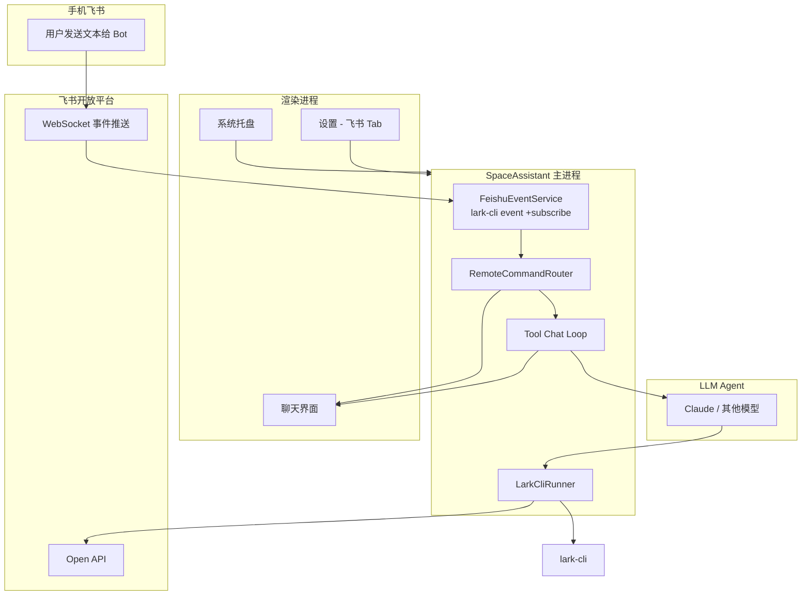

# 飞书 CLI 集成与手机远程指令 — 产品需求文档

**版本：** 1.0  
**日期：** 2026-05-25  
**状态：** 待评审  
**参考来源：**
- [飞书 CLI 安装与使用指南：让 AI Agent 真正接入飞书！](https://www.feishu.cn/content/article/7623291503305083853)
- [Feishu CLI installation guide（官方）](https://open.feishu.cn/document/no_class/mcp-archive/feishu-cli-installation-guide.md)
- [lark-cli 事件订阅参考（GitHub）](https://github.com/larksuite/cli/blob/main/skills/lark-event/references/lark-event-subscribe.md)
- [larksuite/cli 开源仓库](https://github.com/larksuite/cli)

**关联文档：**
- [tools-requirement.md](./tools-requirement.md)
- [skills-requirement.md](./skills-requirement.md)
- [settings-requirement.md](./settings-requirement.md)
- [system-tray.md](./system-tray.md)

---

## 目录

1. [概述](#1-概述)
2. [飞书 CLI 能力摘要](#2-飞书-cli-能力摘要)
3. [现状分析与适配机会](#3-现状分析与适配机会)
4. [目标与非目标](#4-目标与非目标)
5. [用户故事](#5-用户故事)
6. [总体架构](#6-总体架构)
7. [能力一：Agent 通过飞书 CLI 操作飞书](#7-能力一agent-通过飞书-cli-操作飞书)
8. [能力二：接收手机飞书远程指令](#8-能力二接收手机飞书远程指令)
9. [配置与设置界面](#9-配置与设置界面)
10. [Skill 与系统提示词](#10-skill-与系统提示词)
11. [数据模型设计](#11-数据模型设计)
12. [IPC 接口设计](#12-ipc-接口设计)
13. [UI 与交互设计](#13-ui-与交互设计)
14. [安全与权限](#14-安全与权限)
15. [非功能需求](#15-非功能需求)
16. [发布计划](#16-发布计划)
17. [验收标准](#17-验收标准)
18. [待解决问题](#18-待解决问题)
19. [相关文件](#19-相关文件)

---

## 1. 概述

### 1.1 背景

SpaceAssistant 当前已具备本地 Agent 能力：流式聊天、内置文件工具、Skills、项目记忆等。AI 可以在**工作目录**内读写文件、搜索代码、执行 Python 脚本，但无法触达用户日常协作所在的**飞书**——消息、文档、日历、多维表格、邮箱等均与桌面助手隔离。

飞书官方开源的 **lark-cli**（飞书 CLI）专为 AI Agent 设计，提供标准化的命令行入口，覆盖飞书核心业务域，并在错误提示、权限引导、Token 消耗等方面针对 Agent 调用做了优化。官方推荐通过 Skill + CLI 组合，让 Cursor、Claude Code 等 Agent 工具「能看也能动手」地操作飞书。

本需求旨在让 SpaceAssistant：

1. **出站（Outbound）**：在对话中通过 `lark-cli` 调用飞书能力（读消息、写文档、查日历、发群消息等）。
2. **入站（Inbound）**：在桌面端后台监听飞书事件，接收用户从**手机飞书**发给 Bot 的指令，自动创建或续接会话并执行 Agent 任务，结果回传飞书。

### 1.2 产品价值

| 价值 | 说明 |
|------|------|
| 上下文贯通 | Agent 可读取飞书消息、文档、日历、妙记等，回答与操作基于真实工作上下文 |
| 执行闭环 | 不再停留在「建议你建个文档」，而是直接在飞书中创建、更新、发送 |
| 移动遥控 | 用户在外出时通过手机飞书向 Bot 发指令，桌面 SpaceAssistant 在后台执行并回传结果 |
| 与现有能力协同 | 飞书指令可触发本地代码读写、Wiki 维护、Plan 模式等已有能力，形成「飞书 + 本地工程」统一 Agent |

### 1.3 核心原则

- **优先复用官方 lark-cli**，不自研飞书 Open API 封装层；SpaceAssistant 负责安装引导、进程托管、事件桥接与安全策略。
- **用户无需学习 CLI**；普通用户通过自然语言与 Bot 交互，高级用户可在设置中管理凭据与监听规则。
- **最小权限**：Bot 身份与用户 OAuth 身份分离，按场景申请 scope，缺权限时引导补授权（与 lark-cli 行为一致）。

---

## 2. 飞书 CLI 能力摘要

> 以下内容整理自官方文章与开源文档，作为本需求的能力边界参考。

### 2.1 安装与配置

| 步骤 | 命令 / 操作 |
|------|------------|
| 安装 CLI | `npm install -g @larksuite/cli` 或 `npx @larksuite/cli@latest install` |
| 安装 Skill | `npx -y skills add https://open.feishu.cn --skill -y` |
| 配置应用 | `lark-cli config init --new`（可新建或选择已有飞书应用） |
| 用户授权（可选） | `lark-cli auth login` / `lark-cli auth login --recommend` |
| 验证 | `lark-cli auth status` |
| 国际版 Lark | `lark-cli config init` 并配置 Lark 应用 |

### 2.2 两种工作身份

| 身份 | 用途 | 典型场景 |
|------|------|---------|
| **应用身份（Bot）** | `lark-cli config init` 后的 App ID + App Secret | 发消息、事件订阅、以 Bot 名义回复；**不需要**用户 OAuth |
| **用户身份** | `lark-cli auth login` 完成 OAuth | 访问个人日历、私信、收件箱、以用户名义操作 |

### 2.3 已覆盖业务域（CLI 能力清单）

| 业务域 | 核心能力 |
|--------|---------|
| 消息与群组 | 搜索消息和群聊、发送消息、回复话题 |
| 云文档 | 创建、读取、更新正文、评论协作 |
| 云空间 | 上传下载文件、管理权限、处理评论 |
| 电子表格 | 创建表格、读写单元格、批量更新 |
| 多维表格 | 管理数据表、字段、记录、视图、仪表盘、自动化 |
| 日历 | 查询日程、创建会议、查询忙闲、推荐时间 |
| 视频会议 | 搜索会议、获取纪要和逐字稿、关联日程文档 |
| 邮箱 | 搜索、读取、起草、发送、回复、归档 |
| 任务 | 创建任务、更新状态、管理清单和子任务 |
| 知识库 | 查询空间、管理节点和文档层级 |
| 通讯录 | 查询用户、搜索同事、查看部门 |
| 搜索 | 搜索群聊、消息、文档等 |

### 2.4 事件订阅（入站能力关键）

lark-cli 提供 WebSocket 长连接事件订阅，以 NDJSON 流式输出到 stdout，适合 Agent 集成：

```bash
lark-cli event +subscribe \
  --event-types im.message.receive_v1 \
  --compact --quiet
```

| 项 | 说明 |
|----|------|
| 事件类型 | `im.message.receive_v1`（接收消息）等 |
| 所需权限 | 如 `im:message:receive_as_bot` |
| 身份 | Bot 身份，仅需 `config init`，无需用户 login |
| 输出 | `--compact` 为 Agent 友好格式；支持 `--route` 正则路由 |
| 回复 | `lark-cli api POST "/open-apis/im/v1/messages/{message_id}/reply" --as bot` |
| 连接 | SDK 内置自动重连 |

---

## 3. 现状分析与适配机会

### 3.1 SpaceAssistant 现状

| 模块 | 现状 | 与飞书集成的关系 |
|------|------|-----------------|
| 内置工具 | `read_file` / `write_file` / `grep` / `run_script` 等 | `run_script` 仅支持 Python，**无法直接执行 `lark-cli`  shell 命令** |
| MCP | 本期未实现 | 飞书官方路径为 CLI + Skill，不依赖 MCP |
| Skills | 项目级 + 用户级，自动/手动激活 | 可接入飞书官方 Skill |
| 系统托盘 | 需求已定义，待实现 | 远程监听需后台常驻，与托盘强相关 |
| 主进程 | Node.js，可 `spawn` 子进程 | 适合托管 `lark-cli event +subscribe` 长连接 |
| 配置 | `AppConfig` 含 `tools` / `skills` 等 | 需扩展 `feishu` 配置段 |

### 3.2 关键差距

1. **缺少 Shell/CLI 执行工具**：Agent 无法调用 `lark-cli` 命令。
2. **缺少后台事件监听服务**：无法接收手机飞书消息。
3. **缺少飞书凭据与授权 UI**：用户需在终端手动 `config init` / `auth login`。
4. **缺少远程指令 → 本地会话的路由机制**：入站消息如何映射到 SpaceAssistant 会话尚未定义。

### 3.3 适配策略

采用 **「CLI 托管 + 专用工具 + 事件桥接」** 三层架构，而非在 SpaceAssistant 内重写飞书 API 客户端。

---

## 4. 目标与非目标

### 4.1 目标

| # | 目标 |
|---|------|
| G1 | SpaceAssistant 可检测、引导安装并配置 `lark-cli`（含飞书官方 Skill） |
| G2 | Agent 在对话中可通过专用工具调用 `lark-cli`，操作飞书各业务域 |
| G3 | 主进程可后台运行事件订阅，接收手机飞书发给 Bot 的文本指令 |
| G4 | 入站指令自动创建或路由到本地 Agent 会话，执行完成后将结果回复到飞书 |
| G5 | 设置界面提供飞书集成配置：启用开关、凭据状态、授权入口、监听规则 |
| G6 | 飞书相关工具调用支持确认策略、日志审计与错误可读反馈 |
| G7 | 与系统托盘协同：主窗口关闭后仍可接收并处理远程指令（需托盘已实现） |

### 4.2 非目标（第一期）

| 非目标 | 说明 |
|--------|------|
| 自研飞书 Open API SDK | 一律通过 lark-cli 间接调用 |
| 飞书内嵌 SpaceAssistant UI | 不做飞书小程序 / 网页端聊天界面 |
| 多 Bot / 多租户 | 第一期仅支持单应用、单 Bot |
| 语音 / 图片消息理解 | 第一期仅处理文本消息；富媒体后续迭代 |
| 企业管理员策略下发 | 不做组织级强制策略 |
| 替换飞书 OpenClaw 插件 | 与之并存；OpenClaw 用户可继续用插件，SpaceAssistant 用户走本集成 |
| Wake Word / 妙记自动提取待办 | 列为 Phase 2 增强场景 |

---

## 5. 用户故事

### US-01：桌面对话中操作飞书

**作为** 日常在 SpaceAssistant 中工作的用户，**我希望** 用自然语言让 Agent「把这份 Markdown 发到 XX 群」或「查一下我明天的日程」，**以便** 不必切换回飞书客户端手动操作。

### US-02：首次配置飞书

**作为** 新用户，**我希望** 在设置里一键完成飞书 CLI 安装与应用配置，并在需要访问个人数据时被引导完成 OAuth，**以便** 无需阅读命令行文档。

### US-03：手机远程下发任务

**作为** 外出的用户，**我希望** 在手机飞书里给 SpaceAssistant Bot 发消息「帮我在项目里修一下 XXX bug」，**以便** 桌面端 Agent 自动执行并回复进度与结果。

### US-04：后台静默执行

**作为** 习惯关闭主窗口的用户，**我希望** 应用在托盘后台仍能接收飞书指令，**以便** 不保持窗口打开也能遥控 Agent。

### US-05：安全可控

**作为** 注重安全的用户，**我希望** 飞书写操作（发消息、改文档、发邮件等）在 Agent 执行前可配置是否需确认，**以便** 防止误操作。

### US-06：查看远程任务状态

**作为** 用户，**我希望** 打开桌面应用时能看到由飞书触发的会话，并在会话标题或元数据中标识来源，**以便** 区分本地对话与远程指令。

### US-07：权限不足时的引导

**作为** 用户，**当** Agent 调用飞书能力因 scope 不足失败时，**我希望** 应用给出可操作的补授权指引（含 `lark-cli auth login --scope "..."` 链接或一键打开），**以便** 快速恢复能力。

---

## 6. 总体架构



### 6.1 模块职责

| 模块 | 进程 | 职责 |
|------|------|------|
| `LarkCliRunner` | Main | 统一 spawn `lark-cli`，处理超时、输出截断、错误解析 |
| `FeishuEventService` | Main | 长连接订阅 `im.message.receive_v1`，解析 NDJSON，emit 入站事件 |
| `RemoteCommandRouter` | Main | 过滤、去重、会话映射、触发 Agent 执行、回传飞书 |
| `run_lark_cli` 工具 | Main → Renderer | Agent 可调用的 lark-cli 封装 |
| `FeishuConfig` | Main + Renderer | 凭据状态、监听规则、确认策略 |
| 飞书 Skill | Skill 系统 | 注入 lark-cli 使用规范与常用命令模板 |

---

## 7. 能力一：Agent 通过飞书 CLI 操作飞书

### 7.1 新增内置工具：`run_lark_cli`

在现有 `run_script`（仅 Python）之外，新增专用工具，避免泛化 Bash 带来的安全风险。

#### 7.1.1 工具定义

```json
{
  "name": "run_lark_cli",
  "description": "执行飞书官方 lark-cli 命令，用于操作飞书消息、文档、日历、多维表格、邮箱等。仅允许以 lark-cli 开头的命令；禁止 shell 管道、重定向与任意命令拼接。",
  "input_schema": {
    "type": "object",
    "properties": {
      "args": {
        "type": "array",
        "items": { "type": "string" },
        "description": "lark-cli 参数列表，不含 lark-cli 可执行文件名本身。例：[\"message\", \"send\", \"--chat-id\", \"oc_xxx\", \"--text\", \"hello\"]"
      },
      "timeout": {
        "type": "number",
        "description": "超时秒数，默认 120"
      }
    },
    "required": ["args"]
  }
}
```

#### 7.1.2 执行规则

| 规则 | 说明 |
|------|------|
| 可执行文件 | 从配置读取 `feishu.cliPath`，默认在 PATH 中查找 `lark-cli` |
| 参数白名单 | `args[0]` 必须为 lark-cli 子命令（如 `message`、`doc`、`calendar`、`api`、`auth`、`event` 等）；拒绝 `;`、`|`、`&&`、`>` 等 shell 元字符 |
| 工作目录 | 不受 `workDir` 限制（飞书操作为云服务）；cwd 使用用户主目录或 CLI 配置目录 |
| 环境变量 | 继承 `PATH`；不注入 SpaceAssistant 密钥 |
| 输出限制 | stdout/stderr 各最大 512KB，超出截断 |
| 超时 | 默认 120s，可配置；事件类长命令不在此工具内执行 |
| 确认策略 | **写操作**（发送消息、创建/更新文档、发邮件等）默认需用户确认；**读操作**默认无需确认（可在设置中调整） |
| 进度 | 通过现有 tool progress 通道推送 stdout 尾部片段 |

#### 7.1.3 写操作判定（需确认）

以下子命令前缀或组合视为 **write**，执行前弹出确认卡片：

- `message send`、`message reply`
- `doc create`、`doc update`、`doc comment`（写评论）
- `bitable` 下创建/更新/删除记录
- `calendar create`、`calendar update`
- `mail send`、`mail reply`
- `task create`、`task update`
- `api POST`、`api PUT`、`api PATCH`、`api DELETE`

读操作示例（默认不确认）：`message search`、`doc read`、`calendar list`、`auth status`、`schema`。

#### 7.1.4 错误处理

| 场景 | Agent 可见结果 |
|------|---------------|
| CLI 未安装 | 明确错误 + 设置页安装引导 |
| 未 config init | 引导用户完成应用配置 |
| 权限不足 | 解析 lark-cli stderr 中的 scope 提示，附带补授权说明 |
| 授权过期 | 提示重新 `auth login` |
| 命令被拒绝（安全） | 说明触发的安全规则 |

### 7.2 CLI 安装与检测

| ID | 需求 | 优先级 |
|----|------|--------|
| LARK-01 | 主进程提供 `feishu:detect-cli`，执行 `lark-cli --version` 检测是否可用 | P0 |
| LARK-02 | 设置页提供「安装飞书 CLI」按钮，调用 `npm install -g @larksuite/cli`（需用户确认，展示命令） | P0 |
| LARK-03 | 安装后自动执行 Skill 安装：`npx -y skills add https://open.feishu.cn --skill -y` | P1 |
| LARK-04 | 检测 Node.js / npm 是否存在，缺失时给出前置依赖提示 | P0 |
| LARK-05 | 支持用户手动指定 `cliPath`（绝对路径） | P1 |

### 7.3 应用配置与用户授权

| ID | 需求 | 优先级 |
|----|------|--------|
| LARK-10 | 设置页「配置飞书应用」：触发 `lark-cli config init --new` 或引导用户选择已有应用 | P0 |
| LARK-11 | 展示当前 config 状态（App ID 末四位、是否已配置） | P0 |
| LARK-12 | 「用户授权」入口：spawn `lark-cli auth login --recommend`，解析 stdout 中的授权 URL，用系统浏览器打开 | P0 |
| LARK-13 | 展示 `lark-cli auth status` 结果（已登录用户、token 是否有效） | P0 |
| LARK-14 | scope 不足时，设置页提供「补充授权」并支持 `--scope` 参数 | P1 |

### 7.4 Agent 典型场景（验收用例）

| 场景 | 用户说法 | 预期 Agent 行为 |
|------|---------|----------------|
| 发群消息 | 「在 XX 项目群说今晚发版延迟」 | search 群 → confirm → message send |
| 建文档 | 「把这段 Markdown 创建成飞书文档」 | doc create + 格式转换 |
| 查日程 | 「明天上午我有空吗」 | calendar list / freebusy |
| 读邮件 | 「总结未读邮件」 | mail list + 摘要 |
| 多维表格 | 「把这两周日程写入 XX 多维表格」 | calendar list → bitable insert |
| 回复评论 | 「按文档评论修改正文」 | doc read comments → doc update |

---

## 8. 能力二：接收手机飞书远程指令

### 8.1 用户流程

```
用户在手机飞书打开与 SpaceAssistant Bot 的会话
    → 发送文本：「帮我在 SpaceAssistant 项目里跑测试并汇报结果」
    → 飞书开放平台推送 im.message.receive_v1
    → SpaceAssistant 主进程 FeishuEventService 收到 NDJSON
    → RemoteCommandRouter 解析 content、sender、chat_id、message_id
    → 创建或选择本地会话，注入用户消息，启动 Agent（含本地工具 + run_lark_cli）
    → 执行过程中可选：向飞书回复「已收到，正在处理…」
    → 完成后：lark-cli api reply 将摘要回复到原消息线程
    → 桌面端会话持久化，用户回家后可查看完整过程
```

### 8.2 FeishuEventService

| ID | 需求 | 优先级 |
|----|------|--------|
| EVT-01 | 主进程 spawn 常驻子进程：`lark-cli event +subscribe --event-types im.message.receive_v1 --compact --quiet` | P0 |
| EVT-02 | 按行读取 stdout NDJSON，解析为 `FeishuInboundMessage` 结构 | P0 |
| EVT-03 | WebSocket 断线依赖 lark-cli 内置重连；进程异常退出时指数退避重启（最多 N 次/小时，可配置） | P0 |
| EVT-04 | 应用退出时优雅终止子进程 | P0 |
| EVT-05 | 提供 `feishu:event-status` IPC，返回连接状态：stopped / connecting / connected / error | P0 |
| EVT-06 | `--dry-run` 用于设置页「测试连接」 | P1 |

### 8.3 入站消息模型

```typescript
interface FeishuInboundMessage {
  messageId: string
  chatId: string
  chatType: 'p2p' | 'group' | string
  senderOpenId: string
  senderName?: string
  content: string          // 已解析的纯文本
  rawContent?: string      // 原始 JSON 字符串
  createTime: string
  mentionsBot: boolean     // 群聊中是否 @Bot
}
```

### 8.4 RemoteCommandRouter 规则

| ID | 需求 | 优先级 |
|----|------|--------|
| RTR-01 | **私聊 Bot**：所有文本消息均视为指令 | P0 |
| RTR-02 | **群聊**：仅处理 @Bot 的消息，或内容以配置前缀开头（如 `/sa `） | P0 |
| RTR-03 | **发送者白名单**（可选）：仅处理指定 open_id 列表中的用户 | P1 |
| RTR-04 | **去重**：同一 `message_id` 只处理一次（持久化已处理 ID，保留 7 天） | P0 |
| RTR-05 | **会话映射**：默认每条入站指令创建新会话，标题 `[飞书] {content 前 30 字}`；同一 chat_id 在 T 分钟内可配置为续接同一会话 | P1 |
| RTR-06 | 会话 metadata 标记 `source: 'feishu'`, `feishuChatId`, `feishuMessageId` | P0 |
| RTR-07 | 指令长度上限 4000 字符，超出回复「消息过长」 | P0 |
| RTR-08 | 并发：远程指令触发的 Agent 执行计入现有「并行会话上限」 | P0 |

### 8.5 飞书侧回复策略

| 阶段 | 行为 |
|------|------|
| 收到指令 | 可选立即回复「已收到，正在处理…」（`--as bot` reply） |
| 执行中 | 长任务不流式推送；超过 60s 可发一条进度心跳（可配置） |
| 完成 | 回复文本摘要（≤4000 字）；过长则摘要 + 「完整结果已写入桌面会话 {sessionTitle}」 |
| 失败 | 回复错误原因 + 建议操作 |
| 需确认 | 回复「该操作需桌面端确认，请打开 SpaceAssistant 处理」；桌面端弹出确认卡片 |

> **第一期限制**：写操作若配置为必须确认，远程指令**不自动执行写操作**，仅回复提示；读操作与本地工具可自动执行。Phase 2 可支持「飞书内回复 Y/N 确认」。

### 8.6 与系统托盘协同

| ID | 需求 | 优先级 |
|----|------|--------|
| TRAY-FEI-01 | 启用飞书远程指令时，建议同时启用系统托盘（弱依赖：无托盘则要求主窗口关闭后仍保持主进程） | P1 |
| TRAY-FEI-02 | 托盘图标可选角标/Tooltip 显示「飞书监听中」 | P2 |
| TRAY-FEI-03 | 收到远程指令时，Windows/macOS 可选系统通知「收到飞书任务：…」 | P1 |

### 8.7 开放平台前置配置（用户引导）

设置页需提供 checklist，引导用户在飞书开放平台完成：

1. 创建企业自建应用（或由 `config init` 自动创建）
2. **事件与回调** → 订阅方式 → **使用长连接接收事件**
3. 添加事件：`im.message.receive_v1`
4. 开通权限：`im:message:receive_as_bot`、`im:message:send_as_bot` 等
5. 发布应用版本并使 Bot 对用户/群可用
6. 用户手机飞书搜索 Bot 并发起私聊，或把 Bot 拉入群

---

## 9. 配置与设置界面

### 9.1 设置 Tab 扩展

在 [settings-requirement.md](./settings-requirement.md) 的 Tab 列表中新增：

| Tab | 名称 | 内容 |
|-----|------|------|
| 飞书 | 飞书 | CLI 状态、应用配置、用户授权、远程监听、安全策略 |

### 9.2 飞书 Tab 布局

```
┌─ 飞书集成 ─────────────────────────────────────┐
│ [Switch] 启用飞书集成                            │
│                                                  │
│ ── CLI 状态 ──                                   │
│ 状态：● 已安装 vX.Y.Z  /  ○ 未检测到             │
│ [安装 CLI]  [指定路径…]  [重新检测]              │
│                                                  │
│ ── 应用配置（Bot 身份）──                        │
│ 状态：已配置 App …xxxx  /  未配置                │
│ [配置飞书应用]  [测试 Bot 连接]                  │
│                                                  │
│ ── 用户授权（访问个人数据）──                    │
│ 状态：已登录 user@example.com  /  未登录         │
│ [登录飞书账号]  [查看权限]  [退出登录]           │
│                                                  │
│ ── 远程指令（手机飞书 → 桌面 Agent）──           │
│ [Switch] 启用远程指令监听                        │
│ 连接状态：● 已连接  /  ○ 未连接  /  ⚠ 错误       │
│ 群聊触发：(@Bot) / 前缀 /sa                      │
│ [ ] 收到指令时发送系统通知                       │
│ 发送者白名单：（可选，open_id 列表）             │
│                                                  │
│ ── 安全 ──                                       │
│ 飞书写操作确认：与工具设置一致 / 一律确认 / 禁止远程写操作 │
│ [ ] 允许远程指令执行本地文件写操作               │
└──────────────────────────────────────────────────┘
```

### 9.3 FeishuConfig 字段

见 [§11 数据模型设计](#11-数据模型设计)。

---

## 10. Skill 与系统提示词

### 10.1 飞书官方 Skill

| ID | 需求 | 优先级 |
|----|------|--------|
| SK-FEI-01 | 首次启用飞书集成时，引导安装官方 Skill（`skills add https://open.feishu.cn`） | P1 |
| SK-FEI-02 | 安装后 Skill 进入用户级 Skill 目录，可在 Skill 管理页启用/禁用 | P1 |
| SK-FEI-03 | 当用户消息匹配飞书相关意图（发消息、文档、日历等）或会话 `source=feishu` 时，自动激活飞书 Skill | P0 |

### 10.2 远程指令 System Prompt 片段

入站触发的 Agent 请求额外注入：

```xml
<feishu_remote_command>
来源：飞书 Bot 远程指令（手机或其他客户端）
回复要求：执行完成后必须通过 run_lark_cli 向原 message_id 回复摘要
安全：当前会话 source=feishu，写操作确认策略见 feishu.remoteConfirmPolicy
</feishu_remote_command>
```

---

## 11. 数据模型设计

### 11.1 FeishuConfig（写入 AppConfig）

```typescript
interface FeishuConfig {
  enabled: boolean
  cliPath?: string                    // 默认空 = PATH 查找 lark-cli

  // 应用 / Bot
  appConfigured: boolean              // 镜像状态，真实凭据在 lark-cli 配置目录
  appIdSuffix?: string                // 展示用，末 4 位

  // 用户 OAuth
  userAuthorized: boolean
  userDisplay?: string

  // 远程监听
  remoteEnabled: boolean
  remoteGroupTrigger: 'mention' | 'prefix' | 'both'  // 默认 mention
  remoteCommandPrefix?: string        // 默认 '/sa '
  remoteSenderAllowlist?: string[]    // open_id，空=不限制
  remoteSessionMergeMinutes?: number  // 0=每条新会话
  remoteNotifyOnReceive: boolean

  // 安全
  remoteConfirmPolicy: 'inherit' | 'always' | 'remote_read_only'
  remoteAllowLocalWrite: boolean      // 默认 false

  // 工具
  larkCliDefaultTimeoutSec: number    // 默认 120
  larkCliWriteRequiresConfirm: boolean // 默认 true
}

export const DEFAULT_FEISHU_CONFIG: FeishuConfig = {
  enabled: false,
  appConfigured: false,
  userAuthorized: false,
  remoteEnabled: false,
  remoteGroupTrigger: 'mention',
  remoteCommandPrefix: '/sa ',
  remoteNotifyOnReceive: true,
  remoteConfirmPolicy: 'remote_read_only',
  remoteAllowLocalWrite: false,
  larkCliDefaultTimeoutSec: 120,
  larkCliWriteRequiresConfirm: true,
}
```

### 11.2 Session 扩展

```typescript
interface Session {
  // ...existing fields
  source?: 'local' | 'feishu'
  feishuMeta?: {
    chatId?: string
    lastMessageId?: string
    senderOpenId?: string
  }
}
```

### 11.3 已处理消息去重表

存储于 `userData/feishu-processed-messages.json`（或并入 `spaceassistant-data.json`）：

```typescript
interface FeishuProcessedMessageEntry {
  messageId: string
  processedAt: number
}
```

保留 7 天，启动时清理过期条目。

---

## 12. IPC 接口设计

| 通道 | 方向 | 说明 |
|------|------|------|
| `feishu:detect-cli` | invoke | 检测 CLI 是否可用，返回 `{ installed, version, path }` |
| `feishu:install-cli` | invoke | 触发安装（需确认），返回 `{ success, error? }` |
| `feishu:config-init` | invoke | 引导 config init，返回状态 |
| `feishu:auth-login` | invoke | 启动 auth login，返回 `{ authUrl? }` |
| `feishu:auth-status` | invoke | 返回授权状态 |
| `feishu:event-start` | invoke | 启动事件订阅 |
| `feishu:event-stop` | invoke | 停止事件订阅 |
| `feishu:event-status` | invoke | 返回 `{ state, lastError?, processedCount? }` |
| `feishu:inbound-message` | main → renderer | 推送入站消息（用于 UI 通知、会话列表刷新） |
| `feishu:reply-message` | invoke | 内部使用：reply 指定 messageId |

配置读写复用现有 `config:get` / `config:set`，扩展 `feishu` 字段。

---

## 13. UI 与交互设计

### 13.1 聊天界面

| 元素 | 说明 |
|------|------|
| 会话列表 | `source=feishu` 的会话显示飞书图标角标 |
| 会话标题 | 前缀 `[飞书]` |
| 首条消息 | 展示原始远程指令；可选展示发送者、时间 |
| 工具卡片 | `run_lark_cli` 展示命令摘要（隐藏 App Secret）；写操作走现有确认流 |
| 状态栏（可选） | 显示「飞书监听：已连接」 |

### 13.2 通知

| 事件 | 通知内容 |
|------|---------|
| 收到远程指令 | 「飞书：{指令摘要}」 |
| 远程任务完成 | 「飞书任务已完成：{sessionTitle}」（仅当窗口未聚焦） |
| 监听断开 | 「飞书监听已断开：{reason}」 |

### 13.3 空状态引导

未配置飞书时，设置 Tab 与首次启用 Switch 展示三步引导：安装 CLI → 配置应用 → 登录（可选）→ 启用远程监听。

---

## 14. 安全与权限

### 14.1 威胁模型

| 威胁 | 缓解 |
|------|------|
| 任意命令执行 | `run_lark_cli` 仅允许 lark-cli 参数，禁止 shell 元字符 |
| 未授权用户发远程指令 | 私聊 Bot 需开放平台控制可见范围；可选发送者白名单 |
| 群聊误触发 | 默认仅 @Bot |
| 远程恶意写本地文件 | 默认 `remoteAllowLocalWrite=false` |
| 远程恶意写飞书 | 默认 `remoteConfirmPolicy=remote_read_only` |
| 凭据泄露 | 凭据存 lark-cli 配置目录，SpaceAssistant 不复制 App Secret 到自有数据库 |
| 重放攻击 | message_id 去重 |

### 14.2 工具权限配置

扩展 `ToolsConfig.allowedTools`，新增 `run_lark_cli`。禁用飞书集成时，该工具不注入模型。

### 14.3 审计

- 所有 `run_lark_cli` 调用写入消息 history（与现有 tool_use 一致）
- 入站消息与回复记录写入会话；可选写入 `userData/feishu-audit.log`（Phase 2）

---

## 15. 非功能需求

| 类别 | 要求 |
|------|------|
| 性能 | 事件订阅子进程内存占用 < 100MB；单条远程指令端到端首响 < 5s（不含 LLM） |
| 可靠性 | 监听进程崩溃后 30s 内自动重启；飞书侧消息不丢失（依赖平台至少一次投递 + 去重） |
| 兼容 | 支持飞书国内版；Lark 国际版通过 config 切换（Phase 2 完整验证） |
| 平台 | Windows / macOS / Linux 与 Electron 主进程一致 |
| 离线 | 无网络时监听不可用，UI 显示断开；恢复网络后自动重连 |
| 国际化 | 设置与通知文案 zh-CN；CLI 输出保持原样 |

---

## 16. 发布计划

### Phase 1 — MVP（出站 + 基础入站）

| 交付项 | 说明 |
|--------|------|
| `run_lark_cli` 工具 | 含写操作确认 |
| CLI 检测与设置页 | 安装引导、config、auth |
| 飞书 Skill 集成 | 自动激活 |
| `FeishuEventService` | 私聊 Bot 文本指令 |
| `RemoteCommandRouter` | 新会话、去重、飞书 reply |
| 远程只读策略 | 写操作提示桌面确认 |

**依赖：** 系统托盘（建议并行，非硬阻塞）

### Phase 2 — 增强

| 交付项 | 说明 |
|--------|------|
| 群聊 @Bot、前缀触发 | 完整群聊规则 |
| 会话合并 | 同 chat 续聊 |
| 发送者白名单 | |
| 飞书内 Y/N 确认写操作 | |
| 富文本 / 图片消息 | 下载后作为附件注入 |
| Wake Word / 妙记待办 | 参考官方场景 1 |
| Lark 国际版 | 完整测试 |

### Phase 3 — 可选

| 交付项 | 说明 |
|--------|------|
| 远程指令 Speculative Plan 模式 | 先回计划再等用户飞书确认 |
| 多工作目录路由 | 指令内指定项目名 |
| 审计日志 UI | |

---

## 17. 验收标准

### 17.1 出站（CLI 调用）

- [ ] 设置页可完成 CLI 安装检测与 config init 引导
- [ ] 用户 OAuth 后，对话中「我明天几点开会」可返回日历信息
- [ ] 「给测试群发一条消息：hello」弹出确认后成功发送
- [ ] 权限不足时，聊天内可见补授权指引
- [ ] `run_lark_cli` 拒绝 `lark-cli message send; rm -rf /` 类注入

### 17.2 入站（手机遥控）

- [ ] 启用远程监听后，手机飞书私聊 Bot 发送「列出工作目录下的文件」可触发 Agent 并回复结果摘要
- [ ] 桌面自动创建 `[飞书]` 标记会话，可查看完整工具调用过程
- [ ] 重复 message_id 不重复执行
- [ ] 远程触发的飞书写操作在 `remote_read_only` 下不自动执行，并回复说明
- [ ] 主窗口关闭后（托盘后台）仍可接收并处理指令

### 17.3 安全

- [ ] App Secret 不出现在 SpaceAssistant 数据库明文
- [ ] 禁用飞书集成后，`run_lark_cli` 不可被模型调用

---

## 18. 待解决问题

| ID | 问题 | 建议 |
|----|------|------|
| OQ-1 | lark-cli 是否作为 npm 依赖打包进应用，还是依赖用户全局安装？ | Phase 1 依赖全局/`npx`；打包体积与更新策略 Phase 2 评估 |
| OQ-2 | 远程指令是否默认使用「快速模型」以降低成本？ | 配置项 `remoteDefaultModelId`，默认可与全局默认相同 |
| OQ-3 | 飞书 Bot 与 SpaceAssistant 会话是否 1:1 绑定？ | Phase 1 每条指令新会话；合并策略 Phase 2 |
| OQ-4 | 企业管理员禁用 Bot 时如何提示？ | 解析 lark-cli 错误码，设置页展示 |
| OQ-5 | 是否与 MCP 飞书服务器路线并存？ | 长期并存；CLI 为默认推荐路径 |
| OQ-6 | `run_lark_cli` 与泛化 `run_shell` 的边界？ | 仅实现 `run_lark_cli`，不开放通用 shell |

---

## 19. 相关文件

| 类型 | 路径 |
|------|------|
| 工具执行 | `electron/tools/builtinExecutors.ts` |
| 工具定义 | `src/shared/builtinToolDefinitions.ts` |
| 配置类型 | `src/shared/domainTypes.ts` |
| IPC | `electron/appIpc.ts`、`electron/preload.ts` |
| 设置 UI | `src/renderer/components/Config/` |
| 会话 | `electron/database.ts`、`src/renderer/store/sessionSlice.ts` |
| 托盘 | `docs/requirement/system-tray.md` |
| 官方 CLI | https://github.com/larksuite/cli |

---

**文档结束**
