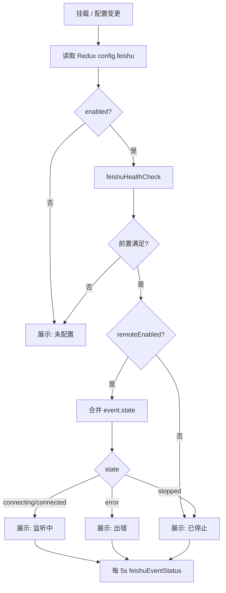

# 飞书远程指令监听状态栏 — 需求规格

**版本：** 1.1  
**日期：** 2026-05-27  
**状态：** 待评审  
**关联文档：** [feishu-integration-requirement.md](./feishu-integration-requirement.md)、[referenced-files-requirement.md](./referenced-files-requirement.md)、[plan-detail-panel-requirement.md](./plan-detail-panel-requirement.md)

---

## 目录

1. [概述](#1-概述)
2. [现状分析](#2-现状分析)
3. [布局与位置](#3-布局与位置)
4. [展示状态模型](#4-展示状态模型)
5. [功能需求](#5-功能需求)
6. [组件与样式规格](#6-组件与样式规格)
7. [数据与刷新策略](#7-数据与刷新策略)
8. [交互规格](#8-交互规格)
9. [实现约束与复用](#9-实现约束与复用)
10. [验收标准](#10-验收标准)
11. [相关文件](#11-相关文件)

---

## 1. 概述

### 1.1 功能定位

在右侧详情面板（`DetailPanel`）中，于 **「引用的文件」板块（`.referenced-files-panel`）正下方** 增加一条固定的 **飞书远程指令监听状态栏**。用户无需打开设置页，即可在桌面主界面持续感知飞书入站监听服务的运行状态、快捷启停监听服务；状态异常时可快速查看原因并跳转配置；需要排查远程指令时可一键打开操作记录。

### 1.2 目标

| # | 目标 |
|---|------|
| G1 | 在右侧栏常驻展示远程指令监听服务的聚合状态（未配置 / 已停止 / 监听中 / 出错） |
| G2 | 出错时通过 Hover Tooltip 展示完整错误信息（含 `lastError` 等） |
| G3 | 点击状态栏主体区域打开 **设置 → 飞书** Tab，便于排查与进阶配置 |
| G4 | 在状态栏右侧提供 **启动 / 停止** 按钮，与设置页行为一致，无需进入设置即可启停 `FeishuEventService` |
| G5 | 提供「操作记录」入口，直接弹出与设置页一致的飞书操作记录面板 |
| G6 | 与现有 `FeishuEventService`、`feishu:event-start` / `feishu:event-stop` / `feishu:event-status` IPC 对齐，不重复实现监听逻辑 |

### 1.3 非目标

- 不在状态栏内编辑飞书配置项（如 `remoteEnabled` 开关、群聊触发规则等；仍通过设置页完成）
- 不展示入站消息内容或会话列表（仅服务级状态）
- 不替代系统托盘上的飞书提示（托盘为 P2，见 [feishu-integration-requirement.md](./feishu-integration-requirement.md) §8.6）
- 选中文件进入 `FileOverlay` 预览时，不要求状态栏仍可见（与 PlanPanel / 引用文件一致，随 `DetailPanel` 分栏视图隐藏）

---

## 2. 现状分析

### 2.1 右侧栏布局（`selectedFile` 为空时）

```text
DetailPanel
├── detail-panel-top（flex: 1 - referencedFilesHeight）
│   └── PlanPanel
├── ResizeHandle（拖动调整上下比例）
└── detail-panel-bottom（flex: referencedFilesHeight）
    └── ReferencedFilesPanel（占满 bottom 区域高度）
```

- 引用文件板块已实现拖动高度调整；bottom 区域目前仅包含 `ReferencedFilesPanel`。
- 用户查看飞书监听状态必须打开 **设置 → 飞书**，且仅在 `feishu.enabled` 时才有 Badge 与 5s 轮询。

### 2.2 已有后端与 IPC

| 能力 | 说明 |
|------|------|
| `FeishuEventService.getStatus()` | 返回 `FeishuEventStatus`：`state` ∈ `stopped` \| `connecting` \| `connected` \| `error`，及 `lastError`、`processedCount`、`startedAt` |
| `window.api.feishuEventStatus()` | IPC `feishu:event-status` |
| `window.api.feishuHealthCheck()` | 聚合 CLI 检测、事件状态、最近入站/回复时间、待确认数等 |
| `FeishuConfig` | `enabled`、`remoteEnabled`、`appConfigured`、`userAuthorized` 等（`src/shared/feishuTypes.ts`） |
| `FeishuAuditDrawer` | 内嵌于 `FeishuSettingsTab.tsx`，通过 `feishuAuditQuery` 拉取操作记录 |

### 2.3 缺口

| 缺口 | 影响 |
|------|------|
| 设置 Modal 无「打开并定位到指定 Tab」能力 | 点击状态栏无法直达飞书配置 |
| 操作记录 Drawer 未抽取为共享组件 | 右侧栏无法复用同一面板 |
| 监听状态仅存在于设置页局部 state | 主界面无持续可见的状态指示 |

---

## 3. 布局与位置

### 3.1 目标结构

在 `detail-panel-bottom` 内，将原单一 `ReferencedFilesPanel` 改为 **纵向堆叠**：

```text
detail-panel-bottom
├── ReferencedFilesPanel（flex: 1; min-height: 0; 保持现有拖动比例逻辑）
└── FeishuRemoteStatusBar（flex-shrink: 0; 固定高度）
```

- **位置语义**：状态栏 DOM 位于 `.referenced-files-panel` **之后**（下方），视觉上贴靠引用文件列表底边与面板外框底边之间。
- **高度**：状态栏固定 **32px**（与 `referenced-files-header` 行高风格一致）；不纳入 `referencedFilesHeight` 拖动比例（拖动仍只调整「引用文件 + 状态栏」整体 bottom 区域与 PlanPanel 的比例；状态栏高度从 bottom 可用高度中扣除，引用文件列表 `flex: 1` 占据剩余空间）。

### 3.2 可见性

| 场景 | 状态栏 |
|------|--------|
| `selectedFile` 为空，`DetailPanel` 分栏视图 | **显示** |
| 用户打开 `FileOverlay` 预览文件 | **不显示**（与引用文件板块相同） |
| 应用窗口过窄导致右侧栏折叠 | 遵循现有 `app-detail-sider` 显示/隐藏规则，不单独处理 |

### 3.3 与引用文件板块的分隔

- 状态栏 **顶边** 使用 `1px solid var(--sa-border)` 与引用文件列表分隔。
- 状态栏 **不** 占用 `referenced-files-header` 内部空间，避免与「引用的文件」标题混淆。

---

## 4. 展示状态模型

### 4.1 用户可见聚合状态（4 种）

UI 层将配置项、健康检查与 `FeishuEventStatus` **合并** 为下列四种展示状态（互斥，优先级从高到低判断）：

| 展示状态 | 用户文案（主标签） | 判定条件（满足即采用，不再向下判断） |
|----------|-------------------|--------------------------------------|
| **未配置** | 未配置 | `feishu.enabled === false` **或** 任一前置条件未满足：`!appConfigured` **或** `!userAuthorized` **或** CLI 未安装（`feishuHealthCheck().cli.installed === false`） |
| **出错** | 出错 | 前置已满足，且 `remoteEnabled === true`，且 `event.state === 'error'` |
| **已停止** | 已停止 | 前置已满足，且（`remoteEnabled === false` **或** `event.state === 'stopped'`） |
| **监听中** | 监听中 | 前置已满足，且 `remoteEnabled === true`，且 `event.state ∈ { 'connecting', 'connected' }` |

> **说明：** `connecting` 与 `connected` 对用户均展示为「监听中」；可在副文案或 Tooltip 中区分「正在连接…」与「已连接」。

### 4.2 与底层 `FeishuEventConnectionState` 的映射

| 底层 `state` | `remoteEnabled` | 聚合展示 |
|--------------|-----------------|----------|
| — | — | 未配置（若 §4.1 前置不满足） |
| `stopped` | `false` | 已停止 |
| `stopped` | `true` | 已停止（开关已开但服务未跑，设置页可手动启动） |
| `connecting` | `true` | 监听中 |
| `connected` | `true` | 监听中 |
| `error` | `true` | 出错 |

### 4.3 状态指示样式

| 展示状态 | 指示点颜色（CSS 变量建议） | 图标/动画 |
|----------|---------------------------|-----------|
| 未配置 | `var(--sa-text-tertiary)` 灰 | 无动画 |
| 已停止 | `var(--sa-text-tertiary)` 灰 | 无动画 |
| 监听中 | `var(--sa-success)` 绿 | 可选：连接中时使用 Ant Design `Badge` 的 `processing` 脉冲 |
| 出错 | `var(--sa-error)` 红 | 无动画 |

### 4.4 副信息（可选，单行截断）

在主标签右侧或第二行（空间不足时省略）可展示 **一条** 副信息，优先级如下：

1. **出错**：不放在副文案（完整信息走 Tooltip，见 §5.2）
2. **监听中且 `connected`**：`已处理 {processedCount}`（来自 `FeishuEventStatus.processedCount`）
3. **监听中且 `connecting`**：`正在连接…`
4. **已停止且 `remoteEnabled`**：`远程监听已关闭` 或 `服务已停止`
5. **未配置**：`前往设置完成配置`（灰色提示性文案）

副信息使用 `text-overflow: ellipsis`，不得撑高状态栏固定高度。

---

## 5. 功能需求

### 5.1 状态展示（FR-01）

| ID | 需求 | 优先级 |
|----|------|--------|
| FR-01-01 | 组件挂载后拉取 `configGet` 中的 `feishu` 配置，并调用 `feishuHealthCheck()`（或组合 `feishuDetectCli` + `feishuEventStatus`）计算 §4.1 聚合状态 | P0 |
| FR-01-02 | 当 `feishu.enabled && feishu.remoteEnabled` 时，以 **5 秒** 间隔轮询 `feishuEventStatus()`（与 `FeishuSettingsTab` 一致） | P0 |
| FR-01-03 | 配置变更后（用户从设置保存飞书相关项），状态栏应在设置 Modal 关闭时 **立即刷新** 一次（监听 Redux `config` 或设置保存成功回调） | P1 |
| FR-01-04 | 主标签始终为 §4.1 四种文案之一，禁止直接暴露英文 `state` 枚举值 | P0 |

### 5.2 出错 Hover Tooltip（FR-02）

| ID | 需求 | 优先级 |
|----|------|--------|
| FR-02-01 | **仅当** 聚合状态为「出错」时，鼠标悬停状态栏 **主体区域**（不含右侧操作区：启动、停止、操作记录）显示 Tooltip | P0 |
| FR-02-02 | Tooltip 内容须包含：**完整** `FeishuEventStatus.lastError`（若无则展示「未知错误」） | P0 |
| FR-02-03 | 建议附加辅助行（若有数据）：`processedCount`、`startedAt`（格式化为本地时间）、最近一次健康检查中的 `lastInboundAt` / `lastReplyAt`（可选，便于判断是否长期无消息） | P1 |
| FR-02-04 | Tooltip 最大宽度建议 400px，错误文本 **不截断**（允许换行）；超长 stderr 仍展示全文（主进程已限制 `lastError` 约 500 字符） | P0 |
| FR-02-05 | 非「出错」状态悬停可不显示 Tooltip，或仅显示一句简短说明（如「监听中 · 已处理 12 条」），不得展示空 Tooltip | P1 |

### 5.3 点击跳转设置（FR-03）

| ID | 需求 | 优先级 |
|----|------|--------|
| FR-03-01 | 点击状态栏 **主体区域**（左侧状态指示 + 文案区域，不含右侧操作区）打开设置 Modal | P0 |
| FR-03-02 | 打开时 **自动选中** 设置 Tabs 的 `key: 'feishu'`（飞书 Tab） | P0 |
| FR-03-03 | 在 `configSlice`（或等价机制）增加 `settingsActiveTab?: string`，由 `ConfigModal` 受控 `Tabs` 的 `activeKey`；打开设置时写入 `'feishu'`，关闭 Modal 时可重置为 `undefined` 或保留上次 Tab（实现任选，以首次跳转准确为准） | P0 |
| FR-03-04 | 主体区域鼠标样式为 `cursor: pointer`；键盘可达性：焦点 + Enter 触发同等行为（P2） | P1 |

### 5.4 操作记录按钮（FR-04）

| ID | 需求 | 优先级 |
|----|------|--------|
| FR-04-01 | 状态栏 **右侧** 提供文字或图标按钮，文案：**操作记录** | P0 |
| FR-04-02 | 点击按钮 **仅** 打开飞书操作记录 Drawer，**不** 打开设置 Modal | P0 |
| FR-04-03 | Drawer 行为与设置页「查看操作记录」一致：标题「飞书操作记录」、宽度 720、`feishuAuditQuery({ limit: 200 })`、支持刷新 | P0 |
| FR-04-04 | 将 `FeishuAuditDrawer` 从 `FeishuSettingsTab.tsx` **抽取** 为独立组件（如 `FeishuAuditDrawer.tsx`），供设置页与状态栏共用 | P0 |
| FR-04-05 | 点击按钮时使用 `stopPropagation`，避免触发 FR-03 的打开设置行为 | P0 |
| FR-04-06 | 右侧按钮区按钮顺序（从左到右）：**启动** → **停止** → **操作记录** | P0 |

### 5.5 启动 / 停止按钮（FR-05）

| ID | 需求 | 优先级 |
|----|------|--------|
| FR-05-01 | 在「操作记录」按钮 **左侧** 并排提供两个 `size="small"` 按钮，文案分别为 **启动**、**停止**（与 `FeishuSettingsTab` 一致） | P0 |
| FR-05-02 | **启动**：调用 `window.api.feishuEventStart()`，用返回的 `FeishuEventStatus` 立即刷新本地状态；失败时用 `App.message.error` 展示错误 | P0 |
| FR-05-03 | **停止**：调用 `window.api.feishuEventStop()`，同样立即刷新状态；失败时 Toast 错误 | P0 |
| FR-05-04 | 请求进行中：被点击的按钮 `loading`，**启动** 与 **停止** 均 `disabled`，防止重复提交 | P0 |
| FR-05-05 | 点击启动/停止时使用 `stopPropagation`，不触发打开设置（FR-03） | P0 |
| FR-05-06 | **禁用规则**见 §5.5.1；禁用时按钮 `disabled`，可选 Tooltip 说明原因 | P0 |
| FR-05-07 | 不在状态栏修改 `feishu.remoteEnabled` 配置项；若用户未在设置中开启「启用远程指令监听」，启动按钮保持禁用并提示「请先在设置中启用远程指令监听」 | P0 |
| FR-05-08 | 启停成功后依赖既有 5s 轮询 + 本次 IPC 返回值双重更新，无需额外全量 `feishuHealthCheck` | P1 |

#### 5.5.1 启动 / 停止按钮启用状态

| 聚合展示状态 | 启动 | 停止 | 说明 |
|--------------|------|------|------|
| **未配置** | 禁用 | 禁用 | 前置（CLI / 应用 / 授权 / `enabled`）未满足 |
| **已停止** 且 `remoteEnabled === false` | 禁用 | 禁用 | 需先在设置打开远程监听开关 |
| **已停止** 且 `remoteEnabled === true` | **启用** | 禁用 | 服务未运行，可启动 |
| **监听中**（`connecting` / `connected`） | 禁用 | **启用** | 连接中允许停止以取消 |
| **出错** 且 `remoteEnabled === true` | **启用** | **启用** | 可先停止再启动，或直接启动尝试恢复（与设置页一致：两按钮均可点） |

> **与设置页对齐：** `FeishuSettingsTab` 在 `remoteEnabled` 为 true 时展示启停按钮且不根据 `state` 互斥隐藏；状态栏采用上表 **互斥启用**（同时仅一侧可点），以节省窄栏空间并减少误触。

---

## 6. 组件与样式规格

### 6.1 组件划分

| 组件 | 职责 |
|------|------|
| `FeishuRemoteStatusBar` | 状态聚合、轮询、Tooltip、点击打开设置、启停与操作记录按钮 |
| `FeishuAuditDrawer` | 操作记录表格（从设置 Tab 抽出） |
| `useFeishuRemoteDisplayStatus`（可选 hook） | 封装 §4.1 判定与数据刷新，供状态栏与测试复用 |

### 6.2 DOM 结构（示意）

```text
.feishu-remote-status-bar
├── .feishu-remote-status-main（可点击，flex: 1; min-width: 0）
│   ├── .feishu-remote-status-dot
│   ├── .feishu-remote-status-label（主标签）
│   └── .feishu-remote-status-sub（副信息，可选）
└── .feishu-remote-status-actions（flex-shrink: 0; 按钮组）
    ├── Button「启动」
    ├── Button「停止」
    └── Button「操作记录」
```

### 6.3 样式要点

| 属性 | 值 |
|------|-----|
| 高度 | 32px |
| 水平内边距 | 8px |
| 字号 | 12px（与 `referenced-files-title` 一致） |
| 背景 | `var(--sa-bg-panel)` 或与 bottom 区域一致 |
| 操作区 | `display: flex; align-items: center; gap: 4px; flex-shrink: 0` |
| 按钮 | 均为 `size="small"`；「操作记录」可用 `type="text"` / link 风格；「启动」「停止」可用 `type="default"` 或 text，以窄栏内可读为准 |
| 主标签区 | `min-width: 0` + 副文案 ellipsis，确保三个按钮不被挤出可视区域 |

### 6.4 无障碍

- 主区域：`role="button"` 或 `<button>` 包裹（若用 div 需 `tabIndex={0}`）
- 出错 Tooltip：关联 `aria-describedby`（P2）
- 「启动」：`aria-label="启动飞书远程指令监听"`
- 「停止」：`aria-label="停止飞书远程指令监听"`
- 「操作记录」：`aria-label="打开飞书操作记录"`

---

## 7. 数据与刷新策略

### 7.1 数据来源

```typescript
// 已有类型（src/shared/feishuTypes.ts）
interface FeishuEventStatus {
  state: 'stopped' | 'connecting' | 'connected' | 'error'
  lastError?: string
  processedCount: number
  startedAt?: number
}

interface FeishuHealthCheck {
  cli: FeishuCliDetectResult
  event: FeishuEventStatus
  lastInboundAt?: number
  lastReplyAt?: number
  pendingConfirms: number
  pendingPlans: number
}
```

### 7.2 推荐刷新流程



### 7.3 性能

- 轮询仅在 `feishu.enabled && feishu.remoteEnabled` 时启用；组件卸载清除 `setInterval`。
- `feishuHealthCheck` 调用频率：挂载时 1 次 + 配置保存后 1 次；**不要**与 5s 轮询同频调用全量 health（避免重复 spawn 检测）。

---

## 8. 交互规格

### 8.1 交互矩阵

| 用户操作 | 目标区域 | 行为 |
|----------|----------|------|
| 单击 | 状态栏主体 | 打开设置 Modal → 飞书 Tab |
| 单击 | 「启动」 | `feishuEventStart()`，刷新状态（见 FR-05） |
| 单击 | 「停止」 | `feishuEventStop()`，刷新状态 |
| 单击 | 「操作记录」 | 打开 `FeishuAuditDrawer` |
| 悬停 | 状态栏主体（出错） | 显示完整错误 Tooltip |
| 悬停 | 禁用的「启动」 | 可选 Tooltip：「请先在设置中启用远程指令监听」或「请先完成飞书配置」 |
| 拖动 | ResizeHandle | 行为不变；引用文件列表缩短，状态栏始终贴底可见 |

### 8.2 边界情况

| 情况 | 行为 |
|------|------|
| IPC 调用失败 | 聚合为「出错」或副文案显示「状态获取失败」；Tooltip 展示 `Error.message` |
| `feishuEventStatus()` 返回 `undefined`（服务未初始化） | 若 `remoteEnabled` → 展示「已停止」；否则按 §4.1 |
| 飞书未启用 | 展示「未配置」，点击仍跳转飞书 Tab 引导开启 |
| 操作记录无数据 | Drawer 内表格空状态，与设置页一致 |
| 启动时 `eventService` 未初始化 | Toast「飞书服务未就绪」，保持禁用或引导打开设置 |
| 快速连续点击启停 | 由 FR-05-04 loading + disabled 拦截 |

---

## 9. 实现约束与复用

### 9.1 Redux / 设置 Modal

- 新增 action：`setSettingsOpen({ open: true, tab?: 'feishu' })` 或 `setSettingsActiveTab('feishu')` + `setSettingsOpen(true)`。
- `ConfigModal` 中 `<Tabs activeKey={...} onChange={...} />` 与 Redux 同步。

### 9.2 组件挂载点

在 `src/renderer/components/DetailPanel/index.tsx` 的 `detail-panel-bottom` 内，`ReferencedFilesPanel` 之后渲染 `FeishuRemoteStatusBar`。

### 9.3 测试建议（可选）

- 单元测试：`useFeishuRemoteDisplayStatus` 或纯函数 `resolveFeishuRemoteDisplayStatus(config, health, event)` 覆盖 §4.1 优先级表。
- 不要求为本需求单独增加 E2E。

---

## 10. 验收标准

| # | 验收项 |
|---|--------|
| AC-01 | 右侧栏 `DetailPanel` 分栏视图下，「引用的文件」列表下方可见固定高度状态栏 |
| AC-02 | 飞书未启用或 CLI/应用/授权未就绪时，显示「未配置」 |
| AC-03 | `remoteEnabled` 且服务 `connected` 时显示「监听中」，副信息可显示已处理条数 |
| AC-04 | `event.state === 'error'` 时显示「出错」，悬停可见完整 `lastError` |
| AC-05 | `remoteEnabled === false` 或 `state === 'stopped'` 时显示「已停止」 |
| AC-06 | 点击状态栏主体打开设置且当前 Tab 为「飞书」 |
| AC-07 | 「启动」「停止」「操作记录」从左到右排列；后两者点击不打开设置 |
| AC-08 | `remoteEnabled` 且服务已停止时，「启动」可调用并成功进入「监听中」 |
| AC-09 | 监听中点击「停止」后变为「已停止」，「停止」禁用、「启动」可用 |
| AC-10 | 未配置或 `remoteEnabled === false` 时，「启动」「停止」均为禁用 |
| AC-11 | 点击「操作记录」打开 Drawer，内容与设置页一致 |
| AC-12 | 打开文件预览（`FileOverlay`）时状态栏不可见 |
| AC-13 | `remoteEnabled` 时状态约 5 秒内随服务变化自动更新 |

---

## 11. 相关文件

| 文件 | 说明 |
|------|------|
| `src/renderer/components/DetailPanel/index.tsx` | 挂载状态栏 |
| `src/renderer/components/DetailPanel/detailPanel.css` | 布局与样式 |
| `src/renderer/components/DetailPanel/FeishuRemoteStatusBar.tsx` | 新增 |
| `src/renderer/components/Config/FeishuAuditDrawer.tsx` | 从设置 Tab 抽出 |
| `src/renderer/components/Config/FeishuSettingsTab.tsx` | 改用共享 Drawer |
| `src/renderer/components/Config/ConfigModal.tsx` | 受控飞书 Tab |
| `src/renderer/store/configSlice.ts` | 设置 Tab 状态 |
| `src/shared/feishuTypes.ts` | `FeishuEventStatus`、`FeishuHealthCheck` |
| `electron/feishu/feishuEventService.ts` | 监听服务实现 |
| `electron/feishu/feishuIpc.ts` | IPC 处理器 |
| `src/shared/api.ts` | `feishuEventStatus`、`feishuHealthCheck`、`feishuAuditQuery` |

---

**变更记录**

| 版本 | 日期 | 说明 |
|------|------|------|
| 1.0 | 2026-05-27 | 初稿：右侧栏飞书远程指令监听状态与操作记录入口 |
| 1.1 | 2026-05-27 | 状态栏右侧增加「启动」「停止」按钮（位于「操作记录」左侧） |
