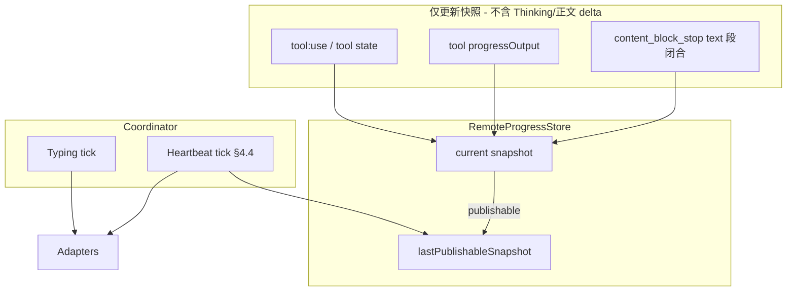

# 远程执行进度同步与确认策略 — 活动状态快照需求


**版本：** 1.7  

**日期：** 2026-07-12  

**状态：** 待评审（v1.7：吸收 [v2 评审](../review/remote-progress-activity-sync-requirement-review-v2.md)）  


**关联文档：**

- [wechat-integration-requirement.md](./wechat-integration-requirement.md) — §7.5 / §7.5.1 / §16 / §17（**v1.7 已同步**）

- [feishu-integration-requirement.md](./feishu-integration-requirement.md) — §8.5 / §8.5.1 / §16 / §17（**v1.7 已同步**）

- [tools-requirement.md](./tools-requirement.md) — `tool:progress` 通道

- [shell-output-display-requirement.md](./shell-output-display-requirement.md) — 工具进度输出

- [remote-progress-activity-sync-requirement-review-v2.md](../review/remote-progress-activity-sync-requirement-review-v2.md) — v2 评审（针对 v1.6）

- [remote-progress-activity-sync-requirement-review.md](../review/remote-progress-activity-sync-requirement-review.md) — v1 评审


---


## 目录


1. [概述](#1-概述)

2. [背景与现状](#2-背景与现状)

3. [目标与非目标](#3-目标与非目标)

4. [「系统消息」定义与可发布规则](#4-系统消息定义与可发布规则)

5. [双通道统一进展同步模型（以微信为基准）](#5-双通道统一进展同步模型以微信为基准)

6. [期望行为](#6-期望行为)

7. [配置项](#7-配置项)

8. [验收标准](#8-验收标准)（含 §8.3 策略拉齐、§8.4 迁移与非功能、§8.5 测试）

9. [分期建议](#9-分期建议)

10. [附录 A：现网代码索引](#附录-a现网代码索引)

11. [附录 B：实现参考（非需求正文）](#附录-b实现参考非需求正文)

12. [附录 C：远程确认统一层（技术方案待决）](#附录-c远程确认统一层技术方案待决)


---


## 1. 概述


### 1.1 问题


用户在手机微信（或飞书）发起远程指令后，执行周期可能长达数分钟；写操作还可能触发 **远程确认**。当前 **微信** 通道在长任务期间主要通过 Typing + 固定心跳文案，**无法反映**桌面端真实的工具执行阶段，且写确认存在「仅引导桌面、IM 无法继续」缺陷；**飞书** 则对每条 tool progress / assistant 文本块即时 reply，信息碎、易刷屏，且同样 **不** 对齐桌面活动状态条。


### 1.2 改进方向


双通道统一为 **Typing + 定时心跳（Activity 快照）**，并与 **远程写操作 IM 确认**（§6.4）在同一用户旅程内交付。快照来源为 **工具态 / 确认态 / 已闭合的系统消息（assistant 可见正文段）**（见 §4）；**Thinking** 与 **流式进行中的正文 delta** 不得作为 IM 进展同步内容。


### 1.3 范围


| 能力域 | 通道 | 优先级 | 说明 |

|--------|------|--------|------|

| **进展同步（Progress）** | 微信 iLink Bot | P0 | Typing + 心跳携带可发布 Activity 快照（§4–§5） |

| **进展同步（Progress）** | 飞书远程指令 | P0 | 废弃 event-driven 逐条 reply，收敛为同一模型（§5） |

| **远程写确认（Confirm）** | 微信 + 飞书 | **P0（同迭代）** | 远程会话写操作 **仅 IM Y/N**（§6.4）；与 Progress 捆绑估期，不可仅按「进度同步」排期 |


---


## 2. 背景与现状


### 2.1 桌面端活动状态条（参考，非全部用于远程）


桌面在 Assistant `status === 'streaming'` 时，由 `resolveStreamingActivityStatus()` 计算：


| 优先级 | 条件 | `label` 示例 | 远程是否采用 |

|--------|------|--------------|--------------|

| 1 | 工具有待确认 | `等待确认：写入文件 …` | **是**（§4.3） |

| 2 | 工具 `calling` / `executing` | 可读标签，如「搜索文件 `src`」 | **是** |

| 3 | Thinking 进行中 | `思考中` | **否** — 不推送、不写入快照 |

| 4 | assistant 可见正文 **流式进行中** | `生成中` | **否** — 段未闭合，视为未完成 |

| 5 | assistant 可见正文 **段已闭合** | 段首行摘要 | **是** — §4.3 `kind: text` |


桌面渲染：`ChatView` / `ChatBubble` 的 `runningActivity`。


### 2.2 飞书远程 — 现网


| 机制 | 行为 |

|------|------|

| 工具 progress | 每次 `sendProgress(message)` → 立即 `replyFeishuText` |

| assistant 文本块 | `content_block_stop(text)` → 立即 reply |

| 定时心跳 | **无** |

| Typing | **无** |


### 2.3 微信远程 — 现网


| 阶段 | 行为 |

|------|------|

| Ack | 可选「已收到，正在处理…」 |

| Typing | `sendTyping`，约 **15s** 周期（`weChatRemoteAgent`） |

| 心跳 reply | 固定「**仍在处理中，请稍候…**」，现网在 **Typing 定时器（15s）与心跳定时器（60s）两处** 均可能触发同一固定文案（职责耦合，统一模型将分离） |

| 工具 / 文本 progress | **未**接入 `toolChatLoop` |


配置：`remoteProgressHeartbeatSec`（默认 60）、`remoteTypingEnabled`（默认 true）。


### 2.4 差距小结


```text

                    现网飞书          现网微信          统一目标（§5）

──────────────────────────────────────────────────────────────────────

Outbound            事件驱动 reply    Typing+耦合心跳     Typing + 快照心跳

工具 progress       立即 reply        未接入             仅更新可发布快照

assistant 流式文本   立即 reply        未接入             段闭合后写入快照；delta 期间不发布

Thinking            否                否                 否（且不参与快照计算）

```


---


## 3. 目标与非目标


### 3.1 目标


| 编号 | 目标 |

|------|------|

| G1 | 双通道进展同步统一为 **Typing + 定时心跳（可发布 Activity 快照）** |

| G2 | 心跳文案来自 **工具态 / 确认态 / 已闭合系统消息（正文段）**；**不含 Thinking、不含流式进行中的正文 delta** |

| G3 | 共用 `RemoteProgressSnapshot`、`lastPublishableSnapshot` 缓存与 Coordinator；IM 差异仅通过 Adapter 调频 |

| G4 | 去重 + 限频，避免 IM 刷屏 |

| G5 | 进度 reply 经 Markdown 清理，长度受限 |

| G6 | 可观测：`*.remote.progress` / `*.remote.confirm` 文件日志（长度/hash/决策，**无正文**）；验收见 RP-NF-01~02（§8.5） |


### 3.2 非目标


- **不**推送 Thinking 正文、片段、「思考中」或任何 Thinking delta 驱动的快照更新。

- **不**在 assistant 正文 **流式传输期间**（`hasOpenContentSegment` / `content_block_delta`）更新可发布快照；**段闭合后**（`content_block_stop(text)` / `closeOpenContentSegment`）方可发布该段摘要。

- **不**流式推送 assistant 全文；进展心跳仅带 **截断段摘要**；完整回复仍仅任务结束时一条摘要。

- **不**推送 shell `progressOutputRaw` / ANSI。

- **不**改造桌面 UI 活动状态条本身。

- **不**在远程会话中采用「仅桌面确认、IM 无法操作」的死胡同；远程写操作确认 **必须** 支持 IM 内 Y/N（见 §6.4）。


---


## 4. 「系统消息」定义与可发布规则


### 4.1 术语


| 术语 | 含义 |

|------|------|

| **Activity 快照** | 由主进程镜像的 `Message` 子集解析出的 `{ label, detail?, kind, publishable }` |

| **可发布快照** | `publishable === true` 且满足 §4.3 的快照 |

| **`lastPublishableSnapshot`** | 本会话内 **最近一次** 可发布快照的缓存；Thinking / 正文流式进行中 / 纯「生成中」阶段心跳 **回退** 使用它 |

| **系统消息（本需求语义）** | assistant **可见正文**（`contentSegments` 的 text 段，**非** Thinking）；**段闭合**后可发布，**流式进行中**视为未完成 |


### 4.2 明确排除（不得进入 IM 进展）


| 类型 | 处理 |

|------|------|

| `Message.thinking` / Thinking segments / `thinking` delta | **完全忽略**：不解析为快照、不更新 `lastPublishableSnapshot`、不 outbound |

| `label === 思考中` | **禁止**推送 |

| assistant 正文 **流式进行中**（`content_block_delta`、未闭合 segment / `endTime === undefined`） | **禁止**写入可发布快照；桌面可显示「生成中」，IM **不**跟 delta |

| 系统 prompt append（`<wechat_remote_command>` 等） | 排除 |

| 完整 assistant `content`（最终摘要） | 仅任务结束时单独发送，非进展心跳 |


> **产品理由：** Thinking 推理过程零碎、更新快，不适合作为 IM 进展说明。assistant **可见正文** 在 **段闭合后** 语义稳定，可作为进展摘要；**delta 期间** 内容不完整，与「未完成」同等对待，**不可发布**。


### 4.3 可发布快照（`publishable: true`）— 三类


| `kind` | 条件 | `label` 来源 | `detail` 来源 |

|--------|------|--------------|---------------|

| **`tool`** | 存在 `calling` / `executing` 工具 | 与桌面一致的 **可读工具标签**（`formatToolLabel`，非 raw `toolName`） | `progressOutput` 首行（plain）；无则省略 |

| **`confirm`** | 工具态为 `confirming` | `等待确认：{action}`（与桌面 `chat.streaming.awaitingConfirm` 一致） | 通常无 |

| **`text`** | 存在 **已闭合** 的 assistant 可见正文段（`contentSegments` 中 `endTime !== undefined`），且当前 **无** 更高优先级 `confirm` / 活跃 `tool` | 该段 plain text **首行**（截断，与 `detail` 规则一致） | 同段 **第二行及以后** 的首行摘要；无则省略 |


> **`kind: text` 示例（用户可见）：** Agent 完成一段说明并段闭合后，如「已找到 12 个匹配文件，正在读取前 3 个…」→ 心跳可带出 `【进度】已找到 12 个匹配文件…`。**非**流式半句、**非** Thinking 片段。


**快照优先级（同时满足多类时取一条 current）：** `confirm` > 活跃 `tool` > 最新已闭合 `text` 段。


**以下态 `publishable: false`，且不得刷新 `lastPublishableSnapshot`：**


- Thinking / `idle`（思考中）

- 正文 **流式进行中**（存在未闭合 segment；桌面显示「生成中」）

- 仅因 **delta** 导致的内容变化（段未闭合）


### 4.4 心跳 outbound 选取规则（解决 Thinking 与「空快照」矛盾）


定时心跳 **层 B** 按序决定 reply 正文：


1. 若当前存在 **可发布快照** → 发送 `formatRemoteProgressMessage(current)`（【进度】+ label + detail）；并更新 `lastPublishableSnapshot`；

2. 否则若 **`lastPublishableSnapshot` 存在** → 发送其格式化内容（Thinking / 正文流式进行中 **继续展示上一轮** 可发布快照）；

3. 否则（任务刚开始、从未有过可发布态）→ 发送兜底 **`仍在处理…`**（**禁止静默**）。


**Typing 层 A** 在 1–3 任意阶段均可独立刷新，不携带业务文案。


### 4.5 远程展示格式


```text

【进度】{label}

{detail}              ← 可选第二行

```


- `label` **必须**为可读工具标签、确认文案，或 **已闭合正文段首行**；**不得**为 raw toolName（如 `grep`），**不得**为流式进行中的半句正文。

- 单条建议 ≤ **400** 字符（`remoteProgressMaxChars`）。

- `detail` 截断与桌面 `firstProgressLine()` 对齐（首行、≤72 字可配置）。

- 确认卡片前缀（飞书）与心跳 **统一** 使用上述 `【进度】` 格式（替代现网 `【进度说明】`）。


### 4.6 兜底文案（相对现网变更）


| 场景 | 现网微信 | 本需求 |

|------|----------|--------|

| 无可用快照且从未有过可发布态 | 「仍在处理**中，请稍候…**」 | 「**仍在处理…**」（更短；i18n `remote.progress.fallback`） |


---


## 5. 双通道统一进展同步模型（以微信为基准）


### 5.1 设计原则


- **单一模型**：Typing（层 A）+ 心跳（层 B）；**工具 progress / 正文段闭合** 不直接 reply IM。

- **确认例外**：工具进入 `confirming` 时 **必须即时** 向 IM 发送可操作的 Y/N 确认提示（§6.4），**不** 等待心跳；Agent **阻塞等待** 用户决策后继续或取消。

- **以微信为基准**：飞书从 event-driven 迁移至本模型。

- **快照与推送解耦**：**工具/确认/正文段闭合** 相关事件更新快照；Thinking / 正文 **delta** **不**触发可发布快照更新。

- **Adapter**：各 IM 微调频率与能力（Typing 有无、频控）。


### 5.2 两层同步


```text

层 A · Typing     → 周期刷新，无业务文案

层 B · Heartbeat  → 按 §4.4 选取 current / lastPublishable / fallback 后 reply

```


| 层级 | 默认频率（可配置） |

|------|-------------------|

| A · Typing | 微信 **15s**；飞书 **关闭**（无 API） |

| B · Heartbeat | 双通道 **60s**（`remoteProgressHeartbeatSec`；`0`=关闭层 B） |


Ack「已收到，正在处理…」不计入本模型。


### 5.3 飞书行为变更与用户体验说明


| 变更 | 用户感知 | 产品价值 |

|------|----------|----------|

| 停止每条 tool progress / 文本块即时 reply | 进度消息 **变稀疏**（约每 60s 一条 + 摘要）；**已闭合**正文段可在心跳中带出 | 与微信一致；减少刷屏；文案 **稳定** |

| 新增 60s 心跳 | 长任务仍有周期性说明 | 弥补无 Typing 时的「还在吗」感知 |


**迁移沟通（Phase B 前）：** Release Note / 设置页飞书 Tab 简短说明：「远程进度改为定期摘要，不再每条工具日志都推送」。Phase A/B 期间默认 60s；**Phase C** 暴露设置 UI 后可调间隔。


### 5.4 IM Adapter 默认参数


| 参数 | 微信 | 飞书 |

|------|------|------|

| `typingIntervalSec` | 15 | 0（no-op） |

| `heartbeatIntervalSec` | 60 | 60 |

| `minReplyIntervalSec` | 3 | 5 |

| `maxProgressChars` | 400 | 400（展示仍建议 400） |


`minReplyIntervalSec` 主要约束：心跳 reply 之间、以及心跳与 **非确认类** 额外 reply 之间的最小间隔。**确认提示（§6.4）不受此限**，须即时送达以便用户继续操作。


### 5.5 配置嵌入


`RemoteProgressConfig` 嵌入 `WeChatConfig` / `FeishuConfig`（字段 shape 相同；飞书 `remoteTypingEnabled` 默认 false）。见 §7。


### 5.6 数据流示意





---


## 6. 期望行为


### 6.1 用户可见时间线（单调递增，可读 label）


| 时刻 | 桌面活动状态 | IM 侧（微信/飞书，层 B 除非注明） |

|------|--------------|-----------------------------------|

| T+0s | 用户消息已收 | Ack：可选「已收到，正在处理…」 |

| T+5s | **搜索文件 `src`** · `搜索中...` | 层 A Typing；快照已更新；**不** reply |

| T+20s | **思考中**（Thinking） | 层 A Typing；**不** reply「思考中」；快照 **不**更新 |

| T+40s | **读取文件 `config.json`** · `准备中…` | 快照更新；**仍不**即时 reply |

| T+60s | 心跳到期 | reply `【进度】读取文件 config.json\n准备中…`（当前可发布快照） |

| T+90s | 再次 **思考中** | 层 A Typing；快照不更新 |

| T+100s | assistant 段闭合：「已找到 12 个匹配文件，正在汇总…」 | 快照 `kind: text`；**不** instant reply |

| T+120s | 心跳到期 | reply `【进度】已找到 12 个匹配文件…`（或若仍为工具态则工具快照；去重则 skip） |

| T+150s | 任务开始至今 **仅 Thinking/流式生成中**、从未有可发布态 | 心跳 → 兜底 **「仍在处理…」** |

| 完成 | streaming 结束 | **停止** progress 会话；**一条**最终摘要（与最后一条心跳去重/顺序：摘要始终发送，不依赖心跳） |


### 6.2 层 A / 层 B 职责（改前 vs 改后）


| 层级 | 现网微信 | 统一后 |

|------|----------|--------|

| **A · Typing** | 15s；且 **错误地** 触发固定文案 reply | **仅** `sendTyping`，**不**发 progress reply |

| **B · Heartbeat** | 60s 固定「仍在处理中，请稍候…」 | 60s；按 §4.4 发送快照 / 缓存 / 兜底 |


### 6.3 去重与限频


| 规则 | 说明 |

|------|------|

| 内容去重 | 与 **上次已发送** 的 progress reply 正文相同 → 不发送 |

| 心跳 vs 最终摘要 | **摘要始终发送**；若摘要与最后一条 progress 正文相同或高度重叠，**仍发摘要**（任务结束语义优先）；可选实现层对完全相同的相邻两条做 skip（**非必须**） |

| 心跳间隔 | `remoteProgressHeartbeatSec` |

| 最小 reply 间隔 | `remoteProgressMinIntervalSec`（见 §5.4） |

| Typing | 不计入 reply 去重 |


### 6.4 执行中「等待远程确认」流程


> **问题（v1.3 及以前）：** 远程用户经 IM 操控 Agent，若仅弹出桌面确认卡片并提示「请打开 SpaceAssistant」，持机用户 **无法继续流程**。远程会话的写操作确认 **必须以 IM 为主操作面**，桌面为并行补充。


与 [wechat-integration-requirement.md](./wechat-integration-requirement.md) §7.5.1、[feishu-integration-requirement.md](./feishu-integration-requirement.md) §8.5 对齐，并 **取代** 其中「Phase 1 仅桌面确认」的表述。


#### 6.4.1 原则


| 原则 | 说明 |

|------|------|

| **IM 唯一确认面** | 远程会话的写操作确认 **只能在 originating IM** 完成（微信 / 飞书内 Y/N）。用户 **不会** 也不应被期望「一手手机、一手桌面」同时操作 |

| **Agent 阻塞等待** | `confirmManager.requestConfirm()` 阻塞 `toolChatLoop`，直至 IM Y/N/超时；**不得** reject 后 sole 引导「请去桌面」 |

| **桌面卡片（可选）** | 桌面可 **同步展示** 同一确认（便于用户碰巧开着 SpaceAssistant 时查看/点击）；**不是**独立产品路径，**不可替代** IM 确认 |

| **与心跳分工** | IM 确认提示 = **即时 reply**；`kind: confirm` 快照参与后续心跳作提醒 |


#### 6.4.2 双通道统一远程确认策略（飞书 / 微信拉齐）


远程会话（`source === 'feishu' | 'wechat'`）的写操作确认，**双通道同一套产品规则**；通道差异仅体现在 IM 传输（reply 方式、超时默认值、prompt 模板）。


##### 统一策略语义


| 统一语义 | 飞书现网枚举 | 微信目标枚举 | 远程会话行为 |

|----------|-------------|-------------|-------------|

| **IM 内确认** | `feishu_confirm` | `wechat_confirm`（新增，与飞书对称） | 需确认的写操作 → **即时 IM Y/N** + Agent 阻塞；**禁止** instant reject |

| **一律确认** | `always` | `always` | 同 **IM 内确认**（远程场景下等效） |

| **禁止远程写** | `remote_read_only` | `remote_read_only` | 远程 **不允许** 执行写类操作；返回明确拒绝文案；**不得**写「请在桌面端确认」 |

| **继承** | `inherit` | `inherit` | **远程会话下解析为 IM 内确认**；**不得**走 instant reject（现网飞书/微信均有缺陷） |


**`inherit` 用户说明：** 「与工具设置一致」指 **桌面本地会话** 仍遵循全局 `ToolsConfig` 确认规则。**远程会话** 下用户操作面只有 IM，故 `inherit` **等效** `feishu_confirm` / `wechat_confirm`。若希望远程 **禁止写操作**，应显式选择 **`remote_read_only`（禁止远程写）**，而非 `inherit`。设置页策略说明须体现此分工（Phase A 最小 tooltip 即可）。


**默认策略（双通道拉齐）：**


| 通道 | 默认值 | 说明 |

|------|--------|------|

| 飞书 | `feishu_confirm` | 与现网 `feishuTypes` 默认一致 |

| 微信 | `wechat_confirm` | 替代「`remote_read_only` + `remoteWechatConfirm`」组合；现网默认须迁移 |


> **`remote_read_only` 不是「需确认」：** UI 文案为「禁止远程写」。该策略下用户 **不能** 通过换去桌面完成写操作；若产品允许某类写操作，应使用 **IM 内确认** 策略而非 `remote_read_only`。


##### 废弃项


| 项 | 处理 |

|----|------|

| `remoteWechatConfirm` | **废弃**；不对用户暴露；行为并入 `wechat_confirm` / 统一 IM 确认路径 |

| `toolChatLoop` 内分通道 duplicate 分支 | 技术方案阶段评估合并为统一 Remote Confirm 层（§附录 C） |

| 「请打开 SpaceAssistant 桌面确认」作为 sole 出口 | **禁止**（两通道） |


##### 飞书现网差异（须在实现中拉齐）


| 现网问题 | 拉齐目标 |

|----------|----------|

| `inherit` 未命中 `feishu_confirm`/`always` → instant reject | 远程会话下 **等效** `feishu_confirm` |

| `remote_read_only` 拦截文案含「请在桌面端…」 | 改为「远程策略禁止此类写操作」类诚实文案 |

| `FeishuConfirmManager` 与 `WeChatConfirmManager` 各一套 | 见 §附录 C 重构方向 |


#### 6.4.5 安全与策略选择


| 主题 | 说明 |

|------|------|

| **身份绑定** | Y/N 仅接受 **同一 remote 会话 originating chat/user** 的入站消息解析（现网 `chatId` / `userId` 匹配）；群聊非触发消息忽略 |

| **误触与格式** | 仅 `Y`/`N`/`确认`/`取消`（大小写不敏感）视为决策；其他文本 **不** 当作确认（见 §6.5） |

| **与 `remote_read_only` 分工** | `remote_read_only` = **禁止远程写**（降低误操作面）；`wechat_confirm` / `feishu_confirm` = **允许写但须 IM 显式 Y/N** |

| **与旧版「不提供微信 IM 确认」** | 旧 rationale（无卡片回调、身份弱于飞书企业态）仍成立部分风险；**产品决策**改为：远程遥控场景下 **流程可继续** 优先于「强制回桌面」；风险通过 Y/N 绑定 + 策略可选 `remote_read_only` 缓解 |


#### 6.4.3 阶段行为


| 阶段 | 行为 |

|------|------|

| 工具进入 `confirming` | ① **即时** IM reply Y/N 确认提示；② Agent **阻塞**等待 IM 决策；③ 桌面 **可选**同步展示同一确认；④ 快照 `kind: confirm` |

| 用户 IM 回复 Y/N | 工具继续 / rejected / timeout；IM 收到对应说明 |

| 用户碰巧在桌面点击确认 | 与 IM Y/N **等价**（实现便利，非产品主路径） |

| 确认超时 | IM reply「操作已取消（确认超时）」；工具 `timeout`；Agent 继续或结束 |

| 等待确认期间 | 层 A Typing 继续；层 B 心跳可重复 `【进度】等待确认：{action}`（**不含** Y/N 指令，见 §6.4.4）；**不** 用兜底替代 confirm 快照 |

| **禁止** | ① 存在「关闭 IM 确认」的用户选项；② 未发 IM Y/N 即 reject；③ sole 回复「请打开桌面」 |


#### 6.4.4 确认文案与 instant / 心跳分工


**Instant 确认 prompt（工具进入 `confirming` 后立即发送，仅此一条含操作说明）：**


- 前缀：`【进度】` + `lastPublishableSnapshot` 或当前 confirm label（可选）。

- 正文：**操作类型**、**关键参数摘要**、**Y/N 指令**、**有效时长**（微信 5 min / 飞书 10 min）。


**Heartbeat 在 confirm 等待期间（§6.4.3）：**


- 仅重复 **状态 label**，格式 `【进度】等待确认：{action}`。

- **不得** 再次包含 Y/N 指令或完整参数块（避免与 instant prompt 重复刷屏）。

- 与 instant prompt **正文不同**，去重 **不** 误 skip 首次 prompt。


**验收：** RP-WX-11~16、RP-FS-06~11（§8）；策略矩阵 RP-RC-01~04（§8.4）。


### 6.5 边界场景


| 场景 | 预期 |

|------|------|

| **快速完成（< 60s）** | 用户可能仅 Ack + 最终摘要，**无**心跳 progress — **可接受** |

| **纯 Thinking / 正文流式进行中、暂无可发布态** | Typing + 心跳回退 `lastPublishableSnapshot` 或兜底「仍在处理…」；**不**推送「思考中」或 delta 半句 |

| **仅有已闭合正文、无工具** | 心跳可发布 `kind: text` 段摘要 |

| **并行上限 / 会话繁忙** | 不注册 progress 会话；无 progress；现有「会话繁忙」reply |

| **Agent 失败 / 取消** | `stopRemoteProgressSession`；**不**强制最后一条 progress；错误信息走现有失败摘要 |

| **locale** | 进度 label / 兜底 / 确认文案跟随 App locale（`readAppLocale`） |

| **群聊 vs 私聊** | reply / 确认提示目标与 Ack 相同（现有路由不变） |

| **远程写操作确认** | **仅** IM Y/N；无「桌面备用路径」产品设定 |

| **确认等待期间误发其他文本** | 如「好的」「？」→ **忽略**，不解除 pending；**不** 自动重复 instant prompt（避免刷屏）；用户仍可按 instant prompt 回 Y/N |

| **同会话连续写确认** | 同一 `sessionId` **同时仅一个** pending confirm；新 confirm 请求在已有 pending 时 **拒绝**（现网 `requestConfirm` 返回 `n`） |

| **`remoteProgressMode: legacy_heartbeat`** | 迁移期：层 B 仍发固定兜底「仍在处理…」，**不** 发 Activity 快照；Confirm 行为 **不变**（仍 IM Y/N） |


---


## 7. 配置项


`RemoteProgressConfig`（嵌入微信 / 飞书配置）：


| 字段 | 类型 | 默认 | 说明 |

|------|------|------|------|

| `remoteProgressMode` | `'activity_snapshot' \| 'legacy_heartbeat' \| 'off'` | `activity_snapshot` | `legacy_heartbeat`：迁移期固定兜底文案；飞书 **无** `event_driven` |

| `remoteProgressHeartbeatSec` | number | 60 | 层 B；0=关闭 |

| `remoteTypingEnabled` | boolean | 微信 true / 飞书 false | 层 A |

| `remoteProgressMinIntervalSec` | number | 微信 3 / 飞书 5 | 见 §5.4 |

| `remoteProgressMaxChars` | number | 400 | 单条 progress reply |

| `remoteProgressFallbackText` | string | `仍在处理…` | §4.6；快照与缓存皆无时 **必发** |


---


## 8. 验收标准


### 8.1 微信


| ID | 场景 | 预期 |

|----|------|------|

| RP-WX-01 | `grep` 执行中有 `progressOutput` | 心跳带【进度】**可读 label** + detail；progress 事件 **不** instant reply |

| RP-WX-02 | 进入 Thinking，此前有过工具态 | **不**收「思考中」；下次心跳 **仍为上一条工具** 快照 |

| RP-WX-03 | Thinking 后进入新工具 | 心跳更新为新工具快照 |

| RP-WX-04 | 同正文重复 | 去重 skip |

| RP-WX-05 | 任务全程无可发布态 | 心跳发 **「仍在处理…」** |

| RP-WX-06 | `remoteProgressMode: off` | 无 progress reply；Typing + 摘要正常 |

| RP-WX-07 | 任务完成 | 一条最终摘要 |

| RP-WX-08 | Thinking delta 高频 | 快照与 `lastPublishable` **不变**；无额外 reply |

| RP-WX-09 | assistant 正文 **流式进行中** | **不**进入 progress reply；`lastPublishable` 不变 |

| RP-WX-10 | assistant 正文 **段闭合** | 快照 `kind: text`；**下一次心跳** 带出段摘要；**不** instant reply |

| RP-WX-11 | Typing | ≈15s `sendTyping`；**不**附带固定文案 reply |

| RP-WX-12 | 工具 `confirming` | **即时** IM 确认 prompt（含 Y/N）；心跳仅 `【进度】等待确认：…` **无** Y/N |

| RP-WX-13 | IM 回复 Y | 工具执行；任务完成后摘要回微信 |

| RP-WX-14 | IM 回复 N 或超时 | 工具 rejected/timeout；IM 收到取消说明 |

| RP-WX-15 | 确认等待期间发「好的」 | **忽略**；pending 保持；不重复 instant prompt |

| RP-WX-16 | 设置页 | **无**「关闭微信 IM 确认」；`remoteWechatConfirm` 不对用户暴露 |


### 8.2 飞书


| ID | 场景 | 预期 |

|----|------|------|

| RP-FS-01 | 与 RP-WX-01~03 对称 | 心跳快照；**无** event-driven reply |

| RP-FS-02 | 确认卡片前缀 | 【进度】+ `lastPublishable` 内容 |

| RP-FS-03 | 2min 多段 tool progress | progress reply **≤** 心跳次数（非 N 条 instant） |

| RP-FS-04 | 无工具态长 Thinking / 仅流式正文 | 兜底「仍在处理…」或回退 `lastPublishable` |

| RP-FS-05 | Typing | 默认无 |

| RP-FS-06 | `confirming` | 同 RP-WX-11；飞书 instant Y/N 提示 |

| RP-FS-07 | IM 回复 Y/N | 同 RP-WX-13 / RP-WX-14 |

| RP-FS-08 | `feishu_confirm` / `always` | 写操作阻塞等 IM Y/N；**不** instant reject |

| RP-FS-09 | `inherit` | 远程会话下 **等效** `feishu_confirm`；IM Y/N 可用 |

| RP-FS-10 | `remote_read_only` | 写操作拒绝；文案 **不含**「请去桌面确认」 |

| RP-FS-11 | confirm 心跳 vs instant | instant 含 Y/N；心跳 confirm label **不含** Y/N |


### 8.3 双通道远程确认（策略拉齐）


| ID | 场景 | 预期 |

|----|------|------|

| RP-RC-01 | 微信 `wechat_confirm` + 写操作需确认 | 同 RP-WX-12~14 |

| RP-RC-02 | 飞书 `feishu_confirm` + 写操作需确认 | 同 RP-FS-06~07 |

| RP-RC-03 | 任通道 `inherit` + 远程会话 | **IM Y/N**；**不** instant reject |

| RP-RC-04 | 任通道 `remote_read_only` + 写操作 | 明确拒绝；**不**引导桌面确认 |


### 8.4 迁移与非功能


| ID | 场景 | 预期 |

|----|------|------|

| RP-MIG-01 | `remoteProgressMode: legacy_heartbeat` | 固定兜底心跳；Confirm 仍 IM Y/N |

| RP-NF-01 | Progress 文件日志 | 每次 heartbeat outbound 写 `*.remote.progress`（hash/len，无正文） |

| RP-NF-02 | Confirm 文件日志 | confirm request/resolve 写 `*.remote.confirm`（decision/id，无参数正文） |


### 8.5 单元 / 集成测试（设计阶段）


- `resolveRemoteProgressSnapshot`：Thinking / 正文 delta（未闭合段）→ 不 publishable；tool / confirm / 已闭合 text → publishable

- `lastPublishableSnapshot`：Thinking 期间回退逻辑

- Coordinator：Typing 与 Heartbeat 职责分离；**confirm 即时 reply 不经过心跳队列**

- `resolveRemoteConfirmPolicy(ctx)`：远程 + `inherit` → IM 确认；`remote_read_only` → block（单测覆盖）

- `RemoteConfirmCoordinator`（或等价层）：飞书/微信 **共用** pending / 超时 / 桌面 mirror；IM prompt 走 Adapter

- `toolChatLoop`：**单一**远程确认入口；移除 `remoteWechatConfirm` gate 与分通道 duplicate if/else

- `toolChatLoop`：无 direct `publishFeishuRemoteProgress` reply（progress 类；confirm 除外 §6.4）


---


## 9. 分期建议


| 阶段 | 内容 |

|------|------|

| **Phase A** | 统一 Remote Confirm 层（最小可行：共享策略解析 + 微信 `wechat_confirm`）；Progress Coordinator + 微信 Adapter |

| **Phase B** | 飞书接入同一 Confirm 层；移除 event-driven progress reply；`inherit` / 拦截文案拉齐 |

| **Phase C** | 设置页「远程进展同步」；可调心跳间隔 |


**关联文档同步清单（v1.7 已完成）：**


| 文档 | 章节 | 内容 |

|------|------|------|

| wechat-integration | §7.5 | 执行中 → Activity 快照心跳 |

| wechat-integration | §7.5.1 / §16 / §17 / OQ-WX-11 | IM 确认、Phase 交付、验收 |

| feishu-integration | §8.5 / §8.5.1 / §16 / §17 | 同上 |


**技术方案（Phase A kickoff 前）：** 评估 **RemoteConfirmCoordinator + IMAdapter**（§附录 C）；冻结 instant vs heartbeat 文案（§6.4.4，**F2**）。


---


## 附录 A：现网代码索引


```text

桌面（参考）     src/shared/streamingActivityStatus.ts

飞书（待废弃）   toolChatLoop → publishFeishuRemoteProgress 即时 reply

微信（待升级）   weChatRemoteAgent Typing+心跳耦合 → Coordinator

目标             electron/remote/remoteProgressCoordinator.ts

                 electron/remote/remoteConfirmCoordinator.ts  ← 待设计（§附录 C）

                 feishu/*Confirm* + wechat/*Confirm* → Adapter

```


---


## 附录 B：实现参考（非需求正文）


> 以下供技术设计参考；**若实现与附录不一致，以 §4–§8 产品规则为准**。


### B.1 快照类型（示意）


```typescript

export type RemoteProgressKind = 'tool' | 'confirm' | 'text' | 'idle'


export type RemoteProgressSnapshot = {

  kind: RemoteProgressKind

  label: string

  detail?: string

  publishable: boolean

}

```


### B.2 Store / Coordinator（示意）


```typescript

export function updateRemoteProgressSnapshot(sessionId: string, mirror: Message): void

export function getLastPublishableSnapshot(sessionId: string): RemoteProgressSnapshot | undefined

export function resolveHeartbeatProgressText(sessionId: string): string // §4.4

export function startRemoteProgressSession(ctx: RemoteContext, sessionId: string): void

export function stopRemoteProgressSession(sessionId: string): void

```


### B.3 正文段闭合挂钩（示意）


- 监听 `content_block_stop`（type=text）或等价 `closeOpenContentSegment` 后，若 segment 已闭合且 plain text 非空 → 更新 `current` 为 `kind: 'text'`。

- **`content_block_delta` / 未闭合 segment**：**不**调用 `updateRemoteProgressSnapshot` 的可发布分支。


### B.4 建议变更文件


`src/shared/remoteProgressTypes.ts`、`src/shared/remoteConfirmPolicy.ts`（策略解析）、`electron/remote/*`、`toolChatLoop.ts`、`weChatRemoteAgent.ts`、`feishuRemoteAgent.ts`、`feishuRemoteProgress.ts`（重构为 store/adapter）。


---


## 附录 C：远程确认统一层（技术方案待决）


> **非需求正文。** Phase A 技术设计 **必须评估** 下列重构是否在本迭代落地；**产品行为** 以 §6.4 为准，与是否完成重构无关。


### C.1 问题：现网 per-IM 重复


| 重复点 | 飞书 | 微信 |

|--------|------|------|

| Pending 存储 / 超时 | `FeishuConfirmManager` | `WeChatConfirmManager` |

| 入站 Y/N 解析 | `tryResolveFromInbound` | 同左（正则相同） |

| IM 即时 prompt | `notifyConfirmPrompt` + `replyFeishuText` | `replyBot.reply`（受错误 gate） |

| 桌面 mirror | 无独立 IPC | `wechat:confirm-request` |

| `toolChatLoop` 分支 | `source === 'feishu'` + 策略 if | `source === 'wechat'` + `remoteWechatConfirm` if |


Progress 同步已有 **Coordinator + Adapter** 方向（§5）；Confirm 仍 **各写一套**，策略解析也不统一（`inherit` 行为不一致）。


### C.2 建议分层（设计选项）


```text

toolChatLoop

    └── resolveRemoteConfirmPolicy(remoteContext, config)  ← 共享：inherit→IM 确认、block_remote_write

    └── RemoteConfirmCoordinator.requestConfirm(payload)

            ├── 通用：pending Map、超时、桌面 mirror、audit

            └── IRemoteConfirmAdapter

                    ├── FeishuConfirmAdapter   (replyFeishuText, 10min, progress prefix)

                    └── WeChatConfirmAdapter   (replyBot, 5min, userId routing)

```


**最小可行（Phase A）：** 仅抽取 `resolveRemoteConfirmPolicy` + 共享 Y/N 正则 / pending 类型；Adapter 仍薄包装现网 Manager。


**推荐（Phase A~B）：** 单 Coordinator + 两 Adapter；删除 `toolChatLoop` 内 feishu/wechat 双分支，改为 `remoteContext?.source` 统一入口。


**可选延后：** 与 Progress 合并为 `RemoteSessionCoordinator`（同一 `sessionId` 下 progress 心跳 + confirm pending）；非必须。


### C.3 设计约束（来自产品）


- 远程写操作确认 **只有 IM 面**；Coordinator **必须** 发 IM prompt（当策略为 IM 内确认时）。

- **禁止** 在 Coordinator 外再次 instant reject 远程写确认。

- `remote_read_only` 在 **工具执行前** 由共享 `evaluateRemoteToolBlock` 处理，与 Confirm 层解耦；文案统一。

- 新增第三 IM 通道时 **只加 Adapter**，不改 `toolChatLoop` 分支。


### C.4 决策记录（设计阶段填写）


| 决策项 | 选项 | 结论（TBD） |

|--------|------|-------------|

| Phase A 是否重构 Confirm | 仅策略拉齐 / 最小抽取 / 全量 Coordinator | |

| 策略类型是否合并为 `src/shared/remoteConfirmPolicy.ts` | 是 / 否 | |

| `feishu_confirm` / `wechat_confirm` 是否保留别名 | 保留 / 统一为 `im_confirm` | |


---


**文档结束**


