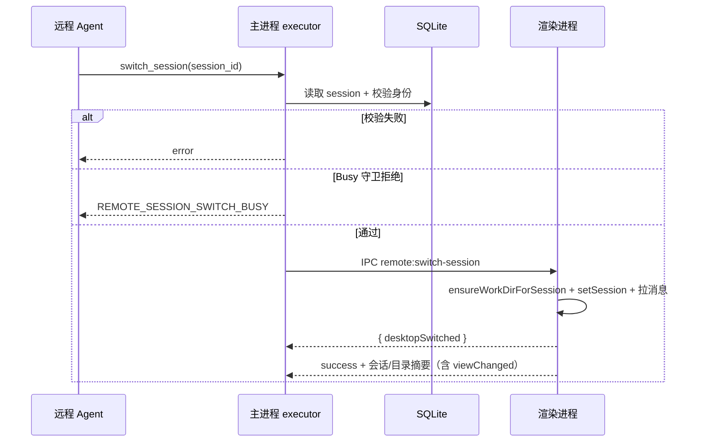
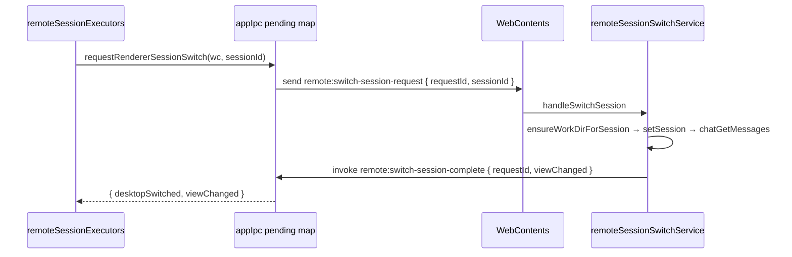

# 远程会话上下文感知与续接 — 需求规格

> **版本：** v1.4  
> **日期：** 2026-07-12  
> **修订：** v1.4 — 吸收 [评审 v2](../review/remote-session-context-awareness-requirement-review-v2.md)：Tier-0/1 出站分级、通道 send 层一体化、dedupe/排序/IPC 定稿  
> **状态：** 建议批准进入技术设计  
> **评审参考：** [v1](../review/remote-session-context-awareness-requirement-review.md)、[v2](../review/remote-session-context-awareness-requirement-review-v2.md)
> **前置依赖：** [feishu-integration-requirement.md](./feishu-integration-requirement.md)、[wechat-integration-requirement.md](./wechat-integration-requirement.md)、[remote-progress-activity-sync-requirement.md](./remote-progress-activity-sync-requirement.md)、[remote-workdir-tools-requirement.md](./remote-workdir-tools-requirement.md)、[remote-workdir-switch-guard-requirement.md](./remote-workdir-switch-guard-requirement.md)

---

## 目录

1. [概述](#1-概述)
2. [背景与现状](#2-背景与现状)
3. [目标与非目标](#3-目标与非目标)
4. [功能需求 A：出站消息携带会话标识](#4-功能需求-a出站消息携带会话标识)
5. [功能需求 B：远程专用「切换会话」工具](#5-功能需求-b远程专用切换会话工具)
6. [功能需求 C：基于空闲超时的会话续接](#6-功能需求-c基于空闲超时的会话续接)
7. [异常与边界场景](#7-异常与边界场景)
8. [用户故事](#8-用户故事)
9. [配置项变更](#9-配置项变更)
10. [验收标准](#10-验收标准)
11. [分期建议](#11-分期建议)
12. [附录 A：现网代码索引](#附录-a现网代码索引)
13. [附录 B：关联文档修订清单](#附录-b关联文档修订清单)
14. [附录 C：switch_session 测试用例](#附录-cswitch_session-建议测试用例并入-guard-7)
15. [附录 D：评审采纳记录](#附录-d评审采纳记录)

---

## 1. 概述

### 1.1 问题陈述

飞书 / 微信远程用户发起指令后，IM 侧回复中**不包含**当前对应桌面会话的标识；桌面端收到远程入站事件时**不会自动切换**到该会话；会话续接仍按「固定 N 分钟滑动窗口合并」，与用户真实对话节奏不一致。

综合表现：远程用户不知道 Agent 在哪个会话里工作、无法凭 IM 信息回到同一会话继续聊；桌面用户若正在其他会话，也看不到远程任务上下文——「Agent 没有脑子」。

### 1.2 改进方向（三项）

| ID | 能力 | 一句话 |
|----|------|--------|
| **A** | 出站会话后缀 | 除纯「正在处理」兜底文案外，IM 出站文本末尾追加 ` 会话$<sessionId>$` |
| **B** | `switch_session` 工具 | 远程 Agent 专用；按 sessionId 切换桌面当前会话，并同步工作目录 |
| **C** | 空闲超时续接 | 以「末条消息发送完成」为起点计空闲；超时后下一条远端指令开新会话 |

### 1.3 范围

| 通道 | 是否纳入 |
|------|----------|
| 飞书远程指令 | ✅ |
| 微信远程指令 | ✅ |
| 桌面 Agent 出站 | ❌（无 IM 通道） |
| 桌面 Agent 工具集 | ❌（`switch_session` 不可见） |

---

## 2. 背景与现状

### 2.1 出站消息路径（分散、无统一后缀）

| 消息类型 | 现网文案示例 | 发送位置 |
|----------|-------------|----------|
| 收包 Ack | `已收到，正在处理…` | `remoteCommandRouter` / `weChatCommandRouter` |
| 心跳兜底 | `仍在处理…` | `remoteProgressCoordinator` → `resolveHeartbeatProgressText` fallback |
| 进度快照 | `【进度】读取 config.json…` | `remoteProgressCoordinator.runHeartbeat` |
| 确认即时提示 | `【进度】等待确认：写入 a.txt…` | `sendInstantRemoteProgressReply` / ConfirmManager |
| 最终摘要 | Agent `summary` 全文 | `replyFeishuText` / `replyWeChatSummary` |
| 守卫拒绝 | `当前会话有任务正在执行…` | `REMOTE_SESSION_BUSY_MESSAGE` 等 |
| 去歧义 | 数字选项目列表 | `buildDisambiguationReply`（**Tier-0**，无后缀） |

**问题：** 上述路径各自调用 reply，无统一格式化层，用户无法从 IM 得知 `sessionId`。

### 2.2 桌面会话切换（远程入站不跟随）

现网远程入站 IPC（`feishu:inbound-message` / `wechat:inbound-message`）在 `ChatView` 中仅 **刷新会话元数据与消息列表**，**不** 调用 `setSession(sessionId)`。

用户从 IM 回到桌面，或 Agent 提示「请查看桌面会话」时，当前 UI 可能仍停留在其他会话。

### 2.3 会话续接（滑动窗口，非对话结束语义）

| 通道 | 配置项 | 默认值 | 判定逻辑 |
|------|--------|--------|----------|
| 微信 | `remoteSessionMergeMinutes` | **10** | 同 `userId` 且 `now - wechatMeta.lastReplyAt < N 分钟` |
| 飞书 | `remoteSessionMergeMinutes` | **0**（现网） | 同 `chatId` 且 `now - session.updatedAt < N 分钟`；0 = 每条新会话。**目标默认改为 10，与微信一致** |

**问题：**

1. **语义错误：** 「10 分钟内任意消息续接」≠「上一轮对话结束后 10 分钟内可续聊」；用户中途离开 15 分钟再回来，可能被错误续到旧上下文，或不该续时被合并。
2. **指标不一致：** 微信用 `lastReplyAt`（仅最终 summary 更新），飞书用 `updatedAt`（任意 session 更新均刷新），双通道不对齐。
3. **长任务：** 执行中无 outbound 时，滑动窗口可能过期，下一条指令误开新会话（与「同一轮任务」预期不符）。

---

## 3. 目标与非目标

### 3.1 目标

| ID | 目标 | 优先级 |
|----|------|--------|
| G1 | Tier-1 IM 出站统一携带后缀；Tier-0 豁免（§4.3） | P0 |
| G2 | 远程 Agent 可调用 `switch_session`，桌面 UI 跳转并同步工作目录 | P0 |
| G3 | 会话续接改为「末条消息发送完成后空闲 N 分钟」语义，双通道一致 | P0 |
| G4 | 出站格式化以 **通道 send 入口** 为唯一注入点（§4.4、§4.6） | P0 |
| G5 | `switch_session` 纳入远程 Busy 守卫（对齐 `switch_work_dir` / `canBindSessionWorkDir`） | P0 |
| G6 | 设置页文案与配置语义同步更新 | P1 |

### 3.2 非目标

| 项 | 说明 |
|----|------|
| 远程用户 IM 内嵌深链接 | 后缀仅为可复制文本，不做 URL scheme |
| `list_sessions` 工具 | 本期不做；用户从后缀复制 ID，或由 Agent 引导 |
| 自动切换桌面会话 | 远程入站**默认仍不**抢焦点；仅 `switch_session` 或用户手动切换 |
| 修改桌面会话列表排序 / 分组 | 不在本需求范围 |
| 变更 Typing 行为 | Typing 非文本消息，不追加后缀 |

### 3.3 术语与数据结构

#### 3.3.1 命名约定

| 语境 | 命名 | 示例 |
|------|------|------|
| TypeScript / DB / 文档正文 | `sessionId`（camelCase） | `ctx.sessionId` |
| 工具 JSON `input_schema` | `session_id`（snake_case） | 与现网 `switch_work_dir.profile_id` 一致 |
| metadata 字段 | `remoteSessionLastActivityAt` | 毫秒时间戳 |

#### 3.3.2 远程身份键（续接 / 切换共用）

| 通道 | 身份键 | 存储位置 | 粒度说明 |
|------|--------|----------|----------|
| 飞书 | `feishuChatId` | `session.metadata.feishuChatId` | **按 chat 续接**（单聊 / 群聊均为 chatId）；同群多 sender **共享**续接会话（延续现网） |
| 微信 | `wechatUserId` | `session.metadata.wechatMeta.userId` | **按微信用户**续接 |

「其他 chat / 其他用户」= 身份键与当前 `remoteContext` 不一致。

#### 3.3.3 `RemoteContext`（引用）

类型定义见 `electron/tools/types.ts`：

| 字段 | 飞书 | 微信 |
|------|------|------|
| `source` | `'feishu'` | `'wechat'` |
| 身份 | `chatId` | `userId` |
| 调用方 session | `sessionId`（可选，与 `ctx.sessionId` 一致） | 同左 |

`switch_session` 身份校验 **必须**使用与 `resolve*Session` 相同的身份键，且 **`target.metadata.source === remoteContext.source`**（**禁止跨通道**切换）。

#### 3.3.4 Busy 注册表与切换守卫分工

沿用 [remote-workdir-switch-guard-requirement.md](./remote-workdir-switch-guard-requirement.md) 现网 registry API，**本需求不新增 registry 方法**：

- `tryClaimRemoteSession` / `releaseRemoteSession` — **仅** `processCommand` 入站互斥（`SESSION_BUSY`）
- `isRemoteAgentRunning(sessionId)` — **仅** `canBindSessionWorkDir`（`switch_work_dir`）共用

`switch_session` **不再**使用 `isRemoteAgentRunning` 判定 busy；运行时不可切换状态由 `electron/remote/remoteSessionSwitchState.ts` 追踪（见 §5.4）。

---

## 4. 功能需求 A：出站消息携带会话标识

### 4.1 后缀格式（规范）

```
<正文> 会话$<sessionId>$
```

| 规则 | 说明 |
|------|------|
| 分隔 | 正文与后缀之间 **一个半角空格** |
| 字面量 | `会话`、`$` 为固定字面量（含美元符号） |
| sessionId | 会话 UUID，与 DB `sessions.id` 一致 |
| 示例 | `【进度】读取 config.json\n准备中… 会话$a1b2c3d4-e5f6-7890-abcd-ef1234567890$` |

### 4.2 「正在处理」系列（**不**追加后缀）

**仅**下列 **固定预置** 文案视为纯处理中占位，**禁止**追加会话后缀：

```typescript
/** src/shared/remoteOutboundFormat.ts */
export const REMOTE_PROCESSING_PLACEHOLDERS = [
  '已收到，正在处理…',
  '仍在处理…',
  '仍在处理中，请稍候…' // 历史/配置兼容项；现网 DEFAULT 为「仍在处理…」，legacy 文档曾用此文案
] as const

export function isRemoteProcessingPlaceholder(text: string): boolean {
  return REMOTE_PROCESSING_PLACEHOLDERS.includes(text.trim() as (typeof REMOTE_PROCESSING_PLACEHOLDERS)[number])
}
```

| 规则 | 说明 |
|------|------|
| 匹配方式 | **仅** `trim()` 后 **全等** 预置表；**无**归一化、**无**子串匹配 |
| 用户自定义 `remoteProgressFallbackText` | 若 **不等于** 上表任一条 → **视为普通 outbound**，**须**追加后缀（见验收 A9） |
| Ack 文案 | 硬编码 `已收到，正在处理…` 始终无后缀；**不**随配置变更 |

### 4.3 出站分级（Tier-0 / Tier-1）

现网 Router 中多条 outbound 发生在 **`resolve*Session` 之前**，尚无 `sessionId`。本需求采用 **方案 A（已确认）**：按是否持有 sessionId 分级，**禁止**为 Tier-0 早退路径提前 `resolve*Session`（避免误创建会话、污染 idle）。

#### 4.3.1 Tier-1（有 `sessionId`）— 必须后缀 + touch

| 类型 | 典型时机 | 后缀 | touch |
|------|----------|------|-------|
| Activity 快照心跳 | progress 会话内 | ✅ | ✅ 发送成功后 |
| 确认即时 reply | confirm manager | ✅ | ✅ |
| 最终摘要 | `processCommand` 完成 | ✅ | ✅ |
| `SESSION_BUSY` / `PARALLEL_FULL` | claim 后 | ✅ | ✅ |
| 绑定失败、Agent 执行错误摘要 | `processCommand` 内 | ✅ | ✅ |
| Ack `已收到，正在处理…` | 新 session 首包（**有** sessionId） | ❌ placeholder | ✅ |

> Tier-1 中 **非 placeholder** 的正文均须后缀；Ack 虽无后缀，仍 touch（刷新 idle）。

#### 4.3.2 Tier-0（无 `sessionId`）— 豁免后缀 + 不 touch

发生在 `resolve*Session` **之前** 的早退 outbound：

| 类型 | 现网位置 |
|------|----------|
| 权限拒绝、allowlist | `handleInbound` |
| 频率限制、消息过长 | `handleInbound` |
| 敏感目录拒绝（飞书，入站解析后、`processCommand` 前） | `handleInbound` |
| 工作目录去歧义列表 | `pendingDisambiguation` |
| 媒体类型拒绝等 | `handleInbound` |

**规则：** Tier-0 **不**追加后缀、**不**调用 `touchRemoteSessionActivity`、**不**为携带后缀而提前 resolve。

#### 4.3.3 与 §4.2 placeholder 的关系

「正在处理」系列在任何 Tier 均免后缀；Tier 区分仅影响 **有实质内容但无 sessionId** 的路径（Tier-0 整体豁免）。

> **产品说明：** 用户首次交互若仅收到 Tier-0 拒绝/去歧义，IM 中 **无** sessionId 属预期；**首次获得 sessionId** 的触点通常是 Tier-1 Ack 之后的进度/摘要，或 busy 拒绝（已 resolve）。

### 4.4 统一格式化层（`remoteOutboundFormat.ts`）

```typescript
/** UUID v4，与 sessions.id 一致 */
export const SESSION_SUFFIX_REGEX =
  / 会话\$[0-9a-fA-F]{8}-[0-9a-fA-F]{4}-[0-9a-fA-F]{4}-[0-9a-fA-F]{4}-[0-9a-fA-F]{12}\$$/

export function stripSessionSuffix(text: string): string {
  return text.replace(SESSION_SUFFIX_REGEX, '').trimEnd()
}

export function formatRemoteOutboundMessage(
  body: string,
  sessionId: string,
  opts?: { forceSuffix?: boolean }
): string { /* 同 v1.3 */ }

/** 进度 dedupe 用：剥后缀后的正文 */
export function progressReplyDedupeKey(text: string): string {
  return stripSessionSuffix(text).trim()
}
```

| 步骤 | 行为 |
|------|------|
| 1–4 | 同 v1.3（trim → placeholder 检查 → 剥旧后缀 → 追加新后缀） |

**进度 dedupe（P1-1）：** `remoteProgressCoordinator.sendProgressReply` 的 dedupe key **必须**基于 `stripSessionSuffix` 后正文，避免「首次无后缀、二次有后缀」重复发送；`markRemoteProgressReplySent` 存 stripped body。

**IM 发送失败：** 通道 send 层 **确认成功** 后才 touch（§6.2）；失败不 touch。

**实施原则（P1-5）：** 实现 **应** 以 **通道 send 入口** 为唯一格式化/touch 注入点；下列为 **迁移清单**，Router 分支 **不应** 各自调用 `formatRemoteOutboundMessage`：

| 通道 wrapper | 文件（新建/改造） |
|--------------|------------------|
| 飞书 | `electron/feishu/feishuRemoteOutbound.ts` → 替代直接 `replyFeishuText` |
| 微信 | `electron/wechat/weChatRemoteOutbound.ts` → 包装 `replyWeChatSummary` / bot.reply |
| 进度 | `remoteProgressCoordinator` → `adapter.reply` 注入 sessionId |

### 4.5 通道长度与后缀顺序（双通道统一）

**统一原则：** 正文截断 → 追加后缀 → 校验通道硬上限（后缀 **不可截断**）。

| 通道 | 硬上限 | 正文截断预算 | 特殊 footer |
|------|--------|-------------|-------------|
| 微信 summary | 2000 字 | 预留 footer + 后缀长度 | `\n\n完整过程请查看 SpaceAssistant 桌面会话` |
| 飞书 reply | 4000 字 | 预留后缀长度 | 无 |
| 飞书 progress 心跳 | 受 `remoteProgressMaxChars` | 截断 **仅**作用于 `【进度】` 正文；后缀 **不计入** maxChars | — |

**微信算法：**

1. `body = stripMarkdown + footer`（现网 `formatWeChatSummary` 逻辑，**不含**后缀）；
2. `suffixLen = 1 + 2 + sessionId.length + 1`（空格 + `会话$` + id + `$`）；
3. 若 `body.length + suffixLen > 2000`，截断 body（保留 footer）；
4. `formatRemoteOutboundMessage(body, sessionId)`。

**长任务与 idle：** 心跳默认 60s 刷新 activity（§6.2），`remoteSessionIdleMinutes > 0` 且心跳间隔 **小于** idle 窗口时，长任务 **不会** 误开新会话（C3）。

### 4.6 通道 send 层（截断 + 后缀 + 发送 + touch 一体化）

**问题（P0-2）：** 现网 `replyFeishuText` 对 **整段** 文本做 4000 字截断；若在 call site 先追加后缀再传入，后缀可能被截断。

**规则：** **禁止** call site「先 format 再 raw reply」；Tier-1 必须经通道 wrapper。

#### 4.6.1 飞书 `sendFeishuRemoteOutbound`

```typescript
export async function sendFeishuRemoteOutbound(args: {
  runner: LarkCliRunner
  messageId: string
  body: string
  sessionId?: string // 缺省 = Tier-0
  touch?: { db: AppDatabase; sessionId: string }
}): Promise<void>
```

| 步骤 | Tier-1（有 sessionId） | Tier-0 |
|------|------------------------|--------|
| 1 | `suffixLen = formatRemoteOutboundMessage('', sessionId).length` | — |
| 2 | `maxBody = 4000 - suffixLen`；超长则截断 **正文** + `…（完整结果请查看桌面会话）` | `maxBody = 4000` |
| 3 | `text = formatRemoteOutboundMessage(truncatedBody, sessionId)` | `text = body` |
| 4 | 底层 `replyFeishuTextRaw`（**不再**二次截断） | 同左 |
| 5 | 成功 → `touchRemoteSessionActivity` | 不 touch |

改造 `feishuReply.ts`：拆出 `replyFeishuTextRaw(runner, messageId, text)`（无截断）；原 `replyFeishuText` 可委托 Tier-0 或 deprecated。

#### 4.6.2 微信 `sendWeChatRemoteOutbound`

```typescript
export async function sendWeChatRemoteOutbound(args: {
  bot: WeChatReplyBot
  inbound: IncomingMessage
  body: string
  sessionId?: string
  touch?: { db: AppDatabase; sessionId: string }
}): Promise<void>
```

| 步骤 | Tier-1 | Tier-0 |
|------|--------|--------|
| 1 | `base = formatWeChatSummary(body)`（footer，**无**后缀） | 同左或 raw |
| 2 | 预留 suffixLen；超 2000 则截断 base 正文 | 现网 2000 逻辑 |
| 3 | `text = formatRemoteOutboundMessage(base, sessionId)` | `text = base` |
| 4 | `bot.reply` | 同左 |
| 5 | 成功 → touch | 不 touch |

#### 4.6.3 进度 adapter

`RemoteProgressAdapter.reply(text)` 在 `startRemoteProgressSession` 时闭包捕获 `sessionId`，内部调用对应通道 wrapper（Tier-1）。

---

## 5. 功能需求 B：远程专用「切换会话」工具

### 5.1 工具定义

| 属性 | 值 |
|------|-----|
| 名称 | `switch_session` |
| 描述 | 将桌面端当前视图切换到指定会话，并同步该会话绑定的工作目录。仅远程会话（飞书/微信）可用。 |
| 风险等级 | `low` |
| 需要确认 | 否 |
| 可见范围 | 仅 `remoteContext != null` 时注入 API（同 `list_work_dirs` / `switch_work_dir`） |

**input_schema：**

```json
{
  "type": "object",
  "properties": {
    "session_id": {
      "type": "string",
      "description": "目标会话 ID（UUID），通常来自 IM 出站末尾「 会话$...$ 」后缀"
    }
  },
  "required": ["session_id"]
}
```

**返回数据：**

```typescript
interface SwitchSessionResult {
  sessionId: string
  sessionName: string
  workDirProfileId?: string
  workDirName?: string
  workDirPath?: string
  /** 渲染进程已完成切换请求（含幂等 no-op） */
  desktopSwitched: boolean
  /** UI 是否实际变更了 currentSessionId（幂等时为 false） */
  viewChanged: boolean
}
```

| 字段 | 含义 |
|------|------|
| `desktopSwitched` | IPC 成功且 workDir 同步成功 |
| `viewChanged` | `currentSessionId` 由 A → B（A≠B）；已处于 B 时为 `false` |

### 5.2 执行语义



| 步骤 | 说明 |
|------|------|
| 1 | 拒绝无 `remoteContext` 的调用 |
| 2 | 目标 session 必须存在 |
| 3 | **身份绑定校验**（见 §5.3） |
| 4 | **Busy 守卫**（见 §5.4，`canSwitchRemoteSession`） |
| 5 | 经 IPC 通知渲染进程切换 |
| 6 | 渲染进程：`ensureWorkDirForSession` → `setSession` → 刷新消息列表 |
| 7 | 写审计日志与 CLI 事件（见下表） |

**审计事件（`feishu-audit.log` / 微信对称；CLI 镜像 `feishu.session.switch*` / `wechat.session.switch*`）：**

| type | 时机 | 字段 |
|------|------|------|
| `session_switch` | IPC 成功且 `desktopSwitched` | `channel`, `callerSessionId`, `targetSessionId`, `requestId`, `desktopSwitched`, `viewChanged`, `workDirProfileId?` |
| `session_switch_denied` | 身份 / 守卫 / 无窗口 / IPC 失败 | `channel`, `callerSessionId`, `targetSessionId`, `requestId`, `reason`: `identity` \| `guard` \| `no_window` \| `ipc`, `code?`, `blockers?`, `error` |

`blockers` 取值：`pending_confirm` \| `tool_in_flight` \| `llm_in_flight`（守卫拒绝时）。

### 5.3 身份绑定校验

须 **同时** 满足：

| # | 条件 |
|---|------|
| 1 | 目标 session 存在于 DB |
| 2 | `target.metadata.source === remoteContext.source`（**禁止跨通道**：飞书 Agent 不可切微信 session，反之亦然） |
| 3 | 身份键匹配（§3.3.2） |

| 通道 | 校验表达式 |
|------|-----------|
| 飞书 | `source==='feishu' && target.feishuChatId === remoteContext.chatId` |
| 微信 | `source==='wechat' && target.wechatMeta.userId === remoteContext.userId` |

**拒绝场景与文案：**

| 场景 | error |
|------|-------|
| UUID 不存在 / 已删除 | `无法切换到该会话：会话不存在或无权访问` |
| 桌面会话 / source 缺失 | 同上 |
| 身份键不匹配 | 同上（**不**区分「不存在」与「无权」，避免信息泄露） |
| 跨通道 | 同上 |

### 5.4 Busy 守卫（显式不可切换状态）

> **与 registry 分工：** `runningRemoteAgentRegistry` / `isRemoteAgentRunning` **仅**服务入站 `SESSION_BUSY` 与 `switch_work_dir`（`canBindSessionWorkDir`）。`switch_session` 守卫由 `remoteSessionSwitchState.ts` 枚举运行时 blocker，**不得**用 registry 占用 alone 拒绝切换。

#### 5.4.1 守卫动机

| 风险 | 说明 |
|------|------|
| 调用方 session 有 in-flight 工具 / LLM / 待确认卡片 | 远程 Agent 仍在 `toolChatLoop` 中；此时 `ensureWorkDirForSession` 会切换**全局 active 工作目录**，与 `switch_work_dir` busy 拒绝同理，可能导致 loop 内 `resolveWorkDir()` 语义漂移 |
| 目标 session 有 in-flight 工具 / LLM / 待确认卡片 | 目标会话仍有未完成工作；切换桌面视图会与运行中 loop / 流式 UI 竞态 |

因此 `switch_session` **不是** `list_work_dirs` 式只读例外；存在 blocker 时 **一律拒绝**。

**明确不属于 blocker（允许切换）：**

- `tryClaimRemoteSession` 占用 alone（同一次入站首工具 `switch_session` 须允许）
- 已完成的历史工具（两轮 LLM 之间的空档）
- 已完成动作（如「曾经读过文件」）

#### 5.4.2 守卫 API

```typescript
// electron/remote/remoteSessionSwitchGuard.ts

export type SwitchBlocker = 'pending_confirm' | 'tool_in_flight' | 'llm_in_flight'

export type SwitchSessionGuardResult =
  | { allowed: true }
  | { allowed: false; error: string; code: 'caller_busy' | 'target_busy'; blockers: SwitchBlocker[] }

export function canSwitchRemoteSession(
  callerSessionId: string,
  targetSessionId: string,
  opts: {
    callerRequestId: string
    hasPendingConfirm: (sessionId: string) => boolean
  }
): SwitchSessionGuardResult
```

**Blocker 检测（caller 与 target 共用，任一命中即拒绝）：**

| Blocker | 含义 | 检测 |
|---------|------|------|
| `pending_confirm` | 该会话有待处理远程确认（飞书/微信 Y/N 卡片） | `confirmManager.hasPendingForSession(sessionId)` |
| `tool_in_flight` | 有工具正在 `execute`（await 未返回） | `remoteSessionSwitchState` per-session 计数 > 0 |
| `llm_in_flight` | 有 LLM stream 正在进行 | `remoteSessionSwitchState` per-session 计数 > 0 |

**LLM 切换专用例外（仅检查 caller）：** 若仅 `llm_in_flight` 命中，且 `callerRequestId` 对应当前 tool loop 的 `requestId`，且该 `requestId` **尚未执行过**除 `switch_session` 以外的工具 → **不因 LLM in-flight 拒绝**（允许「为了切会话」的那一轮 LLM 之后立刻调 `switch_session`）。

| 检查顺序 | 条件 | 结果 |
|----------|------|------|
| 1 | caller 存在任一 blocker（含 LLM 例外判定） | 拒绝，`caller_busy`，返回 `blockers[]` |
| 2 | `targetSessionId !== callerSessionId` 且 target 存在任一 blocker | 拒绝，`target_busy`，返回 `blockers[]` |
| 3 | 否则 | 允许 |

**说明：**

- `switch_session` 的 guard 在 `execute()` 入口执行；loop 侧对 `switch_session` **不在** `exec.execute` 前 `beginTool`，避免自我阻塞；guard 通过后在 executor 内再 `beginTool`/`endTool`
- `targetSessionId === callerSessionId` 且无 blocker：允许（幂等刷新桌面视图）

#### 5.4.3 错误文案与错误码

新增常量（`electron/remote/remoteSessionGuardMessages.ts`）：

| 常量 | 文案 | `errorCodes` |
|------|------|--------------|
| `REMOTE_SESSION_SWITCH_BUSY_CALLER` | 当前会话有任务正在执行，无法切换会话。 | `REMOTE_SESSION_SWITCH_BUSY` |
| `REMOTE_SESSION_SWITCH_BUSY_TARGET` | 目标会话有任务正在执行，请稍后再试。 | `REMOTE_SESSION_SWITCH_BUSY` |

工具返回：`{ success: false, error: <上表文案> }`；Agent 可原样转述至 IM（经 §4 outbound 后缀格式化）。

#### 5.4.4 场景矩阵

| 场景 | 行为 | 对齐 guard 用例 |
|------|------|-----------------|
| 会话 A 有 `tool_in_flight` / `pending_confirm`，工具 `switch_session(B)` | **拒绝**（caller busy） | T14 |
| 会话 B 有 in-flight / confirm，工具 `switch_session(B)` | **拒绝**（target busy） | T15 |
| 会话 A 仅 registry 占用、无 blocker，同入站首工具 `switch_session(B)` | **允许**；桌面跳转 + workDir 同步 | T16 延伸 |
| 会话 A、B 均无 blocker，`switch_session(B)` | 允许；桌面跳转 + workDir 同步 | T16 |
| 会话 A 无 blocker，`switch_session(A)` | 允许（幂等） | — |
| 飞书 A 有 blocker，微信 B 工具 `switch_session(B)` | 允许（跨通道 blocker 互不影响） | — |
| 远程入站 `SESSION_BUSY` 期间另一入站 | Router `tryClaimRemoteSession` 拒绝（与 switch guard 独立） | T17 |

#### 5.4.5 与 `switch_work_dir` 对比

| 工具 | busy 守卫对象 | 判定来源 |
|------|--------------|----------|
| `switch_work_dir` | **当前** `ctx.sessionId` 的 `workDirProfileId` 变更 | `isRemoteAgentRunning(sessionId)`（registry） |
| `switch_session` | **调用方** + **目标** session 的导航 / 全局 workDir 同步 | `remoteSessionSwitchState` + `hasPendingForSession`（**非** registry） |

二者均在 tool executor 入口调用 guard，**不** claim / release registry（claim 仍仅属 `processCommand`，见 guard §4.2.3）。

#### 5.4.6 会话续接（§6）与 registry 关系

| 项 | 规则 |
|----|------|
| 切换后用户再发 IM | 由 §6 空闲续接解析 session；`switch_session` 成功后会 **touch 目标会话** 并更新 `remoteContext.sessionId`，出站后缀与续接跟随目标会话 |
| busy 时 IM 新指令 | 仍走 `tryClaimRemoteSession` → `REMOTE_SESSION_BUSY`（入站互斥），与 switch 工具守卫独立 |
| registry 占用 | **不**阻止同一次入站内的 `switch_session`（修复「切换指令永远失败」死锁） |

> **产品说明：** `switch_session` 解决「桌面用户看哪里」；须在 **无 in-flight / confirm blocker** 窗口调用。Agent 应在 IM 回复中说明：「当前任务执行中无法切换，请稍后再试」或引导用户任务结束后再切换。

#### 5.4.7 IPC 切换（单次 invoke 往返）

对齐 `workdir:switch` 的 **request/response** 心智，但 UI 状态在渲染进程，采用 **主进程发起、渲染进程执行、单次 ACK** 模式：



| 项 | 规格 |
|----|------|
| 主进程 | `requestRendererSessionSwitch(wc, sessionId)` + `ipcMain.handle('remote:switch-session-complete', …)` |
| 渲染进程 | `initRemoteSessionSwitchBridge()` 订阅 `remote:switch-session-request`，完成后 **invoke complete** |
| **禁止** | `webContents.send` + 独立 fire-and-forget；**禁止** send/handle 双通道混用 |
| 顺序 | `ensureWorkDirForSession` 成功 → `setSession` → `chatGetMessages` |
| 幂等 | 已在 target 且 workDir 已同步 → `{ desktopSwitched: true, viewChanged: false }` |
| 失败 | workDir 失败 → `{ desktopSwitched: false }`，**不** `setSession`（B11） |
| 并发 | 主进程对 `wc` 串行 mutex；同一窗口排队 |
| 超时 | 5s 无 ACK → 工具失败，记 audit |

### 5.5 工具注册与实施清单（有序）

| 序号 | 任务 | 文件 |
|------|------|------|
| 1 | 工具 schema | `src/shared/builtinToolDefinitions.ts` |
| 2 | 风险等级 `low` | `src/shared/domainTypes.ts` → `builtinToolRiskLevel` |
| 3 | 远程过滤 | `electron/toolsConfigRuntime.ts` |
| 4 | 执行器 | `electron/tools/remoteSessionExecutors.ts` |
| 5 | Busy 守卫 | `electron/remote/remoteSessionSwitchGuard.ts` |
| 6 | 错误文案 | `electron/remote/remoteSessionGuardMessages.ts` |
| 7 | 错误码 | `src/shared/errorCodes.ts` |
| 8 | 注册 executor | `electron/tools/index.ts`（或现网注册点） |
| 9 | 通道 outbound | `feishuRemoteOutbound.ts` / `weChatRemoteOutbound.ts`（§4.6） |
| 10 | 格式化 | `src/shared/remoteOutboundFormat.ts` |
| 11 | touch | `electron/remote/remoteSessionActivity.ts` |
| 12 | IPC pending + complete | `requestRendererSessionSwitch.ts` + `appIpc.ts` |
| 13 | 渲染 bridge | `remoteSessionSwitchService.ts` + `App.tsx` |
| 14 | 设置页 copy | `src/shared/builtinToolSettingsCopy.ts` |
| 15 | 单测 | outbound / guard / resolver / executor |

### 5.6 Agent 使用指引（系统提示 / 工具 description）

工具 description 应暗示典型场景：

- 用户从 IM 复制 `会话$…$` 并要求「继续刚才的会话」（**须**目标与会话均非 busy）
- 用户询问「现在是在哪个会话」，Agent 解析后缀后调用以同步桌面视图
- 远程任务涉及多会话协作时，Agent 主动切换以便桌面用户查看
- **禁止**在工具 loop 执行中（caller busy）尝试切换；应告知用户待当前任务完成后再操作

---

## 6. 功能需求 C：基于空闲超时的会话续接

### 6.1 语义变更（核心）

| | 现网（滑动合并） | 目标（空闲续接） |
|---|----------------|-----------------|
| **起点** | 上一条入站 / `updatedAt` | **末条消息发送完成**时刻 |
| **结束** | 固定 N 分钟无 **新入站** | 空闲 N 分钟无 **任何新消息** |
| **新指令** | 窗口内 → 续旧 session | 空闲已超时 → **新建** session |
| **用户感知** | 「10 分钟内都算同一个」 | 「上次聊完 10 分钟内还能续；否则新开一轮」 |

### 6.2 「末条消息发送完成」定义

记 `session.metadata.remoteSessionLastActivityAt`（毫秒时间戳）：

| 事件 | 是否刷新 | 刷新时机 |
|------|----------|----------|
| 远程 user 消息持久化 | ✅ | **`tryClaimRemoteSession === 'ok'` 之后** 的 `appendMessage(user, status:'sent')` 完成（见 §6.4） |
| IM 出站文本 | ✅（**Tier-1**） | 通道 wrapper **确认发送成功** 后 |
| Assistant 流式结束 | ✅ | DB 中 `status → completed \| failed` |
| IM 发送失败 / 重试中 | ❌ | 成功后再 touch |
| Typing | ❌ | — |
| 仅 Redux / UI patch | ❌ | — |

**`status: 'sent'`：** 指 `domainTypes.MessageStatus` 中 user 消息写入 DB 时的终态（非 `streaming` / `sending`）。现网 remote router 在 `appendMessage` 时即设为 `sent`。

**统一 touch 实现：**

```typescript
/** electron/remote/remoteSessionActivity.ts */
export function touchRemoteSessionActivity(
  db: AppDatabase,
  sessionId: string,
  at: number = Date.now()
): void {
  const session = getSession(db, sessionId)
  if (!session) return
  const prev = (session.metadata as { remoteSessionLastActivityAt?: number })
    .remoteSessionLastActivityAt ?? 0
  const next = Math.max(prev, at) // 单调递增，抵御乱序/并发
  if (next === prev) return
  updateSession(db, sessionId, {
    metadata: { ...session.metadata, remoteSessionLastActivityAt: next }
  })
}
```

**性能：** 采用 `max(prev, at)` 单调合并 + 同值 skip 写入（见 v1.3 §6.2）。

### 6.3 续接判定算法

替换 `resolveFeishuSession` / `resolveWeChatSession` 内 merge 逻辑：

```typescript
function resolveActivityAt(session: Session): number {
  return (
    (session.metadata as { remoteSessionLastActivityAt?: number }).remoteSessionLastActivityAt
    ?? session.updatedAt
  )
}

function pickRemoteSessionCandidate(
  sessions: Session[],
  source: 'feishu' | 'wechat',
  identityKey: string,
  getIdentity: (s: Session) => string | undefined
): Session | undefined {
  const candidates = sessions
    .filter((s) => {
      const m = s.metadata as Record<string, unknown>
      return m?.source === source && getIdentity(s) === identityKey
    })
    .sort((a, b) => {
      const da = resolveActivityAt(a)
      const db = resolveActivityAt(b)
      if (db !== da) return db - da
      return b.createdAt - a.createdAt // 并列时较新创建的优先
    })
  return candidates[0]
}
```

```
idleTimeoutMs = readRemoteSessionIdleMinutes(config) * 60_000
if idleTimeoutMs <= 0 → 始终新建

existing = pickRemoteSessionCandidate(...)
if existing && (now - resolveActivityAt(existing)) < idleTimeoutMs:
  reuse
else:
  createNew
```

**注意：**

- **禁止** `listSessions().find()` 非确定性顺序（P1-2）
- 不再使用 `wechatMeta.lastReplyAt` 作为续接依据
- 复用 session 时更新 metadata（如 `feishuMessageId`）**不得**再依赖 `updatedAt` 作为 activity 代理（§6.7）

### 6.4 与 Busy 守卫协作

**processCommand 顺序（与 touch 强相关）：**

```
resolve*Session → tryClaim → [失败则 reply busy 并 return，不 appendMessage、不 touch]
→ appendMessage(user) + touch → run*RemoteAgent → outbound touch → finally release
```

| 场景 | 行为 |
|------|------|
| 空闲窗口内再发指令，session **busy** | `SESSION_BUSY`；**不** `appendMessage`、**不** touch（避免 idle 被误刷新） |
| 任务执行中 | 心跳 / Ack 等 outbound 持续 touch；idle 从末次 activity 起算 |
| 任务完成后 idle 窗口内 | 同 session 续上下文 |
| idle 超时后 | 新 session；旧 session 可通过后缀 ID + `switch_session` 查看 |

### 6.5 确认等待期间

| 项 | 规则 |
|----|------|
| 确认 prompt 发出 | Tier-1 outbound → touch |
| 用户 Y/N | `tryResolveFromInbound` 路径（**不**经 `processCommand` claim）；resolve 成功后须 **append user 消息**（若现网有）+ 后续 outbound → touch |
| 确认超时 | 按现网 confirm TTL 取消工具 |
| 超时后用户新指令 | 走 §6.4 `processCommand` 全链路 |

**独立路径说明（P2-4）：** confirm resolve 与 `processCommand` **并列**，均须调用 `touchRemoteSessionActivity`，但 **仅** confirm 成功且实际写入/回复时 touch；Y/N 路径 **不** claim、**不**触发 `SESSION_BUSY`（guard US-RBG06）。

### 6.6 配置项重命名与迁移

| 现网字段 | 目标字段 | 说明 |
|----------|----------|------|
| `remoteSessionMergeMinutes` | `remoteSessionIdleMinutes` | **语义变更**；建议 rename + 迁移 |

**迁移策略：**

1. **读取函数**（统一入口，避免散落 `??`）：

```typescript
// src/shared/feishuTypes.ts / wechatTypes.ts 或 shared helper
function readRemoteSessionIdleMinutes(
  config: FeishuConfig | WeChatConfig
): number {
  return config.remoteSessionIdleMinutes
    ?? config.remoteSessionMergeMinutes
    ?? DEFAULT_REMOTE_SESSION_IDLE_MINUTES
}
```

2. 写入设置页时：仅写 `remoteSessionIdleMinutes`
3. **默认值（已确认，双通道一致）：**
   - 微信 / 飞书默认：**10**
   - `0` = 禁用续接（每条远端指令新建 session）

**配置变更生效：** **立即**作用于 **下一次** `resolve*Session`（每次入站读取最新 config）；**不** retroactive 修改已打开 session 的历史计时。

**设置页文案：**

| 现网 | 目标 |
|------|------|
| 会话合并：__N__ 分钟内同用户消息续接 | 会话续接：末条消息发送完成后 __N__ 分钟内，下一条指令继续该会话 |

### 6.7 历史数据兼容

| 场景 | 行为 |
|------|------|
| 无 `remoteSessionLastActivityAt` 的旧 session | 续接判定 **一次性降级** `session.updatedAt` |
| 首次 Tier-1 outbound / touch | 写入 `remoteSessionLastActivityAt = now` |
| 复用 session 仅更新 metadata | **禁止**依赖 `updateSession` 触发的 `updatedAt` 变化替代 touch（P2-3） |

**迁移期要求：** `resolve*Session` 在复用分支调用 `updateSession(metadata patch)` 时，若本次无 outbound/user append，**不得** bump activity；后续仅以 `touchRemoteSessionActivity` 为准。

### 6.8 多远程身份并发（独立补充）

| 场景 | 行为 |
|------|------|
| 微信用户 A / B 同时发指令 | 各自身份键隔离；续接、busy、并行上限 **互不影响**（guard §US-RBG04） |
| 飞书 chat X / chat Y | 同上，按 `feishuChatId` 隔离 |
| 飞书群聊多 sender、同一 chatId | **共享**续接 session（现网语义保留）；busy 仍按 **sessionId** 单飞 |

---

## 7. 异常与边界场景

| 场景 | 期望行为 | 关联 |
|------|----------|------|
| **会话已删除** | `switch_session` → 不存在/无权；新 IM 指令 → `resolve*Session` 找不到候选 → **新建** session | B9 |
| **IM 出站失败** | 不 touch；重试成功后 touch + 后缀 | §4.4、§6.2 |
| **跨通道 switch** | 飞书 Agent 切微信 session → 拒绝 | §5.3、US-RSCA07 |
| **busy 拒绝后 idle** | 未 touch user 消息；idle 计时 **不变** | §6.4 |
| **自定义 fallback 文案** | 非预置表全文 → **带**后缀 | A9 |
| **`idleMinutes` 改为 0** | 下一入站立即新建 session | C8 |
| **`session:delete` 且 busy** | 沿用 guard P1：IPC 拒绝删除 | guard §5.1 |
| **Tier-0 早退** | 权限/限流/去歧义 | **无**后缀、**无** touch | §4.3.2、A11 |
| **后缀重复发送** | `SESSION_SUFFIX_REGEX` 剥除旧后缀 | A7 |
| **飞书长摘要** | 3990+ 字 | 后缀完整、正文截断 | A12 |

---

## 8. 用户故事

### US-RSCA01：从进度消息获知会话 ID

**作为** 微信远程用户，**当** 我收到带 `【进度】… 会话$abc$` 的心跳，**我希望** 知道桌面 Agent 正在会话 `abc` 中执行，**以便** 稍后引用该 ID 继续沟通。

### US-RSCA02：纯 Ack 不刷屏

**作为** 远程用户，**当** 我只收到「已收到，正在处理…」，**我希望** 消息 **不带** 会话后缀，**以便** 减少 noise。

### US-RSCA03：Agent 帮我打开对应桌面会话

**作为** 桌面用户，**当** 远程 Agent 调用 `switch_session`，**我希望** 界面自动跳到该会话并切换工作目录，**以便** 直接查看工具卡片与完整上下文。

### US-RSCA04：跨会话切换被拒绝

**作为** 攻击者 / 误操作，**当** 我试图 `switch_session` 到他人飞书 chat 的会话，**我希望** 工具返回无权错误，**以便** 保证隔离。

### US-RSCA04b：busy 时禁止切换会话

**作为** 远程用户，**当** 当前或目标会话仍有 Agent 执行中，**我希望** `switch_session` 被拒绝并返回明确文案，**以便** 与 `switch_work_dir` 一样不会出现执行语义漂移（参见 [remote-workdir-switch-guard-requirement.md](./remote-workdir-switch-guard-requirement.md) US-RBG02）。

### US-RSCA05：对话自然结束后再开新会话

**作为** 远程用户，**当** 上次任务摘要已收到且 **超过 10 分钟** 未再发消息，**我希望** 下一条指令在新会话执行，**以便** 不携带陈旧上下文。

### US-RSCA06：短暂间隔内续聊

**作为** 远程用户，**当** 上次摘要收到后 **3 分钟** 再发追问，**我希望** 仍在同一会话，**以便** Agent 记住刚才结论。

### US-RSCA07：跨通道切换被拒绝

**作为** 飞书远程用户，**当** Agent 尝试 `switch_session` 到 `[微信]` 前缀的会话，**我希望** 工具失败，**以便** 通道隔离不被破坏。

### US-RSCA08：已删除会话不可切换

**作为** 远程用户，**当** 我引用旧后缀 ID 但桌面已删该会话，**我希望** 收到「会话不存在或无权访问」，**以便** 知晓需重新发指令开新会话。

### US-RSCA09：修改空闲时间立即生效

**作为** 管理员，**当** 我把空闲续接从 10 改为 0 并保存，**我希望** 下一条远端指令立刻新建会话，**以便** 调试或临时禁用续接。

---

## 9. 配置项变更

| 配置键 | 类型 | 默认（微信） | 默认（飞书） | UI 位置 |
|--------|------|-------------|-------------|---------|
| `remoteSessionIdleMinutes` | number | 10 | **10**（与微信一致） | 遥控 Tab · 会话续接 |
| `remoteProgressFallbackText` | string | `仍在处理…` | 同左 | 高级 · 进展同步 |

**i18n 新增 key 示例：**

- `feishu.sessionIdleLabel` / `settings.wechat.sessionIdleLabel`
- `tools.switchSession.name` / `tools.switchSession.description`

### 9.1 升级迁移说明（Release Note）

| 项 | 说明 |
|----|------|
| **飞书默认 idle** | 自 **0 → 10**：升级后默认 **10 分钟内**续接同一 chat 的上个远程 session；旧行为（每条新 session）设 **`remoteSessionIdleMinutes = 0`** |
| **微信** | 默认仍为 10，**语义**由滑动合并改为空闲续接（非 BREAKING 默认值） |
| **配置读取** | 旧字段 `remoteSessionMergeMinutes` 只读兼容，保存后写新字段 |
| **用户沟通** | 设置页 Release 提示或 changelog 一句说明飞书默认变更 |

---

## 10. 验收标准

### 10.1 出站后缀（A）

| # | 场景 | 期望 |
|---|------|------|
| A1 | Activity 心跳 `【进度】读取文件…` | 末尾含 ` 会话$<id>$` |
| A2 | Ack `已收到，正在处理…` | **不含** 后缀 |
| A3 | 兜底心跳 `仍在处理…` | **不含** 后缀 |
| A4 | 最终 summary | 含后缀 |
| A5 | 确认 Y/N prompt | 含后缀 |
| A6 | `SESSION_BUSY` 拒绝 | 含后缀 |
| A7 | 同一正文重复发送 | 不叠双后缀 |
| A8 | 微信 2000 字边界 | 后缀完整可见 |
| A9 | 自定义 `remoteProgressFallbackText='正在分析…'` | **含**后缀（非预置表全文） |
| A10 | IM send 失败一次后重试成功 | 仅成功时 touch 一次 |
| A11 | Tier-0：去歧义 / 权限 / 限流 | **不含**后缀、不 touch |
| A12 | 飞书 3990+ 字 Tier-1 摘要 | 后缀完整可见；正文被截断 |

### 10.2 切换会话工具（B）

| # | 场景 | 期望 |
|---|------|------|
| B1 | 远程 Agent 调用合法 sessionId（双端 idle） | 桌面跳转 + workDir 同步 |
| B2 | 桌面 Agent 工具列表 | **无** `switch_session` |
| B3 | 切换到其他 user/chat 的 session | 失败 + 明确 error |
| B4 | **调用方** session 有 `tool_in_flight` / `pending_confirm` / `llm_in_flight`（非 switch-only 例外） | 失败，`REMOTE_SESSION_SWITCH_BUSY_CALLER` |
| B5 | **目标** session 有 in-flight / confirm | 失败，`REMOTE_SESSION_SWITCH_BUSY_TARGET` |
| B6 | 双端 idle 时 `switch_session(自身 id)` | 成功（幂等） |
| B7 | 飞书 session A busy，微信 session B idle 切换 B | 成功（跨通道隔离） |
| B8 | 审计日志与 CLI | 成功写 `session_switch`；拒绝写 `session_switch_denied`（含 `reason` / `blockers`）；CLI 可搜 `feishu.session.switch` / `feishu.session.switch_denied` |
| B9 | 目标 session 已删除 | 失败，统一无权文案 |
| B10 | 飞书 Agent 切微信 session | 失败 |
| B11 | workDir 切换失败 | 不 `setSession`；`desktopSwitched: false` |

### 10.3 空闲续接（C）

| # | 场景 | 期望 |
|---|------|------|
| C1 | 摘要完成后 3min 再发指令 | 同 sessionId |
| C2 | 摘要完成后 11min 再发指令 | 新 sessionId |
| C3 | 长任务中心跳每 60s | session 不因 idle 过期 |
| C4 | 执行中再发指令 | busy 拒绝，**非**新 session |
| C5 | idleMinutes = 0 | 双通道均为每条新 session |
| C6 | 飞书 / 微信同规则 | 默认 10 分钟；`lastActivityAt` 语义一致 |
| C7 | 历史 session 无 `remoteSessionLastActivityAt` | 降级 `updatedAt` 判定 |
| C8 | 运行中将 idle 改为 0 | 下一入站新建 session |
| C9 | busy 拒绝入站 | **不** touch；idle 不变 |
| C10 | 两微信用户并行 | 各自续接互不影响 |
| C11 | 同 chat 两候选 session、activity 不同 | 续接 **较新** activity 者 |
| C12 | confirm Y/N 后 3min 追问 | 同 session（confirm touch 生效） |

### 10.4 回归

- [remote-progress-activity-sync-requirement.md](./remote-progress-activity-sync-requirement.md) 心跳去重、minInterval 仍生效
- [remote-workdir-switch-guard-requirement.md](./remote-workdir-switch-guard-requirement.md) busy 单飞不退化
- `npm test` 相关单测通过

---

## 11. 分期建议

| 阶段 | 内容 | 说明 |
|------|------|------|
| **P0-a** | §4 通道 outbound wrapper + 格式化单测 | 含 P0-2 send 层；可与文档定稿并行 |
| **P0-b** | §6 空闲续接 + metadata | 共享 touch |
| **P0-c** | §5 `switch_session` + IPC | **待 P0-a Tier 分级定稿** 后细化 |
| **P1** | 设置页、i18n、Release Note（§9.1） | 飞书默认 10 |

---

## 附录 A：现网代码索引

| 模块 | 路径 | 本需求关联 |
|------|------|-----------|
| 飞书 session 解析 | `electron/feishu/feishuSessionResolver.ts` | §6 重写续接 |
| 微信 session 解析 | `electron/wechat/weChatSessionResolver.ts` | §6 重写续接 |
| 进度心跳 | `electron/remote/remoteProgressCoordinator.ts` | §4 格式化 |
| 飞书 Router | `electron/feishu/remoteCommandRouter.ts` | §4 outbound |
| 微信 Router | `electron/wechat/weChatCommandRouter.ts` | §4 outbound |
| 远程工具过滤 | `electron/toolsConfigRuntime.ts` | §5 注册 |
| Busy 守卫 | `electron/workDirBinding.ts` → `canBindSessionWorkDir` | §5.4 平行参照 |
| Session 切换守卫 | `electron/remote/remoteSessionSwitchGuard.ts` | §5.4 |
| 切换运行时状态 | `electron/remote/remoteSessionSwitchState.ts` | §5.4 **新建** |
| 切换审计/CLI | `electron/remote/remoteSessionSwitchAudit.ts` | §5.2 步骤 7 |
| Activity touch | `electron/remote/remoteSessionActivity.ts` | §6.2 **新建** |
| Outbound 格式化 | `src/shared/remoteOutboundFormat.ts` | §4.4 **新建** |
| 飞书 reply 底层 | `electron/feishu/feishuReply.ts` | §4.6 拆 `replyFeishuTextRaw` |
| 飞书 outbound wrapper | `electron/feishu/feishuRemoteOutbound.ts` | §4.6.1 **新建** |
| 微信 outbound wrapper | `electron/wechat/weChatRemoteOutbound.ts` | §4.6.2 **新建** |
| IPC 切换 pending | `electron/remote/requestRendererSessionSwitch.ts` | §5.4.7 **新建** |
| 配置读取 | `readRemoteSessionIdleMinutes` in feishu/wechat types | §6.6 |
| 注册表 | `electron/feishu/runningRemoteAgentRegistry.ts` | §3.3.4 入站互斥 / §6.4 |
| Session 切换 IPC | `src/renderer/services/remoteSessionSwitchService.ts` | §5.4.7 **新建** |
| 工作目录工具 | `electron/tools/workDirExecutors.ts` | §5 参照实现 |
| 桌面 workDir 同步 | `src/renderer/services/workDirSessionSync.ts` | §5 复用 |
| 远程入站 UI | `src/renderer/components/Chat/ChatView.tsx` | 入站刷新（不自动 switch） |
| 配置 UI | `FeishuSettingsTab` / `WeChatSettingsTab` | §9 文案 |

---

## 附录 B：关联文档修订清单

**建议锁定顺序：** ① [remote-workdir-switch-guard](./remote-workdir-switch-guard-requirement.md) → ② [remote-progress-activity-sync](./remote-progress-activity-sync-requirement.md) → ③ feishu/wechat 集成文档。

实施完成后须同步修订：

| 文档 | 修订点 |
|------|--------|
| [feishu-integration-requirement.md](./feishu-integration-requirement.md) | §会话合并 → 空闲续接；出站后缀 |
| [wechat-integration-requirement.md](./wechat-integration-requirement.md) | §648 会话合并 UI；§838 `lastReplyAt` |
| [remote-progress-activity-sync-requirement.md](./remote-progress-activity-sync-requirement.md) | 通道 wrapper；dedupe 剥后缀；Tier 分级 |
| [remote-workdir-tools-requirement.md](./remote-workdir-tools-requirement.md) | 交叉引用 `switch_session` |
| [remote-workdir-switch-guard-requirement.md](./remote-workdir-switch-guard-requirement.md) | §1.2 增补 `switch_session`；§7 T14–T18 |

---

## 附录 C：`switch_session` 建议测试用例（并入 guard §7）

| ID | 用例 | 验证点 |
|----|------|--------|
| T14 | 调用方 session 有 `tool_in_flight` 或 `pending_confirm` 时 `switch_session` | `REMOTE_SESSION_SWITCH_BUSY_CALLER`；`blockers` 含对应项；不触发 IPC |
| T15 | 目标 session 有 in-flight / confirm 时 `switch_session` | `REMOTE_SESSION_SWITCH_BUSY_TARGET` |
| T16 | 双端无 blocker（含 caller 仅 registry + switch-only LLM） | IPC 切换成功；`ensureWorkDirForSession` 被调用；审计 `session_switch` |
| T17 | busy 入站拒绝 | 无 user append；`remoteSessionLastActivityAt` 不变 |
| T18 | 跨通道 switch | 统一无权 error |

---

## 附录 D：评审采纳记录

### v1 → v1.3

| 评审项 | 采纳 | 处理 |
|--------|------|------|
| 补充异常场景 | ✅ | §7 |
| 精确匹配 / 正则 | ✅ | §4.2、§4.4 |
| touch debounce | ❌→✅ | `max(prev,at)`（§6.2） |
| guard 独立模块 | ✅ | `remoteSessionSwitchGuard.ts` |

### v2 → v1.4

| 编号 | 建议 | 处理 |
|------|------|------|
| R2-P0-1 | Tier-0 / Tier-1 分级 | ✅ §4.3；A11 |
| R2-P0-2 | send 层截断+后缀一体化 | ✅ §4.6；A12 |
| R2-P1-1 | dedupe 剥后缀 | ✅ §4.4 |
| R2-P1-2 | candidates 显式排序 | ✅ §6.3 |
| R2-P1-3 | 统一 SwitchSessionResult | ✅ §5.1 `viewChanged` |
| R2-P1-4 | 单一 IPC 往返 | ✅ §5.4.7 |
| R2-P1-5 | 通道级 wrapper | ✅ §4.4、§4.6 |
| R2-P1-6 | 飞书默认迁移 Release Note | ✅ §9.1 |
| R2-P2-1 | placeholder 第三条注释 | ✅ §4.2 |
| R2-P2-3 | metadata 更新不代理 activity | ✅ §6.7 |
| R2-P2-4 | confirm touch 路径 | ✅ §6.5 |
| R2-P2-2 | 关闭 OQ-3 | ✅ 见下 |

---

## 开放问题

| ID | 问题 | 结论 |
|----|------|------|
| ~~OQ-1~~ | 飞书默认 idle | **10**，与微信一致 |
| OQ-2 | 入站自动 `setSession` | 本期不做 |
| ~~OQ-3~~ | 审计 log 含后缀 plaintext | **关闭**：审计记 `sessionId` 字段即可，**不**重复存完整 IM 后缀正文 |
