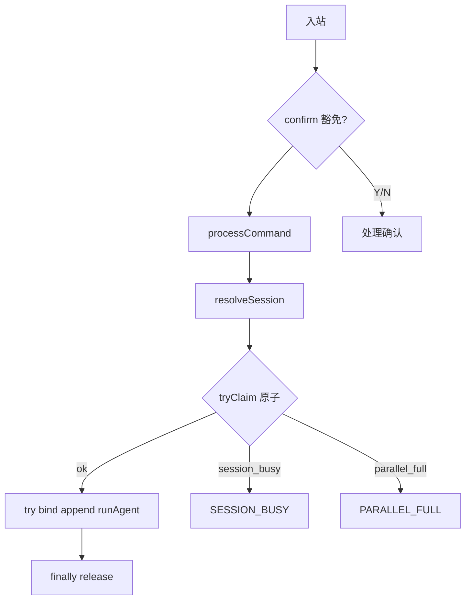

# 远程会话 Busy 守卫需求规格

> 版本：v1.3  
> 创建日期：2026年7月12日  
> 修订日期：2026年7月12日（v1.3：统一 Claim/Release 归属；原子化全局并行检查；明确 Agent 阻塞语义）  
> 状态：草案  
> 前置依赖：[remote-workdir-tools-requirement.md](./remote-workdir-tools-requirement.md)、[feishu-integration-requirement.md](./feishu-integration-requirement.md)、[wechat-integration-requirement.md](./wechat-integration-requirement.md)  
> 评审参考：[remote-workdir-switch-guard-requirement-review-v2.md](../review/remote-workdir-switch-guard-requirement-review-v2.md)  
> 关联实现：`runningRemoteAgentRegistry`、`bindSessionWorkDir`、`remoteCommandRouter`、`weChatCommandRouter`、`switch_work_dir`

> **文档沿革**  
> - v1.0：工作目录切换守卫  
> - v1.1：升格为远程会话 Busy 守卫（单飞 + 绑定守卫）  
> - v1.2：Session Claim、去歧义路径、confirm 例外、P0 简单 `Set`  
> - v1.3：修复 Claim/Release 矛盾；`tryClaim` 原子检查全局并行；补充异常路径测试

---

## 1. 概述

### 1.1 背景与问题

[remote-workdir-tools-requirement.md](./remote-workdir-tools-requirement.md) 已实现会话级工作目录绑定与动态 `resolveWorkDir()` 解析。现网在「远程会话已有 Agent 运行」时，存在多类未守卫的变异操作：

| 优先级 | 现象 | 根因 | 用户感知 |
|--------|------|------|----------|
| **P0** | 同一会话可并行多个远程 Agent | 入站 `void handleInbound`；register 过晚 → **TOCTOU** | 乱序回复、工具失败 |
| **P0** | 全局并行上限可被突破 | `countRunning` 检查与 `register` 非原子 | 超出 `maxParallelChatSessions` |
| **P0** | 长任务中切换目录 | 每轮 `resolveWorkDir()` 重读 DB | 前后半段目录不一致 |
| **P0** | 飞书去歧义可绕过守卫 | 数字回复直达 `processCommand`（守卫须写在其内） | busy 时仍启第二个 Agent |
| **P1** | 微信会话无 `workDirProfileId` | 回退全局 active | 桌面切全局目录影响远程 |
| **P1** | `session:delete` 无 busy 检查 | IPC 未感知远程 Agent | 删会话与 loop 冲突 |

### 1.2 功能定位

**远程会话 Busy 守卫**：当 `sessionId` 已被远程 Agent 占用时，拒绝会引入并发或改变执行语义的操作。

| 层级 | 守卫对象 |
|------|----------|
| **P0** | ① **Session Claim**（同步、原子）；② 同 session **单飞**；③ **全局并行**与 claim 合一；④ **workDirProfileId** 绑定守卫；⑤ 所有 `processCommand` 路径（含去歧义） |
| **P1** | 微信补 `workDirProfileId`；`session:delete`；可选 workDir 启动快照 |
| **P2** | 入站排队；IM 取消；`requestId` 级隔离；引用计数（仅放宽单飞时） |

**合法例外（不 claim）**：`confirmManager.tryResolveFromInbound`；`list_work_dirs`；正确 `requestId` 确认；绑定去重。

**守卫粒度**：按 `sessionId`；飞书与微信互不影响。

### 1.3 目标

| ID | 目标 | 优先级 |
|----|------|--------|
| G1 | 同 session 禁止并行远程 Agent | P0 |
| G2 | `tryClaim` 在 `resolve*Session` 之后、其他 `await` 之前**同步原子**执行 | P0 |
| G3 | 全局并行与单飞在**同一次** `tryClaim` 内判定，无全局 TOCTOU | P0 |
| G4 | **谁 claim 谁 release**——唯一释放在 `processCommand` `finally` | P0 |
| G5 | busy 时拒绝 `workDirProfileId` 变更 | P0 |
| G6 | 飞书去歧义路径受同一守卫 | P0 |
| G7 | 明确 IM/工具拒绝文案 | P0 |
| G8 | `list_work_dirs` busy 时可用 | P0 |
| G9 | 微信新会话写入 `workDirProfileId` | P1 |

### 1.4 非目标

| 项 | 说明 |
|----|------|
| P0 引用计数 | 单飞下 `Set` 足够 |
| busy 入站排队 / IM 取消 | P2 |
| 扩展桌面 `runningSessions` | 本需求聚焦主进程入站 |

---

## 2. 用户故事

### US-RBG01：长任务中禁止再发新指令

再发任何新指令（含飞书数字选项目）应被拒绝。

### US-RBG02：长任务中禁止切换工作目录

busy 时切换目录被拒绝，`resolveWorkDir()` 保持稳定。

### US-RBG03：任务结束后可正常操作

Agent 结束后可切换目录并执行新指令。

### US-RBG04：跨通道互不影响

飞书 busy 不影响微信。

### US-RBG05：忙时仍可查询目录

`list_work_dirs` 可用。

### US-RBG06：确认回复不受单飞误伤

Y/N 确认正常处理，不触发 `REMOTE_SESSION_BUSY`。

---

## 3. 现网机制摘要

| 机制 | 现网 | 缺口 |
|------|------|------|
| `runningRemoteAgentRegistry` | `Set<sessionId>`；register 在 `run*RemoteAgent` 内 | 过晚；与 `processCommand` 双重 register/unregister |
| 入站 | `void handleInbound` | 并发 `processCommand` |
| `run*RemoteAgent` | `await runToolChatSession(...)` | **阻塞直至完成**（非 fire-and-forget） |

---

## 4. 行为规格（P0）

### 4.1 统一入口：`processCommand`

凡启动远程 Agent，**必须**经 `processCommand`（或等价包装）。禁止 router 其他分支直接 `run*RemoteAgent`。

| 路径 | 守卫 |
|------|------|
| 飞书/微信正常入站 | `processCommand` |
| 飞书去歧义数字回复 | `processCommand` |
| 确认 Y/N | `tryResolveFromInbound` → **豁免**，不 claim |

### 4.2 Session Claim（TOCTOU 修复）

#### 4.2.1 注册表 API

```typescript
// runningRemoteAgentRegistry.ts — P0：简单 Set，无引用计数

export type ClaimResult = 'ok' | 'session_busy' | 'parallel_full'

/**
 * 原子占用：同步检查 session 单飞 + 全局并行，通过则 add。
 * countRunningRemoteAgents() === running.size，语义为 **distinct busy session 数**。
 */
export function tryClaimRemoteSession(
  sessionId: string,
  maxParallel: number
): ClaimResult

/** 幂等释放：Set.delete，多次调用安全（迁移期防御用，正常路径仅调用一次） */
export function releaseRemoteSession(sessionId: string): void

export function isRemoteAgentRunning(sessionId: string): boolean
export function countRunningRemoteAgents(): number  // = running.size
```

| API | 语义 |
|-----|------|
| `tryClaim` | 已占用 → `session_busy`；`size >= maxParallel` → `parallel_full`；否则 add 并 `ok` |
| `countRunningRemoteAgents` | **distinct sessionId 数量**，与现网 `Set.size` 一致 |
| `release` | 从 Set 删除；**唯一合法调用点**见 §4.2.3 |

> **独立思考（v1.3）**：v1.2 将全局并行检查放在 `tryClaim` 之前，仍存在「多条不同 session 并发通过检查、同时 claim」的全局 TOCTOU。v1.3 将**单飞与全局上限合并进同一次同步 `tryClaim`**，与 session 级 TOCTOU 一并消除。`resolve*Session` 之前的「早退」全局检查可保留为**非权威优化**（减少无效 resolve），**最终以 `tryClaim` 为准**。

#### 4.2.2 `processCommand` 流程（飞书/微信对称）

```typescript
private async processCommand(...) {
  const maxParallel = this.deps.getAppConfig().maxParallelChatSessions

  // 1. 唯一允许在 claim 之前的 await
  const { sessionId } = await resolve*Session(...)

  // 2. 同步原子 claim（单飞 + 全局并行）
  const claim = tryClaimRemoteSession(sessionId, maxParallel)
  if (claim === 'session_busy') {
    await replyText(REMOTE_SESSION_BUSY)
    return
  }
  if (claim === 'parallel_full') {
    await replyText(REMOTE_PARALLEL_FULL)
    return
  }

  // 3. 谁 claim 谁 release — RAII
  try {
    await bindSessionWorkDir(...)      // 内含绑定 busy 守卫
    await appendMessage(...)
    await run*RemoteAgent(...)         // 阻塞直至 tool loop 结束，见 §4.2.4
  } finally {
    releaseRemoteSession(sessionId)    // ← 唯一 release 点
  }
}
```

#### 4.2.3 Claim/Release 归属（修复 v1.2 矛盾）

| 组件 | claim | release |
|------|-------|---------|
| `processCommand` | `tryClaimRemoteSession`（同步） | **`finally` → `releaseRemoteSession`（唯一）** |
| `run*RemoteAgent` | **禁止**操作 registry | **禁止** release |

**理由（采纳 v2 评审）**：

1. **RAII**：谁占用谁释放，生命周期与 `processCommand` 一致  
2. **异常安全**：`bindSessionWorkDir` 失败时不进入 `run*RemoteAgent`，仍由 `finally` 释放，**无泄漏**  
3. **低耦合**：Agent 不感知 registry  

**现网迁移**：删除 [`feishuRemoteAgent.ts`](../../electron/feishu/feishuRemoteAgent.ts) / [`weChatRemoteAgent.ts`](../../electron/wechat/weChatRemoteAgent.ts) 内 `registerRunningRemoteAgent` / `unregisterRunningRemoteAgent`。**禁止**两边同时 release。

#### 4.2.4 `run*RemoteAgent` 语义

现网 `runFeishuRemoteAgent` / `runWeChatRemoteAgent` 为 `async` 且 **`await runToolChatSession(...)`**，属于**阻塞直至完成**，非 fire-and-forget。

因此 `processCommand` 在 `await run*RemoteAgent` 返回后 `finally` release，**busy 期与 Agent 执行期一致**。若未来改为异步启动后立即返回，须重新设计 claim 生命周期（P2 文档化，非 v1.3 范围）。

#### 4.2.5 异常路径

| 失败点 | release | 会话可再 claim |
|--------|---------|----------------|
| `bindSessionWorkDir` 抛错 | `processCommand` `finally` | ✅ |
| `run*RemoteAgent` 抛错 | `processCommand` `finally` | ✅ |
| `tryClaim` 返回非 `ok` | 未 claim，无 release | ✅ |

### 4.3 会话单飞与全局并行

```
允许启动 ⟺ tryClaim(sessionId, maxParallel) === 'ok'
```

| 返回值 | 文案常量 | 中文 |
|--------|----------|------|
| `session_busy` | `REMOTE_SESSION_BUSY` | 当前会话有任务正在执行，请等待完成后再发送新指令。 |
| `parallel_full` | `REMOTE_PARALLEL_FULL` | 当前并行任务已满，请稍后再试。 |

默认不追加孤立 user 消息。

### 4.4 工作目录绑定守卫

入站绑定在 claim 之后、单飞已保证无第二条入站；绑定守卫主要覆盖 **运行中 Agent 内的 `switch_work_dir`**。

| 条件 | 结果 |
|------|------|
| 不 busy | 现网 `bindSessionWorkDir` |
| busy 且 profile 变更 | 拒绝 `REMOTE_WORKDIR_SWITCH_BUSY` |
| profile 相同 | 去重允许 |

实现：`canBindSessionWorkDir` → `isRemoteAgentRunning(sessionId)`。

### 4.5 合法例外

| 分支 | claim? |
|------|--------|
| `tryResolveFromInbound` | 否 |
| 去歧义 → `processCommand` | 是 |
| 正常指令 → `processCommand` | 是 |

### 4.6 飞书入站决策序

```
入站
  → [豁免] confirmManager.tryResolveFromInbound
  → [豁免] 去歧义 pending → processCommand
  → accept / rate limit / dedup / sensitive
  → processCommand:
       resolve*Session
       tryClaimRemoteSession(sessionId, maxParallel)
       try { bind → append → run*RemoteAgent } finally { release }
```

### 4.7 注册表：P0 保持 `Set`

不引入引用计数。P2 放宽单飞时可升级 `Map<sessionId, number>`。

---

## 5. P1 / P2 摘要

### 5.1 P1

| 项 | 说明 |
|----|------|
| 微信 `workDirProfileId` | `resolveWeChatSession` 新建/merge 时写入 active profile |
| `session:delete` | busy 时 IPC 拒绝 |
| `session:update` | 仅守卫 `workDirProfileId` 变更 |
| 错误码 | `errorCodes.ts` |
| workDir 启动快照 | 可选纵深防御 |

### 5.2 P2

入站排队；IM 取消；`requestId` 资源隔离；引用计数。

---

## 6. 场景验收

| 步骤 | 操作 | 预期 |
|------|------|------|
| 1 | 飞书长任务 | claim 成功 |
| 2 | 微信长任务（另一 session） | 与 1 并行 |
| 3a | 飞书 busy 再发指令 | `REMOTE_SESSION_BUSY` |
| 3b | 飞书 busy `/sa @写作` | bind 拒绝；目录不变 |
| 3c | 飞书 busy 去歧义「1」 | 拒绝 |
| 3d | 飞书 busy 回复 `Y` | 确认正常 |
| 3e | busy `list_work_dirs` | 允许 |
| 3f | `bindSessionWorkDir` 失败后重试 | 可再次 claim 并成功 |
| 3g | Agent 结束后再发 | 允许 |

---

## 7. 测试用例

| ID | 用例 | 验证点 |
|----|------|--------|
| T1 | busy 时飞书第二条入站 | `REMOTE_SESSION_BUSY`；不启动 Agent |
| T2 | busy 时微信第二条入站 | 同上 |
| T3 | TOCTOU：同 session `Promise.all` 两条入站 | 仅 1 次 `run*RemoteAgent` |
| T4 | busy 时飞书去歧义数字 | 不启动第二个 Agent |
| T5 | busy 时 confirm `Y` | 不误伤 |
| T6 | busy 时 `switch_work_dir` | `REMOTE_WORKDIR_SWITCH_BUSY` |
| T7 | 会话 A busy，B 入站 | B 成功 |
| T8 | **`bindSessionWorkDir` 失败** | `release` 被调用；第二次入站可 claim |
| T9 | **`processCommand` finally release** 后 | 第二条入站 claim 成功 |
| T10 | busy 时 `list_work_dirs` | 成功 |
| T11 | tool loop 多轮 | `resolveWorkDir()` 恒定 |
| T12 | **全局 TOCTOU**：`maxParallel=2` 时 3 个不同 session 并发 | 仅 2 个 `run*RemoteAgent` |
| T13 | **迁移**：`run*RemoteAgent` 内无 `release` | 每入站 `release` 恰好 1 次 |

---

## 8. 实施任务拆分

| 序号 | 任务 | 优先级 |
|------|------|--------|
| T1 | `tryClaimRemoteSession` / `releaseRemoteSession`（含 `ClaimResult`） | P0 |
| T2 | `processCommand` RAII；**删除** Agent 内 register/unregister | P0 |
| T3 | 去歧义路径回归（T4） | P0 |
| T4 | `canBindSessionWorkDir` | P0 |
| T5 | 文案 / errorCodes | P0 |
| T6 | 单测 T3/T8/T12/T13 + router 集成 | P0 |
| T7 | 微信 `workDirProfileId` | P1 |
| T8 | `session:delete` busy | P1 |

---

## 9. 验收标准

### P0（v1.3）

- [ ] `tryClaim` 原子检查单飞 + 全局并行（T12）
- [ ] **唯一** release 点在 `processCommand` `finally`（T13）
- [ ] `bind` 失败不泄漏占用（T8）
- [ ] TOCTOU T3；去歧义 T4；confirm T5
- [ ] busy 时 `workDirProfileId` 不可变更
- [ ] `list_work_dirs` busy 可用；跨 session 隔离
- [ ] Agent 内无 registry 操作

### P1

- [ ] 微信默认 `workDirProfileId`；`session:delete` busy 拒绝

---

## 10. 架构总览



---

## 11. 评审采纳记录

### v1 → v1.2

TOCTOU Session Claim；去歧义统一入口；P0 简单 Set；confirm 例外；`session:update` 范围；微信补绑定时机。

### v2 → v1.3

| 评审项 | 采纳 | v1.3 处理 |
|--------|------|-----------|
| Claim/Release 矛盾 | ✅ | 统一 `processCommand` `finally`；Agent 禁止 release |
| `run*RemoteAgent` 语义 | ✅ | §4.2.4 明确阻塞 `await runToolChatSession` |
| `countRunning` 语义 | ✅ | §4.2.1 文档化 distinct sessions |
| 异常路径测试 | ✅ | T8 |
| 双重释放防护 | ✅ | T13 + release 幂等说明 + 迁移要求 |

| 独立补充（v1.3） | 说明 |
|------------------|------|
| 全局并行 TOCTOU | `tryClaim` 内合并 `size >= maxParallel` 检查 |
| `ClaimResult` 三分支 | 区分 `SESSION_BUSY` vs `PARALLEL_FULL` 文案 |
| 早退全局检查 | 可保留优化，非权威 |

---

**文档结束**
