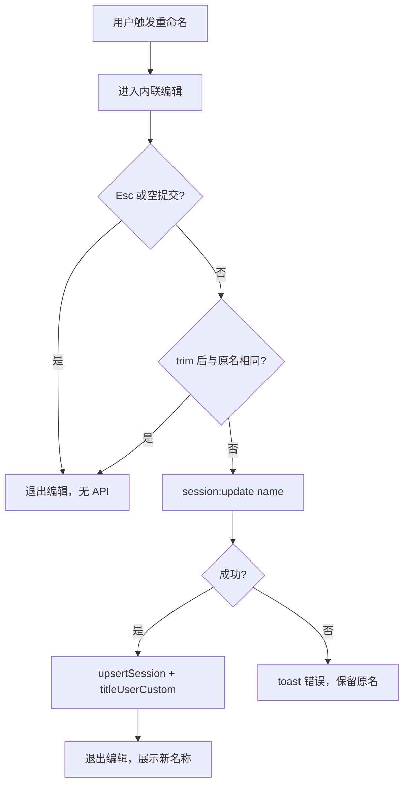
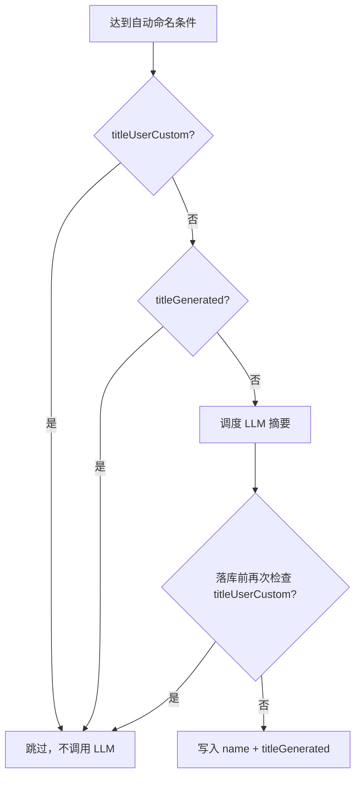

# 会话手动修改标题 — 产品需求文档

**版本：** 1.1  
**日期：** 2026-06-06  
**状态：** 待实现  
**关联文档：**
- [session-auto-title-requirement.md](./session-auto-title-requirement.md)（会话自动生成标题）
- [auto-create-session-requirement.md](./auto-create-session-requirement.md)（自动创建会话）
- [i18n-sync-guide.md](../develop/i18n-sync-guide.md)（多语言同步指南）

---

## 目录

1. [概述](#1-概述)
2. [现状分析](#2-现状分析)
3. [目标与非目标](#3-目标与非目标)
4. [用户故事](#4-用户故事)
5. [功能需求](#5-功能需求)
6. [与自动命名的协作规则](#6-与自动命名的协作规则)
7. [数据模型与 API](#7-数据模型与-api)
8. [UI 与交互设计](#8-ui-与交互设计)
9. [边界情况与并发](#9-边界情况与并发)
10. [验收标准](#10-验收标准)
11. [实现参考](#11-实现参考)
12. [多语言资源规划](#12-多语言资源规划)

---

## 1. 概述

### 1.1 功能定位

用户在侧栏会话列表中，可对任意会话的显示标题进行**手动重命名**。重命名结果持久化到 `Session.name`，并在搜索、删除确认、待确认横幅等所有展示会话名称的界面即时生效。

一旦用户完成一次有效的手动改名，系统应将该会话标记为「用户自定义标题」，**永久停止**该会话的自动标题生成（含聊天过程中的触发与老会话打开补全），避免覆盖用户意图。

### 1.2 产品价值

| 价值 | 说明 |
|------|------|
| 可发现性 | 用户可用有意义的名称管理大量历史会话，便于检索与识别 |
| 尊重用户意图 | 手动命名优先级高于 LLM 自动摘要，消除「刚改好又被覆盖」的干扰 |
| 低侵入 | 复用既有 `session:update` 与 `titleUserCustom` 元数据约定，不改动聊天主流程 |

### 1.3 设计原则

| 原则 | 说明 |
|------|------|
| **手动优先** | `titleUserCustom === true` 后，任何自动命名路径均不得写入 `name` |
| **最小改动** | 不修改工具循环、消息存储、会话创建/删除等无关逻辑 |
| **就地编辑** | 在侧栏列表内完成改名，无需弹窗或跳转设置页 |
| **失败可恢复** | 改名 API 失败时保留原名称，并给出错误提示 |

---

## 2. 现状分析

### 2.1 已有能力（后端）

| 能力 | 状态 | 说明 |
|------|------|------|
| 自动命名 | ✅ 已实现 | 见 `session-auto-title-requirement.md` |
| `titleUserCustom` 元数据 | ✅ 已约定 | `metadata.titleUserCustom === true` 时跳过自动命名 |
| `session:update` 写 `name` | ✅ 已实现 | `electron/appIpc.ts` 在 `payload.name !== undefined` 时写入 `titleUserCustom` |
| 自动命名尊重用户标题 | ✅ 已实现 | `sessionTitleSuggest.ts` 在调度前、落库前均检查 `titleUserCustom` |

### 2.2 缺失能力（前端）

| 能力 | 状态 | 说明 |
|------|------|------|
| 侧栏重命名入口 | ❌ 未实现 | `SessionListPane` 仅展示只读标题，点击整行切换会话 |
| 内联编辑组件 | ❌ 未实现 | 文件树已有 `InlineInput` 可复用交互模式 |
| 改名成功/失败反馈 | ❌ 未实现 | 需 toast 与 Redux `upsertSession` |
| 改名相关 i18n | ❌ 未实现 | 无 `rename` 相关文案键 |

### 2.3 相关代码位置

| 模块 | 路径 | 说明 |
|------|------|------|
| 会话列表 | `src/renderer/components/SessionList/SessionListPane.tsx` | 侧栏列表，改名 UI 主要落点 |
| 名称展示 | `src/renderer/utils/sessionDisplay.ts` | `sessionDisplayName` 空标题兜底 |
| 内联输入参考 | `src/renderer/components/FileTree/InlineInput.tsx` | 确认/取消/失焦提交模式 |
| 会话更新 IPC | `electron/appIpc.ts` → `session:update` | 持久化 `name` 与 `titleUserCustom` |
| 自动命名 | `electron/sessionTitleSuggest.ts` | 须继续遵守 `titleUserCustom` |
| Redux | `src/renderer/store/sessionSlice.ts` | `upsertSession` 合并更新 |

---

## 3. 目标与非目标

### 3.1 目标

| # | 目标 |
|---|------|
| G1 | 用户可在侧栏对任意会话执行手动重命名 |
| G2 | 改名后立即在侧栏、搜索命中、删除确认等位置展示新名称 |
| G3 | 有效手动改名后写入 `titleUserCustom`，该会话不再触发自动命名 |
| G4 | 改名操作不影响会话切换、删除、中止运行、聊天发送等现有行为 |
| G5 | 支持键盘操作（Enter 确认、Esc 取消）与无障碍标签 |

### 3.2 非目标

- 不在聊天主区域顶部增加标题编辑（本期仅侧栏）
- 不提供批量重命名
- 不修改自动命名的触发时机、提示词或字符上限（仍见关联文档）
- 不提供「恢复为自动标题」或清除 `titleUserCustom` 的显式入口（用户可再次手动编辑名称）
- 飞书远程会话、导入会话等特殊来源不在本期单独设计（统一走同一 `session:update` 路径即可）

---

## 4. 用户故事

| ID | 故事 | 验收 |
|----|------|------|
| US1 | 作为用户，我想给默认名「会话 3」改成「重构登录模块」，以便日后快速找到 | 侧栏显示新名称；刷新后仍保留 |
| US2 | 作为用户，我想在自动标题生成前抢先命名，以免 LLM 给出不准确摘要 | 改名后即使满 3 轮 assistant 也不再自动覆盖 |
| US3 | 作为用户，我想在自动标题已生成后改成自己喜欢的名称 | 新名称保留；后续对话不再自动改名 |
| US4 | 作为用户，我误触编辑后按 Esc，希望名称不变 | 取消编辑不调用 API、不写 `titleUserCustom` |
| US5 | 作为用户，我在会话执行中改名，不应影响当前回复流 | 聊天、工具确认、流式输出正常继续 |

---

## 5. 功能需求

### 5.1 重命名入口

| 序号 | 需求 | 说明 |
|------|------|------|
| F1 | 入口位置 | 侧栏 `SessionListPane` 每条会话行提供「重命名」操作 |
| F2 | 推荐交互 | **双击**会话标题文字进入内联编辑；或标题区域右键/更多菜单提供「重命名」项（二选一或同时支持，以实现阶段 UI 评审为准，至少保证一种可发现路径） |
| F3 | 与切换会话隔离 | 进入编辑模式时，点击标题区域不应触发 `setSession`；删除、中止按钮行为不变 |
| F4 | 并发编辑 | 同一时刻仅允许一个会话处于编辑状态；切换编辑目标时自动取消前一个未提交的编辑 |

### 5.2 编辑与提交

| 序号 | 需求 | 说明 |
|------|------|------|
| F5 | 初始值 | 输入框默认值为当前 `Session.name` 的原始存储值（非 `sessionDisplayName` 兜底后的展示值）；若存储为空字符串，输入框显示为空 |
| F6 | 确认 | Enter 或输入框 **失焦（blur）** 时尝试提交（与文件树 `InlineInput` 一致） |
| F7 | 取消 | Esc 取消编辑，不调用 API，不写 metadata |
| F8 | 空标题 | 用户提交全空白字符串时，视为取消编辑（与 `InlineInput` 一致），不调用 API |
| F9 | 未变更 |  trim 后与当前 `Session.name` 相同则视为无操作：退出编辑模式，**不**调用 API，**不**写 `titleUserCustom` |
| F10 | 长度上限 | 单条标题最长 **64** 个 Unicode 字符（展示侧 `truncateSessionTitle` 仍可用于确认框；列表内 CSS 省略号截断）。超出时前端截断或阻止输入并提示（推荐：`maxLength={64}` + 提交前 `Array.from(s).slice(0, 64)` 双保险） |
| F11 | 持久化 | 有效变更时调用 `window.api.sessionUpdate({ sessionId, name: trimmedName })` |
| F12 | 状态同步 | API 返回 `Session` 后 `dispatch(upsertSession(updated))`；失败时 `message.error` 且保持列表展示原名称 |

### 5.3 展示一致性

改名成功后，以下位置应展示新名称（经 `sessionDisplayName` 或等价逻辑）：

- 侧栏会话列表
- 侧栏搜索过滤（按名称匹配）
- 全局搜索中的会话类结果（索引由主进程维护，改名后下次搜索应命中新名称）
- 删除确认弹窗 `SessionDeleteConfirmModal`
- 待确认横幅 `PendingConfirmBanner` 中的会话名

**说明：** 聊天区域本期无会话标题展示，无需改动 `ChatView`。

---

## 6. 与自动命名的协作规则

本节是对 [session-auto-title-requirement.md](./session-auto-title-requirement.md) 第 4 节的**补充与细化**，以实现「用户手动改名后永不自动覆盖」。

### 6.1 何时写入 `titleUserCustom`

| 场景 | 是否写入 `titleUserCustom` |
|------|---------------------------|
| 用户通过改名 UI 提交且 trim 后名称与原文不同 | ✅ 是 |
| 用户取消编辑（Esc / 空提交 / 未变更） | ❌ 否 |
| 仅更新 `skillsState`、`metadata`、`temperature` 等字段 | ❌ 否 |
| 自动命名成功写入 `name` | ❌ 否（仅写 `titleGenerated`） |
| 创建会话时的默认名 `会话 N` | ❌ 否 |

### 6.2 自动命名跳过条件（保持不变 + 强调）

以下任一为真时，**不得**调度或落库自动标题：

1. `metadata.titleGenerated === true`
2. `metadata.titleUserCustom === true`
3. 该 `sessionId` 已在 `inFlightSessionIds` 中（并发去重）

涉及路径：

- `scheduleSessionTitleSuggestion`（聊天第 3 轮 assistant 后）
- `scheduleSessionTitleOpenBackfillIfNeeded`（老会话首次打开补全）

### 6.3 后端 `session:update` 细化建议

当前实现：只要 `payload.name !== undefined` 即设置 `titleUserCustom`。建议实现阶段收紧为：

```text
仅当 payload.name 经 trim 后与当前 Session.name trim 后不同，才写入 name 并设置 titleUserCustom = true
```

这样可避免未来其它调用方误传 `name` 同值时污染 metadata。现有渲染侧调用均不传 `name`，无回归风险。

### 6.4 与 `titleGenerated` 的关系

| 字段 | 含义 | 手动改名后 |
|------|------|------------|
| `titleGenerated` | 曾成功自动生成过标题 | **保持不变**（历史事实，不清除） |
| `titleUserCustom` | 用户曾手动命名 | 设为 `true` |

两者独立：用户可在自动标题生成**之前或之后**手动改名；一旦 `titleUserCustom`，无论 `titleGenerated` 为何值，都不再自动覆盖 `name`。

### 6.5 时序：与进行中的自动命名竞态

| 顺序 | 结果 |
|------|------|
| 自动命名 in-flight → 用户提交手动改名 | 手动改名先落库并设 `titleUserCustom`；in-flight 请求在落库前检查到 `titleUserCustom` 后**放弃写入** |
| 自动命名已写入 → 用户随后手动改名 | 用户名称覆盖自动名称，并设 `titleUserCustom`，后续不再自动命名 |

**要求：** 自动命名落库前必须二次读取会话并检查 `titleUserCustom`（现有代码已满足，实现时保持）。

---

## 7. 数据模型与 API

### 7.1 数据字段（无 schema 变更）

沿用 `Session`：

| 字段 | 类型 | 说明 |
|------|------|------|
| `name` | `string` | 持久化标题；可为空字符串 |
| `metadata.titleUserCustom` | `boolean` | 用户手动改过标题 |
| `metadata.titleGenerated` | `boolean` | 是否曾自动生成（见关联文档） |
| `metadata.titleOpenBackfillAttempted` | `boolean` | 打开补全是否已尝试（见关联文档） |

### 7.2 IPC 约定（复用，不新增 channel）

| 调用 | 说明 |
|------|------|
| `session:update` | 改名 UI 唯一写入路径：`{ sessionId, name: string }` |
| 返回值 | 更新后的完整 `Session`；会话不存在时 `undefined` |
| 备份 | 与现有一致：`syncBackup` 在更新后执行 |

可选（非必须）：若团队希望语义更清晰，可新增薄封装 `session:rename`，内部仍调用同一 `updateSession` 逻辑；预加载暴露为 `sessionRename`。本期以复用 `sessionUpdate` 为默认方案。

### 7.3 渲染进程状态

- 改名成功后仅 `upsertSession`，**不**切换 `currentSessionId`
- 不触发 `sessionBackfillAutoTitleIfNeeded`（该调用仅在切换会话时发生；且 `titleUserCustom` 后主进程会直接跳过）

---

## 8. UI 与交互设计

### 8.1 内联编辑态

```
┌─────────────────────────────────────┐
│ [图标] [████████ 输入框 ████████] [删] │
└─────────────────────────────────────┘
```

- 编辑态：隐藏原标题 `span`，显示单行 `input`（或复用/抽取 `InlineInput`）
- 非编辑态：保持现有布局（选择按钮 + 可选中止 + 删除）
- 样式：与侧栏字号、行高一致；聚焦时 1px 主色描边（可参考文件树）
- 运行中会话：允许改名（US5）

### 8.2 事件隔离

| 元素 | 行为 |
|------|------|
| 标题双击 | `stopPropagation`，进入编辑 |
| 编辑中点击行空白 | 不切换会话 |
| 会话行主按钮（非编辑态） | 仍切换当前会话 |
| 删除 / 中止 | 编辑态下仍可用；若正在编辑该条，可先 blur 提交或取消再操作（推荐 blur 触发提交） |

### 8.3 反馈

| 事件 | 反馈 | i18n key |
|------|------|----------|
| 改名成功 | 可选轻量 `message.success`；或仅静默更新列表（以实现统一 toast 策略为准，至少一种正向反馈） | `session.rename.success` |
| 改名失败 | `message.error`，保留原名称 | `session.rename.failed`（可经 `formatUserFacingError` 包裹） |
| 超长 | 输入限制或提交前校验提示 | `session.rename.tooLong`（`{{max}}` = 64） |

### 8.4 无障碍

- 重命名入口：`aria-label` 使用 `session.rename.aria`（插值 `{{name}}` 为 `sessionDisplayName` 结果）
- 编辑输入框：`aria-label` 使用 `session.rename.inputAria`
- 编辑态对屏幕阅读器：可用 `aria-current` 或 `aria-expanded` 标示编辑中（实现细节由前端定，须可键盘完成全流程）

---

## 9. 边界情况与并发

| # | 场景 | 期望行为 |
|---|------|----------|
| E1 | 改名后会话被删除 | 与现有一致，无额外处理 |
| E2 | 改名同时收到 `session:title-generated` 事件 | Redux 以**时间戳较新**或**后到达的 upsert** 为准；因 `titleUserCustom` 已设，不应再收到自动命名覆盖（主进程已拦截） |
| E3 | 多窗口（若未来支持） | 以数据库 + `syncBackup` 为准；收到备份同步后列表刷新（本期单窗口可忽略） |
| E4 | 名称仅含空格 | 按 F8 取消处理 |
| E5 | 名称含 emoji / 多语言 | 按 Unicode 字符计数，正常存储与展示 |
| E6 | 快速双击两条不同会话 | 仅最后进入编辑的一条保持编辑态 |
| E7 | 老会话仅有默认名、未满 3 轮 | 允许提前手动命名；设 `titleUserCustom` 后即使后续满 3 轮也不自动命名 |

---

## 10. 验收标准

### 10.1 手动改名

1. 侧栏可通过既定入口进入编辑，修改名称后 Enter 或失焦提交，列表立即显示新名称。
2. 重启应用后名称仍为手动值。
3. Esc、空提交、未变更提交均不调用 `session:update`，`titleUserCustom` 保持原状。
4. 删除确认、搜索过滤展示新名称。

### 10.2 与自动命名互斥

5. 手动改名**前**未满 3 轮 assistant：改名后继续对话至满 3 轮，**不**自动生成标题。
6. 自动标题**已生成**：手动改名后名称保持用户输入，再次对话**不**覆盖。
7. 手动改名**后**切换到老会话：不触发打开补全（`titleUserCustom` 为真）。
8. 手动改名与 in-flight 自动命名竞态：最终名称为用户手动值。

### 10.3 非回归

9. 会话切换、删除、中止、发送消息、工具确认、技能状态更新、metadata 补丁等行为与改版前一致。
10. `sessionUpdate` 仅传 `skillsState` / `metadata` 时，**不**设置 `titleUserCustom`。

### 10.4 多语言验收

11. 切换应用语言为 en-US 后，重命名相关按钮、aria-label、成功/失败提示均显示英文。
12. `npm run i18n:check` 通过（zh-CN / en-US key 对齐）。
13. 改名相关组件源码无硬编码中文（`.test.ts(x)` 测试文件除外，见 [i18n-sync-guide.md](../develop/i18n-sync-guide.md)）。

### 10.5 测试建议

| 层级 | 范围 |
|------|------|
| 单元 | `session:update` 在 name 变更 / 未变更 / 仅 metadata 时的 `titleUserCustom` 行为 |
| 组件 | `SessionListPane` 或抽取的 `SessionTitleEditor`：提交、取消、未变更、maxLength |
| 集成 | 改名 → 模拟第 3 轮 assistant → 断言 `name` 不变且无 `session:title-generated` |

---

## 11. 实现参考

建议实现顺序：

1. **主进程（可选收紧）** — `appIpc.ts` `session:update`：仅在实际 name 变化时写 `titleUserCustom`
2. **组件** — 抽取 `SessionTitleEditor` 或扩展 `SessionListPane` 内联编辑
3. **样式** — `layout.css` 中 `.session-item-name` / 编辑态 input
4. **i18n** — 见下节
5. **测试** — 组件 + IPC 单元测试

主要改动文件（预估）：

| 文件 | 变更 |
|------|------|
| `src/renderer/components/SessionList/SessionListPane.tsx` | 编辑态、提交逻辑 |
| `src/renderer/components/SessionList/SessionTitleEditor.tsx` | 新建（可选） |
| `src/renderer/theme/layout.css` | 编辑态样式 |
| `electron/appIpc.ts` | `titleUserCustom` 写入条件收紧（可选） |
| `src/renderer/i18n/resources/zh-CN/common.json` | 新增 `session.rename` 文案（主来源） |
| `src/renderer/i18n/resources/en-US/common.json` | 镜像同名 key |
| `src/renderer/i18n/types.ts` | 运行 `i18n:generate-types` 自动更新 |

**不应改动（除非 bugfix）：** `toolChatLoop.ts`、`sessionTitleSuggest.ts` 触发条件（已尊重 `titleUserCustom`）、`ChatView.tsx` 聊天主流程。

---

## 12. 多语言资源规划

本节按 [i18n-sync-guide.md](../develop/i18n-sync-guide.md) 规范，定义会话手动改名的翻译 key、落盘位置、开发流程与代码用法。

### 12.1 命名空间分配

| 命名空间 | 是否新增文件 | 用途 | 涉及组件 |
|----------|--------------|------|----------|
| `common` | 否（扩展现有 `common.json`） | 侧栏会话重命名文案、Toast、无障碍标签 | `SessionListPane.tsx`、`SessionTitleEditor.tsx`（若抽取） |

**说明：**

- 会话相关文案已集中在 `common.session.*`（如 `deleteAria`、`stopAria`、`unnamed`），本期继续在同级扩展 `session.rename`，**不新增命名空间**。
- 主进程 `electron/` 侧无 UI 文案，不涉及 i18n。
- 与文件树 `fileTree.contextMenu.rename`（「重命名...」）语义相近但场景不同；会话侧重命名空间内独立维护，避免跨命名空间耦合。

### 12.2 文案清单与 key 映射

| Key | 使用场景 | 插值 |
|-----|----------|------|
| `session.rename.menuItem` | 右键/更多菜单项（若实现菜单入口） | — |
| `session.rename.aria` | 重命名按钮或双击区域的 `aria-label` | `{{name}}`：当前展示名（经 `sessionDisplayName`） |
| `session.rename.inputAria` | 内联编辑输入框 `aria-label` | — |
| `session.rename.success` | 改名成功 Toast（若采用显式提示） | — |
| `session.rename.failed` | 改名 API 失败 Toast | — |
| `session.rename.tooLong` | 超出 64 字符时的校验提示 | `{{max}}`：上限常量 `64` |

**复用既有 key（勿重复定义）：**

| 场景 | 复用 key |
|------|----------|
| 空标题列表展示 | `session.unnamed`（`sessionDisplay.ts` 已用） |
| 删除确认中的会话名展示 | 继续走 `sessionDisplayName`，无需新 key |
| 通用「取消」 | 无独立取消按钮时由 Esc 处理；若后续加快捷键说明可用 `common.cancel` |

### 12.3 zh-CN 翻译资源（主来源）

在现有 `session` 对象内新增 `rename` 子对象：

```json
// src/renderer/i18n/resources/zh-CN/common.json
{
  "session": {
    "aborted": "已中止该会话的执行",
    "createFailed": "创建会话失败，请稍后重试",
    "defaultName": "会话 {{index}}",
    "deleteAria": "删除会话「{{name}}」",
    "stopAria": "中止「{{name}}」的执行",
    "unnamed": "未命名会话",
    "rename": {
      "menuItem": "重命名",
      "aria": "重命名会话「{{name}}」",
      "inputAria": "编辑会话标题",
      "success": "已更新标题",
      "failed": "更新标题失败，请稍后重试",
      "tooLong": "标题不能超过 {{max}} 个字符"
    }
  }
}
```

> 上例仅展示本期新增与相邻参考项；合入时保留文件中其余既有 `session.*` 键，勿覆盖。

### 12.4 en-US 翻译资源（镜像同步）

`en-US/common.json` 中 **`session.rename` 子树的 key 路径必须与 zh-CN 完全一致**：

```json
// src/renderer/i18n/resources/en-US/common.json
{
  "session": {
    "deleteAria": "Delete session \"{{name}}\"",
    "stopAria": "Stop execution for \"{{name}}\"",
    "unnamed": "Untitled session",
    "rename": {
      "menuItem": "Rename",
      "aria": "Rename session \"{{name}}\"",
      "inputAria": "Edit session title",
      "success": "Title updated",
      "failed": "Could not update title. Try again later.",
      "tooLong": "Title cannot exceed {{max}} characters"
    }
  }
}
```

**英文措辞约定：**

- 与现有 `session.deleteAria` / `session.stopAria` 一致，会话名使用英文直引号 `\"{{name}}\"`。
- `failed` 句式与 `session.deleteFailed`、`session.createFailed` 保持同一语气（Could not … Try again later.）。

### 12.5 插值与展示名约定

| 参数 | 来源 | 说明 |
|------|------|------|
| `{{name}}` | `sessionDisplayName(session.name)` | 与 `deleteAria`、`stopAria` 一致；空存储名显示为「未命名会话」/ Untitled session |
| `{{max}}` | 常量 `SESSION_TITLE_MAX_LENGTH = 64` | 建议与需求 §5.2 F10 共用同一常量，避免文案与校验不一致 |
| `{{index}}` | 仅 `session.defaultName` 使用 | 本期 rename 不涉及 |

项目全局使用 i18next 双花括号插值（`{{var}}`），**禁止**写成 `{name}`。

### 12.6 开发流程

按 [i18n-sync-guide.md](../develop/i18n-sync-guide.md) 标准工作流执行：

```
1. 在 zh-CN/common.json 的 session 下添加 rename 子对象（§12.3）
2. 运行 npm run i18n:generate-types（或 npm run dev / build:renderer，pre 钩子会自动执行）
3. 在 SessionListPane / SessionTitleEditor 中使用 useTypedTranslation('common')
4. 在 en-US/common.json 镜像相同 key 结构（§12.4）
5. 运行 npm run i18n:check 验证 key 对齐与 JSON 格式
6. 提交前可选 npm run i18n:check:strict 检测硬编码中文
```

| 步骤 | 命令 / 动作 | 预期 |
|------|-------------|------|
| 类型更新 | `npm run i18n:generate-types` | `src/renderer/i18n/types.ts` 包含 `session.rename.*` 路径 |
| 基础检查 | `npm run i18n:check` | zh-CN / en-US key 一致，JSON 合法 |
| 严格检查 | `npm run i18n:check:strict` | 改名相关 `.tsx` 无硬编码中文 |

### 12.7 代码使用示例

```tsx
// src/renderer/components/SessionList/SessionListPane.tsx（或 SessionTitleEditor.tsx）
import { App as AntdApp } from 'antd'
import { useTypedTranslation } from '../../i18n/useTypedTranslation'
import { sessionDisplayName } from '../../utils/sessionDisplay'
import { formatUserFacingError } from '../../utils/formatUserFacingError'

const SESSION_TITLE_MAX_LENGTH = 64

function SessionRenameExample({ session }: { session: { id: string; name: string } }) {
  const { t } = useTypedTranslation('common')
  const { message } = AntdApp.useApp()
  const displayName = sessionDisplayName(session.name)

  const submitRename = async (trimmed: string) => {
    if (trimmed.length > SESSION_TITLE_MAX_LENGTH) {
      message.warning(t('session.rename.tooLong', { max: SESSION_TITLE_MAX_LENGTH }))
      return
    }
    try {
      const updated = await window.api.sessionUpdate({ sessionId: session.id, name: trimmed })
      if (updated) {
        // dispatch(upsertSession(updated))
        message.success(t('session.rename.success'))
      }
    } catch (e) {
      message.error(
        formatUserFacingError(e instanceof Error ? e.message : t('session.rename.failed'))
      )
    }
  }

  return (
    <input
      aria-label={t('session.rename.inputAria')}
      maxLength={SESSION_TITLE_MAX_LENGTH}
      // ...
    />
  )
}

// 菜单项或重命名触发按钮
// aria-label={t('session.rename.aria', { name: displayName })}
// 菜单文案：t('session.rename.menuItem')
```

**禁止写法：**

```tsx
// ❌ 硬编码中文
message.success('已更新标题')

// ❌ 未指定命名空间的裸 key
t('rename.success')

// ❌ 与资源文件不一致的单花括号
t('session.rename.aria', { name: displayName }) // 资源里须为 {{name}}，i18next 传参仍用 name
```

### 12.8 测试与 Mock

组件测试 mock `useTypedTranslation` 或依赖 vitest 环境已加载的 i18n 实例时：

- 测试断言可使用固定中文（`.test.tsx` **豁免**硬编码检查，见 i18n-sync-guide §5.4）。
- 若断言文案内容，建议与 zh-CN 资源保持一致，或 mock `t` 返回 key 本身以降低耦合。

```tsx
// SessionListPane.rename.test.tsx 示例
vi.mock('../../i18n/useTypedTranslation', () => ({
  useTypedTranslation: () => ({
    t: (key: string) => key
  })
}))
```

### 12.9 多语言相关文件清单

| 文件 | 变更类型 |
|------|----------|
| `src/renderer/i18n/resources/zh-CN/common.json` | 新增 `session.rename` |
| `src/renderer/i18n/resources/en-US/common.json` | 镜像 `session.rename` |
| `src/renderer/i18n/types.ts` | 自动生成 |
| `src/renderer/components/SessionList/SessionListPane.tsx` | 引用 `t('session.rename.*')` |
| `src/renderer/components/SessionList/SessionTitleEditor.tsx` | 若抽取则同上 |

---

## 附录 A：流程图

### A.1 用户手动改名



### A.2 自动命名与手动标题决策



---

## 附录 B：与自动命名文档的变更关系

本需求**不修改** [session-auto-title-requirement.md](./session-auto-title-requirement.md) 的触发时机与摘要逻辑，仅：

1. 明确「用户手动改名」为 `titleUserCustom` 的**主要前端入口**（关联文档第 4 节已预留 `session:update` 路径）；
2. 建议收紧 `session:update` 仅在名称实际变化时打标；
3. 补充侧栏 UI、验收与测试范围。

自动命名文档第 7 节验收要点第 4 条继续有效，并由本需求第 10.2 节扩展覆盖「改名前未满 3 轮」等场景。

---

**文档版本**：v1.1  
**修订记录**：

- v1.1 (2026-06-06)：按 [i18n-sync-guide.md](../develop/i18n-sync-guide.md) 扩充 §12 多语言资源规划
  - 新增命名空间分配、key 映射、zh-CN / en-US 完整 JSON 片段、插值约定
  - 新增开发流程、代码示例、测试 Mock 说明与文件清单
  - §10 增加多语言验收条目（§10.4）
- v1.0 (2026-06-06)：初稿
