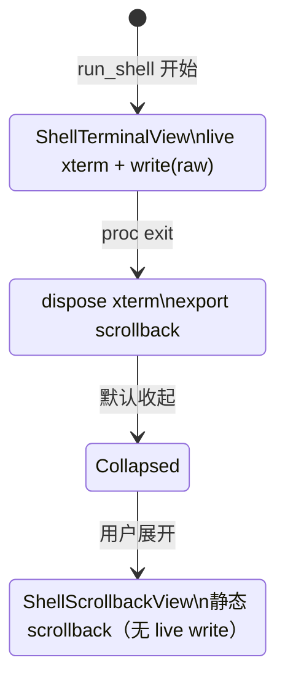
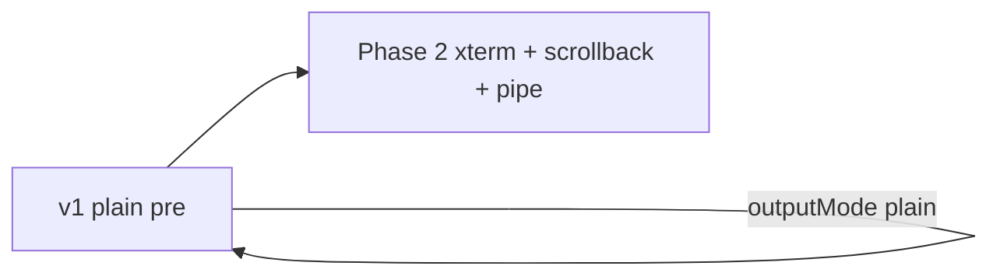
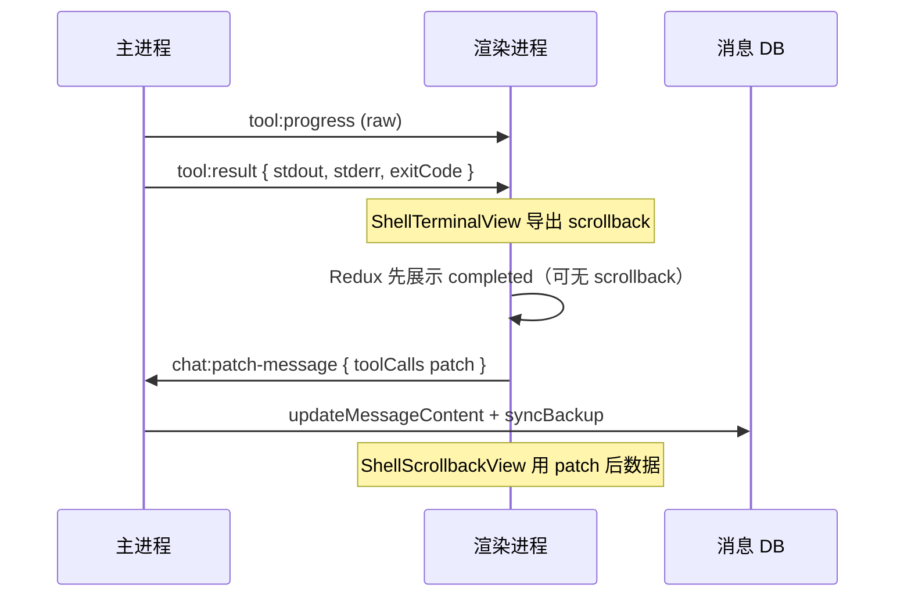

# run_shell 终端输出增强（ANSI / 进度条）— 产品需求

**版本：** 1.5  
**日期：** 2026-05-31  
**状态：** 已实现  

**前置文档：**
- [shell-output-display-requirement.md](./shell-output-display-requirement.md)（v1.0 MVP：实时纯文本输出、格式化 stdout/stderr）— **已实现**
- [shell-command-tool-requirement.md](./shell-command-tool-requirement.md)（`run_shell` 工具定义、安全机制）

**关联文档：**
- [chat-message-ui-requirement.md](./chat-message-ui-requirement.md)（工具卡片 UI）
- [browser-playwright-install-guide-requirement.md](./browser-playwright-install-guide-requirement.md)（`playwright install` 典型慢命令场景）

**架构决策（v1.1）：** **单一 xterm 渲染栈** — 执行中挂载 live xterm；命令结束 **销毁实例并导出 scrollback** 供完成态静态展示。**不**单独维护 `AnsiOutput` 双栈（见 [§5.1](#51-架构决策xterm-单栈--scrollback-导出)）。

**架构决策（v1.2）：** **PTY 不做，维持 pipe** — 不引入 `node-pty`；执行通道永久使用 `child_process.spawn` 管道。xterm 仅作展示层；TTY 检测、块缓冲、部分 CLI 进度行为与本地 Terminal 的差异为**已知限制**，不纳入本需求范围。

---

## 目录

1. [概述](#1-概述)
2. [MVP 基线与剩余差距](#2-mvp-基线与剩余差距)
3. [目标与非目标](#3-目标与非目标)
4. [用户故事](#4-用户故事)
5. [方案总览](#5-方案总览)
6. [xterm 执行视图与 scrollback 导出](#6-xterm-执行视图与-scrollback-导出)
7. [数据流与类型设计](#7-数据流与类型设计)
8. [UI 与交互](#8-ui-与交互)
9. [安全与配置](#9-安全与配置)
10. [实现要点与文件清单](#10-实现要点与文件清单)
11. [测试计划](#11-测试计划)
12. [验收标准](#12-验收标准)
13. [待解决问题](#13-待解决问题)

---

## 1. 概述

### 1.1 背景

[v1 MVP](./shell-output-display-requirement.md) 已落地：`ShellOutputView` + `progressOutput` 管道推送 + `normalizeTerminalOutput()` 剥离控制码。

真实 CLI 场景仍存在展示层差距：无 ANSI 颜色、`\r` 进度条在 `<pre>` 中不刷新、完成态去色。管道非 TTY 导致的 CLI 行为差异（块缓冲、部分工具关色/简版 UI）**不在本需求修复范围内**——维持 pipe，避免 Electron 原生模块打包成本。

本需求定义 **Phase 2**：在保持 `run_shell` 安全边界与 **pipe 执行** 的前提下，用 **xterm.js 单栈** 提升输出可读性与终端观感。

### 1.2 产品价值

| 价值 | 说明 |
|------|------|
| 可读性 | 执行中与完成后 scrollback 保留 ANSI 语义（程序已输出的部分） |
| 进度展示 | `\r` 进度条在 live xterm 中同行刷新（数据到达时） |
| 运行时轻量 | 完成后销毁 xterm，历史卡片不堆积 live 实例 |
| 工程简单 | 无 `node-pty` / `electron-rebuild` / 三平台 prebuild |

### 1.3 已知限制（pipe，不修复）

| 限制 | 说明 |
|------|------|
| G8 管道块缓冲 | 部分 CLI 输出延迟或成块到达；进度条可能长时间不动或跳变 |
| 非 TTY 行为 | 部分工具无 TTY 时关闭颜色或使用简版进度 UI |
| 与 Terminal 非 1:1 | 典型如 `npx playwright install` 进度体验可能弱于本地 Terminal |

缓解手段（可选、非验收硬指标）：`shellSpawnEnv.ts` 环境变量补丁、`FORCE_COLOR` 等；无法替代 PTY。

---

## 2. MVP 基线与剩余差距

### 2.1 已实现（v1）

| 组件 | 路径 | 行为 |
|------|------|------|
| 实时推送 | `electron/tools/runShellExecutor.ts` | `sendProgress` → 尾部 4000 字符 |
| 控制码预处理 | `src/shared/terminalOutputSanitize.ts` | 剥离 ANSI、`\r` 折叠 |
| 渲染 | `ShellOutputView.tsx` | `<pre>` 纯文本 |
| 环境补丁 | `electron/shell/shellSpawnEnv.ts` | PATH 补全；playwright 专用 env |

### 2.2 Phase 2 差距（本需求覆盖）

| # | 差距 |
|---|------|
| G6 | ANSI 被 strip |
| G7 | `\r` 仅折叠快照，非终端刷新 |
| G10 | 完成态去色 |

### 2.3 明确不覆盖（v1.2）

| # | 原差距 | 状态 |
|---|--------|------|
| G8 | 管道块缓冲 | **接受**；PTY 不做 |
| G9 | 无 PTY | **已决**：不做 |

---

## 3. 目标与非目标

### 3.1 目标

| # | 目标 |
|---|------|
| O2-01 | **executing**：xterm 只读视图，ANSI + `\r` 同行刷新（raw 到达时） |
| O2-02 | **completed/failed**：销毁 xterm，**导出 scrollback** 静态展示（含颜色） |
| O2-03 | 只读：不向 Agent / 用户注入 stdin |
| O2-04 | `outputMode: plain` 回退 v1 |
| O2-05 | xterm 主题跟随应用亮/暗色 |
| O2-06 | 执行通道维持 **pipe**（`runShellExecutor` spawn，不引入 `node-pty`） |

### 3.2 非目标

| 项 | 说明 |
|----|------|
| **PTY / `node-pty`** | **v1.2 已否决**；见架构决策 |
| `AnsiOutput` 独立组件 / 双渲染栈 | 已否决；ANSI 统一由 xterm 处理 |
| 全功能交互终端 | vim、npm init 交互等 |
| Agent stdin | 不做 |
| 输出搜索 / 过滤 | 不做 |
| 全屏 TUI（`less`/`top`/`vim` 等） | **不保证**；见 [§9.1 全屏 TUI 策略（OQ-4）](#91-全屏-tui-策略oq-4) |
| scrollback 持久化到 DB | 仅存 `result.data`；刷新后靠 scrollback 字段重建 |
| 远程 / SSH PTY | 不做 |
| pipe 下 TTY 行为与本地 Terminal 完全一致 | 不做 |
| 飞书远程 terminal 模式 | **v1.4 已否决**；飞书会话恒 `plain`，见 §9.3 |

---

## 4. 用户故事

### US2-01：彩色构建日志

**作为开发者**，命令执行期间与完成后，我希望在卡片里看到**带 ANSI 的彩色输出**（在 CLI 已输出 ANSI 的前提下）。

### US2-02：安装进度可见

**作为开发者**，`npx playwright install` 等慢命令执行时，我希望在卡片里看到**尽可能实时的输出**；`\r` 进度条在数据到达时应同行刷新。**不**要求与本地 Terminal 进度条完全等价。

### US2-03：历史卡片不拖慢界面

**作为开发者**，聊天里有多条已完成的 shell 命令时，界面仍应流畅——**不应**为每条历史命令常驻 live xterm。

### US2-04：可控回退

**作为开发者**，我可在设置中选「纯文本」，回到 v1 行为。

---

## 5. 方案总览

### 5.1 架构决策：xterm 单栈 + scrollback 导出 + pipe 执行



| 阶段 | xterm 实例 | 执行 | 展示内容 |
|------|------------|------|----------|
| `executing` | **1 个 live** / 工具调用 | **pipe** | 实时 `write(raw bytes)` |
| `completed` / `failed` | **0**（已 dispose） | — | 导出后的 scrollback 快照 |
| 历史卡片展开 | **0 或懒加载 1 个只读** | — | 从 scrollback 恢复，**禁止** `write` |

**scrollback 导出时机：** 收到 `tool:result` 前，渲染端在 `ShellTerminalView` 卸载前调用 `exportTerminalScrollback(terminal)`，经 IPC/Redux 写入 `result.data.terminalScrollback`（见 §7）。

**为何不双栈：** 包体积只引入 **一次** xterm；完成态不另建 `AnsiOutput` 解析器。静态展示优先用 **SerializeAddon 序列化字符串** 或 **scrollback 行文本 + ANSI**，在 `ShellScrollbackView` 中一次性 `write` 后冻结（`disableStdin`、不再订阅 progress）。

**为何不 PTY：** Electron 原生模块打包与三平台维护成本高；SpaceAssistant `run_shell` 为只读 Agent 代跑，pipe + xterm 已覆盖主要展示诉求。

### 5.2 范围



| 范围 | 内容 | 优先级 |
|------|------|--------|
| **Phase 2** | `@xterm/xterm` live 视图；scrollback 导出；完成态静态展示；**pipe 执行** | P1 |

~~Phase 2B（`node-pty`）~~ — **v1.2 砍掉**，见架构决策。

---

## 6. xterm 执行视图与 scrollback 导出

### 6.1 组件职责

| 组件 | 文件 | 职责 |
|------|------|------|
| `ShellTerminalView` | 新建 | **仅** `status === 'executing'`；live xterm |
| `ShellScrollbackView` | 新建 | **仅** `completed` / `failed`；静态 scrollback |
| `ShellOutputView` | 保留 | `outputMode === 'plain'` 时全阶段使用（v1） |

### 6.2 `ShellTerminalView`（executing）

| 属性 | 规格 |
|------|------|
| 依赖 | `@xterm/xterm`、`@xterm/addon-fit`；可选 `@xterm/addon-serialize` |
| 模式 | `disableStdin: true` |
| 输入 | IPC `progressOutputRaw`（base64 增量 bytes）→ `terminal.write()` |
| 尺寸 | 默认 80×24 逻辑行列；CSS max-height 240px；`FitAddon` |
| 主题 | `terminalTheme.ts` → xterm `ITheme`，映射 `--sa-*` |
| 滚动 | 默认跟随底部；用户上滚 → 暂停 +「恢复跟随」 |

### 6.3 scrollback 导出（executing → completed）

在 `ToolCallCard` / `chatToolSessionService` 监听到 **同一 `toolUseId` 进入终态** 时：

```typescript
type TerminalScrollbackExport = {
  /** SerializeAddon 序列化串，或 xterm 官方推荐的 restore 格式；优先 */
  serialized?: string
  /** 降级：带 ANSI 的纯文本行（buffer 逐行拼接） */
  ansiText?: string
  /** 降级：无 ANSI 纯文本（plain 模式回退） */
  plainText?: string
  cols: number
  rows: number
}

function exportTerminalScrollback(terminal: Terminal): TerminalScrollbackExport
```

| 步骤 | 说明 |
|------|------|
| 1 | `terminal.buffer.active` 或 `SerializeAddon.serialize()` |
| 2 | 写入 `result.data.terminalScrollback`（随 tool result 持久化到消息） |
| 3 | `terminal.dispose()`；清空 `progressOutputRaw` |
| 4 | 切换渲染为 `ShellScrollbackView` |

**与 v1 字段关系：**

| 字段 | terminal 模式 |
|------|---------------|
| `stdout` / `stderr` | 仍填充 **plainText**（无 ANSI），供 Agent tool_result / 搜索；**pipe 下分路保留** |
| `terminalScrollback` | UI 专用，含 ANSI/序列化态 |
| `progressOutput` | executing 期间可选保留；完成后清除 |

### 6.4 `ShellScrollbackView`（completed / failed）

| 策略 | 说明 |
|------|------|
| **首选** | 懒加载：卡片**展开时** `new Terminal({ disableStdin: true })` → `write(serialized)` **一次** → 不再 write；卡片收起或卸载时 `dispose` |
| **降级 A** | 无 serialized 时用 `ansiText` 一次性 write |
| **降级 B** | 仅 `plainText` → 回退 v1 `ShellOutputView` |

**约束：** 同一时刻，聊天区内 **live xterm 实例数 ≤ 正在执行的 run_shell 数**（通常 ≤ 并行会话数）；**不得**为每条历史命令常挂 live xterm。

### 6.5 pipe 模式数据流

```
runShellExecutor (pipe，唯一执行通道)
  → stdout/stderr 分路累积
  → sendProgress({ raw: base64(chunk), seq })  // terminal 模式发 raw；plain 模式发 message
  → progressOutputRaw 累积 / 增量
  → ShellTerminalView.write

proc.on('close')
  → tool:result { stdout, stderr, exitCode }   // 主进程尚无 scrollback
  → 渲染端 exportTerminalScrollback + xterm.dispose
  → chat:patch-message merge terminalScrollback → DB
```

**scrollback 持久化（OQ-6 已决）：** 复用现有 **`chat:patch-message`**，**不**新增 `tool:scrollback` IPC。

| 方案 | 说明 |
|------|------|
| A. `chat:patch-message` merge | 渲染端导出后 patch `toolCalls[].result.data.terminalScrollback` | ✅ **采用** |
| B. Redux 仅存 scrollback | 刷新丢失 | ❌ |
| C. 新建 `tool:scrollback` | 语义独立但多一条通道 | ❌ 不采用 |

**时序（terminal 模式）：**



**patch 要点：**

| 项 | 规格 |
|----|------|
| 通道 | 现有 `chat:patch-message`（`preload` → `appIpc` → `updateMessageContent`） |
| 定位 | `messageId` + `sessionId` + `toolUseId` 对应 `toolCalls[]` 条目 |
| merge | 仅 merge `result.data.terminalScrollback`；**不**改 `stdout`/`stderr`（主进程已在 `tool:result` 写入） |
| UI 空窗 | `tool:result` 后 scrollback 未到时，完成态可暂用 `stdout`/`stderr` plain 或 loading；patch 到达后切 `ShellScrollbackView` |
| 飞书 plain | **不**触发 scrollback patch（§9.3） |

### 6.6 与 `normalizeTerminalOutput` 的关系

| `outputMode` | executing | completed |
|--------------|-----------|-----------|
| `plain` | `ShellOutputView` + strip ANSI | v1 行为 |
| `terminal` | raw → xterm，**不** strip | scrollback 快照，**不** strip |

---

## 7. 数据流与类型设计

### 7.1 类型扩展

```typescript
/** result.data 扩展 */
export interface ShellTerminalScrollback {
  serialized?: string
  ansiText?: string
  plainText?: string
  cols: number
  rows: number
}

export interface ToolCallRecord {
  progressOutput?: string          // plain 模式；terminal 模式可省略
  progressOutputRaw?: string       // base64 增量；仅 executing 内存
  progressSeq?: number
}

export interface ShellResultData {
  stdout?: string
  stderr?: string
  exitCode?: number | null
  truncated?: boolean
  persistedOutputPath?: string
  /** terminal 模式完成态 UI */
  terminalScrollback?: ShellTerminalScrollback
}
```

### 7.2 ShellConfig 扩展

```typescript
export interface ShellConfig {
  /** plain：v1；terminal：xterm + scrollback（默认升级用户 plain，新用户 terminal） */
  outputMode?: 'plain' | 'terminal'
  // 无 usePty / ptyCols / ptyRows — PTY 不做
}

/** 有效输出模式：飞书远程会话强制 plain，见 §9.3 */
function resolveEffectiveShellOutputMode(
  shellConfig: ShellConfig | undefined,
  sessionMetadata?: SessionMetadata
): 'plain' | 'terminal'
```

| 条件 | 有效 `outputMode` |
|------|-------------------|
| `session.metadata.source === 'feishu'` | **`plain`（强制）** |
| `remoteContext?.source === 'feishu'`（headless 远程 Agent） | **`plain`（强制）** |
| 其它桌面会话 | `shellConfig.outputMode ?? 'terminal'`（或产品默认） |

### 7.3 IPC（OQ-6：scrollback 回写）

**主 → 渲染（既有，不变）：**

```typescript
// tool:progress — terminal 模式含 raw；plain 含 message
{ requestId, toolUseId, status, raw?: string, seq?: number, message?: string }

// tool:result — 主进程字段；不含 terminalScrollback
{ requestId, toolUseId, result: ToolCallResultPersisted }
```

**渲染 → 主（scrollback 持久化，复用既有）：**

```typescript
// chat:patch-message — 导出 scrollback 后立即 invoke
{
  sessionId: string
  messageId: string   // 当前 assistant 消息
  patch: {
    toolCalls: ToolCallRecord[]  // 深拷贝后仅改对应 id 的 result.data.terminalScrollback
  }
}
```

实现可在 `chatToolSessionService` / `ToolCallCard` 卸载钩子中封装 `patchShellTerminalScrollback(toolUseId, scrollback)`，内部调用 `window.api.chatPatchMessage`。

**不新增：** `tool:scrollback` 事件或 invoke 通道。

### 7.4 完成态 UI 选型

| 状态 | `plain` | `terminal` |
|------|---------|------------|
| executing | `ShellOutputView` | `ShellTerminalView` |
| completed / failed | `ShellOutputView` | `ShellScrollbackView` |
| stderr 展示 | 分 stdout/stderr 块 | scrollback 统一展示；**可选** meta 行显示退出码；Agent 仍用分路 `stdout`/`stderr` |

---

## 8. UI 与交互

### 8.1 设置（Shell Tab）

| 控件 | 选项 |
|------|------|
| 命令输出 | 纯文本（v1）/ 终端视图（xterm） |

> **飞书远程会话**（`metadata.source === 'feishu'`）恒为纯文本，设置项对这类会话**不生效**；见 [§9.3](#93-飞书远程输出模式oq-5)。

~~使用伪终端~~ — **不提供**；执行恒为 pipe。

### 8.2 生命周期示意

```
executing:  [ ShellTerminalView — live xterm ]
     │ export + dispose
     ▼
completed:  [ ShellScrollbackView — 静态，展开时懒加载 xterm 或 pre 降级 ]
```

### 8.3 性能预算

| 指标 | 上限 |
|------|------|
| 同时 **live** xterm | ≤ 并行 executing 的 run_shell 数 |
| scrollback 序列化大小 | ≤ 256KB；超出截断并标记 `truncated` |
| progress raw 内存 | ≤ 64KB tail |
| xterm write 批量 | `requestAnimationFrame` ≥16ms |

---

## 9. 安全与配置

### 9.1 全屏 TUI 策略（OQ-4）

**已决：** 应用内**不支持**全屏 / 交互式 TUI；遇此类场景**提示用户在外部 Terminal 执行**，不做 in-app 仿真，**不**为 TUI 引入 PTY 或 stdin。

| 层级 | 策略 |
|------|------|
| **产品边界** | `run_shell` 为只读 pipe +（可选）xterm 展示；`disableStdin`；卡片高度有限，不承载 `less`/`top`/`vim`/`npm init` 交互向导 |
| **Agent 引导** | `shell-setup-guide` Skill 与 `run_shell` 工具描述：优先非交互替代（如 `git --no-pager log`、`npm init -y`）；**避免**对分页器 / 全屏监控 / 编辑器调用 `run_shell` |
| **用户提示** | Shell 工具卡片（设置页帮助文案可复用）：说明「交互式全屏命令请在外部终端运行」；提供 **「在工作目录打开终端」** 按钮（复用 `openTerminalAtCwd`，IPC 建议 `shell:open-terminal`，cwd = 会话 `workDir`） |
| **安全** | **不**将 `less`/`vim`/`top` 等列入 §7.2 硬 deny；与 [shell-command-tool-requirement.md](./shell-command-tool-requirement.md)「不支持交互式 stdin」一致，以引导为主 |
| **事后** | 命令已跑且挂起 / 输出乱码时：卡片展示简短说明 + 同上「打开终端」入口；Agent 建议用户手动在外部 Terminal 重跑 |

**典型不适用命令（非穷举）：** `less`、`more`、`top`、`htop`、`vim`、`nano`、交互式 `npm init`、需编辑器的 `git rebase -i`。

### 9.3 飞书远程输出模式（OQ-5）

**已决：** 飞书相关会话 **`run_shell` 输出恒为 `plain`**，**禁用** terminal 模式（无 xterm、无 `progressOutputRaw`、无 `terminalScrollback`、不向飞书推送 ANSI/raw）。

| 层级 | 策略 |
|------|------|
| **判定** | `session.metadata.source === 'feishu'` **或** 主进程 `remoteContext?.source === 'feishu'`（`feishuRemoteAgent` headless 路径） |
| **与用户设置** | 忽略全局 `shellConfig.outputMode`；用户在 Shell 设置选「终端视图」**不影响**飞书会话 |
| **桌面查看飞书会话** | 用户在桌面打开由飞书创建的会话时，仍走 **plain**（与远程执行、持久化字段一致） |
| **进度回飞书** | 仅 `tool:progress.message` 纯文本 → `publishFeishuRemoteProgress`（现有链路）；**不**发送 base64 raw |
| **持久化** | `result.data` 仅 `stdout` / `stderr` / `exitCode` 等 v1 字段；**不**写入 `terminalScrollback` |
| **UI** | 飞书来源会话的工具卡片始终 `ShellOutputView`；不挂载 `ShellTerminalView` / `ShellScrollbackView` |

**理由：** 飞书端无 xterm 展示面；headless Agent 无渲染进程 scrollback 导出；plain 与现有飞书进度/回复格式一致。

**与 `run_shell` 远程开关：** 若产品仍禁止飞书远程调用 `run_shell`（见 [shell-command-tool-requirement.md OQ-4](./shell-command-tool-requirement.md)），本条款在 **允许远程 shell 后** 仍成立；实现 `resolveEffectiveShellOutputMode` 时一并接入。

### 9.4 其它

- xterm 不改变 `run_shell` 确认与沙箱规则；执行仍为 pipe spawn。
- xterm `disableStdin`；**不**引入原生模块到渲染进程或主进程打包链。
- SerializeAddon 输出仅作展示，禁止 `dangerouslySetInnerHTML`。
- xterm 初始化失败 → 降级 `plain` + `ShellOutputView`。

---

## 10. 实现要点与文件清单

| 文件 | 改动 |
|------|------|
| `ShellTerminalView.tsx` | **新建** live xterm |
| `ShellScrollbackView.tsx` | **新建** 静态 scrollback |
| `terminalScrollback.ts` | **新建** export/import 工具 |
| `terminalTheme.ts` | **新建** xterm ITheme |
| `ToolCallCard.tsx` | executing/completed 分支；卸载前 export；可选 shell「在工作目录打开终端」 |
| `chatToolSessionService.ts` | `progressOutputRaw`；`onResult` 后触发 scrollback 导出 + `chatPatchMessage` |
| `runShellExecutor.ts` | progress 发送 raw base64（pipe）；按有效 outputMode 分支 plain/raw |
| `toolChatLoop.ts` | `resolveEffectiveShellOutputMode`；飞书 plain-only；`tool:result` 不含 scrollback |
| `feishuRemoteAgent.ts` / `feishuRemoteProgress.ts` | 远程路径不期望 raw/scrollback |
| `domainTypes.ts` | `ShellTerminalScrollback`、`outputMode` |
| `ShellSettingsTab.tsx` | 输出模式；Shell 帮助文案含 TUI 说明 |
| `shellSetupGuideSkill.ts` | Agent：避免 TUI / 优先非交互 flags |
| `appIpc.ts` / `preload.ts` | 可选 `shell:open-terminal`（workDir，`openTerminalAtCwd`） |
| `package.json` | `@xterm/xterm`、`@xterm/addon-fit`、`@xterm/addon-serialize` |

**不新增：** `runShellExecutorPty.ts`、`node-pty`、`electron-rebuild`、**`tool:scrollback` IPC**。

---

## 11. 测试计划

| 测试 | 覆盖 |
|------|------|
| `terminalScrollback.test.ts` | 导出/截断/降级 plainText |
| `ShellTerminalView.test.tsx` | mock xterm；`\r` 同行 |
| `ShellScrollbackView.test.tsx` | serialized 恢复；dispose |
| `ToolCallCard.test.tsx` | executing→completed 切换；无残留 live |
| `resolveEffectiveShellOutputMode.test.ts` | feishu metadata / remoteContext → plain |
| `chatToolSessionService.test.ts` | scrollback 导出后调用 `chatPatchMessage` |
| 手工 | 带 ANSI 的构建日志；完成后展开颜色保留；慢命令有持续输出（进度平滑性非硬指标） |

---

## 12. 验收标准

- [ ] `outputMode=terminal` 时 executing 使用 live xterm，`\r` 进度条在 raw 到达时同行刷新
- [ ] 命令结束后 live xterm **已 dispose**；`chat:patch-message` 写入 `result.data.terminalScrollback`
- [ ] **刷新页面 / 重开会话** 后，已完成 shell 卡片展开仍可见 scrollback 彩色内容
- [ ] 完成态展开为静态 scrollback，颜色与 executing 末帧一致（CLI 有输出 ANSI 时）
- [ ] 聊天历史 10+ 条已完成 shell 卡片，无 10+ live xterm
- [ ] `outputMode=plain` 与 v1 一致
- [ ] 执行通道为 pipe；**无** `node-pty` 依赖
- [ ] `stdout` / `stderr` 仍分路写入 `result.data`，供 Agent 使用
- [ ] `metadata.source === 'feishu'` 的会话：`run_shell` 恒 plain，无 xterm/scrollback/raw progress

**非验收项（已知限制）：** pipe 块缓冲导致的进度延迟；非 TTY 下 CLI 不开色；与 iTerm 完全一致的 install 进度。

---

## 13. 待解决问题

| ID | 问题 | 状态 |
|----|------|------|
| OQ-1 | xterm 与 AnsiOutput 是否长期并存？ | **已决**：否；xterm 单栈 + scrollback 导出 |
| OQ-2 | PTY 单流后 stderr 如何展示？ | **已决（PTY 不做）**：维持 pipe 分路；UI scrollback 合并展示 + 退出码 meta |
| OQ-3 | `node-pty` 打包 | **已决**：不做 PTY；维持 pipe |
| OQ-4 | 全屏 TUI | **已决**：不支持 in-app TUI；Agent/文案引导 + 卡片「在工作目录打开终端」（`shell:open-terminal`）；不硬 deny |
| OQ-5 | 飞书远程禁用 terminal 模式？ | **已决**：飞书会话 / remoteContext 强制 **仅 `plain`**；见 §9.3 |
| OQ-6 | scrollback 回写 IPC | **已决**：复用 **`chat:patch-message`** merge `toolCalls[].result.data.terminalScrollback`；不新增 `tool:scrollback`；见 §6.5、§7.3 |

---

**变更记录：**

| 版本 | 日期 | 说明 |
|------|------|------|
| 1.0 | 2026-05-31 | 初稿（含 AnsiOutput 双栈方案） |
| 1.1 | 2026-05-31 | 采纳 xterm 单栈：executing live → 导出 scrollback → 静态展示；移除 AnsiOutput |
| 1.2 | 2026-05-31 | **砍掉 Phase 2B**；架构决策「PTY 不做，维持 pipe」；移除 `node-pty`/PTY 配置/验收；收紧 US2-02 与已知限制 |
| 1.3 | 2026-05-31 | **OQ-4 已决**：全屏 TUI 不保证；引导外部 Terminal + `shell:open-terminal`；§9.1 |
| 1.4 | 2026-05-31 | **OQ-5 已决**：飞书远程 / `metadata.source=feishu` 强制 plain；§7.2、§9.3 |
| 1.5 | 2026-05-31 | **OQ-6 已决**：scrollback 经 `chat:patch-message` 回写；§6.5、§7.3 |

**维护者：** 与 [shell-output-display-requirement.md](./shell-output-display-requirement.md) 同步演进
