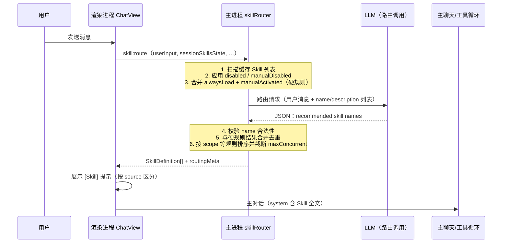

# Skill 大模型路由 — 需求规格

**版本：** 1.1  
**日期：** 2026-05-27  
**状态：** 待评审  
**关联文档：** [skills-requirement.md](./skills-requirement.md)、[session-auto-title-requirement.md](./session-auto-title-requirement.md)、[tools-requirement.md](./tools-requirement.md)、[chat-message-ui-requirement.md](./chat-message-ui-requirement.md)

**变更记录：**

| 版本 | 日期 | 说明 |
|------|------|------|
| 1.0 | 2026-05-27 | 初稿：将 Skill 自动加载从本地启发式匹配演进为大模型基于 `description` 的路由决策 |
| 1.1 | 2026-05-27 | 明确 `scope` 为平台运行时字段，不传入路由 LLM，仅用于 UI 与后处理排序 |

---

## 目录

1. [概述](#1-概述)
2. [现状与问题](#2-现状与问题)
3. [目标与非目标](#3-目标与非目标)
4. [设计原则](#4-设计原则)
5. [目标架构](#5-目标架构)
6. [路由调用规格](#6-路由调用规格)
7. [硬规则与 LLM 决策边界](#7-硬规则与-llm-决策边界)
8. [字段语义变更](#8-字段语义变更)
9. [会话级状态与多轮行为](#9-会话级状态与多轮行为)
10. [用户可见反馈](#10-用户可见反馈)
11. [配置与数据模型](#11-配置与数据模型)
12. [IPC 与模块边界](#12-ipc-与模块边界)
13. [与现有功能的关系](#13-与现有功能的关系)
14. [非功能需求](#14-非功能需求)
15. [迁移与兼容](#15-迁移与兼容)
16. [发布计划](#16-发布计划)
17. [验收标准](#17-验收标准)
18. [待解决问题](#18-待解决问题)
19. [相关文件](#19-相关文件)

---

## 1. 概述

### 1.1 背景

SpaceAssistant 已实现 Skills 机制（见 [skills-requirement.md](./skills-requirement.md)）：扫描项目级 / 用户级 `SKILL.md`，在用户发送聊天消息**之前**，通过本地规则匹配 Skill，并将命中 Skill 的全文注入主对话的 `system` 字段。

当前自动匹配采用 **关键词（`triggers`）+ 描述文本相似度（`description`）** 的启发式算法（`electron/skills/skillMatcher.ts`），**并非** Claude Code 所描述的「模型阅读 Skill 描述后自行判断是否相关」。

产品方向调整为：**由大模型阅读各 Skill 的 `description`，决定本次用户请求是否应加载对应 Skill 全文**。这与 Claude Code Skills PRD（`docs/references/claude_code_skills_prd.md` §4.3）一致，也更符合 Skill 作者在 `description` 中撰写「适用场景」的预期。

### 1.2 本需求范围

| 在范围内 | 不在范围内 |
|----------|------------|
| 用一次**轻量 LLM 路由调用**替代本地自动匹配 | Skill 市场、Skill 依赖声明 |
| 保留 `/skill use`、全局/会话禁用、`alwaysLoad` 等硬规则 | 主 Agent 循环内新增 `load_skill` 工具（可作为后续 OQ 评估） |
| 更新配置项、IPC、UI 提示、激活审计 | 向量检索 / Embedding 索引（属于另一技术路线） |
| 明确失败降级与用户可见行为 | 修改 Skill 文件格式（Front Matter 必填字段不变） |

### 1.3 与现有需求文档的关系

- 本需求 ** supersede ** [skills-requirement.md](./skills-requirement.md) 中 **§6.2 自动匹配策略** 与 **§13 Phase 3「描述语义匹配」** 的实现方向。
- [skills-requirement.md](./skills-requirement.md) 的 Skill 定义、目录、管理 UI、注入格式、斜杠命令等 **继续有效**。
- 实现完成后，应在 `skills-requirement.md` §14 增加交叉引用，标明自动匹配已迁移至本文档。

---

## 2. 现状与问题

### 2.1 当前流程（已实现）

```
用户发送消息
  → skill:match（本地 skillMatcher）
      · alwaysLoad
      · manualActivated
      · triggers 关键词包含
      · description 词频/Jaccard 相似度 ≥ 0.4
  → buildSystemPromptFromSkills(activeSkills)
  → 主聊天 / 工具循环（Skill 全文已在 system 中）
```

### 2.2 主要问题

| # | 问题 | 影响 |
|---|------|------|
| P1 | **语义理解不足**：本地相似度无法理解「帮我头脑风暴几个游戏创意」与「高概念种子生成」的关联 | 该加载时不加载，或不该加载时误加载 |
| P2 | **误匹配**：描述中含常见词（如「生成」「筛选」）时，与普通编程/写作请求产生假阳性 | 无关 Skill 占用上下文窗口 |
| P3 | **与作者意图不一致**：Skill 作者在 `description` 中写的是给「模型读的判断依据」，实现却用字符串匹配 | 维护成本高，需额外调 `triggers` 规避误匹配 |
| P4 | **UI 状态泄漏（已修）**：切换会话时 `[Skill] 已自动加载` 提示未清空，造成「新会话未对话即显示加载」的错觉 | 用户信任度下降 |
| P5 | **`triggers` 职责混乱**：既作本地关键词，又可能在 description 中重复表达适用场景 | 两套规则难以保持一致 |

### 2.3 期望方向（Claude Code 对齐）

```
用户输入
  ↓
向模型提供：用户消息 + 可用 Skill 列表（仅 name / description）
  ↓
模型推理：哪些 Skill 与当前任务高度相关？
  ↓
  ├── 命中 → 读取对应 SKILL.md 全文 → 注入 system → 执行主对话
  └── 未命中 → 不注入 Skill → 直接执行主对话
```

SpaceAssistant 为桌面应用，需在 **延迟、成本、可观测性** 约束下实现上述语义，而非在 CLI 宿主内隐式完成。

---

## 3. 目标与非目标

### 3.1 目标

| # | 目标 |
|---|------|
| G1 | 用户发送普通聊天消息后，由 **LLM 基于各 Skill 的 `description`** 决定自动加载哪些 Skill |
| G2 | 自动加载决策 **不依赖** 本地 `triggers` 关键词匹配与 description 词频相似度 |
| G3 | 保留并明确 **硬规则通道**：`alwaysLoad`、`/skill use`、飞书会话等特殊策略不受 LLM 否决 |
| G4 | 路由失败时有 **可预期降级**，不阻断主对话 |
| G5 | 用户仍可在聊天区看到 **本次实际加载了哪些 Skill** 及加载来源（LLM / 手动 / alwaysLoad） |
| G6 | 路由调用与主对话 **解耦**（异步、可超时），实现模式参考 [session-auto-title-requirement.md](./session-auto-title-requirement.md) |

### 3.2 非目标

- 不在本阶段引入 Embedding 向量库或本地 ML 模型
- 不让主 Agent 通过 Tool Use 自行「翻目录找 Skill」（避免多一轮工具延迟；见 OQ-3）
- 不改变 Skill 正文注入格式（仍为 `buildSystemPromptFromSkills`）
- 不强制用户为路由单独配置 API Key（复用当前会话 LLM 服务）

---

## 4. 设计原则

| 原则 | 说明 |
|------|------|
| **Description 是唯一自动语义依据** | 路由 LLM 的 Skill 列表中，每个 Skill **仅**暴露 `name` 与 `description`；不传 `scope`、`triggers`、正文或路径 |
| **`scope` 不参与路由推理** | `scope`（`project` / `user`）为 SpaceAssistant 扫描目录时赋值的**平台运行时字段**，非 SKILL.md 规范字段；仅用于 UI 展示与后处理排序（见 §8.4） |
| **硬规则优先于 LLM** | `alwaysLoad`、手动激活、全局/会话 `disabled` 在路由前/后确定性处理，LLM 不能加载已禁用 Skill |
| **先路由、后主对话** | 路由完成（或超时降级）后再发起主流式请求，保证 system 中 Skill 内容完整 |
| **失败可降级、不阻断** | 路由超时/解析失败 → 视为「无自动 Skill」，主对话照常进行 |
| **可观测** | 记录路由输入摘要、模型输出、最终加载列表与 `matchSource`，写入 Agent 日志与会话 metadata |
| **成本可控** | 路由使用短输出、低 `max_tokens`；可选独立「路由模型」配置 |

---

## 5. 目标架构

### 5.1 端到端流程



### 5.2 模块划分

| 模块 | 路径（建议） | 职责 |
|------|----------------|------|
| Skill 扫描 / 缓存 | 现有 `skillCache.ts`、`skillScanner.ts` | 不变 |
| **Skill 路由器** | 新建 `electron/skills/skillRouter.ts` | 硬规则 + 调用 LLM + 解析 + 合并 |
| 路由 Prompt 构建 | `electron/skills/skillRoutingPrompt.ts` 或合入 router | 组装 system/user 消息 |
| 本地匹配器（废弃路径） | `skillMatcher.ts` | Phase 4 后仅保留给 `routingMode=legacy` 或测试 |
| 渲染层编排 | `ChatView.tsx` | 调用 `skill:route` 替代 `skill:match` |
| 会话标题路由（参考） | `sessionTitleSuggest.ts` | 复用「独立 LLM 调用 + 超时 + 不阻断主流程」模式 |

### 5.3 路由调用时机

| 场景 | 是否走路由 LLM |
|------|----------------|
| 普通用户消息（含 Plan 模式用户消息） | 是（若 `skills.routing.enabled === true`） |
| `/skill list` / `use` / `disable` / `status` | 否（命令处理器，不触发路由） |
| `/wiki …` 命令 | 否（Wiki 命令流独立） |
| 仅 Plan Worker 内部步进、无新用户消息 | 否（沿用当轮已加载 Skill 或空） |
| 飞书远程入站（`metadata.source === 'feishu'`） | 硬规则可预加载飞书 Skill；其余仍走路由 |

---

## 6. 路由调用规格

### 6.1 路由 LLM 输入

#### System Prompt（固定模板）

```text
你是 SpaceAssistant 的 Skill 路由助手。你的唯一任务是：根据「用户当前请求」，从「可用 Skill 列表」中选出**确实需要加载**的 Skill。

判断依据：
- 仅根据每个 Skill 的 description 判断是否与当前任务相关。
- 宁可少选，不可误选：不确定时不选。
- 不要猜测用户未表达的需求。
- 输出必须是合法 JSON，不要 markdown 代码块，不要解释。

输出格式：
{"skills":["skill-name-1","skill-name-2"]}

若无合适 Skill，输出：{"skills":[]}
```

#### User 消息体

```text
## 用户当前请求
{userInput}

## 可用 Skill 列表
{skillsCatalog}

## 会话上下文（可选）
{recentContext}
```

其中 `{skillsCatalog}` 每行一条，格式：

```text
- {name}：{description}
```

- **仅包含** `name` 与 `description`（均来自 `SKILL.md` Front Matter）
- **不包含** `scope`、Skill 正文、`triggers`、文件路径
- 已 `disabled` / `manualDisabled` 的 Skill **不出现在列表中**

> `scope` 不在 catalog 中展示给路由模型。同名 Skill 在项目级与用户级目录同时存在时，扫描阶段已按 [skills-requirement.md](./skills-requirement.md) §5 规则合并为一条（项目级覆盖用户级），catalog 中不会出现重复 `name`。

#### 可选 `{recentContext}`

| 策略 | 说明 | 默认 |
|------|------|------|
| `none` | 仅当前用户消息 |  |
| `last_user_turn` | 上一条用户消息 + 当前消息 | **推荐默认** |
| `last_n_turns` | 最近 N 轮 user/assistant 纯文本摘要（不含 tool 块） | 可配置 N=2 |

用于消解追问场景（如「继续刚才那个」）。上下文总字符上限默认 **2000**，超出从最早轮次截断。

### 6.2 路由 LLM 输出

| 字段 | 类型 | 说明 |
|------|------|------|
| `skills` | `string[]` | 模型推荐的 Skill `name` 列表，顺序无关 |

**后处理规则：**

1. 解析 JSON；失败则整次路由视为失败（降级）
2. 过滤不在「可用列表」中的 name（模型幻觉）
3. 过滤 `disabled` / `manualDisabled`（双重保险）
4. 与硬规则已加载集合 **并集去重**
5. 按优先级排序后取 Top `maxConcurrent`（排序在**主进程本地**完成，路由 LLM 不参与）：
   - 来源分：`manual` = 1.0 > `alwaysLoad` = 0.95 > `llm` = 0.90
   - LLM 推荐内部顺序保留为次要键
   - 同分且需截断时：**`scope === 'project'` 优先于 `'user'`**（与现有 Skill 优先级一致）
   - `scope` **仅在此步与 UI 展示中使用**，不进入路由 Prompt

### 6.3 模型与参数

| 参数 | 默认值 | 说明 |
|------|--------|------|
| 模型 | 与当前会话相同 | 可通过 `skills.routing.model` 覆盖为更便宜模型 |
| `max_tokens` | 256 | 路由只需短 JSON |
| `temperature` | 0 | 确定性选择 |
| 超时 | 15s | 超时走降级 |
| 并发 | 每会话同时最多 1 个 in-flight 路由 | 防止连点发送重复调用 |

### 6.4 实现参考

独立 LLM 调用模式与下列现有实现一致：

- `electron/sessionTitleSuggest.ts`：`createAnthropicClient`、AbortController 超时、失败静默
- 不进入 `toolChatLoop`，不消耗工具循环 token 预算

---

## 7. 硬规则与 LLM 决策边界

以下路径 **不经过或不完全经过** LLM，且 LLM **不能推翻**：

| 来源 | 行为 | LLM 是否可否决 |
|------|------|----------------|
| `skills.alwaysLoad[]` | 每次用户消息自动并入加载集 | 否 |
| `sessionSkillsState.manualActivated[]` | 会话内手动激活，持续有效直至 disable | 否 |
| `/skill use <name>` | 写入 `manualActivated` | 否 |
| `skills.disabled[]` | 全局禁用，不出现在路由 catalog | 否 |
| `sessionSkillsState.manualDisabled[]` | 会话禁用 | 否 |
| 飞书入站 `metadata.source === 'feishu'` | 可自动并入飞书相关 Skill（保持现有策略） | 否 |
| LLM 路由推荐 | 仅补充「自动语义匹配」部分 | — |

**合并公式（概念）：**

```text
finalSkills = (alwaysLoad ∪ manualActivated ∪ feishuAuto ∪ llmRecommended)
              \ disabledGlobal
              \ manualDisabled
              → sort → take(maxConcurrent)
```

---

## 8. 字段语义变更

### 8.1 `description`（核心）

| 维度 | 变更前 | 变更后 |
|------|--------|--------|
| 作者定位 | 辅助本地相似度 + 给人看 | **路由 LLM 判断是否要加载 Skill 的唯一语义依据** |
| 写作要求 | 一般描述 | 必须写清：**适用任务类型、不适用场景、典型用户表述**（见 §8.5） |

### 8.2 `triggers`

| 维度 | 变更后语义 |
|------|------------|
| 自动加载 | **不再参与** 本地关键词匹配 |
| 保留用途 | （可选）路由 Prompt 中作为「补充提示」附加在 description 后；或仅文档/人工维护参考 |
| 必填性 | Front Matter 仍必填（兼容现有校验）；允许作者写「无」或 `- none` 占位 |
| `/skill use` | 仍按 **name** 激活，与 triggers 无关 |

> **决议（待评审确认）：** Phase 4 默认 **不把 triggers 传入路由 LLM**，避免回到「关键词驱动」；若评审认为有帮助，可在 `skills.routing.includeTriggersInCatalog` 中可选开启。

### 8.3 废弃的本地算法

以下逻辑在 `routingMode=llm` 下 **删除或停用**：

- `keywordMatch(userInput, triggers)`
- `descriptionSimilarity` + `DESCRIPTION_MATCH_THRESHOLD`
- 飞书关键词启发式（保留飞书 **Skill 名称/描述** 硬匹配，或一并改为 LLM）

### 8.4 `scope`（平台字段，非 SKILL 规范）

| 维度 | 说明 |
|------|------|
| **定义** | `SkillDefinition.scope: 'project' \| 'user'`，由应用根据 Skill 所在目录赋值（`.space-skills/` → `project`，`<userData>/skills/` → `user`） |
| **是否在 SKILL.md 中** | **否**。Front Matter 无 `scope` 字段；作者无需、也无法在 Skill 文件中声明 |
| **路由 LLM** | **不传入**。模型仅依据 `description` 判断是否加载，不应感知「项目级 / 用户级」 |
| **UI** | 聊天区 `[Skill] 已自动加载: foo（项目级）`、设置页 Skill 列表「作用域」列等，继续展示 `scope` |
| **后处理排序** | 硬规则合并后、`maxConcurrent` 截断前的本地排序 tie-break：项目级优先于用户级 |
| **扫描合并** | 同名 Skill 已在上游扫描阶段按 scope 优先级去重，路由 catalog 通常每个 `name` 唯一 |

### 8.5 Description 写作指南（规范性附录，迁移期参考）

作者在 `description` 中应包含：

1. **一句话能力摘要**
2. **适用**：典型用户意图、任务类型（3～5 条短句）
3. **不适用**：明确排除场景（避免误加载）
4. **示例用户表述**（可选）：如「生成高概念种子」「筛选创意方向」

示例：

```yaml
description: "用于交互式「高概念种子」 brainstorm：根据题材约束生成多条创意种子并协助筛选。适用：用户明确要头脑风暴游戏/故事/产品的高概念方向。不适用：普通代码编写、目录创建、与创意无关的问答。典型表述：「想几个高概念」「帮我筛创意种子」。"
```

---

## 9. 会话级状态与多轮行为

### 9.1 每轮重新路由 vs 会话粘性

| 策略 | 说明 | 推荐 |
|------|------|------|
| **每轮重新路由** | 每条新用户消息重新调用路由 LLM | **默认** |
| 会话粘性 | LLM 曾加载过的 Skill 在本会话后续轮次自动保留 | 不采用（易残留无关 Skill） |

**例外：** `manualActivated` 与 `alwaysLoad` 本身即「粘性」硬规则。

### 9.2 与 `skillsState` 的关系

`SessionSkillsState` 结构 **不变**：

```typescript
interface SessionSkillsState {
  manualActivated: string[]
  manualDisabled: string[]
}
```

LLM 路由结果 **不写入** `skillsState`（仅写入 activation log metadata），避免会话恢复时错误「回放」历史自动 Skill。

### 9.3 激活审计日志扩展

`SkillActivationLogEntry.source` 扩展枚举：

```typescript
type SkillActivationSource = 'manual' | 'alwaysLoad' | 'llm' | 'feishu' | 'legacy'
```

新增可选字段：

```typescript
interface SkillActivationLogEntry {
  // ...existing
  routingRequestId?: string
  llmRecommended?: string[]   // 模型原始输出（过滤前）
  routingFailed?: boolean
  routingError?: string
}
```

---

## 10. 用户可见反馈

### 10.1 聊天区 Skill 提示

沿用 [skills-requirement.md](./skills-requirement.md) §6.4：**不写入消息历史**，仅 UI 层 `SkillHintBubble`。

| 来源 | 文案模板 |
|------|----------|
| LLM 路由 | `[Skill] 已自动加载: {name}（{scope 中文标签}）` — `{scope}` 来自本地 `SkillDefinition`，非模型输出 |
| 手动 | `[Skill] 已手动激活: …`（现有） |
| alwaysLoad | `[Skill] 已加载（始终加载）: …` |
| 混合 | `[Skill] 已加载: a（LLM）、b（始终加载）` — 或简化为统一「已加载」列表 + 设置页查看详情 |

### 10.2 路由进行中状态

| 状态 | UI |
|------|-----|
| 路由 LLM 调用中 | 输入框/聊天区可选展示「正在匹配 Skill…」（P2，非阻塞） |
| 路由失败降级 | **不**向用户弹错误；可选 DEBUG 日志 |
| 空会话 | **不得**显示任何 Skill 提示（切换 `sessionId` 时必须清空 `skillHints`） |

### 10.3 设置页 Skill Tab

| 增强 | 说明 |
|------|------|
| 路由模式说明 | 「自动检测」Switch 文案改为：「由 AI 根据 Skill 描述自动选择要加载的 Skill」 |
| 激活审计 | 已有「激活审计（当前会话）」列表增加 `source=llm` 标签 |
| 调试（P2） | 展开最近一次路由的模型输入/输出（仅开发模式或高级开关） |

---

## 11. 配置与数据模型

### 11.1 `SkillsConfig` 扩展

```typescript
interface SkillsConfig {
  /** 是否启用 Skill 自动加载（总开关） */
  autoDetect: boolean
  maxConcurrent: number
  disabled: string[]
  alwaysLoad: string[]

  /** 新增：路由子配置 */
  routing: SkillsRoutingConfig
}

interface SkillsRoutingConfig {
  /** llm：大模型路由（默认）；legacy：保留旧本地匹配（回滚用） */
  mode: 'llm' | 'legacy'
  /** 是否启用 LLM 路由（autoDetect 为 true 且 mode 为 llm 时生效） */
  enabled: boolean
  /** 可选：路由专用模型 name；空则与会话模型相同 */
  model?: string
  /** 路由上下文策略 */
  context: 'none' | 'last_user_turn' | 'last_n_turns'
  contextTurns?: number
  contextMaxChars?: number
  timeoutMs?: number
  /** 是否在 catalog 中附带 triggers（默认 false） */
  includeTriggersInCatalog?: boolean
}
```

**默认值：**

```json
{
  "autoDetect": true,
  "maxConcurrent": 5,
  "disabled": [],
  "alwaysLoad": [],
  "routing": {
    "mode": "llm",
    "enabled": true,
    "context": "last_user_turn",
    "contextTurns": 2,
    "contextMaxChars": 2000,
    "timeoutMs": 15000,
    "includeTriggersInCatalog": false
  }
}
```

### 11.2 数据库

`configs.skills` JSON 合并升级；旧配置缺 `routing` 时按默认值补齐（与 `mergeSkillsConfig` 一致）。

---

## 12. IPC 与模块边界

### 12.1 新增 / 变更 IPC

| 通道 | 参数 | 返回 | 说明 |
|------|------|------|------|
| **`skill:route`**（新增） | `{ userInput, sessionSkillsState, sessionId?, recentMessages? }` | `SkillRouteResult` | 替代自动场景下的 `skill:match` |
| `skill:match` | 不变 | 不变 | **deprecated**；`routing.mode=legacy` 时内部仍可用；或仅测试保留 |

```typescript
interface SkillRouteResult {
  skills: SkillDefinition[]
  meta: {
    sources: Record<string, SkillActivationSource>
    llmRecommended?: string[]
    routingFailed?: boolean
    routingError?: string
    durationMs: number
  }
}
```

### 12.2 渲染进程变更

`ChatView.sendInternal`：

```diff
- const activeSkills = await window.api.skillMatch({ userInput: chatText, sessionSkillsState })
+ const routeResult = await window.api.skillRoute({ userInput: chatText, sessionSkillsState, sessionId, recentMessages })
+ const activeSkills = routeResult.skills
```

`skillHints` 必须在 `sessionId` 变化时清空（**已实现，本需求作为硬性验收项**）。

### 12.3 Agent 日志

新增事件类型：

| event | 字段 |
|-------|------|
| `skills.route.start` | sessionId, skillCount, userInputLength |
| `skills.route.done` | recommended, final, durationMs, failed |
| `skills.route.error` | error, fallback |

---

## 13. 与现有功能的关系

| 功能 | 影响 |
|------|------|
| **主聊天流式 API** | 仍在路由完成后注入 `system`；无协议变更 |
| **Tool 循环** | 路由在主循环之前完成；Skill 全文仍在首轮 system 中 |
| **Plan 模式** | Plan 探索/执行期用户消息同样走路由；Plan Worker 自动步进不重复路由 |
| **llm-wiki Skill** | `alwaysLoad` / Wiki 命令 `/wiki run` 逻辑保持；LLM 路由可额外命中 `llm-wiki` |
| **飞书集成** | 飞书硬加载策略保留；与 LLM 推荐并集 |
| **上下文占用环** | 路由调用 token **不计入** 当前会话 `lastUsage` 展示（与标题摘要一致，避免误导） |
| **project-memory** | 与 Skill system 片段共存；各自截断策略独立 |

---

## 14. 非功能需求

### 14.1 延迟

| 指标 | 目标 |
|------|------|
| 路由 P50 额外延迟 | ≤ 800ms（同区域 API） |
| 路由 P95 额外延迟 | ≤ 15s（超时上限） |
| 超时后 | 立即降级启动主对话，不二次等待 |

### 14.2 成本

- 单次路由输入 token ≈ `len(catalog) + len(userInput) + len(context)`，应通过 **仅传 description 不传正文** 控制
- 50 个 Skill、每个 description 100 字 ≈ 5k 字符量级；需监控并在 Skill 数量 > 30 时评估 catalog 分批（见 OQ-4）

### 14.3 可靠性

| 场景 | 行为 |
|------|------|
| JSON 解析失败 | 降级为仅硬规则 Skill |
| 模型返回未知 name | 忽略 |
| API Key 缺失 | 跳过 LLM 路由，仅硬规则；可选 `message.warning`「未配置 API Key，Skill 自动匹配已跳过」 |
| 用户取消发送 | 路由 in-flight 应 Abort |

### 14.4 安全

- 路由 Prompt 中 **不得** 包含 Skill 目录绝对路径、脚本内容、**`scope`**
- 用户消息原样传入路由 LLM，须走现有日志脱敏策略（`agentLogger/sanitize`）

---

## 15. 迁移与兼容

### 15.1 分阶段切换

| 阶段 | 行为 |
|------|------|
| Phase 4.0 | 实现 `skill:route`，默认 `routing.mode=llm` |
| Phase 4.1 | 保留 `routing.mode=legacy` 一个版本供回滚 |
| Phase 4.2 | 移除 legacy 路径与 `skillMatcher` 自动匹配逻辑 |

### 15.2 对 Skill 作者的影响

- 需 **重写或强化 `description`**，写清适用/不适用场景
- `triggers` 对自动加载 **不再关键**；已有 Skill 不修改 front matter 也应能工作，但匹配质量依赖 description 质量

### 15.3 写作指南

见 §8.5。

---

## 16. 发布计划

### Phase 4.0 — LLM 路由 MVP（P0）

- [ ] `skillRouter.ts` + 路由 Prompt + JSON 解析
- [ ] IPC `skill:route` + preload + `SpaceAssistantApi` 类型
- [ ] `ChatView` 改用 `skillRoute`；`sessionId` 切换清空 `skillHints`
- [ ] `SkillsConfig.routing` 默认值与 `mergeSkillsConfig`
- [ ] 硬规则合并 + `maxConcurrent` 截断
- [ ] Agent 日志 `skills.route.*`
- [ ] 单元测试：Prompt 构建、JSON 解析、硬规则合并、降级

### Phase 4.1 — 可观测与配置（P1）

- [ ] 设置页更新「自动检测」文案
- [ ] 激活审计 `source=llm`
- [ ] 可选 `routing.model` 配置 UI（高级）
- [ ] `routing.mode=legacy` 回滚开关（隐藏或高级）

### Phase 4.2 — 清理（P2）

- [ ] 移除 `skillMatcher` 自动匹配路径
- [ ]  deprecate `skill:match` 对外文档
- [ ] 更新 [skills-requirement.md](./skills-requirement.md) §6.2 交叉引用

---

## 17. 验收标准

### 17.1 功能

| # | 场景 | 期望 |
|---|------|------|
| R1 | 新建空会话，未发送消息 | 聊天区 **无** Skill 提示 |
| R2 | 用户问「写个 Python 脚本读 CSV」；存在「高概念种子」Skill | **不**加载高概念 Skill |
| R3 | 用户问「帮我想几个科幻游戏的高概念种子」；存在对应 Skill | 加载该 Skill，提示「已自动加载」 |
| R4 | `/skill use foo` 后发送无关消息 | `foo` 仍在加载集（手动激活） |
| R5 | `alwaysLoad` 含 `bar` | 每条消息均加载 `bar`，与 LLM 无关 |
| R6 | 全局 `disabled` 含 `baz` | 任何路径不加载 `baz` |
| R7 | 路由 LLM 超时 | 主对话正常开始；仅硬规则 Skill（若有） |
| R8 | 路由返回幻觉 name `not-exist` | 忽略；不影响其它合法 Skill |
| R9 | 切换会话 | 上一会话 Skill 提示不残留 |

### 17.2 非功能

| # | 场景 | 期望 |
|---|------|------|
| N1 | 路由成功 | 主对话 system 含正确 Skill 全文 |
| N2 | 50 并发 Skill 扫描 | 路由 catalog 构建 < 50ms（不含 LLM） |
| N3 | 路由失败 | 无 modal 报错；Agent 日志有 `skills.route.error` |

---

## 18. 待解决问题

| # | 问题 | 优先级 | 建议 |
|---|------|--------|------|
| OQ-1 | 路由模型是否默认与会话模型相同，还是强制便宜模型？ | 高 | 默认相同；设置页可选覆盖 |
| OQ-2 | 路由失败是否 toast 提示用户？ | 中 | 默认静默；高级开关可开启 |
| OQ-3 | 是否在主 Agent 增加 `load_skill(name)` 工具作为二次补充？ | 低 | Phase 4 不做；与「先路由后主对话」正交 |
| OQ-4 | Skill 数量很大（>30）时单次 catalog 超长怎么办？ | 中 | 先全量；后续可做两阶段「粗筛+精筛」 |
| OQ-5 | `triggers` 是否彻底废弃还是可选传入 catalog？ | 中 | 默认不传；配置项开启 |
| OQ-6 | 多语言 description 与中文用户消息的匹配质量 | 低 | 依赖模型；文档鼓励 description 语言与用户一致 |
| OQ-7 | Plan Worker 步进是否继承 Coordinator 轮次已加载 Skill？ | 中 | 默认 Worker 继承当前会话最近一次路由结果，不重复调用 |

---

## 19. 相关文件

| 类型 | 路径 |
|------|------|
| 现有 Skill 需求 | `docs/requirement/skills-requirement.md` |
| Claude Code 参考 | `docs/references/claude_code_skills_prd.md` |
| 本地匹配（待替换） | `electron/skills/skillMatcher.ts` |
| 聊天编排 | `src/renderer/components/Chat/ChatView.tsx` |
| 独立 LLM 调用参考 | `electron/sessionTitleSuggest.ts` |
| 类型定义 | `src/shared/domainTypes.ts` |
| IPC | `electron/appIpc.ts`、`electron/preload.ts`、`src/shared/api.ts` |

---

**文档版本**: v1.1  
**创建日期**: 2026-05-27  
**适用范围**: SpaceAssistant Skill 自动加载机制演进（LLM 路由）
