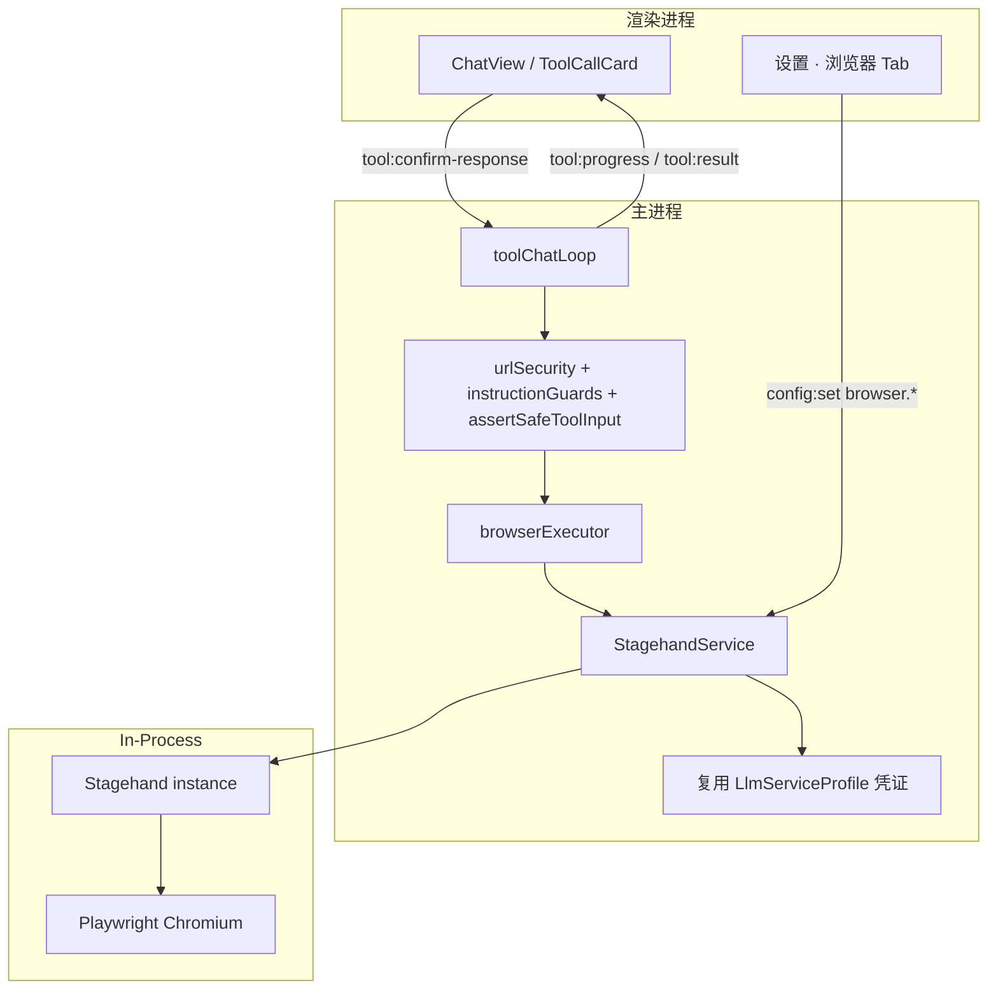

# Agent 网页访问工具 — 产品需求文档

**版本：** 1.0  
**日期：** 2026-05-26  
**状态：** 待评审  

**参考来源：**
- [browserbase/stagehand](https://github.com/browserbase/stagehand) — AI Browser Automation Framework
- [Stagehand 文档](https://docs.stagehand.dev)
- [Stagehand claude.md（V3 API 参考）](https://github.com/browserbase/stagehand/blob/main/claude.md)

**关联文档：**
- [tools-requirement.md](./tools-requirement.md) — 内置工具机制、确认流、安全基线
- [通用Agent-Plan模式MVP产品需求文档.md](./通用Agent-Plan模式MVP产品需求文档.md) — Plan 模式只读工具隔离
- [llm-service-profiles-requirement.md](./llm-service-profiles-requirement.md) — Stagehand 内部推理可复用激活的大模型服务
- [feishu-integration-requirement.md](./feishu-integration-requirement.md) — 外部能力封装与安全边界参考

---

## 目录

1. [概述](#1-概述)
2. [Stagehand 能力摘要](#2-stagehand-能力摘要)
3. [现状分析与适配机会](#3-现状分析与适配机会)
4. [目标与非目标](#4-目标与非目标)
5. [用户故事](#5-用户故事)
6. [总体架构](#6-总体架构)
7. [内置 `browser` 工具定义](#7-内置-browser-工具定义)
8. [StagehandSession 生命周期](#8-stagehandsession-生命周期)
9. [配置与设置界面](#9-配置与设置界面)
10. [安全与权限（核心）](#10-安全与权限核心)
11. [与现有工具机制的衔接](#11-与现有工具机制的衔接)
12. [数据模型设计](#12-数据模型设计)
13. [UI 与交互设计](#13-ui-与交互设计)
14. [非功能需求](#14-非功能需求)
15. [发布计划](#15-发布计划)
16. [验收标准](#16-验收标准)
17. [待解决问题](#17-待解决问题)
18. [相关文件](#18-相关文件)

---

## 1. 概述

### 1.1 背景

SpaceAssistant 当前内置工具覆盖**本地工作目录**内的文件读写、搜索与 Python 脚本执行，Agent 无法访问互联网上的实时信息，也无法与需要 JavaScript 渲染的 SPA 页面交互。

[Stagehand](https://github.com/browserbase/stagehand) 是 Browserbase 开源的 **AI 浏览器自动化框架**（TypeScript SDK，`@browserbasehq/stagehand`），在 Playwright/Chromium 之上提供四类核心能力：

| Stagehand 方法 | 用途 |
|----------------|------|
| `observe()` | 发现页面上可执行的操作（返回结构化 Action，只读） |
| `extract()` | 按自然语言指令抽取结构化/非结构化内容（只读） |
| `act()` | 执行**单步**自然语言浏览器操作（写操作） |
| `agent()` | 多步自主 Agent（**本需求不暴露**） |

Stagehand 适合动态 DOM、Shadow DOM、SPA 等场景。SpaceAssistant 通过**单一 `browser` 工具 + action 白名单**封装 Stagehand，action 语义与其原语对齐，安全策略在主进程按 action 运行时判定。

### 1.2 产品价值

| 价值 | 说明 |
|------|------|
| 动态页面可读 | `extract` / `observe` 适配 JS 渲染与复杂 DOM |
| 自然语言交互 | `act` 用单句指令点击/填表，无需维护 selector |
| 安全默认 | 默认关闭；域名白名单 + navigate/act 确认 + Plan 只读隔离 |
| 架构一致 | 单一 `browser` 内置工具，走 `toolChatLoop` 确认链 |
| 凭证复用 | Stagehand 内部 LLM **默认复用** SpaceAssistant 激活的大模型服务 |

### 1.3 核心原则

- **单一工具 + action 白名单**：只暴露 `browser`；`action` 为封闭枚举，映射到 Stagehand/Playwright 固定调用路径；**不**暴露 `stagehand.agent()` 或任意 SDK 透传。
- **SpaceAssistant 握确认权**：Stagehand 内部无 GUI 确认；`navigate`（open）与 `act` 必须在 `toolChatLoop` 获得用户批准后才调用 SDK。
- **LOCAL 优先**：MVP 仅 `env: 'LOCAL'`，页面与 Cookie 留在本机；Browserbase 云端为可选增强。
- **LLM 成本可控**：限制每轮 tool chat 内 Stagehand 推理次数；`observe`/`extract` 优先于反复 `act`。
- **默认关闭**：`browser.enabled` 默认 `false`。
- **不替代 WebSearch**：仅访问 Agent 显式给出的 URL，不提供开放式搜索。

---

## 2. Stagehand 能力摘要

> 整理自 [Stagehand README](https://github.com/browserbase/stagehand) 与 [claude.md](https://github.com/browserbase/stagehand/blob/main/claude.md)。SpaceAssistant **不暴露全部 API**。

### 2.1 安装与依赖

| 项 | 说明 |
|----|------|
| npm 包 | `@browserbasehq/stagehand`（当前 monorepo 版本约 3.x） |
| 浏览器 peer | `playwright-core` 或 `playwright`（MVP 选 Playwright Chromium） |
| Schema | `zod`（`extract` 可选结构化输出） |
| Node | `^20.19.0 \|\| >=22.12.0`（与 Electron 主进程 Node 版本须兼容） |
| 本地浏览器 | `npx playwright install chromium`（设置页引导） |
| 云端（可选） | `BROWSERBASE_API_KEY` + `BROWSERBASE_PROJECT_ID`，`env: 'BROWSERBASE'` |

**初始化示例（LOCAL，MVP 路径）：**

```typescript
import { Stagehand } from '@browserbasehq/stagehand'

const stagehand = new Stagehand({
  env: 'LOCAL',
  verbose: 0,
  model: browserConfig.stagehandModel, // 如 'anthropic/claude-sonnet-4-20250514'
  // apiKey / baseUrl 由 StagehandService 从激活的 LlmServiceProfile 注入
})
await stagehand.init()
const page = stagehand.context.pages()[0]
await page.goto('https://example.com') // navigate action 走 urlSecurity 后再调用
```

### 2.2 推荐 Agent 工作流（映射到 `browser` action）

```typescript
// 1. 打开页面（无 Stagehand LLM）
await page.goto(url)

// 2. 发现可交互元素（只读，有 LLM）
const actions = await stagehand.observe('Find the sign in button')

// 3. 抽取内容（只读，有 LLM）
const { extraction } = await stagehand.extract('extract the main documentation body')

// 4. 单步操作（写操作，有 LLM — 需用户确认）
await stagehand.act('Click the sign in button')
// 或：await stagehand.act(actions[0])  // 复用 observe 结果，少一次 LLM

// 5. 截图（无 LLM）
await page.screenshot({ path: capturePath })

// 6. 关闭
await stagehand.close()
```

**Observe + Act 模式（Stagehand 官方推荐）：** 先 `observe` 再 `act(action)`，可跳过 `act` 的额外 LLM 推断。SpaceAssistant 第一期允许模型分两次调用；Phase 2 可在会话内缓存 `observe` 结果供 `act(observe_id)` 引用。

### 2.3 本需求采用的 Stagehand 能力

| 采用 | SpaceAssistant `browser.action` |
|------|--------------------------------|
| `page.goto` / `goBack` / `reload` | `navigate` |
| `stagehand.observe()` | `observe` |
| `stagehand.extract()` | `extract` |
| `stagehand.act()` | `act` |
| `page.screenshot()` | `screenshot` |
| `stagehand.close()` | `close` |

### 2.4 本需求**不采用**的 Stagehand 能力

| 能力 | 不采用原因 |
|------|-----------|
| `stagehand.agent()` / CUA / hybrid agent | 多步自主 + 嵌套 LLM 循环，无法逐 step 确认；与 SpaceAssistant Agent 职责重叠 |
| `env: 'BROWSERBASE'`（MVP） | 页面内容出境；Phase 2 可选，默认关闭 |
| MCP `integrations` | 引入不可控外部工具 |
| `deepLocator` / 多 tab 复杂编排 | Phase 3+ |
| 直接暴露 Playwright `page.evaluate` | 等同任意 JS 执行 |
| Director / `npx create-browser-app` 脚手架 | 仅开发参考，不嵌入产品 |

---

## 3. 现状分析与适配机会

### 3.1 SpaceAssistant 现状

| 模块 | 现状 | 与浏览器工具的关系 |
|------|------|-------------------|
| 内置工具 | 6 个文件/脚本工具 | 无 Web 访问能力 |
| 大模型服务 | 多套 `LlmServiceProfile` + 激活服务 | 可复为 Stagehand `model` / API 凭证 |
| 工具框架 | `toolChatLoop` + `ToolExecutor` | 扩展 `browser` executor |
| 安全 | `assertSafeToolInput`、`pathSecurity` | 新增 `urlSecurity` + 指令校验 |
| Plan 模式 | 探索期只读工具白名单 | 按 `browser.action` 执行期拦截 |
| Electron 主进程 | CommonJS（`tsconfig.electron.json`） | 使用 Stagehand CJS 入口 `require('@browserbasehq/stagehand')` |

### 3.2 关键差距

1. **无 Web 读取/交互工具**。
2. **无 SSRF / 域名策略**（须在 `page.goto` 前独立校验）。
3. **无 Stagehand/Playwright 依赖引导**（Chromium 下载、Node 版本）。
4. **无 StagehandSession 管理**（`init`/`close`、每 SpaceAssistant 会话一实例）。
5. **无 Stagehand LLM 成本护栏**（内部推理与聊天 LLM 叠加）。

### 3.3 适配策略

**「StagehandService 托管 + 单一 `browser` 工具 + action 级安全 + URL 硬闸」**

```
Agent 调用 browser(action=…)
    → toolChatLoop（action 确认 / Plan 拦截 / 推理配额）
    → browserExecutor（action → Stagehand/Playwright 固定路径）
    → StagehandService（每 Session 一个 Stagehand 实例，env=LOCAL）
    → Playwright Chromium（headless/headed）
```

**仍不采用 SDK 透传的原因：** 与不做 `run_shell` 同理——须枚举 action 与参数，禁止模型直传 Stagehand 配置或 Playwright API。

---

## 4. 目标与非目标

### 4.1 目标

| # | 目标 |
|---|------|
| G1 | 设置中可启用浏览器工具，完成 Stagehand + Playwright Chromium 依赖检测/安装引导 |
| G2 | Agent 通过 `browser` 打开白名单 URL、`observe`/`extract` 读页、`act` 单步交互 |
| G3 | `navigate`(open) 与 `act` 走现有确认卡片；只读 action 免确认 |
| G4 | 遵循 `ToolsConfig`、Plan 只读隔离、`assertSafeToolInput`、SSRF 防护 |
| G5 | Stagehand 内部 LLM 默认复用激活的 `LlmServiceProfile` |
| G6 | 每 SpaceAssistant 会话独立 Stagehand 实例，空闲/删除时 `close()` |
| G7 | 限制每轮 tool chat 的 Stagehand 推理次数，防止 Token 失控 |

### 4.2 非目标（第一期）

| 非目标 | 说明 |
|--------|------|
| WebSearch | 不提供开放式搜索 |
| `stagehand.agent()` | 不暴露多步自主 Agent |
| Browserbase 云端 | MVP 仅 LOCAL |
| 登录态持久化 | 不复用用户 Chrome Profile；不导入 Cookie |
| 文件上传 / 任意下载 | MVP 不支持 |
| 飞书 / 远程会话 | 默认不注入 `browser` |
| MCP / SDK 透传 | 不暴露 |

---

## 5. 用户故事

### US-01：查阅在线文档

**作为** 开发者，**当** 我让 Agent 总结 React 文档某页时，**我希望** Agent `navigate` 到 URL 后 `extract` 正文，**以便** 无需手动复制。

### US-02：受控单步交互

**作为** 用户，**当** Agent 要点击「搜索」按钮时，**我希望** 确认卡片展示 **`act` 的自然语言指令**（如「Click the Search button」），**以便** 批准后才执行。

### US-03：先观察再操作

**作为** 用户，**我希望** Agent 先 `observe` 列出可点击项，再 `act`，**以便** 减少误点且降低 Stagehand LLM 调用。

### US-04：首次启用

**作为** 新用户，**我希望** 设置页检测 `@browserbasehq/stagehand` 与 Chromium，并引导 `playwright install`，**以便** 无需读文档。

### US-05：安全与成本

**作为** 注重安全与成本的用户，**我希望** 浏览器默认关闭、域名白名单、且单轮对话内 Stagehand 推理有上限，**以便** 可控。

---

## 6. 总体架构



### 6.1 模块职责

| 模块 | 职责 |
|------|------|
| `StagehandService` | 每 Session 管理 `Stagehand` 实例、`init`/`close`、注入 model/API、Playwright 启动参数 |
| `urlSecurity.ts` | SSRF、域名白名单、`page.goto` 前校验 |
| `instructionGuards.ts` | **新建** — `act`/`observe`/`extract` 指令长度、多步启发式拦截 |
| `browserExecutor.ts` | 单一 `browser` 工具，按 action 分发 |
| `browserActionPolicy.ts` | action 风险 / 确认 / Plan 只读 / 推理配额 |
| `BrowserSettingsTab.tsx` | 依赖检测、白名单、Stagehand 模型选择 |

---

## 7. 内置 `browser` 工具定义

### 7.1 action 一览

| `browser.action` | Stagehand / Playwright | 内部 LLM | 风险 | 确认 | Plan 探索期 |
|------------------|------------------------|----------|------|------|------------|
| `navigate` | `page.goto` / `reload` / `goBack` / `goForward` | 否 | medium | open 时**是**¹ | ❌ |
| `observe` | `stagehand.observe(instruction?)` | 是 | low | 否 | ✅ |
| `extract` | `stagehand.extract(instruction)` | 是 | low | 否 | ✅ |
| `act` | `stagehand.act(instruction)` | 是 | medium | **是** | ❌ |
| `screenshot` | `page.screenshot()` | 否 | low | 否 | ✅ |
| `close` | `stagehand.close()` | 否 | low | 否 | ✅ |

¹ `trustedDomains` 内 URL 可配置免确认。

**`browser.deniedActions`**：如 `['act']` 禁止交互。

**推理配额：** 每 `requestId`（一轮 tool chat）内 `observe`+`extract`+`act` 合计默认 ≤ **8** 次（`browser.maxInferencesPerRequest`），超出返回错误。

### 7.2 工具 Schema

```json
{
  "name": "browser",
  "description": "在隔离浏览器中访问网页（基于 Stagehand）。navigate 打开 URL；observe 发现可交互元素；extract 抽取页面内容；act 执行单步自然语言操作（需确认，指令须原子化，如「Click the Submit button」）；screenshot 截图；close 关闭会话。workflow 建议：navigate → observe/extract → act。仅允许白名单域名。",
  "input_schema": {
    "type": "object",
    "properties": {
      "action": {
        "type": "string",
        "enum": ["navigate", "observe", "extract", "act", "screenshot", "close"]
      },
      "url": {
        "type": "string",
        "description": "action=navigate 且 mode=open 时必填"
      },
      "mode": {
        "type": "string",
        "enum": ["open", "refresh", "back", "forward"],
        "description": "action=navigate 时，默认 open"
      },
      "wait_until": {
        "type": "string",
        "enum": ["load", "domcontentloaded", "networkidle"],
        "description": "navigate(mode=open) 的 Playwright waitUntil，默认 domcontentloaded"
      },
      "instruction": {
        "type": "string",
        "description": "action=observe/extract/act 时的自然语言指令；act 须为单步原子操作"
      },
      "selector": {
        "type": "string",
        "description": "action=observe/extract 可选，缩小 DOM 范围"
      },
      "full_page": {
        "type": "boolean",
        "description": "action=screenshot，默认 false"
      }
    },
    "required": ["action"]
  }
}
```

**字段互斥：**

| action | 必填 | 说明 |
|--------|------|------|
| `navigate` | `mode`；open 时还需 `url` | 不经 Stagehand LLM |
| `observe` | — | `instruction` 空则返回可交互元素列表 |
| `extract` | `instruction` | MVP 使用简单 `{ extraction: string }` 结构 |
| `act` | `instruction` | 须通过原子性校验 |
| `screenshot` | — | 路径服务端生成 |
| `close` | — | |

### 7.3 action → 实现映射（固定路径）

| action | 实现 |
|--------|------|
| `navigate` + open | `urlSecurity` → `page.goto(url, { waitUntil })` |
| `navigate` + refresh/back/forward | `page.reload()` / `goBack()` / `goForward()` |
| `observe` | `stagehand.observe(instruction, { selector? })` → 返回 `Action[]` 摘要 |
| `extract` | `stagehand.extract(instruction, { selector? })` → 截断后返回 |
| `act` | `instructionGuards.assertAtomicAct(instruction)` → `stagehand.act(instruction)` |
| `screenshot` | `page.screenshot({ path, fullPage })` |
| `close` | `stagehand.close()` + 从 registry 移除 |

**禁止：** 调用 `stagehand.agent()`、任意 `page.evaluate`、模型传入 Playwright launch 参数。

### 7.4 执行规则

| 规则 | 说明 |
|------|------|
| 运行环境 | Electron **主进程**内 await SDK；**不** spawn 子进程传用户字符串 |
| Session | 每 `Session.id` 至多一个 `Stagehand`；懒 `init` |
| LLM 凭证 | 从激活的 `LlmServiceProfile` 读取；与聊天共用 API Key（`secureApiKey` 解密） |
| Stagehand model | `browser.stagehandModel`，默认与聊天 model 相同或更轻量 |
| 超时 | 单 action 默认 90s（`browser.actionTimeoutSec`）；可合成 `AbortSignal` |
| 输出截断 | `extract`/`observe` 结果字符串上限 `browser.maxOutputChars`（默认 50000） |
| 截图 | `{userData}/{captureSubdir}/{sessionId}/{timestamp}.png` |
| 进度 | navigate →「正在打开 …」；act → 展示 instruction 摘要 |
| headless | `browser.headless`，默认 true |

### 7.5 写操作确认

| action | 确认 |
|--------|------|
| `navigate` + open | URL ∉ `trustedDomains` 或 HTTP（若允许） |
| `act` | 始终（除非 `actRequiresConfirm=false`） |
| 其余 | 否 |

确认卡片展示：`action` + `url` 或 `instruction`（不展示 API Key、Cookie、完整 DOM）。

---

## 8. StagehandSession 生命周期

### 8.1 映射

| SpaceAssistant | Stagehand |
|----------------|-----------|
| `Session.id` | 一个 `Stagehand` 实例 + 一个 BrowserContext |
| 首次 `browser` 调用 | `new Stagehand()` → `init()` |
| `browser(close)` / 会话删除 / idle | `close()` |

### 8.2 状态机

```
[none] --browser(navigate|observe|…)--> [init] --> [active]
[active] --browser(*)--> [active]
[active] --browser(close)--> [closed]
[active] --idle/删除/退出--> [closed]
```

### 8.3 自动清理

| 事件 | 行为 |
|------|------|
| 删除 SpaceAssistant 会话 | `StagehandService.closeSession(id)` |
| `idleTimeoutSec` 无调用（默认 1800s） | `close()` |
| 应用退出 | 关闭所有实例 |
| `init` 失败 | 返回错误 + 设置页「运行检测」引导 |

### 8.4 Playwright 导航拦截（域名硬闸）

除 `urlSecurity` 外，在 BrowserContext 注册 `page.route('**/*', handler)`：

- `document` 主框架导航目标不在 `allowedDomains` → `abort`
- 与 goto 前校验形成双保险

---

## 9. 配置与设置界面

### 9.1 AppConfig 扩展

```typescript
interface BrowserConfig {
  enabled: boolean                    // 默认 false
  /** LOCAL | BROWSERBASE；MVP 仅 LOCAL */
  env: 'LOCAL' | 'BROWSERBASE'
  allowedDomains: string[]
  trustedDomains: string[]
  allowHttp: boolean                    // 默认 false
  headless: boolean                     // 默认 true
  /** Stagehand 内部 LLM，如 'anthropic/claude-sonnet-4-20250514' */
  stagehandModel: string
  /** true：复用激活 LlmServiceProfile 的 Key/BaseUrl；false：单独配置（Phase 2） */
  reuseActiveLlmProfile: boolean        // 默认 true
  actionTimeoutSec: number              // 默认 90
  idleTimeoutSec: number              // 默认 1800
  maxOutputChars: number                // 默认 50000
  maxInferencesPerRequest: number       // observe+extract+act 合计，默认 8
  navigateRequiresConfirm: boolean
  actRequiresConfirm: boolean           // 默认 true
  deniedActions: string[]
  allowRemoteSessions: boolean          // 默认 false
  captureSubdir: string                 // 默认 browser-captures
  // Phase 2: browserbaseApiKeyEnc, projectId
}
```

### 9.2 设置 Tab —「浏览器」

| 区域 | 内容 |
|------|------|
| 总开关 | 启用浏览器工具 |
| 依赖检测 | `@browserbasehq/stagehand` 版本、Playwright Chromium、`node -v` |
| 安装引导 | `npm install @browserbasehq/stagehand playwright zod` + `npx playwright install chromium` |
| 运行环境 | LOCAL（MVP 固定）；Browserbase 灰显「后续支持」 |
| Stagehand 模型 | 下拉/输入 `stagehandModel`；说明「用于 observe/extract/act 的内部推理」 |
| 域名白名单 / 可信域名 | Tag 输入 |
| 安全与配额 | headless、超时、maxOutput、maxInferencesPerRequest |
| 工具开关 | 「工具」Tab 一行 `browser` |

### 9.3 IPC

| 通道 | 功能 |
|------|------|
| `browser:detect` | 检测 npm 包、Chromium、Stagehand 试初始化 |
| `config:get/set` | 扩展 `browser` 字段 |

---

## 10. 安全与权限（核心）

### 10.1 威胁模型

| 威胁 | 缓解 |
|------|------|
| SSRF | `urlSecurity` + Playwright route 双闸 |
| 非预期 `act` | 用户确认 + 原子指令校验 + Plan 探索期禁止 |
| 嵌套 Agent 失控 | 禁止 `stagehand.agent()` |
| LLM 成本爆炸 | `maxInferencesPerRequest` + 截断 |
| 凭据泄露 | Stagehand 使用解密后的 Key，不写入 tool result / 日志 |
| 指令注入 | 长度上限；禁止 `evaluate`/`agent` 等关键字；act 多步启发式 |
| 远程滥用 | 飞书会话默认禁用 browser |
| 云端数据出境 | MVP 禁止 BROWSERBASE |

### 10.2 URL 安全（`urlSecurity.ts`）

拒绝非 http(s)、loopback、私有 IP、link-local、metadata、`file://` 等；`allowedDomains` 为空则禁止 `navigate` open。

### 10.3 指令安全（`instructionGuards.ts`）

| 规则 | 说明 |
|------|------|
| 长度 | `instruction` ≤ 1024 字符 |
| `act` 原子性 | 拒绝含明显多步连接词（中英文）：如「然后」「并且」「and then」「;」 |
| 禁止子串 | `evaluate`、`agent(`、`page.`、`require(` 等 |
| `extract` | 仅自然语言描述；不接受 executable JS |

### 10.4 action 级策略（`browserActionPolicy.ts`）

```typescript
export const PLAN_READONLY_BROWSER_ACTIONS = [
  'observe', 'extract', 'screenshot', 'close',
] as const

export type BrowserAction =
  | 'navigate' | 'observe' | 'extract' | 'act' | 'screenshot' | 'close'

export function browserActionNeedsConfirmation(
  action: BrowserAction,
  input: Record<string, unknown>,
  cfg: BrowserConfig
): boolean {
  if (action === 'act') return cfg.actRequiresConfirm
  if (action === 'navigate') {
    const mode = (input.mode as string) ?? 'open'
    if (mode !== 'open') return false
    if (!cfg.navigateRequiresConfirm) return false
    return !isTrustedDomain(input.url as string, cfg.trustedDomains)
  }
  return false
}
```

**Plan 探索期：** 注入 `browser`，执行时若 `!isPlanReadonlyBrowserAction(action)` 则拒绝。

**推理计数：** `StagehandService` 在每次 `observe`/`extract`/`act` 前检查并递增计数器。

### 10.5 远程 / 飞书

默认 `allowRemoteSessions: false`；飞书来源会话不注入 `browser`。

### 10.6 入参校验（`assertSafeToolInput`）

合并 URL、action 枚举、instruction 长度、字段互斥校验（见 §7.2）。

---

## 11. 与现有工具机制的衔接

| 机制 | 衔接 |
|------|------|
| `toolChatLoop` | `browserActionNeedsConfirmation`；Plan action 拦截；推理配额 |
| `builtinToolRiskLevel('browser')` | 返回 `medium` |
| `filterBuiltinToolsForRenderer` | 新增 1 条 `browser`；`browser.enabled` 控制 |
| `LlmServiceProfile` | `reuseActiveLlmProfile` 时注入 Stagehand |
| `combineUserAbortAndTimeout` | 长时间 `act`/`extract` 可取消 |

**工具注入：**

```
1. tools.enabled === false → 不注入
2. browser.enabled === false → 不注入
3. 远程 && !allowRemoteSessions → 不注入
4. filterBuiltinToolsForRenderer
5. Plan 阶段仍注入；非只读 action 执行时拒绝
```

---

## 12. 数据模型设计

### 12.1 StagehandSessionState（主进程内存）

```typescript
interface StagehandSessionState {
  spaceSessionId: string
  stagehand: Stagehand
  lastUrl?: string
  inferenceCountThisRequest: number  // 随 requestId 重置
  lastActivityAt: number
  createdAt: number
}
```

### 12.2 工具结果形状（示例）

```typescript
// observe
{ actions: Array<{ description: string; method?: string; selector?: string }> }

// extract
{ extraction: string }

// screenshot
{ path: string; width: number; height: number }
```

---

## 13. UI 与交互设计

| action | ToolCallCard |
|--------|--------------|
| `navigate` | URL + mode；确认态完整 URL |
| `observe` | instruction + 返回 actions 列表（折叠） |
| `extract` | instruction + extraction 摘要 |
| `act` | **instruction 全文** + 确认按钮 |
| `screenshot` | 缩略图 |
| 失败 | 「URL 不在允许范围」/「推理次数已达上限」 |

设置空状态：**安装 Stagehand + Chromium → 配置白名单 → 选择 Stagehand 模型 → 启用**。

---

## 14. 非功能需求

| 类别 | 要求 |
|------|------|
| 性能 | 首次 `navigate` 冷启动 < 20s（含 Chromium）；后续 `extract` < 30s |
| 内存 | 单 Stagehand 实例 < 600MB |
| 成本 | 单轮 tool chat Stagehand 推理 ≤ 8 次（可配置） |
| 兼容 | Win10+ / macOS 12+ / Linux；Node 满足 Stagehand engines |
| 打包 | 评估 `@browserbasehq/stagehand` + `playwright` 对安装包体积影响（OQ-4） |

---

## 15. 发布计划

### Phase 1 — MVP（LOCAL + 只读 + navigate）

- `StagehandService`（LOCAL、`init`/`close`、凭证注入）
- `urlSecurity` + route 拦截
- `browser`：`navigate` / `observe` / `extract` / `close`
- 推理配额 + instruction 校验
- 设置 Tab + `browser:detect`
- 单元测试（URL、指令、action 策略）

### Phase 2 — 交互与可视化

- `act` + 确认卡片
- `screenshot` + 缩略图
- `trustedDomains` 免确认 navigate
- `deniedActions`
- observe 结果缓存 → `act` 引用（减 LLM）

### Phase 3 — 可选增强

- `env: BROWSERBASE`（显式开关 + 隐私说明）
- `extract` 带 Zod schema（结构化字段）
- headed 围观
- Wiki 导入联动

---

## 16. 验收标准

### 功能

- [ ] 默认无法调用 `browser`
- [ ] 白名单域名下 `navigate` + `extract` 可用
- [ ] `127.0.0.1` / `file://` 被拒绝
- [ ] `act` 前出现确认卡片，展示 instruction
- [ ] Plan 探索期 `navigate` / `act` 被拒绝
- [ ] 单轮 tool chat 第 9 次 observe/extract/act 返回配额错误
- [ ] 删除会话后 Stagehand 实例关闭

### 安全

- [ ] 未调用 `stagehand.agent()`
- [ ] Stagehand 凭证来自 secureStorage，不出现在 tool result
- [ ] 飞书会话默认无 `browser`
- [ ] `act` 多步指令「打开页面然后点击提交」被拒绝

### 体验

- [ ] 检测失败时设置页有可操作引导
- [ ] 历史会话可回放 browser 工具卡片

---

## 17. 待解决问题

| # | 问题 | 优先级 | 备注 |
|---|------|--------|------|
| OQ-1 | Stagehand ESM/CJS 与 Electron 主进程编译兼容性？ | 高 | 实施前 spike |
| OQ-2 | `stagehandModel` 是否与聊天 model 分离默认为更便宜模型？ | 中 | 建议默认更轻量 |
| OQ-3 | Plan 探索期是否允许 `navigate` 只读打开文档？ | 中 | 当前禁止 |
| OQ-4 | Playwright Chromium 是否随应用打包？ | 高 | 体积 vs 体验 |
| OQ-5 | screenshot 是否作为多模态 image 块回传聊天模型？ | 低 | |
| OQ-6 | observe 结果是否支持 `act(observe_index)` 减 LLM？ | 中 | Phase 2 |
| OQ-7 | Browserbase 云端合规与用户告知文案？ | 低 | Phase 3 |

---

## 18. 相关文件

| 路径 | 说明 |
|------|------|
| `package.json` | 新增 `@browserbasehq/stagehand`、`playwright`、`zod` |
| `src/shared/builtinToolDefinitions.ts` | `browser` schema |
| `src/shared/domainTypes.ts` | `BrowserConfig` |
| `electron/urlSecurity.ts` | URL/SSRF |
| `electron/browser/instructionGuards.ts` | 指令校验 |
| `electron/browser/browserActionPolicy.ts` | action 策略 |
| `electron/browser/stagehandService.ts` | Stagehand 生命周期 |
| `electron/tools/browserExecutor.ts` | 工具执行 |
| `electron/toolInputGuards.ts` | 入参校验 |
| `electron/toolChatLoop.ts` | 确认与 Plan 拦截 |
| `src/renderer/components/Config/BrowserSettingsTab.tsx` | 设置 UI |

---

**文档版本**: v1.0  
**创建日期**: 2026-05-26  
**适用范围**: SpaceAssistant — Agent 网页访问（基于 Stagehand）
