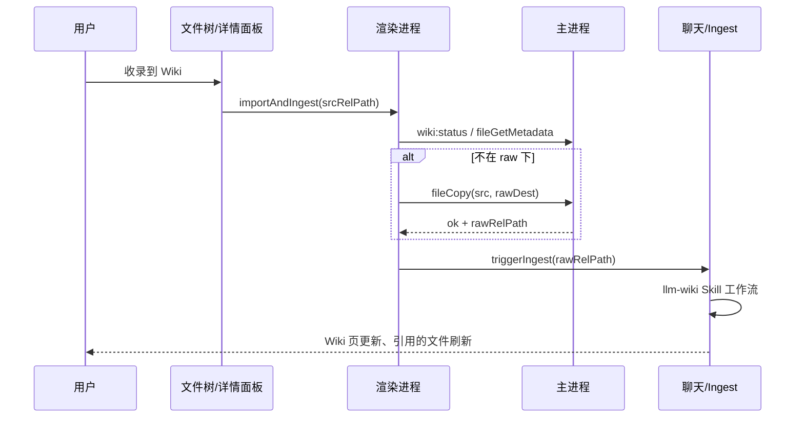

# Wiki 外部文件导入并 Ingest — 需求规格

**版本：** 1.1  
**日期：** 2026-05-24  
**状态：** 待评审  
**关联文档：** [llm-wiki-requirement.md](./llm-wiki-requirement.md)、[file-pane-tree-requirement.md](./file-pane-tree-requirement.md)、[file-content-viewer-requirement.md](./file-content-viewer-requirement.md)

**变更记录：**

| 版本 | 日期 | 说明 |
|------|------|------|
| 1.0 | 2026-05-24 | 初稿：补齐「选文件 → 收录到 Wiki」断裂路径；外部文件先拷贝至 `raw/` 再 Ingest |
| 1.1 | 2026-05-24 | 用户可见文案统一为「收录到 Wiki」（含 Wiki 树 raw 右键，替代「Ingest 到 Wiki」/「提取到 Wiki」） |

---

## 目录

1. [概述](#1-概述)
2. [问题与目标](#2-问题与目标)
3. [用户故事](#3-用户故事)
4. [用户旅程](#4-用户旅程)
5. [功能范围](#5-功能范围)
6. [交互与入口](#6-交互与入口)
7. [执行流程](#7-执行流程)
8. [拷贝至 raw 的规则](#8-拷贝至-raw-的规则)
9. [命令行扩展](#9-命令行扩展)
10. [配置与数据模型](#10-配置与数据模型)
11. [IPC 与实现要点](#11-ipc-与实现要点)
12. [错误与边界](#12-错误与边界)
13. [与现有能力的关系](#13-与现有能力的关系)
14. [发布计划](#14-发布计划)
15. [验收标准](#15-验收标准)
16. [待解决问题](#16-待解决问题)
17. [相关文件](#17-相关文件)

---

## 1. 概述

### 1.1 背景

[llm-wiki-requirement.md](./llm-wiki-requirement.md) 规定：**Ingest 只处理 `{wikiRoot}/raw/` 下的只读源文件**。Phase 2 已在 **Wiki 分段树** 内为 `raw/` 文件提供右键「收录到 Wiki」（实现时 Phase 2 曾用「Ingest 到 Wiki」，Phase 2.5 起统一更名）。

但用户自然的使用路径是：

1. 在 **文件列表**（上半段）或详情面板中打开/选中工作区任意资料文件；
2. 希望 **一步** 将其「收录进 Wiki」。

当前实现要求用户 **手动** 将文件复制到 `raw/` 后再到 Wiki 树 Ingest，路径 **断裂**，与心智模型不符。

### 1.2 本需求要做什么

提供统一的 **「收录到 Wiki」** 能力：

- 用户选中 **工作区内任意符合条件的文件**；
- 应用 **自动**（对用户透明）完成：`拷贝至 raw/` → 触发既有 Ingest 流程；
- 不要求用户理解 `raw/` 与 `wiki/` 的分层，除非需要高级控制。

> **实现策略（已确认）：** 外部文件 **拷贝**（非移动）到 `raw/` 后再 Ingest 即可；是否移动、是否保留原文件由 §8 约定。

### 1.3 非目标（首版）

| 项 | 说明 |
|----|------|
| 监听文件夹自动 Ingest | 仍由用户显式触发 |
| 二进制 / PDF / Office 自动解析 | 延续 OQ-7：首版仅文本类 |
| 从剪贴板粘贴创建 raw | 见 [llm-wiki-requirement.md §17 Phase 3](./llm-wiki-requirement.md)；可与本需求分阶段交付 |
| 从 OS 文件对话框导入 workDir 外文件 | 首版仅 workDir 内相对路径 |
| LLM 写入 `raw/` | 仍禁止；拷贝由 **应用层 IPC** 完成 |

---

## 2. 问题与目标

### 2.1 现状缺口

| 用户意图 | 现状 | 缺口 |
|----------|------|------|
| 对 `docs/note.md` 收录到 Wiki | 需手动复制到 `llm-wiki/raw/` 再 Ingest | 多步、概念负担高 |
| 对 `llm-wiki/raw/x.md` 收录 | Wiki 树右键可用 | ✅ 已满足（Phase 2.5 起文案统一为「收录到 Wiki」） |
| 聊天输入 `/wiki 提取 docs/note.md` | 命令不校验路径，但 Skill 假定已在 raw | 行为不确定，无拷贝步骤 |

### 2.2 目标

| ID | 目标 |
|----|------|
| G1 | **一步操作**：从文件列表 / 详情面板 / 命令，完成「导入 raw + Ingest」 |
| G2 | **保留架构**：`raw/` 仍为只读源层；Ingest 语义不变 |
| G3 | **可预期命名**：拷贝到 raw 的文件名冲突有明确规则 |
| G4 | **可观测**：UI 提示拷贝目标路径 + Ingest 已开始；完成后可在 Wiki 树看到 raw 副本 |
| G5 | **安全**：路径沙箱、文本类型校验、Wiki 未初始化时引导 |

---

## 3. 用户故事

### US-I01：从文件列表收录

**作为** 用户，**当** 我在文件 Tab「文件列表」中右键一个项目内的 Markdown 笔记，**我希望** 点击「收录到 Wiki」后 AI 自动维护 Wiki 页面，**以便** 我不必手动操作 `raw/` 目录。

### US-I02：从详情面板收录

**作为** 用户，**当** 我在详情面板预览某份资料，**我希望** 工具栏有「收录到 Wiki」按钮，行为与右键一致。

### US-I03：已在 raw 的文件

**作为** 用户，**当** 文件已在 `{wikiRoot}/raw/` 下，**我希望** 「收录到 Wiki」等价于 Ingest（不重复拷贝），**以便** 各入口语义统一。

### US-I04：命令行

**作为** 用户，**我希望** `/wiki ingest|摄取|提取 <任意 workDir 内路径>` 在路径不在 raw 时自动导入再 Ingest，**以便** 与 UI 行为一致。

### US-I05：失败可理解

**作为** 用户，**当** 文件是 PDF 或 Wiki 未初始化，**我希望** 在拷贝前得到明确错误提示，**以便** 知道下一步该做什么。

---

## 4. 用户旅程

### 4.1 主路径（外部文本文件）

```
用户在「文件列表」选中 src/notes/meeting.md
    → 右键「收录到 Wiki」
    → [应用] 校验 Wiki 已启用且已初始化、当前有会话、文件为支持的文本类型
    → [应用] 拷贝至 llm-wiki/raw/meeting.md（若冲突则自动重命名，见 §8）
    → [应用] Toast：「已导入 raw：llm-wiki/raw/meeting.md，Ingest 已开始」
    → [应用] 等价于发送 /wiki ingest llm-wiki/raw/meeting.md
    → [LLM] 既有 Ingest 工作流：读 raw → 写 wiki 页 → 更新 index / log
    → 用户可在 Wiki 分段看到新 raw 副本；引用的文件 / 工具卡片可见 wiki 变更
```

### 4.2 已在 raw 的路径

```
用户在 Wiki 分段 raw/ 下右键（或任意入口传入 raw 内路径）
    → 跳过拷贝
    → 直接 Ingest
```

### 4.3 Wiki 未初始化

```
用户点击「收录到 Wiki」
    → Modal / Toast：「Wiki 尚未初始化」+ 按钮「初始化并继续」
    → 初始化成功后继续 §4.1（不丢失用户选中的源文件）
```

---

## 5. 功能范围

### 5.1 支持的源路径

| 源路径类型 | 是否支持「收录到 Wiki」 | 行为 |
|------------|-------------------------|------|
| workDir 内、不在 `{wikiRoot}/` 下的文件 | ✅ | 拷贝 → Ingest |
| `{wikiRoot}/raw/**` 下文件 | ✅ | 仅 Ingest（不拷贝） |
| `{wikiRoot}/wiki/**` 下文件 | ❌ | 提示：「Wiki 页面请用 Query / 归档，或找到对应 raw 源再 Ingest」 |
| `{wikiRoot}/SCHEMA.md` 等 Wiki 根级文件 | ❌ | 提示：非 Ingest 源 |
| 目录 | ❌ | 菜单项不可用 |
| workDir 外路径 | ❌ | 沙箱拒绝 |

### 5.2 支持的文件类型（首版）

与 [llm-wiki-requirement.md §6.7](./llm-wiki-requirement.md) 一致：

| 类型 | 处理 |
|------|------|
| `.md`、`.txt` 及主进程判定为 utf-8 文本的文件 | 允许 |
| 图片、PDF、Office、二进制 | 拒绝；提示「首版仅支持文本资料，请先转为 Markdown 放入 raw」 |

类型判定复用 `fileGetMetadata.isText` 或 `fileReadFile` 的 `kind === 'text'`。

---

## 6. 交互与入口

### 6.1 入口一览

| 入口 | 位置 | 菜单/按钮文案 | 优先级 |
|------|------|---------------|--------|
| E1 | **文件列表**分段树 — 文件右键 | **收录到 Wiki** | P0 |
| E2 | 详情面板工具栏（预览文本文件时） | **收录到 Wiki** | P1 |
| E3 | Wiki 分段 `raw/` 文件右键 | **收录到 Wiki** | 已有（Phase 2.5 统一文案） |
| E4 | 聊天命令 | `/wiki ingest\|摄取\|提取 <path>` 自动导入 | P0 |
| E5 | 引用的文件列表 — 文件项右键/操作 | **收录到 Wiki**（对非 wiki 页的外部文件） | P2 |

**显示条件（E1/E2/E5）：**

- `wiki.enabled === true`
- 当前选中为 **文件**（非目录）
- 路径 **不在** `{wikiRoot}/wiki/` 下
- 所有入口（含已在 `{wikiRoot}/raw/` 下的文件）**统一文案「收录到 Wiki」**；已在 raw 时跳过拷贝，仅执行 Ingest。

**禁用 / 隐藏：**

- `wiki.enabled === false`：不显示菜单项
- 目录、wiki 页、Schema 文件：不显示

### 6.2 会话要求

与现有 Ingest 一致：需 **当前已选会话**。若无会话，Toast：「请先选择或创建一个会话」。

### 6.3 导入完成后的 UI 反馈

| 项 | 行为 |
|----|------|
| Toast | 「已导入 raw：`{rawRelPath}`，Ingest 已开始」或已在 raw 时「Ingest 已开始：`{rawRelPath}`」 |
| Wiki 分段 | 可选：自动展开 LLM Wiki 分段并在树中选中 `{rawRelPath}` |
| 聊天区 | 注入现有 Wiki hint + 启动 Ingest run（与右键 raw Ingest 相同） |

---

## 7. 执行流程

### 7.1 逻辑流程（应用层）

```
importAndIngest(srcRelPath)
│
├─ assert wiki.enabled
├─ assert sessionId 存在
├─ wikiStatus.initialized ─否→ 引导 init → 重试
├─ assert src 为文件且路径在 workDir 沙箱内
├─ assert 非 {wikiRoot}/wiki/** 且非 SCHEMA 等排除项
├─ assert 文本类型 supported
│
├─ if src 已在 {wikiRoot}/raw/**
│     └─ rawRelPath = srcRelPath → 跳至 ingest
│
├─ rawRelPath = computeRawDest(srcRelPath)   // §8
├─ if 目标已存在 → resolveConflict()       // §8.3
├─ fileCopy(srcRelPath, rawRelPath)          // §11
│
└─ triggerIngest(rawRelPath)
      └─ 等价：dispatch sa-wiki-ingest-request 或 send(`/wiki ingest ${rawRelPath}`)
```

### 7.2 与 LLM Ingest 的边界

| 步骤 | 执行者 |
|------|--------|
| 拷贝至 raw | **主进程 / 应用 IPC**（非 LLM 工具） |
| read raw、写 wiki、更新 index/log | **LLM + 既有 Skill**（不变） |

### 7.3 时序图



---

## 8. 拷贝至 raw 的规则

### 8.1 目标路径（默认）

```
rawRelPath = {wikiRoot}/raw/{basename(srcRelPath)}
```

- 使用 **拷贝**（copy），**不删除** 源文件。
- 不使用源文件的完整相对目录结构（避免 `raw/src/a/b.md` 过深）；首版 **扁平化到 raw 根**。

### 8.2 可选命名策略（配置）

| 策略键 | 结果示例 | 说明 |
|--------|----------|------|
| `basename`（默认） | `raw/report.md` | 仅文件名 |
| `date-prefix` | `raw/2026-05-24-report.md` | 日期前缀，降低冲突 |
| `preserve-stem-hash` | `raw/report-a1b2c3.md` | 源路径 hash 后缀，适合大量同名文件 |

首版实现 **`basename` + 冲突重命名** 即可；其余策略可后续扩展。

### 8.3 冲突处理

当 `{wikiRoot}/raw/{basename}` 已存在：

| 策略 | 行为 | 首版 |
|------|------|------|
| `auto-rename` | 生成 `{stem}-{YYYYMMDD-HHmmss}{ext}` 或 `{stem}-2{ext}` | ✅ 默认 |
| `overwrite` | 覆盖 raw 副本（**不推荐**，违背 raw 审计语义） | ❌ |
| `ask` | Modal 让用户选择重命名 / 取消 / 仅 Ingest 已有副本 | P2 |

**首版默认 `auto-rename`**，并在 Toast 中说明实际 raw 路径。

### 8.4 同源文件再次收录

| 情况 | 行为 |
|------|------|
| 源文件未改、raw 副本已存在 | 自动重命名新副本 **或** 提示「已有 raw 副本，是否仅 Ingest？」— **首版：auto-rename** |
| 源文件已改、basename 相同 | 新副本带时间戳；旧 raw 保留（用户可手动清理） |
| 用户只想重新 Ingest 已有 raw | 在 Wiki 树对 raw 文件使用 Ingest（不经过拷贝） |

---

## 9. 命令行扩展

### 9.1 归一化规则

扩展 [wikiCommandService.ts](../../src/renderer/services/wikiCommandService.ts) 中 `ingest` 子命令：

| 输入路径 | 行为 |
|----------|------|
| 已在 `{wikiRoot}/raw/**` | 与现网一致，直接 Ingest |
| workDir 内其他路径 | **先** `importAndIngest` 的拷贝步骤，**再** Ingest |
| 不在 workDir 内 | 返回 `[Wiki] 路径无效或超出工作目录` |

### 9.2 文案

Help 更新为：

```
/wiki ingest|摄取|提取 <workDir内路径> | ingest --all
```

说明：`/wiki 提取` 等命令别名在**命令层**保留；**UI 按钮与右键**统一显示「收录到 Wiki」。

### 9.3 可选独立子命令（非必须）

若团队希望语义更清，可增加 `/wiki import <path>` 作为 `ingest` 的别名；**首版不强制**，统一走 ingest 即可。

---

## 10. 配置与数据模型

### 10.1 WikiConfig 扩展

```typescript
interface WikiConfig {
  // ...existing
  /** 外部文件导入 raw 时的命名策略 */
  importRawNaming?: 'basename' | 'date-prefix'  // 默认 'basename'
  /** raw 目标已存在时的策略 */
  importRawConflict?: 'auto-rename' | 'ask'      // 默认 'auto-rename'
}
```

### 10.2 `.wiki-meta.json`（可选扩展）

可在拷贝成功后追加记录，供 `--all` 去重与 UI 展示：

```typescript
interface WikiMeta {
  // ...existing
  importedSources?: Array<{
    srcRelPath: string
    rawRelPath: string
    importedAt: string
  }>
}
```

首版 **不阻塞**；若未实现，去重仍依赖 `log.md` ingest 条目。

---

## 11. IPC 与实现要点

### 11.1 新增 IPC（推荐）

| 通道 | 参数 | 返回值 | 功能 |
|------|------|--------|------|
| `file:copy` | `{ srcRelPath, destRelPath }` | `{ ok: true } \| { ok: false; error }` | 工作目录内安全拷贝；创建父目录；与 `fileMove` 并列 |
| `wiki:import-raw` | `{ srcRelPath, naming?, conflict? }` | `{ ok: true; rawRelPath; copied: boolean } \| { ok: false; error }` | 封装 §8 规则 + 文本校验；`copied:false` 表示已在 raw |

**推荐：** 实现 `wiki:import-raw` 聚合校验与命名，内部调用 `file:copy`；渲染进程 `importAndIngest()` 调用后者再 `triggerIngest`。

### 11.2 渲染进程服务

新建或扩展：

```
src/renderer/services/wikiImportService.ts
  - importAndIngest(srcRelPath): Promise<{ rawRelPath; copied }>
  - canImportToWiki(relPath): { ok: true } | { ok: false; reason }
```

### 11.3 UI 改动点

| 文件 | 改动 |
|------|------|
| `FileTreeContextMenu.tsx` | 条件展示「收录到 Wiki」 |
| `FileTree.tsx`（文件列表分段） | 传入 `onImportToWiki` |
| `FilePane.tsx` | 文件列表树接线上传；Wiki 树保持 `onIngestRaw` |
| `FileToolbar.tsx` / `FileOverlay.tsx` | 详情面板按钮 |
| `ChatView.tsx` | 共用 `importAndIngest` + ingest 事件 |
| `wikiCommandService.ts` | ingest 路径预处理 |

### 11.4 拷贝 vs LLM 写 raw

| 操作 | 允许 |
|------|------|
| 用户 OS / 文件树手动复制到 raw | ✅ |
| 应用 IPC `file:copy` / `wiki:import-raw` | ✅（本需求） |
| LLM `write_file` / `edit_file` 目标 raw | ❌（维持现网拦截） |

---

## 12. 错误与边界

| 场景 | 用户可见提示 |
|------|----------------|
| Wiki 未启用 | 「请先在设置中启用 Wiki」 |
| Wiki 未初始化 | 「Wiki 尚未初始化」+ 初始化入口 |
| 无当前会话 | 「请先选择或创建一个会话」 |
| 非文本文件 | 「首版仅支持文本资料（.md / .txt）」 |
| 目标是 wiki 页 | 「Wiki 页面不能作为 Ingest 源；请使用归档或对应 raw 文件」 |
| 路径非法 / 越界 | 「路径无效或超出工作目录」 |
| 拷贝失败（磁盘满等） | 显示主进程错误信息；**不** 启动 Ingest |
| Ingest 已启动但 LLM 失败 | 与现网 Ingest 一致；raw 副本仍保留 |

---

## 13. 与现有能力的关系

| 现有能力 | 关系 |
|----------|------|
| raw 右键 Ingest（Phase 2） | 保留能力；**UI 文案** Phase 2.5 起改为「收录到 Wiki」 |
| `/wiki 摄取` / `/wiki 提取` 别名 | 命令层扩展为可接受任意 workDir 路径 |
| Phase 3「粘贴 → raw → ingest」 | 与本需求 **互补**；粘贴入口可复用 `wiki:import-raw` 的 raw 写入 + ingest |
| 「归档到 Wiki」 | 面向 **助手回答** → `wiki/queries/`；与本需求 **源文件 Ingest** 不同 |
| `hideWikiFromFileTree` | 不变；用户从文件列表对 **非 wiki** 文件收录 |

---

## 14. 发布计划

建议作为 **Phase 2.5 — 导入体验补全**（介于 Phase 2 与 Phase 3 之间）：

| 阶段 | 内容 |
|------|------|
| P0 | `wiki:import-raw` + 文件列表右键 + 命令 ingest 自动导入 |
| P1 | 详情面板工具栏按钮 + 导入后 Wiki 树定位 |
| P2 | 引用的文件入口 + 冲突 `ask` 策略 + `importRawNaming` 设置项 |

---

## 15. 验收标准

### 15.1 核心

- [ ] 在「文件列表」对 `docs/foo.md` 右键「收录到 Wiki」后，出现 `llm-wiki/raw/foo.md`（或 auto-rename 后路径），且聊天区开始 Ingest
- [ ] 源文件 `docs/foo.md` **仍存在**（拷贝非移动）
- [ ] 对已在 `llm-wiki/raw/foo.md` 的文件，「收录到 Wiki」不重复拷贝，直接 Ingest
- [ ] `/wiki 提取 docs/foo.md` 与 UI 行为一致
- [ ] 对 PDF 点击「收录到 Wiki」在拷贝前被拒绝并提示
- [ ] 对 `llm-wiki/wiki/entities/x.md` 不显示或禁用「收录到 Wiki」
- [ ] LLM 仍无法通过工具写入 `raw/`

### 15.2 体验

- [ ] Toast 展示最终 raw 路径
- [ ] Wiki 未初始化时可引导初始化并继续
- [ ] 导入 + Ingest 完成后，Wiki 页与 index/log 有可见更新（与 Phase 1 Ingest 一致）

---

## 16. 待解决问题

| # | 问题 | 倾向 |
|---|------|------|
| OQ-I1 | 文件列表与 Wiki 树是否统一按钮文案为「收录到 Wiki」？ | **已决议：是** |
| OQ-I2 | 同名冲突默认 auto-rename 还是 ask？ | **首版 auto-rename** |
| OQ-I3 | 是否支持 Shift+收录 = 移动至 raw 而非拷贝？ | Phase 2.5 **不做** |
| OQ-I4 | 导入后是否自动删除源文件？ | **否**（仅拷贝） |
| OQ-I5 | 是否记录 `importedSources` 到 `.wiki-meta.json`？ | 可选，P2 |

---

## 17. 相关文件

| 文件 | 改动类型 |
|------|----------|
| `docs/requirement/wiki-import-ingest-requirement.md` | 本文档 |
| `docs/requirement/llm-wiki-requirement.md` | 交叉引用、Phase 计划更新 |
| `electron/appIpc.ts` | `file:copy`、`wiki:import-raw` |
| `electron/wiki/wikiImport.ts` | 导入命名与校验（新建） |
| `src/shared/api.ts` | API 类型 |
| `src/renderer/services/wikiImportService.ts` | 渲染层编排（新建） |
| `src/renderer/components/FileTree/FileTreeContextMenu.tsx` | 菜单项 |
| `src/renderer/components/FilePane/FilePane.tsx` | 文件列表接线上传 |
| `src/renderer/components/DetailPanel/FileToolbar.tsx` | 工具栏按钮 |
| `src/renderer/services/wikiCommandService.ts` | ingest 路径扩展 |

---

**更新日期**: 2026-05-24
