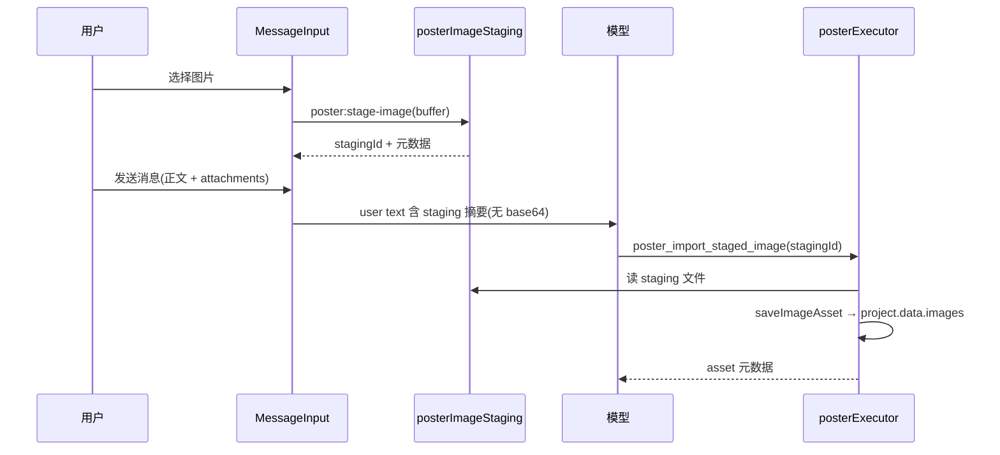

# 海报图片零 Base64 进 LLM 上下文 — 实现计划

> **For agentic workers:** REQUIRED SUB-SKILL: Use superpowers:subagent-driven-development (recommended) or superpowers:executing-plans to implement this plan task-by-task. Steps use checkbox (`- [ ]`) syntax for tracking.

**Goal:** 用户图片二进制只走 Renderer → IPC → 主进程落盘；LLM 上下文与工具 schema 中永不出现 `dataBase64` / data URI；模型当轮输出 token 也不再生成整段 base64。

**Architecture:** 在现有 `posterToolContextSanitize` API 脱敏层之上，新增 Session 级图片 Staging 服务 + 聊天附件 UI；模型通过 `poster_import_staged_image { stagingId }` 导入项目 assets；`poster_run_layout` 可选自动合并 staging。`poster_upload_image` 的 `dataBase64` 从 LLM 可见工具列表移除，仅保留 IPC/内部路径。

**Tech Stack:** Electron IPC, TypeScript, Vitest (node + jsdom), 现有 poster 管线 (`saveImageAsset`, `mergeLayoutInputImages`, `assignImages`)

**Branch / Worktree:** 海报功能在 `feat/social-poster` worktree（`.worktrees/feat-social-poster`）；本计划所有路径均相对于该 worktree，合并前 main 无 poster 模块。

**Depends on (已完成):** `src/shared/posterToolContextSanitize.ts` + `claudeToolHistory.ts` + `toolChatLoop.ts` API 边界脱敏（兜底安全网）

---

## 背景与问题

| 层级 | 现状 | 问题 |
|------|------|------|
| 模型当轮输出 | Agent 调用 `poster_upload_image { dataBase64 }` | 单张图可在 completion 中消耗数万 token |
| API 历史（后续轮） | 已脱敏 | 无法消除当轮生成成本 |
| 用户上传 | 无聊天附件；模型需自行 base64 或 `read_file` 读图 | 旁路泄漏、步骤繁琐 |
| 本地 DB | `toolCalls.input` 存完整 base64 | 会话 JSON 膨胀 |

**设计原则：** 二进制只走 IPC/文件系统；LLM 只见 `{ stagingId / assetId, filename, 尺寸, byteLength }`。

---

## 目标架构



---

## 分阶段交付

| Phase | 名称 | 交付物 | 验收 |
|-------|------|--------|------|
| **0** | 兜底（已完成） | `posterToolContextSanitize` | 历史 replay / tool loop 脱敏 |
| **1** | Session Staging + 聊天附件 | staging 服务、IPC、UI、`poster_import_staged_image` | 用户选图发消息，API 消息 0 base64 |
| **2** | Schema 去 base64 + 自动导入 | 隐藏 `poster_upload_image` schema；layout 自动 import staging | 模型无法合法输出 dataBase64 |
| **3** | 旁路补齐 | user 粘贴、read_file 图片、Agent 日志 slim | 非 poster 路径也不泄漏 |

---

## 文件结构总览

| 文件 | 变更 |
|------|------|
| `src/shared/domainTypes.ts` | 修改：`ChatAttachment`、`Message.attachments` |
| `src/shared/posterTypes.ts` | 修改：`StagedPosterImage` 类型（可选） |
| `src/shared/api.ts` | 修改：staging IPC 类型 |
| `electron/poster/posterImageStaging.ts` | **新增**：stage / list / read / discard / cleanup |
| `electron/poster/posterImageStaging.test.ts` | **新增** |
| `electron/poster/posterIpc.ts` | 修改：注册 staging IPC |
| `electron/poster/posterService.ts` | 修改：`importStagedImage` 封装 |
| `electron/tools/posterExecutor.ts` | 修改：新增 `poster_import_staged_image` executor |
| `electron/toolChatLoop.ts` | 修改：`ToolExecutorContext.sessionId` 传递 |
| `src/shared/builtinToolDefinitions.ts` | 修改：新工具定义；Phase 2 隐藏 upload schema |
| `src/shared/builtinToolSettingsCopy.ts` | 修改：i18n 工具名/描述 |
| `src/shared/claudeToolHistory.ts` | 修改：`formatUserMessageForApi` + attachment 摘要 |
| `src/shared/claudeToolHistory.test.ts` | 修改：poster + attachment 脱敏断言 |
| `src/shared/posterToolContextSanitize.ts` | 修改：`stagingId` 字段白名单（可选） |
| `electron/preload.ts` | 修改：暴露 staging API |
| `src/renderer/components/Chat/MessageInput.tsx` | 修改：选图 + attachment chips |
| `src/renderer/components/Chat/ChatComposer.tsx` | 修改：`onSend(text, attachments?)` |
| `src/renderer/components/Chat/ChatView.tsx` | 修改：发送链持久化 attachments |
| `src/renderer/components/Chat/ChatBubble.tsx` | 修改：展示 attachment chips |
| `src/renderer/i18n/resources/zh-CN/chat.json` | 修改：新增 key |
| `src/renderer/i18n/resources/en-US/chat.json` | 修改：新增 key |
| `electron/skills/bundled/posterOrchestratorSkill.ts` | 修改：staging playbook |
| `electron/skills/posterSkills.test.ts` | 修改：断言新 playbook 文案 |

Phase 3 额外：

| 文件 | 变更 |
|------|------|
| `electron/toolChatLoop.ts` | 修改：`read_file` image result slim |
| `electron/agentLogSanitize.ts` 或内联 | 修改：tool.result 日志脱敏 |

---

## 数据模型

### ChatAttachment（`domainTypes.ts`）

```typescript
export type ChatAttachmentKind = 'poster_image'

export interface ChatAttachment {
  kind: ChatAttachmentKind
  stagingId: string
  filename: string
  width?: number
  height?: number
  byteLength: number
  mimeType: string
}

// Message 增加
attachments?: ChatAttachment[]
```

### Staging 目录布局

```
{workDir}/.poster-staging/{sessionId}/
  index.json          # { stagingId → meta }
  {stagingId}-{safeFilename}
```

- 单张上限：与 `MAX_FILE_READ_SIZE` 一致
- 格式：`png | jpg | jpeg | webp`
- TTL：7 天；会话删除时 `discardSessionStaging(sessionId)`
- `safeFilename`：路径遍历防护（复用 `pathSecurity` 思路）

---

## Phase 1 — Session Staging + 聊天附件 + 新工具

### Task 1: Staging 服务核心

**Files:**
- Create: `electron/poster/posterImageStaging.ts`
- Create: `electron/poster/posterImageStaging.test.ts`

- [ ] **Step 1: 实现 `stagePosterImage(workDir, sessionId, { filename, buffer, mimeType, width?, height? })`**

返回 `ChatAttachment` 元数据（含新生成 `stagingId`）。

- [ ] **Step 2: 实现 `listStagedImages` / `readStagedBuffer` / `discardStagedImage` / `cleanupExpiredStaging`**

- [ ] **Step 3: 单元测试**

覆盖：写入/read/discard、非法 sessionId、超大文件拒绝、文件名 sanitize。

- [ ] **Step 4: 验证**

```bash
npx vitest run electron/poster/posterImageStaging.test.ts
npm run build:electron
```

---

### Task 2: IPC + preload + api 类型

**Files:**
- Modify: `electron/poster/posterIpc.ts`
- Modify: `electron/preload.ts`
- Modify: `src/shared/api.ts`

- [ ] **Step 1: 注册 IPC**

| 通道 | 参数 | 返回 |
|------|------|------|
| `poster:stage-image` | `{ sessionId, filename, dataBase64, mimeType, width?, height? }` | `ChatAttachment` |
| `poster:list-staged` | `{ sessionId }` | `ChatAttachment[]` |
| `poster:discard-staged` | `{ sessionId, stagingId }` | `void` |

注：IPC 层可接受 base64/buffer，**不进入 LLM**。

- [ ] **Step 2: preload 暴露 `posterStageImage` / `posterListStaged` / `posterDiscardStaged`**

- [ ] **Step 3: `npm run build:electron` 通过**

---

### Task 3: 消息模型与 API 用户消息组装

**Files:**
- Modify: `src/shared/domainTypes.ts`
- Modify: `src/shared/claudeToolHistory.ts`
- Modify: `src/shared/claudeToolHistory.test.ts`

- [ ] **Step 1: 扩展 `Message` 与 DB 序列化（确保 `append-message` / `patch-message` 透传 `attachments`）**

- [ ] **Step 2: 新增 `formatUserMessageForApi(message: Message): string`**

规则：
- 正文原样（trim 后空则用空格占位）
- 若有 `attachments`，追加结构化摘要块：

```
[用户已上传图片，已落盘至会话 staging；请用 poster_import_staged_image 导入，禁止 read_file / dataBase64]

- [poster_image] stagingId=... filename=... 1080x800 (123456 bytes)
```

- [ ] **Step 3: `buildClaudeToolChatMessages` 中 user 分支改用 `formatUserMessageForApi`**

- [ ] **Step 4: 测试：带 attachments 的消息 replay 后 content 不含 base64**

```bash
npx vitest run src/shared/claudeToolHistory.test.ts
```

---

### Task 4: 新工具 `poster_import_staged_image`

**Files:**
- Modify: `electron/tools/posterExecutor.ts`
- Modify: `electron/toolChatLoop.ts`（或 executor context 定义处）
- Modify: `src/shared/builtinToolDefinitions.ts`
- Modify: `src/shared/builtinToolSettingsCopy.ts`
- Modify: `electron/poster/posterService.ts`

- [ ] **Step 1: 扩展 `ToolExecutorContext` 含 `sessionId: string`**

在 `toolChatLoop` 调用 executor 时传入当前 sessionId。

- [ ] **Step 2: 实现 executor**

输入：`{ projectId, stagingId, uploadIndex? }`

逻辑：
1. `readStagedBuffer(workDir, sessionId, stagingId)`
2. 调用现有 `posterUploadImage(workDir, projectId, { buffer, filename, ... })`
3. `discardStagedImage` 或标记已导入
4. 返回 `{ asset: ImageAsset }`

- [ ] **Step 3: 注册 builtin 工具定义**

```typescript
{
  name: 'poster_import_staged_image',
  description: '将会话 staging 中的用户图片导入 poster 项目 assets/。用户消息含 [poster_image] stagingId 时使用；禁止 base64。',
  input_schema: {
    type: 'object',
    properties: {
      projectId: { type: 'string' },
      stagingId: { type: 'string' },
      uploadIndex: { type: 'number' }
    },
    required: ['projectId', 'stagingId']
  }
}
```

- [ ] **Step 4: `posterToolContextSanitize` 对 `stagingId` 保留明文（非二进制）**

- [ ] **Step 5: 集成测试**

mock staging 文件 → executor → `project.data.images` 含新 asset。

---

### Task 5: 聊天 UI — 选图与展示

**Files:**
- Modify: `src/renderer/components/Chat/MessageInput.tsx`
- Modify: `src/renderer/components/Chat/ChatComposer.tsx`
- Modify: `src/renderer/components/Chat/ChatView.tsx`
- Modify: `src/renderer/components/Chat/ChatBubble.tsx`
- Modify: `src/renderer/i18n/resources/zh-CN/chat.json`
- Modify: `src/renderer/i18n/resources/en-US/chat.json`

- [ ] **Step 1: MessageInput 增加「添加图片」按钮**

`accept="image/png,image/jpeg,image/webp"`；选后立即 `window.api.posterStageImage({ sessionId, ... })`。

- [ ] **Step 2: Composer 状态维护 `pendingAttachments: ChatAttachment[]`**

支持移除单个 chip；发送时随 `onSend(text, attachments)` 传出。

- [ ] **Step 3: ChatView 发送链**

`append-message` 写入 `attachments`；清空 composer attachments。

- [ ] **Step 4: ChatBubble 展示 attachment chips（文件名 + 尺寸，无缩略图 base64 亦可先用图标）**

- [ ] **Step 5: i18n**

```bash
npm run i18n:generate-types
npm run i18n:check
```

- [ ] **Step 6: 可选组件测试 `MessageInput` staging 调用 mock**

---

### Task 6: Skill playbook 更新

**Files:**
- Modify: `electron/skills/bundled/posterOrchestratorSkill.ts`
- Modify: `electron/skills/posterSkills.test.ts`

- [ ] **Step 1: 工具顺序第 2 步改为 staging 流程**

```
用户消息含 [poster_image] → poster_import_staged_image { projectId, stagingId }
禁止 poster_upload_image / read_file 拉图
```

- [ ] **Step 2: 新增专节「图片不进上下文」**

说明：图片已由 UI 落盘；Agent 只见 stagingId/asset 元数据。

- [ ] **Step 3: 更新 `posterSkills.test.ts` 断言**

---

### Phase 1 验收清单

- [ ] 用户选 3 张图发消息 → Agent log / 导出 API messages 中 **0 处 base64**
- [ ] Agent 调 `poster_import_staged_image` → `mergeLayoutInputImages` 排版自动带图
- [ ] `npx vitest run` 相关测试全绿
- [ ] `npm run build` 通过

---

## Phase 2 — 从 LLM 工具 Schema 移除 dataBase64

### Task 7: 隐藏 `poster_upload_image`（模型不可见）

**Files:**
- Modify: `src/shared/builtinToolDefinitions.ts`
- Modify: `src/shared/toolsConfigFilter.ts`（若需 internal 标记）
- Modify: `electron/skills/bundled/posterOrchestratorSkill.ts`

- [ ] **Step 1: 将 `poster_upload_image` 移出 LLM 注册列表**

保留 executor + IPC `poster:upload-image`（Preview 面板 / 内部用）。

- [ ] **Step 2: Skill 删除对 `poster_upload_image` 的 Agent 指引**

- [ ] **Step 3: 验证新会话 tools 列表无 `dataBase64` 字段**

---

### Task 8: Layout 自动导入 Session Staging

**Files:**
- Modify: `electron/poster/posterService.ts`
- Modify: `electron/poster/layoutEngine.ts` 或 `runLayout` 入口
- Create: `electron/poster/posterService.staging.test.ts`

- [ ] **Step 1: 新增 `importAllSessionStagedImages(workDir, sessionId, projectId)`**

在 `runLayout` 创建新项目后、排版前调用。

- [ ] **Step 2: `toolChatLoop` / layout executor 传入 `sessionId`**

- [ ] **Step 3: Skill 简化**

「有附件时 layout 会自动合并 staging；仅补图时再调 import」。

- [ ] **Step 4: 测试：staging 2 张图 + runLayout → project 含 2 assets，无需 Agent 逐步 import**

---

### Task 9: 持久化 redact（可选，建议做）

**Files:**
- Modify: `src/renderer/services/chatToolSessionService.ts` 或 message 写入点
- Modify: `src/shared/posterToolContextSanitize.ts`

- [ ] **Step 1: 写入 DB 的 `toolCalls[].input` 若含 `dataBase64` → 存 omitted 占位**

与 API 脱敏口径一致，减小 `spaceassistant-data.json` 体积。

- [ ] **Step 2: UI 卡片仍从 `result.data.asset` 展示，不依赖 input 内 base64**

---

### Phase 2 验收清单

- [ ] 新会话 Agent 工具列表无 `poster_upload_image` / `dataBase64`
- [ ] 带附件用户消息 + 直接 `poster_run_layout` → 自动有图
- [ ] 旧会话 replay 仍正常（sanitizer 兜底）

---

## Phase 3 — 旁路补齐

### Task 10: 用户正文 base64 粘贴剥离

**Files:**
- Modify: `src/shared/claudeToolHistory.ts` 或新建 `userMessageSanitize.ts`

- [ ] **Step 1: `stripLikelyBase64FromUserText(text)`**

启发式：连续 >4000 字符且符合 base64 字母表 → `[base64 omitted, N chars]`

- [ ] **Step 2: 接入 `formatUserMessageForApi`**

- [ ] **Step 3: 单元测试**

---

### Task 11: read_file 图片结果 slim

**Files:**
- Modify: `electron/toolChatLoop.ts`（`formatToolResultPayload`）

- [ ] **Step 1: 当 `toolName === 'read_file'` 且 `data.kind === 'image'`**

返回 `{ kind, mimeType, byteLength, path }`，不含 `content`。

- [ ] **Step 2: 测试 + Skill 提示「海报场景勿 read_file 读图」**

---

### Task 12: Agent 日志脱敏

**Files:**
- Modify: `electron/toolChatLoop.ts`（`logAgentEvent('tool.result', ...)`）

- [ ] **Step 1: poster_* / read_file image 的 log data 走 slim**

- [ ] **Step 2: 手动跑一轮上传，检查 `Agent-*.log` 无大段 base64**

---

### Task 13: 文件树拖入图片（可选）

**Files:**
- Modify: 文件面板 drop handler → 调用 `posterStageImage`

- [ ] **Step 1: 拖入图片到聊天区 → 等同 composer 选图**

---

### Phase 3 验收清单

- [ ] 用户粘贴 1MB base64 文本 → API 消息被截断
- [ ] Agent `read_file` 图片 → tool_result 无 content 字段
- [ ] Agent 日志无 html/base64 大块

---

## 测试矩阵

| 场景 | 命令 / 操作 | 期望 |
|------|-------------|------|
| Staging 单元 | `vitest posterImageStaging` | pass |
| 用户消息 | attachment replay | content 无 base64 |
| Import 工具 | executor + mock staging | asset 写入 project |
| Layout 自动 import | staging + runLayout | images.length ≥ 1 |
| Schema | 新会话 tools JSON | 无 dataBase64 |
| 回归 | `npm test` | 全绿 |
| 构建 | `npm run build` | 通过 |

---

## 风险与决策（已锁定）

| 决策 | 选择 | 理由 |
|------|------|------|
| 项目未创建时上传 | Session staging → layout 时 auto-import | 减少 Agent 步骤；与 Skill「先 layout」一致 |
| 新工具 vs 改 upload | 新增 `poster_import_staged_image` | schema 清晰；upload 保留给 IPC |
| sessionId 来源 | `toolChatLoop` → `ToolExecutorContext` | 校验 staging 归属 |
| 多会话并行 | staging 按 sessionId 目录隔离 | 防串图 |
| 向后兼容 | sanitizer 保留 | 旧消息含 dataBase64 仍可 replay |

---

## PR 拆分建议

| PR | 内容 | Phase |
|----|------|-------|
| PR1 | `posterImageStaging` + IPC + 测试 | 1 |
| PR2 | Message 模型 + `formatUserMessageForApi` | 1 |
| PR3 | `poster_import_staged_image` + context.sessionId | 1 |
| PR4 | MessageInput / ChatBubble 附件 UI + i18n | 1 |
| PR5 | Skill playbook | 1 |
| PR6 | 隐藏 upload schema + layout auto-import | 2 |
| PR7 | DB redact + read_file / paste / 日志 | 3 |

---

## 与现有模块关系

```
ChatAttachment UI
    → posterImageStaging (session)
    → poster_import_staged_image / layout auto-import
    → posterUploadImage → saveImageAsset
    → mergeLayoutInputImages → assignImages → layoutEngine

posterToolContextSanitize ──兜底──→ buildClaudeToolChatMessages / toolChatLoop
```

**不变：** `imageResolver`、`buildPosterPageDocument`、DOM 校验、export 管线。

---

## 完成后声明

全部 Phase 1–2 完成后，应满足：

1. 用户通过 UI 上传图片的路径 **零 base64 进入 LLM**（含当轮 completion）
2. Agent 工具 schema **无 dataBase64 字段**
3. 排版引擎 **自动消费** session / project 内图片
4. 现有 API 脱敏层 **保留** 作历史数据安全网
