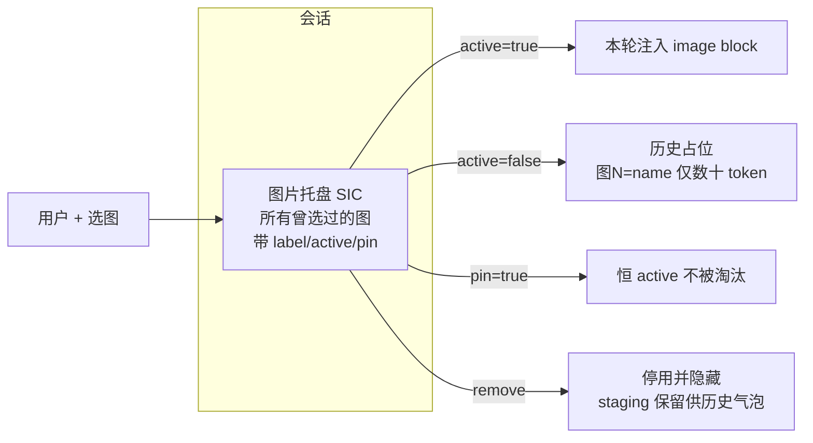

# 聊天视觉上下文：会话级图片托盘（持久激活）技术方案

> 版本：v0.1（草案）
> 设计日期：2026-06-18
> 状态：草案，待评审
> 前置文档：[chat-vision-image-context-design.md](./chat-vision-image-context-design.md)（v1.2，已实现「Composer 选图 + 当轮-only hydrate + 视觉模型路由 + 上下文环」）
> 本文档是对前置文档 **§3.6（当轮-only）** 与 **OQ-5（「再看刚才那张图」→ P1）** 的增量修订，不推翻已合入实现，仅在其上叠加「持久图片上下文」层。

---

## 0. 背景与问题

### 0.1 用户现象

v1.2 已支持 Composer「+」选图、当轮注入多模态 `image` block。但交互是**一次性**的：

- 第 1 轮：选图 A + 提问 → API 收到 `image(A)`，模型看图作答。
- 第 2 轮：针对同一张图 A 追问（「把图中左上角的文字翻译一下」）→ 用户**没有**重新选图 → `Message.attachments` 为空 → API 请求不含任何 `image` block，A 在历史里仅是文本占位 `[此前发送的图片: A.png]` → **模型看不到像素，只能瞎猜或要求重传**。
- 用户被迫：每轮追问都重新点「+」选同一张图。

### 0.2 根因（现网代码）

| 环节 | 现网行为 | 后果 |
|------|----------|------|
| `Message.attachments` | 图片元数据**绑定到单条 user 消息** | 图片随该消息「用完即弃」，下一条消息天然不带图 |
| `shouldHydrateImagesForMessage` | 仅 `msg.id === currentUserMessageId` 时 `full` hydrate | 历史消息恒为 `text-placeholder-only`，像素永远不回灌 |
| `imagesDeliveredToApi` | 首轮送达后置 `true`，**禁止**后续 re-hydrate | 即便想回灌也被该标志挡住（v1.2 为省 token 刻意为之） |
| Composer `pendingAttachments` | 发送后 `clearComposerAttachments()` 清空 | 选图状态不跨消息留存，无「图片库/托盘」概念 |

结论：**图片的生命周期 = 单条消息**，而追问的生命周期 = 整个会话。两者粒度不匹配是根因。v1.2 的当轮-only 是正确的省 token 策略，但它把「能否再次看到图」与「该图是否在本轮消息上」耦合死了。

### 0.3 设计目标

1. **一次选图，会话内可反复追问**：图片进入会话级「图片上下文」后，无需重传即可在后续任意轮次被模型看到。
2. **token / 上下文成本可控且可预期**：默认不为「便利」无限叠加图片 token；提供预算上限、自动淘汰、可视化占用。
3. **用户对成本有最终控制权**：可显式置顶（pin，恒注入）、停用（deactivate，仅占位）、移除；上下文环如实反映即将注入的图片 token。
4. **最小侵入**：复用现有 staging / `ChatImageAttachment` / 视觉路由 / 上下文环链路；不重写 v1.2 的当轮-only 机制，而是在其上增加「激活集」维度。
5. **向后兼容**：老会话、老消息无破坏；`imagesDeliveredToApi` 平滑降级为「不再驱动 hydrate」。

### 0.4 非目标（本方案不做）

- 工作目录路径指图（前置文档 §3.7）——仍由独立 P1/P2 跟进，本方案不覆盖。
- 视频 / PDF / 多图轮播编辑器。
- 跨会话图片库（图片仅会话内持久；跨会话复用另开）。
- 非 Anthropic 兼容网关的 `image_url` 形态（沿用 v1.2 OQ-3）。

---

## 1. 核心概念：会话图片上下文（Session Image Context, SIC）

把图片从「消息附件」升级为「会话资源」，引入**激活集**解耦「图片存在」与「本轮注入」。



**三态模型（每张图在 SIC 中的状态）：**

| 状态 | 含义 | API 表现 | token 成本 |
|------|------|----------|-----------|
| **active** | 本轮注入 | 当轮 user 消息含 `image` block | 每轮付一次图片 token |
| **inactive** | 已入库但本轮不注入 | 历史位置文本占位 `图N=name` | ~20 token/条 |
| **pinned** | active 的子集，永不自动淘汰 | 同 active | 同 active，但不会被预算淘汰 |

关键转变：**注入与否由 SIC.activeIds 决定，不再由「图片是否在当前消息上」决定**。一张老图只要仍 active，就在每一轮被重新注入到**当轮** user 消息（而非其原始历史位置）。

---

## 2. 数据模型

### 2.1 领域类型（`src/shared/domainTypes.ts`）

```typescript
/** 会话级图片上下文：解耦图片与单条消息的绑定 */
export interface SessionImageContext {
  /** 稳定标签，key=attachmentId，value=如 "图1"（单调递增，移除不回收） */
  labels: Record<string, string>
  /** 本轮需注入的图片 attachmentId（按入栈顺序） */
  activeIds: string[]
  /** 用户置顶的 attachmentId；永不被动淘汰 */
  pinnedIds: string[]
  /** 标签自增计数器 */
  nextLabelSeq: number
}

export interface Session {
  // ...existing
  /** 会话级图片上下文；缺省视为空（向后兼容） */
  imageContext?: SessionImageContext
}
```

- `Message.attachments` **语义不变**：仍记录「该消息发送时**新附加**的图片」（供气泡缩略图展示）。SIC 是跨消息的并集视图。
- `Message.imagesDeliveredToApi`：**降级**为只读遗留字段，hydrate 判定不再依赖它（见 §5.3）。保留字段以兼容旧 DB，读取时忽略。
- `schemaVersion`：无需 bump；`imageContext` 缺省即空 SIC。

### 2.2 托盘条目派生（渲染层）

托盘 UI 的条目 = 会话内所有 user 消息 `attachments` 按 id 去重的并集，再叠加 SIC 的 `labels/activeIds/pinnedIds`：

```typescript
interface TrayItem extends ChatImageAttachment {
  label: string         // 图1、图2…
  active: boolean
  pinned: boolean
  originMessageId: string // 该图首次出现的消息
}
```

派生为纯函数 `deriveImageTray(messages, imageContext): TrayItem[]`，便于单测。`stagingKey` 来自 `ChatImageAttachment`，缩略图读取沿用 `readStagedImage`。

---

## 3. 激活与注入策略（token 预算核心）

### 3.1 默认激活规则

| 事件 | SIC 变更 |
|------|----------|
| 用户「+」选新图 | 分配 `图{nextLabelSeq++}`，加入 `activeIds`（默认 active，使即时追问可用） |
| 用户点「置顶」 | `pinnedIds` 加入该 id |
| 用户点「停用」 | 从 `activeIds` 移除（保留在 labels，气泡与历史占位仍可见） |
| 用户点「移除」 | 停用 + 从托盘视图隐藏（**不删 staging 文件**，历史气泡仍需读图） |
| 用户点「清空图片上下文」 | `activeIds = []`（pinned 一并清空，需二次确认） |

### 3.2 自动淘汰（防 token 失控）

新增配置（`AppConfig` 下，或复用 `tools` 同级常量首版硬编码）：

```typescript
export const DEFAULT_MAX_ACTIVE_IMAGES = 2
export const DEFAULT_IMAGE_CONTEXT_TOKEN_BUDGET = 6000
```

**淘汰触发**：在「选新图加入 activeIds」后校验，若

- `activeIds.length > MAX_ACTIVE_IMAGES`，或
- `sum(estimateTokensFromImageAttachment(active items)) > IMAGE_CONTEXT_TOKEN_BUDGET`

则按**入栈时间最早的非 pinned active 图**逐张移出 `activeIds`（降为 inactive），直到满足约束。`pinnedIds` 永不淘汰；若 pinned 自身已超预算，仅给 UI 警告，不强制淘汰（尊重用户显式意图）。

> 这保证稳态成本上界 ≈ `min(MAX_ACTIVE_IMAGES 张, BUDGET tokens)`，与对话长度无关。

### 3.3 注入规则（替代 v1.2 §3.6 的当轮-only 判定）

`buildClaudeToolChatMessages` 增加 option：

```typescript
export type BuildClaudeToolChatMessagesOptions = {
  currentUserMessageId?: string
  /** SIC 激活集：本轮需注入的图片（跨消息来源） */
  activeImageIds?: Set<string>
  /** 标签映射，用于历史占位与可能的库索引 */
  imageLabels?: Record<string, string>
  /** 按 attachmentId 解析 base64（主进程实现，跨消息查找） */
  resolveImageById?: (id: string) => { mimeType: string; data: string } | null
}
```

组装逻辑：

| 消息 | 内容 |
|------|------|
| **当轮 user 消息**（`id === currentUserMessageId`） | `text` + `image block × activeImageIds`（按 activeIds 顺序，`resolveImageById` 解析；失败降级 `[图N 已失效]`） |
| **历史 user 消息**（含原 attachments） | 恒 `text-placeholder-only`，占位用 label：`[历史图片: 图1=a.png]` |
| 历史/当轮纯文本 user 消息 | 纯文本（不变） |
| assistant / tool_result | 不变 |

要点：
- **历史位置永不 re-hydrate**——沿用 v1.2 §3.6 的省 token 策略。
- **active 图统一在当轮注入**，无论其原始出自哪条历史消息。这让「老图追问」天然成立，且每轮仅出现一次（无重复 block）。
- 当轮若 `activeImageIds` 为空，则当轮 user 消息退化为纯文本（与 v1.2 行为一致）。

### 3.4 与 v1.2 当轮-only 的关系

| 维度 | v1.2（现网） | 本方案 |
|------|--------------|--------|
| 决定注入的依据 | 「图是否在当轮消息上」+ `imagesDeliveredToApi` | 「图是否在 SIC.activeIds 中」 |
| 历史位置 | 文本占位 | 文本占位（**不变**） |
| 当轮注入来源 | 仅当轮消息自带 attachments | 当轮 active 集（可含历史消息的图） |
| 重传需求 | 每轮追问都要重选 | 选一次、保持 active 即可 |
| 稳态图片 token | 仅首轮付一次 | active 期间每轮付一次（可淘汰/停用/缓存优化） |

本方案**保留** v1.2 「历史不 re-hydrate」的核心省 token 策略，仅把「当轮注入哪些图」从「当轮消息附件」放宽为「SIC 激活集」。

---

## 4. Token / 上下文占用分析

### 4.1 量化对比（单图 1024×1024，估算 ≈1600 token）

| 方案 | T1 选图提问 | T2 追问 | T3 追问 | 3 轮图片 token 总和 | 能否追问看图 |
|------|-------------|---------|---------|---------------------|--------------|
| v1.2 当轮-only | 1600 | 占位 20 | 占位 20 | ~1640 | ❌ 需重传 |
| 本方案（保持 active） | 1600 | 1600 | 1600 | ~4800 | ✅ |
| 本方案（T1 后停用） | 1600 | 占位 20 | 占位 20 | ~1640 | ❌（用户主动停用） |

**结论**：便利的代价是「active 期间每轮多付一张图的 token」。这正是 §3.2 预算淘汰要约束的——把「每轮成本」从「会话内所有历史图」收敛到「≤ MAX_ACTIVE_IMAGES 张 / ≤ BUDGET tokens」。

### 4.2 Prompt 缓存优化（Anthropic 兼容网关，P1 增强）

同一张 active 图在连续多轮被原样 re-inject 时，对支持 prompt caching 的网关（Claude native 等）可给 `image` block 打 `cache_control: { type: 'ephemeral' }`：

- 首轮写缓存（`cache_creation_input_tokens`），后续轮命中缓存（`cache_read_input_tokens`，计费 ≈ 10%）。
- 实际边际成本从「每轮全价」降至「首全价 + 后续 ≈0.1×」。
- **provider 感知**：仅对确认支持 cache 的网关打标，其余保持无 cache（避免被严格网关拒）。复用 `effectiveModelForUsage` / 服务类型判定。

> 该优化使「保持 active」在 Anthropic 系下接近免费，显著改善 §4.1 的成本对比。列为 P1，不阻塞 MVP。

### 4.3 上下文环联动

`ContextUsageRing` 现已支持 `pendingImageAttachments`（composer 待发图）。本方案调整：

| 时机 | 行为 |
|------|------|
| Composer 展示托盘 | `pendingImageAttachments` 改为传入 **active 托盘条目**（含历史 active 图），`estimateTokensFromImageAttachments` 即反映「本轮将注入的图片 token」 |
| 环 tooltip | 已有 `tooltip.pendingImages` 复用；新增 `tooltip.activeImages` 区分「待发新图」与「会话 active 图」 |
| 发送前预警 | `estimateTokensFromImageAttachments(active) + estimatedOccupancy > 0.8 × maximumContext` → 托盘条目警告色（沿用 v1.2 §5.4.5） |
| 自动淘汰后 | 环即时回降（active 集变小） |

环不再只反映「composer 新选图」，而是反映「本轮真实将注入的图片总量」——与 API payload 一致，消除 v1.2 §5.4.1 G2 的偏差。

---

## 5. 实现改动

### 5.1 共享层（`src/shared/claudeToolHistory.ts`）

- `buildClaudeToolChatMessages`：新增 `activeImageIds / imageLabels / resolveImageById` options（§3.3）。
- 当轮 user 分支：从「读 `m.attachments`」改为「读 `activeImageIds` 并 `resolveImageById`」。
- 历史 user 分支：占位改用 label：`formatHistoricalImagePlaceholder` → `[历史图片: 图1=a.png, 图2=b.png]`。
- `shouldHydrateImagesForMessage`：**移除**对 `imagesDeliveredToApi` 的依赖；历史恒 placeholder，当轮恒注入 active 集。
- 新增纯函数 `deriveImageTray(messages, imageContext)`、`applyActiveEviction(sic, attachments, limits)`（淘汰算法，便于单测）。

### 5.2 主进程

| 文件 | 改动 |
|------|------|
| `electron/database.ts` | `Session.imageContext` 序列化/反序列化；`session:update` 支持写回 |
| `electron/chatMessageBuild.ts` | `buildToolChatMessagesFromSource` 读取 `session.imageContext`（从 appDb），构建跨消息 `resolveImageById`（扫描所有 user 消息 attachments 建索引），传入 `buildClaudeToolChatMessages` |
| `electron/appIpc.ts` | 新增 `chat:image-context-update`（toggle active / pin / remove / clear）；选图 `chat:stage-image` 成功后同步写 SIC（分配 label、加入 activeIds、跑淘汰） |
| `electron/claudeStreamHandlers.ts` | `hasImageAttachments` 触发条件改为「`activeImageIds` 非空」（影响视觉路由 §5.4 与 system hint） |
| `electron/llmSystemPrompt.ts` | `hasImageAttachments` 语义同上；可选追加**图片库索引**（见 §5.5） |

`resolveImageById` 实现：主进程在 build 前遍历 `sourceMessages` 所有 user 消息，收集 `Map<attachmentId, ChatImageAttachment>`，再按需 `resolveChatAttachmentBase64`（复用现有 staging 读）。仅在 active 集上解析，避免读无用图。

### 5.3 `imagesDeliveredToApi` 降级

- **不再**在 API 成功后置 `true`；**不再**读取它决定 hydrate。
- 保留 DB 字段与旧值（不主动迁移清除），读取时忽略；新消息不再写入。
- 影响：v1.2 的「首轮送达后历史占位」由新规则（历史恒占位）天然继承，行为等价。

### 5.4 视觉模型路由（`src/shared/visionModelRouting.ts`）

`resolveVisionRouteForImageSend` 触发条件从「当轮消息有 attachments」改为「SIC.activeIds 非空」。`currentUserMessageHasImages` → `sessionHasActiveImages(imageContext)`。语义：只要本轮要注入图片，就走视觉优选；纯文本轮（activeIds 空）走 session 语言模型——与 v1.2 §4.2 不回写 session 策略一致。

### 5.5 系统提示图片库索引（可选，P1）

当 SIC 非空时，system 末尾追加极简索引（仅文件名 + 是否 active，不含 base64）：

```text
## 会话图片库
- 图1=a.png（已加载）
- 图2=b.png（未加载，如需查看请提示用户激活）
```

成本：每图 ~15 token。收益：模型知道有哪些图、能按 label 引用，可在用户说「图1」时对号入座；inactive 图也能被模型主动请求激活。首版可不加，列为 P1。

### 5.6 渲染层

| 组件 | 改动 |
|------|------|
| `MessageInput.tsx` | `pendingAttachments` 概念升级为**持久托盘**：发送后**不清空**，改为从 Redux `session.imageContext` 派生 `deriveImageTray`；每条目增加 active 切换（👁）、pin（📌）、remove；「+」仍向托盘追加新图 |
| `ChatView.tsx` | `onSend(text, attachments)` 中 `attachments` 仍为「本轮新附加」；发送前 dispatch `imageContext` 更新（active/pin 变更）随 payload 下发或由主进程自行读 DB |
| `ContextUsageRing.tsx` | `pendingImageAttachments` 改收 active 托盘条目（§4.3） |
| `chatToolSessionService.ts` | `buildToolChatPayload` 无需改（仍传 `sourceMessages` + `currentUserMessageId`）；SIC 由主进程从 DB 读 |
| Redux `sessionSlice`/`chatSlice` | 增加 `imageContext` 状态；切换会话时加载；toggle/pin/remove 走 IPC 回写 DB |
| `ChatBubble.tsx` | 不变（仍按 `Message.attachments` 展示当轮新图缩略图） |

### 5.7 i18n

新增 key（命名空间 `chat`）：`tray.title`、`tray.activate`、`tray.deactivate`、`tray.pin`、`tray.unpin`、`tray.remove`、`tray.clearAll`、`tray.clearConfirm`、`tray.evictedHint`（「已达上限，最早一张已停用」）；`contextUsage.tooltip.activeImages`。按 CLAUDE.md 规范走 `i18n:generate-types` + `i18n:check`。

---

## 6. 边界与风险

| 场景 | 行为 |
|------|------|
| 老 DB 会话（无 `imageContext`） | 加载时 normalize 为空 SIC；**不**自动激活历史图（避免突增 token）；用户重新选图或手动激活老图 |
| active 图 staging 文件丢失 | 当轮注入降级 `[图N 已失效]`；历史占位仍显示文件名；UI 标红 |
| 跨会话切换 | SIC 随 session 加载/卸载；托盘仅显示当前会话图 |
| 用户置顶过多超预算 | pinned 不淘汰；环警告但不阻断（尊重显式意图） |
| 工具 loop 中间轮 | active 图仅在进入 loop 的首条 user 消息注入（与 v1.2 §3.6.4 一致）；tool_result 轮不附加 |
| 会话删除 | `deleteSessionChatAttachments` 已清理目录；SIC 随 session 删除 |
| 「移除」是否删 staging | **不删**（历史气泡仍需读图）；仅停用+隐藏。彻底删除随会话删除发生 |
| 同一图被重复选入 | 按 `attachmentId` 去重；同文件二次选图生成新 id、新标签（视为新条目，可接受） |
| 非 Anthropic 网关 re-inject 成本 | 无 cache 优惠，每轮全价——靠 §3.2 预算淘汰 + 用户停用控制；文档明确 |

---

## 7. 测试计划

### 7.1 自动化

```bash
npm test -- src/shared/claudeToolHistory.test.ts        # active 集注入、历史 label 占位、imagesDeliveredToApi 不再驱动
npm test -- src/shared/contextUsageEstimate.test.ts     # active 托盘 token 估算
npm test -- src/shared/visionModelRouting.test.ts       # activeIds 非空才触发视觉路由
npm test -- electron/chatAttachmentManager.test.ts      # SIC 写回、淘汰算法
npm test -- src/renderer/components/Chat/MessageInput.test.tsx  # 托盘持久、toggle/pin/remove
```

关键用例：
- `deriveImageTray`：多消息去重、label 稳定、active/pin 派生。
- `applyActiveEviction`：超 `MAX_ACTIVE_IMAGES` 淘汰最老非 pinned；pinned 不被淘汰；超 token 预算淘汰。
- `buildClaudeToolChatMessages`：T1 选图 A、T2 纯文本追问且 A 仍 active → T2 当轮注入 `image(A)`，T1 历史为 label 占位；A 停用后 T2 无 image block。
- 视觉路由：activeIds 空时走语言模型；非空走视觉优选且不回写 session。

### 7.2 手工验收

1. 选图 A 提问 → 追问「图中文字」→ **无需重传**，模型直接作答（payload 含 `image(A)`）。
2. 托盘可见 A 为 active；点「停用」→ 再追问 → 模型看不到 A（payload 无 image block），历史占位 `图1=A.png`。
3. 连选 3 张图（默认上限 2）→ 最早的 A 自动停用，托盘提示「已停用」；环 token 回降。
4. 置顶 A → 再连选多张 → A 不被淘汰。
5. 重启应用续聊 → 托盘与 active 状态保留；续聊追问仍能看 active 图。
6. 环：active 期间每轮 tooltip 显示图片 token；停用后回降；超 80% 上下文时托盘警告色。
7. 视觉路由：active 发图走视觉模型；停用后纯文本走会话语言模型（不残留视觉模型）。

---

## 8. 文件改动清单

| 模块 | 文件 | 改动摘要 |
|------|------|----------|
| 类型 | `src/shared/domainTypes.ts` | `SessionImageContext`、`Session.imageContext` |
| 共享组装 | `src/shared/claudeToolHistory.ts` | active 集注入、label 占位、`deriveImageTray`、`applyActiveEviction`、移除 `imagesDeliveredToApi` 驱动 |
| 估算 | `src/shared/contextUsageEstimate.ts` | 复用现有 image 估算（无需新函数） |
| 路由 | `src/shared/visionModelRouting.ts` | 触发条件改 `activeIds` 非空 |
| 主进程 | `electron/database.ts` | SIC 序列化、`session:update` 回写 |
| 主进程 | `electron/chatMessageBuild.ts` | 读 SIC、跨消息 `resolveImageById` |
| 主进程 | `electron/appIpc.ts` | `chat:image-context-update`、选图同步 SIC + 淘汰 |
| 主进程 | `electron/claudeStreamHandlers.ts` | `hasImageAttachments` 改 active 判定 |
| 主进程 | `electron/llmSystemPrompt.ts` | hint 触发改 active；可选图片库索引 |
| 预加载 | `electron/preload.ts` | 暴露 `chatImageContextUpdate` |
| 渲染 | `MessageInput.tsx` | 持久托盘、active/pin/remove、不清空 |
| 渲染 | `ChatView.tsx`、Redux slice | SIC 状态、IPC 回写 |
| 渲染 | `ContextUsageRing.tsx` | active 托盘 token |
| i18n | `chat.json`、`contextUsage.json` | 托盘与环文案 |
| 测试 | `*.test.ts` | 见 §7.1 |

---

## 9. 开放问题（OQ）

| ID | 问题 | 倾向决议 |
|----|------|----------|
| OQ-P1 | 默认 `MAX_ACTIVE_IMAGES` / token 预算取值 | 首版 2 / 6000，设置页可配；后续按真实用量调 |
| OQ-P2 | 新选图是否默认 active | 是（保证即时追问可用）；用户可一键停用 |
| OQ-P3 | Prompt cache 标记（§4.2）是否进 MVP | 不进；P1 按 provider 感知补 |
| OQ-P4 | 图片库索引（§5.5）是否进 MVP | 不进；P1 补，收益/成本比好 |
| OQ-P5 | 「移除」是否提供「彻底删除 staging」 | 首版不提供；随会话删除清理，避免破坏历史气泡 |
| OQ-P6 | 老 DB 历史图是否自动激活 | 不自动（避免突增 token）；用户手动激活 |
| OQ-P7 | 跨会话图片库 | 非目标，另开 |

---

## 10. 里程碑建议

| 里程碑 | 内容 | 预估 |
|--------|------|------|
| M1 | 数据模型 + 共享层 active 注入/淘汰 + 单测 | 1 天 |
| M2 | 主进程 SIC 读写 + IPC + 视觉路由/hint 适配 | 1 天 |
| M3 | 渲染托盘 UI + 环联动 + i18n | 1–1.5 天 |
| M4 | 手工验收 / 回归 / 文档 | 0.5 天 |
| M5（P1） | Prompt cache + 图片库索引 | 0.5–1 天 |

---

## 11. 参考代码位置（现网）

- 当轮-only hydrate 判定：`src/shared/claudeToolHistory.ts` → `shouldHydrateImagesForMessage`、`buildUserMessageContent`
- staging 读写：`electron/chatAttachmentManager.ts` → `stageChatImage`、`resolveChatAttachmentBase64`
- 主进程组装入口：`electron/chatMessageBuild.ts` → `buildToolChatMessagesFromSource`
- 视觉路由：`src/shared/visionModelRouting.ts` → `resolveVisionRouteForImageSend`
- 上下文环：`src/renderer/components/Chat/ContextUsageRing.tsx`；估算 `src/shared/contextUsageEstimate.ts` → `estimateTokensFromImageAttachment`
- Composer 选图/清空：`src/renderer/components/Chat/MessageInput.tsx` → `stageFiles`、`clearComposerAttachments`
- payload：`src/renderer/services/chatToolSessionService.ts` → `buildToolChatPayload`
